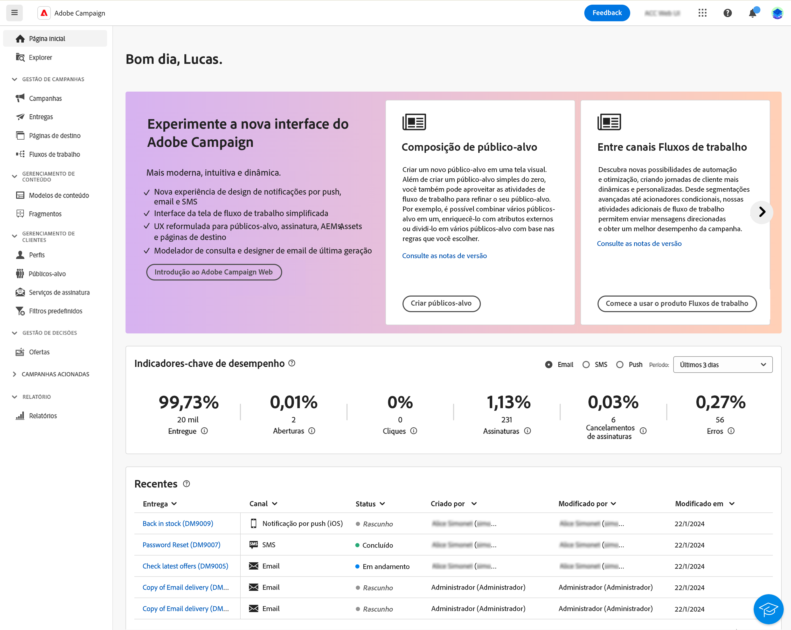

# Conheça a interface {#user-interface}

>[!CONTEXTUALHELP]
>id="acw_homepage_learnmore"
>title="Conheça a interface"
>abstract="A nova interface da Web do Campaign v8 oferece uma experiência do usuário integrada, intuitiva e consistente."

A nova interface da Web do Campaign v8 oferece uma experiência de usuário moderna e intuitiva para simplificar o design e a entrega da campanha de marketing. Essa nova interface é integrada à Adobe Experience Platform.

>[!NOTE]
>
>Esta documentação é atualizada com frequência para refletir as alterações recentes na interface do produto. Entretanto, algumas capturas de tela podem diferir ligeiramente da sua interface.

## Menu de navegação esquerdo {#user-interface-left-nav}

Navegue pelos links à esquerda para acessar os recursos do Campaign Web v8. Vários links exibem listas de objetos que podem ser classificados e filtrados. Você também pode configurar colunas para exibir todas as informações necessárias. Consulte esta [seção](#list-screens). Todas as telas de lista são do tipo somente leitura, exceto a lista de entrega de email. A opção de clicar em qualquer item de lista para editar/visualizar não está disponível na versão Alfa. Todas as listas serão editáveis em versões futuras. Os itens exibidos no menu de navegação esquerdo dependem das permissões do usuário.

### Página inicial {#user-interface-home}

Esta tela inclui links e elementos importantes para um acesso rápido aos principais recursos do Campaign Web v8.

A lista **Recentes** fornece atalhos para as entregas criadas e modificadas recentemente. Esta lista mostra o canal, status, proprietário, datas de criação e modificação.

Acesse as páginas de ajuda principais da Web do Campaign v8 na **Aprendizado** seção da página inicial.

### Explorer {#user-interface-explorer}

>[!CONTEXTUALHELP]
>id="acw_explorer"
>title="Explorer"
>abstract="A variável **Explorer** O menu exibe todos os componentes e objetos do Campaign com a mesma hierarquia de pastas que a do console do cliente. Navegue por todos os componentes, pastas e esquemas do Campaign v8 e crie entregas, fluxos de trabalho e campanhas. Todas as outras listas são somente leitura."

A variável **Explorer** O menu exibe todos os recursos e objetos do Campaign com a mesma hierarquia de pastas que a do console do cliente. Navegue por todos os componentes, pastas e esquemas do Campaign v8 e crie entregas, fluxos de trabalho e campanhas. Todas as outras listas são somente leitura.

Os itens exibidos no explorador dependem das permissões do usuário.

Como em qualquer tela de lista, você pode configurar as colunas para personalizar a exibição e mostrar todas as informações necessárias. Consulte esta [seção](#list-screens).

Para obter mais informações sobre o explorador do Campaign, a hierarquia de pastas e os recursos, consulte [Documentação do Campaign v8 (console)](https://experienceleague.adobe.com/docs/campaign/campaign-v8/new/campaign-ui.html?lang=pt-BR#ac-explorer-ui){target="_blank"}.

### Gerenciamento de campanhas {#user-interface-campaign-management}

>[!CONTEXTUALHELP]
>id="acw_campaigns_list"
>title="Campanhas"
>abstract="É a lista das suas campanhas. É possível exibir informações úteis, como datas de início/término/última modificação e status. Você pode filtrar a lista por status ou datas iniciais/finais. Clique no botão “Criar campanha” para adicionar uma nova campanha. Selecione uma campanha para exibir seu conteúdo, entregas e detalhes. Navegue até a guia “Modelos” para exibir e criar modelos."

>[!CONTEXTUALHELP]
>id="acw_deliveries_list"
>title="Entregas"
>abstract="Navegue pela lista de entregas. É possível visualizar seu status, principais KPIs e datas de contato e modificação. É possível filtrar a lista por estado, data de contato ou canal. Clique no botão “Criar entrega” para adicionar uma nova entrega. Selecione uma entrega para visualizar seu conteúdo, público-alvo e detalhes."

Na seção CAMPAIGN MANAGEMENT, você pode acessar campanhas de marketing, deliveries e workflows.

* **Campanhas** - Esta é a lista de suas campanhas e modelos de campanha. Por padrão, para cada campanha, é possível visualizar as datas de início/término/criação/última modificação, o status atual e o nome do operador de campanha que a criou. É possível filtrar a lista por status, datas de início/término, pasta ou criar um filtro avançado para definir seus próprios critérios de filtragem. Saiba mais sobre campanhas [nesta seção](../campaigns/gs-campaigns.md).

* **Entregas**: navegue pela lista de entregas. Você pode visualizar o estado, a data da última modificação, bem como os principais KPIs. É possível filtrar a lista por estado, data de contato ou canal. Clique em uma entrega de email para abrir o painel e obter uma visão geral dos detalhes da entrega. As entregas em outros canais são do tipo somente leitura. Saiba mais sobre entregas [nesta seção](../msg/gs-messages.md).

  Use o botão **Mais ações** para excluir ou duplicar uma entrega.

  {width="70%" align="left"}

* **Workflows** - Nessa tela, é possível acessar a lista completa de workflows e modelos de workflows. É possível verificar o status, as datas da última/próxima execução e criar um novo workflow ou um novo modelo de workflow. É possível filtrar a lista com os mesmos critérios de outros objetos. Além disso, é possível filtrar os workflows que pertencem ou não a uma campanha. Saiba mais sobre fluxos de trabalho [nesta seção](../workflows/gs-workflows.md).

### Gerenciamento de clientes {#user-interface-customer-management}

>[!CONTEXTUALHELP]
>id="acw_recipients_list"
>title="Recipients"
>abstract="Acesse o banco de dados de recipients. É possível visualizar informações úteis, como endereço de email, nome e sobrenome. Essa lista é do tipo somente leitura."

>[!CONTEXTUALHELP]
>id="acw_audiences_list"
>title="Públicos"
>abstract="É a sua lista de públicos. É possível exibir o tipo, a origem, as datas de criação/última modificação e o rótulo. É possível filtrar a lista por origem. Essa lista é do tipo somente leitura."

>[!CONTEXTUALHELP]
>id="acw_subscriptions_list"
>title="Listas de assinaturas"
>abstract="Navegar pelas listas de assinaturas. É possível exibir o tipo, o modo e o rótulo. Essa lista é do tipo somente leitura."

Na seção GERENCIAMENTO DE CLIENTES, você pode visualizar os recipients, públicos-alvo e assinaturas. Essas listas são somente leitura.

* **Recipients**: acessa o banco de dados de recipients. Por padrão, você pode ver o endereço de email, o nome e o sobrenome. Saiba mais sobre recipients em [Documentação do Adobe Campaign v8 (console)](https://experienceleague.adobe.com/docs/campaign/campaign-v8/audience/gs-audiences.html){target="_blank"}.
* **Públicos**: esta é a lista de públicos. Por padrão, é possível ver o tipo, a origem, as datas de criação/última modificação e o rótulo. É possível filtrar a lista por origem. Saiba mais sobre públicos-alvo e listas em [Documentação do Adobe Campaign v8 (console)](https://experienceleague.adobe.com/docs/campaign/campaign-v8/audience/create-audiences/create-audiences.html){target="_blank"}.
* **Assinaturas** - Navegue pelas listas de assinaturas. Por padrão, é possível ver o tipo, o modo e o rótulo. Saiba como gerenciar assinaturas e cancelamentos de assinaturas no [Documentação do Adobe Campaign v8 (console)](https://experienceleague.adobe.com/docs/campaign/campaign-v8/campaigns/send/subscriptions.html){target="_blank"}.

### Gestão de decisões

>[!CONTEXTUALHELP]
>id="acw_offers_list"
>title="Ofertas"
>abstract="Você pode navegar pela lista de ofertas de interação. Por padrão, é possível exibir o status, a data inicial/final e o ambiente. É possível filtrar a lista por estado e data inicial/final. Os modelos de oferta também estão disponíveis. Essas listas são do tipo somente leitura."

* **Ofertas**: navegue pela lista de ofertas de interação. Por padrão, é possível exibir o status, a data inicial/final e o ambiente. É possível filtrar a lista por estado e data inicial/final. Os modelos de oferta também estão disponíveis. Essas listas são do tipo somente leitura.

Saiba como criar e gerenciar ofertas no [Documentação do Adobe Campaign v8 (console)](https://experienceleague.adobe.com/docs/campaign/campaign-v8/offers/interaction.html?lang=pt-BR){target="_blank"}.

## Barra superior

Use a barra superior da interface para:

* compartilhar seu feedback como um testador Alfa
* alternar entre organizações e instâncias
* alternar entre os aplicativos da Adobe Experience Cloud
* acessar páginas de ajuda, entrar em contato com o suporte e compartilhar feedback. Você pode pesquisar artigos e vídeos de ajuda no campo de pesquisa.

{width="70%" align="left"}
<!--
Org / Sub-org switcher to switch between instances. Only one for Alpha. Later: intermerdiate screen with Control Panel (beta). if v8 + ACS with one card per ACS instance. Maybe quickly explain the menu for Alpha?
-->

## Procurar e filtrar listas {#list-screens}

A maioria dos links do menu de navegação esquerdo exibe listas de objetos, como a lista de **Entregas** ou **Campanhas**. Algumas dessas telas de lista são somente leitura. Você pode personalizar a exibição da lista e filtrar essas listas, conforme detalhado abaixo.

Para remover um filtro, clique no link **Limpar tudo** botão.

### Personalizar telas de lista {#custom-lists}

As listas são exibidas em colunas. É possível exibir informações adicionais alterando a configuração da coluna. Para fazer isso, clique no link **Configurar coluna para layout personalizado** no canto superior direito da lista.

{width="70%" align="left"}

No **Configurar colunas** , adicionar ou remover colunas e alterar a ordem na qual elas são exibidas.

Por exemplo, para estas configurações:

{width="70%" align="left"}

A lista mostra as seguintes colunas:

{width="70%" align="left"}

Use o **Exibir atributos avançados** alternar para ver todos os atributos da lista atual. [Saiba mais](#adv-attributes)

### Classificar dados {#sort-lists}

Também é possível classificar itens na lista clicando em qualquer cabeçalho de coluna. Uma seta é exibida (para cima ou para baixo) indicando que a lista está classificada nessa coluna.

Para colunas numéricas ou de data, a variável **Para cima** indica que a lista é classificada em ordem crescente enquanto a variável **Para baixo** indica uma ordem descendente. Para strings ou colunas alfanuméricas, os valores são listados em ordem alfabética.

### Filtros embutidos {#list-built-in-filters}

Para localizar itens mais rapidamente, você pode usar a barra de pesquisa ou filtrar a lista com base em critérios contextuais.

{width="70%" align="left"}

Por exemplo, você pode filtrar deliveries em seu status, canal, data de contato ou pasta. Você também pode ocultar testes.

### Filtros personalizados{#list-custom-filters}

Para criar filtros personalizados nos dados, navegue até a parte inferior dos filtros e clique no **Adicionar regras** botão.

Arraste e solte atributos para criar seus critérios de filtro no **Filtros avançados** tela.

{width="70%" align="left"}

Use o **Exibir atributos avançados** alternar para ver todos os atributos da lista atual. [Saiba mais](#adv-attributes)

### Usar atributos avançados {#adv-attributes}

>[!CONTEXTUALHELP]
>id="acw_attributepicker_advancedfields"
>title="Exibir atributos avançados"
>abstract="Somente os atributos mais comuns são exibidos por padrão na lista de atributos. Use esse botão para criar um filtro com atributos avançados."

Somente os atributos mais comuns são exibidos por padrão nas telas de configuração de filtro e lista de atributos.

Use o **Exibir atributos avançados** alternar para ver todos os atributos disponíveis para a lista atual.

## Ajuda contextual {#contextual-help}

Uma ajuda contextual está disponível na interface. Quando disponível, clique no link `?` ícone para exibir informações de ajuda e links de documentação relacionados.

{width="70%" align="left"}

<!--An on-boarding guide is also available to help you get started with Campaign v8 Web. Click the icon in the bottom right corner, choose one of the available step-by-step scenarios, and simply follow the instructions.

{width="70%" align="left"}-->

## Navegadores compatíveis {#browsers}

O Campaign Web v8 foi desenvolvido para funcionar de maneira ideal na versão mais recente do Google Chrome, Safari e Microsoft Edge. Você pode ter problemas ao usar determinados recursos em versões mais antigas ou em outros navegadores.

## Preferências de idioma {#language-pref}

Atualmente, o Campaign Web v8 está disponível nos seguintes idiomas:

<table>
<tr>
<td>

Inglês (EUA) - EN-US

Francês - FR

Alemão - DE

Italiano - IT

</td>
<td>

Espanhol - ES

Português (Brasil) - PTBR

Japonês - JP

</td>
<td>

Coreano - KR

Chinês simplificado - CHS

Chinês tradicional - CHT

</td>
</tr>
</table>

O idioma padrão da interface é determinado pelo idioma preferencial especificado no perfil do usuário.

Para alterar o idioma:

1. Clique no ícone do perfil, na parte superior direita, e selecione **Preferências**.
1. Em seguida, clique no link do idioma exibido sob seu endereço de email.
1. Selecione o idioma de sua preferência e clique em **Salvar**. Você pode selecionar um segundo idioma caso o componente que está usando não esteja localizado em seu primeiro idioma.

<!--
######## This part stores the contextualHelp definition for WebUI BETA ###########
######## These blocks should be dispatched in the appropriate pages when available ###########
######## PLEASE DO NOT DELETE ###########
REFER TO 
https://wiki.corp.adobe.com/pages/viewpage.action?spaceKey=neolane&title=v8+WebUI+Contextual+Help+%3CALPHA%3E-+Official+list
-->

>[!CONTEXTUALHELP]
>id="acw_rulebuilder_advancedfields"
>title="Campos avançados do construtor de regras"
>abstract="Configure colunas com campos avançados."

>[!CONTEXTUALHELP]
>id="acw_rulebuilder_properties_advanced"
>title="Atributos avançados do Construtor de regras"
>abstract="Use atributos avançados para definir sua regra."

>[!CONTEXTUALHELP]
>id="acw_deliveries_email_metrics_sent"
>title="Métricas enviadas"
>abstract="Número de emails entregues."

>[!CONTEXTUALHELP]
>id="acw_deliveries_email_metrics_errors"
>title="Métricas de erros"
>abstract="Número de emails com o status de erro."

>[!CONTEXTUALHELP]
>id="acw_email_preview_option_test_target"
>title="População de teste"
>abstract="Selecione um modo de população de teste."

>[!CONTEXTUALHELP]
>id="acw_email_preview_mode"
>title="Modo de visualização"
>abstract="Visualize e teste a mensagem incluindo a população de teste ao público-alvo principal."

>[!CONTEXTUALHELP]
>id="acw_targetdata_personalization_enrichmentdata"
>title="Dados de enriquecimento"
>abstract="A confirmar"

>[!CONTEXTUALHELP]
>id="acw_targetdata_personalization_dashboard"
>title="Personalização"
>abstract="A confirmar"

>[!CONTEXTUALHELP]
>id="acw_campaign_reporting_sending"
>title="Envio de relatórios"
>abstract="Consulte os indicadores de envio para os relatórios da campanha."

>[!CONTEXTUALHELP]
>id="acw_campaign_reporting_tracking"
>title="Rastreamento de relatórios"
>abstract="Consulte os indicadores de rastreamento para os relatórios da campanha."

>[!CONTEXTUALHELP]
>id="acw_campaign_reporting_deliveries_overview"
>title="Visão geral dos relatórios"
>abstract="Métricas principais para a sua entrega."

>[!CONTEXTUALHELP]
>id="acw_campaign_reporting_deliveries_target"
>title="Relatório de estatísticas do público alvo"
>abstract="Esta seção exibe métricas específicas de acordo com os públicos-alvo."

>[!CONTEXTUALHELP]
>id="acw_campaign_reporting_deliveries_selection"
>title="Relatórios agregados para entregas"
>abstract="Selecione pelo menos duas entregas para exibir um relatório de dados agregado."

>[!CONTEXTUALHELP]
>id="acw_orchestration_deduplication_fields"
>title="Campos de desduplicação"
>abstract="A confirmar"

>[!CONTEXTUALHELP]
>id="acw_orchestration_deduplication_settings"
>title="Configurações de desduplicação"
>abstract="A confirmar"

>[!CONTEXTUALHELP]
>id="acw_orchestration_deduplication_complement"
>title="Complemento de desduplicação"
>abstract="A confirmar"

>[!CONTEXTUALHELP]
>id="acw_orchestration_dimension_complement"
>title="Complemento de dimensão"
>abstract="A confirmar"

>[!CONTEXTUALHELP]
>id="acw_push_permission_for_segment"
>title="Permissão necessária"
>abstract="Seu administrador precisa lhe conceder permissão para que você possa criar um segmento."

>[!CONTEXTUALHELP]
>id="acw_push_overview_edit"
>title="Permissão necessária"
>abstract="Seu administrador precisa lhe conceder permissão para que você possa criar um segmento."

>[!CONTEXTUALHELP]
>id="acw_deliveries_metrics_newquarantines"
>title="Nova métrica de quarentenas"
>abstract="Nova métrica de quarentena."

>[!CONTEXTUALHELP]
>id="acw_keyindicators_delivered"
>title="Entregue"
>abstract="KPI Entregue"

>[!CONTEXTUALHELP]
>id="acw_keyindicators_opens"
>title="Aberturas"
>abstract="Abre o KPI"

>[!CONTEXTUALHELP]
>id="acw_keyindicators_clicks"
>title="Cliques"
>abstract="KPI de Cliques"

>[!CONTEXTUALHELP]
>id="acw_keyindicators_unsubscriptions"
>title="Cancelamentos de assinatura"
>abstract="KPI de Cancelamentos de Assinatura"

>[!CONTEXTUALHELP]
>id="acw_keyindicators_spam"
>title="Spam"
>abstract="KPI de spam"

>[!CONTEXTUALHELP]
>id="acw_keyindicators_errors"
>title="Erros"
>abstract="KPI de erros"
