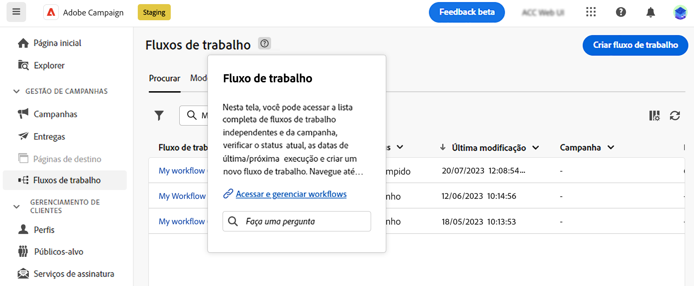

# Usar o assistente de conhecimento habilitado para IA {#using-ai}

Obtenha respostas rápidas e geradas por IA com base na documentação do produto e no contexto atual do produto, com o assistente de conhecimento habilitado por IA disponível nas caixas de ajuda contextual do produto.

A variável **Assistente de conhecimento com Gen AI** incorporado na ajuda contextual revoluciona a pesquisa de documentação e a resposta a perguntas &quot;como&quot;, com uma verificação fácil através de vastos repositórios de documentação, localizando instantaneamente as informações precisas de que você precisa.

Graças aos recursos do Campaign Gen AI, esse assistente transforma sua experiência, facilitando a recuperação de informações e a solução de problemas. Quer você esteja buscando orientação em uma tarefa complexa ou navegando em documentos extensos, nosso Assistente de conhecimento com Gen AI é seu companheiro perfeito, fornecendo eficiência e precisão incomparáveis em todas as interações.

## Consentimento {#consent-ai}

O assistente de conhecimento do Campaign incorporado nas caixas de ajuda contextual usa IA. O uso desse recurso constitui o consentimento de que as informações fornecidas na sessão serão coletadas, usadas, divulgadas e retidas pelo Adobe de acordo com os termos do Programa de feedback do cliente do Adobe. Não forneça informações pessoais sobre você ou outras pessoas (incluindo seu nome ou informações de contato) no assistente de conhecimento.

## Privacidade {#privacy-ai}

Seus dados são criptografados e privados seguindo nossas práticas padrão de proteção de dados. Saiba mais sobre [Políticas de privacidade do Adobe](https://www.adobe.com/br/privacy/policy.html){target="_blank"}.

O recurso de IA do assistente de conhecimento não usa seus dados para treinar nossos modelos. Não permitimos que nenhum parceiro ou terceiro use seus dados para treinar seus modelos ou qualquer outra finalidade.

Para obter informações específicas sobre políticas de IA de Adobe em aplicativos e soluções de Experience Cloud, consulte [esta página](https://business.adobe.com/products/sensei/adobe-sensei.html){target="_blank"}.

## Respostas {#answers-ai}

As respostas podem ser imprecisas ou enganosas. Como consequência, o assistente de conhecimento de Adobe pode produzir informações incorretas. Verifique a documentação do produto que está vinculada em cada caixa de ajuda.

Os modelos de inteligência artificial e aprendizado de máquina melhoram com o tempo para lidar melhor com casos de uso específicos. O assistente de conhecimento alimentado por IA do Campaign continuará melhorando nos próximos meses. Recomendamos que você use a ?? ?? sempre que ler uma resposta, para sinalizar quaisquer respostas inadequadas aos nossos engenheiros.

## Recomendações  {#recommendations-ai}

Ao fazer uma pergunta na ajuda contextual, o contexto atual do produto é levado em conta.

Para tirar o melhor proveito do assistente, ao fazer uma pergunta, recomendamos que você:

* Ser tão preciso e específico quanto possível e evitar ambiguidades. A resposta será mais precisa e útil.
* Para ajudar o assistente de conhecimento a encontrar as informações corretas, adicione o máximo de detalhes possível sobre o que você está tentando aprender.
* Reescreva suas perguntas e refine-as para obter respostas melhores. Se a resposta não for precisa ou útil, tente abordagens diferentes e adicione contexto para obter melhores resultados.
* Use termos e textos apropriados, com um tom neutro.
* Classifique as respostas e forneça feedback para que nossos engenheiros possam aprender com a sua experiência e melhorar os resultados.

