# Trabalhar com pastas {#folders}

>[!CONTEXTUALHELP]
>id="acw_folder_properties"
>title="Propriedades da pasta"
>abstract="Propriedades da pasta"

>[!CONTEXTUALHELP]
>id="acw_folder_security"
>title="Segurança da pasta"
>abstract="Segurança da pasta"

>[!CONTEXTUALHELP]
>id="acw_folder_schedule"
>title="Programação da pasta"
>abstract="Programação da pasta"

## Sobre pastas {#about-folders}

Pastas são objetos no Adobe Campaign que permitem organizar os componentes e dados.

É possível criar, renomear, reordenar e mover pastas na árvore de navegação. Também é possível excluí-las com base nos seus direitos.

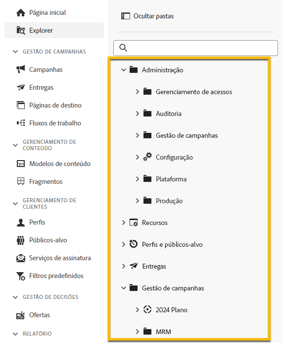{zoomable="yes"}

É possível configurar um tipo de pasta. Por exemplo: uma pasta de entregas. O ícone de pasta muda de acordo com o tipo.

>[!CONTEXTUALHELP]
>id="acw_folder_restrictions"
>title="Restrições da pasta"
>abstract="As pastas Objects created automatically e Technical workflows são restritas e não podem ser visualizadas no painel lateral esquerdo."

>[!IMPORTANT]
>
>As pastas **[!UICONTROL Objetos criados automaticamente]** e **[!UICONTROL Fluxos de trabalho técnicos]** são restritos e não podem ser exibidos no painel esquerdo.

## Criar uma nova pasta {#create-a-folder}

Para criar uma nova pasta na interface web do Adobe Campaign, siga estas etapas:

1. No **[!UICONTROL Explorer]**, acesse a pasta na qual você deseja criar a nova pasta.  No menu **[!UICONTROL ...]**, selecione **[!UICONTROL Criar nova pasta]**.

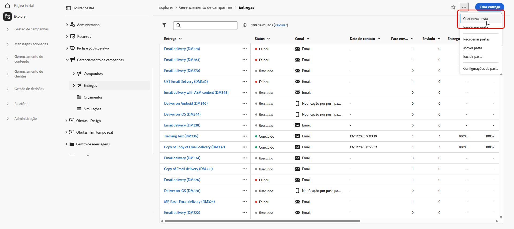{zoomable="yes"}

Ao criar uma nova pasta, o tipo de pasta assume como padrão o tipo da pasta principal. Neste exemplo, uma pasta é criada na pasta **[!UICONTROL Entregas]**.

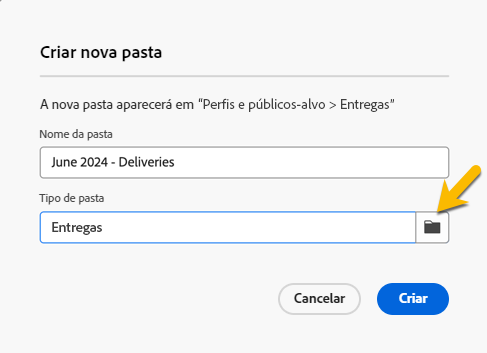{zoomable="yes"}

1. Para alterar o tipo de pasta, clique no ícone de tipo de pasta (se necessário) e selecione o tipo desejado na lista apresentada, conforme mostrado abaixo:

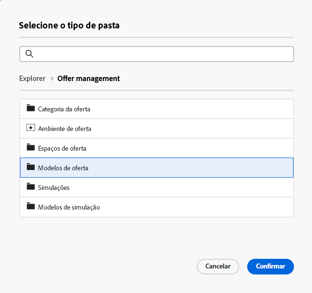{zoomable="yes"}

Para configurar o tipo de pasta, clique em **[!UICONTROL Confirmar]**.

Se quiser criar uma pasta sem nenhum tipo específico, escolha o tipo **[!UICONTROL Pasta genérica]**.

Também é possível [criar e gerenciar pastas no console do Adobe Campaign](https://experienceleague.adobe.com/pt-br/docs/campaign/campaign-v8/config/configuration/folders-and-views).

## Reordenar pastas {#reorder-folders}

Você pode reordenar as pastas com base nas suas necessidades. Para isso, clique em **[!UICONTROL Reordenar pastas]**, conforme mostrado abaixo.

Neste exemplo, a pasta **Entregas** contém quatro subpastas.

{zoomable="yes"}

Para alterar a ordem das pastas, é possível **arrastar e soltar** ou utilizar as **setas para cima e para baixo**.

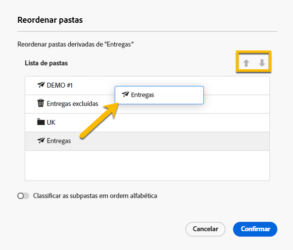{zoomable="yes"}

### Pastas favoritas {#favorite-folders}

>[!CONTEXTUALHELP]
>id="acw_folder_favorites"
>title="Favoritos"
>abstract="Suas pastas favoritas serão exibidas na parte superior da guia esquerda."

As pastas que foram marcadas como &quot;Favorito&quot; serão sempre mostradas na parte superior da guia à esquerda.

Você pode adicionar pastas como favoritas clicando no botão estrela no canto superior direito ao visualizar uma pasta.

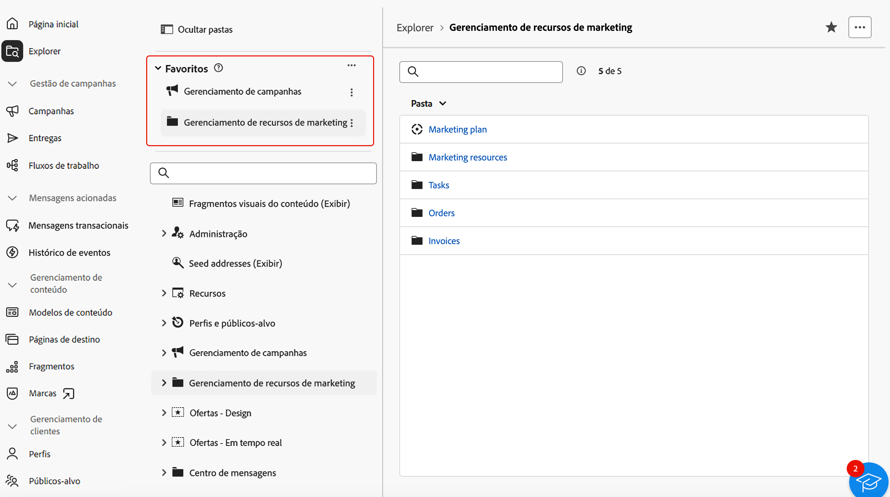{zoomable="yes"}

## Excluir uma pasta {#delete-a-folder}

>[!CAUTION]
>
>Ao excluir uma pasta, todos os dados armazenados nela também são excluídos.

Para excluir uma pasta, selecione-a na árvore do **[!UICONTROL Explorer]** e clique no menu **[!UICONTROL ...]**. Escolha **[!UICONTROL Excluir pasta]**.

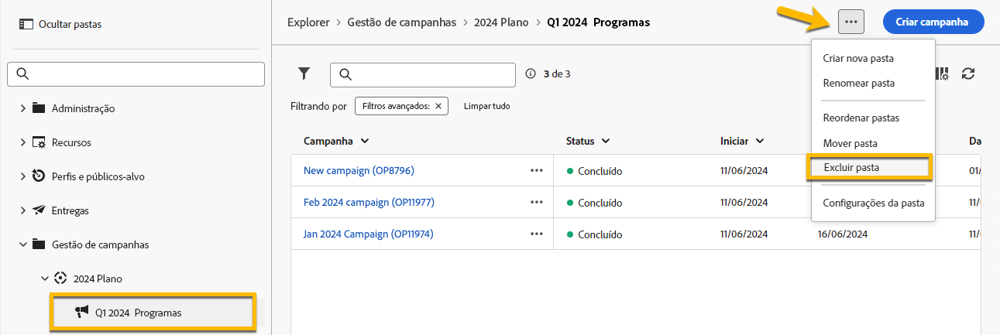{zoomable="yes"}

## Distribuição de valores em uma pasta {#distribution-values-folder}

A distribuição de valores ajuda a entender a porcentagem de um valor em uma coluna dentro de uma tabela.

Para ver a distribuição de valores de uma pasta, siga o procedimento descrito abaixo.

Por exemplo, entre as entregas, queremos saber qual é a distribuição dos valores da coluna **Canal**.

Para obter essas informações, acesse a pasta **[!UICONTROL Entregas]** e clique no ícone **[!UICONTROL Configurar colunas]**.

Na janela **[!UICONTROL Configurar colunas]**, clique no ícone **[!UICONTROL Informações]** correspondente à coluna que você deseja analisar. Em seguida, clique em **[!UICONTROL Distribuição de valores]**.

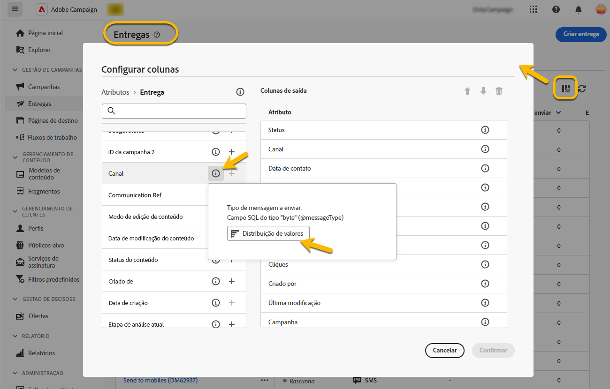{zoomable="yes"}

Você verá a porcentagem dos valores na coluna **[!UICONTROL Canal]**.

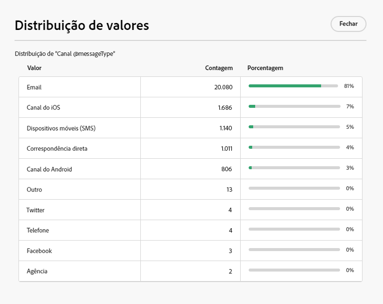{zoomable="yes"}

>[!NOTE]
>
>Para colunas com muitos valores, somente os primeiros 20 serão exibidos. Uma notificação de **[!UICONTROL carregamento parcial]** serve como aviso.

Também é possível ver a distribuição de valores de um link.

Na lista de atributos, clique no botão **+** ao lado do link desejado, conforme mostrado abaixo. Isso adiciona o link às **[!UICONTROL Colunas de saída]**. Agora é possível acessar o ícone **[!UICONTROL Informações]** para visualizar a distribuição dos valores. Caso não queira manter o link nas **[!UICONTROL Colunas de saída]**, clique em **[!UICONTROL Cancelar]**.

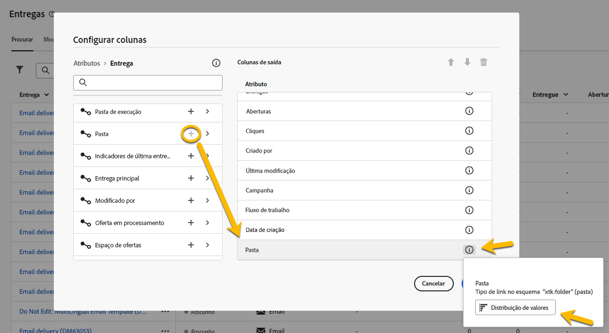{zoomable="yes"}

Também é possível ver a distribuição de valores em um modelador de consultas. [Saiba mais aqui](../query/build-query.md#distribution-of-values-in-a-query).

### Filtrar os valores {#filter-values}

Por usar os **[!UICONTROL Filtros avançados]** na janela de distribuição de valores, é possível filtrar os resultados com base em condições específicas.

No exemplo da lista de entregas acima, que mostra a distribuição por canal, é possível filtrá-la para exibir apenas as entregas com o status **Concluído**.

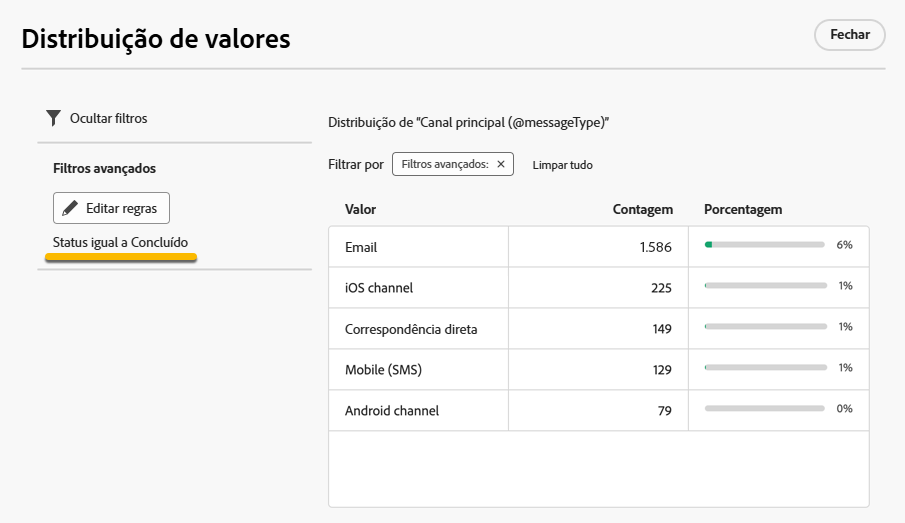{zoomable="yes"}