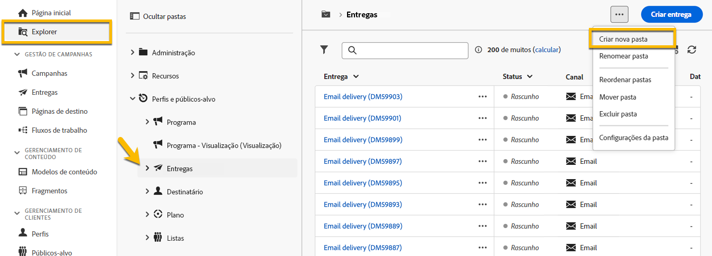
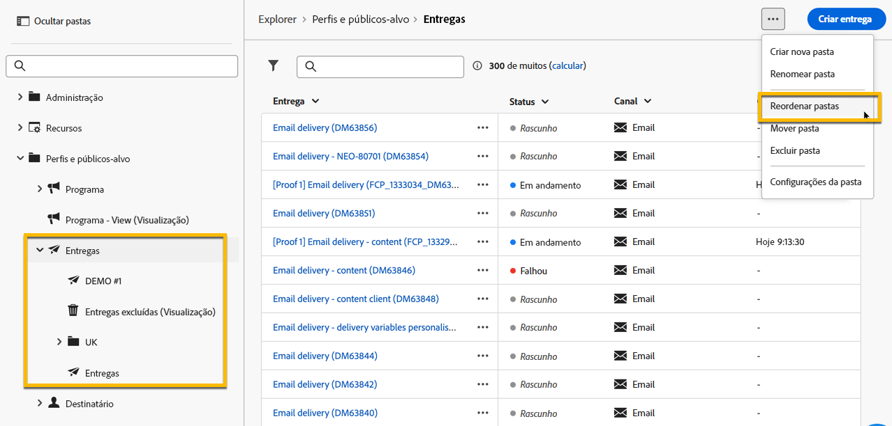

# Trabalhar com pastas {#folders}

>[!CONTEXTUALHELP]
>id="acw_folder_properties"
>title="Propriedades da pasta"
>abstract="Propriedades da pasta"

>[!CONTEXTUALHELP]
>id="acw_folder_security"
>title="Segurança da pasta"
>abstract="Segurança da pasta"

>[!CONTEXTUALHELP]
>id="acw_folder_restrictions"
>title="Restrições da pasta"
>abstract="Restrições da pasta"

>[!CONTEXTUALHELP]
>id="acw_folder_schedule"
>title="Programação da pasta"
>abstract="Programação da pasta"

## Sobre pastas {#about-folders}

Pastas são objetos no Adobe Campaign que permitem organizar os componentes e dados.

É possível criar, renomear, reordenar e mover pastas na árvore de navegação. Também é possível excluí-las de acordo com os direitos que você possui.

{zoomable="yes"}

É possível configurar um tipo de pasta. Por exemplo: uma pasta de entregas.
O ícone da pasta será alterado de acordo com esse tipo.

## Criar uma nova pasta {#create-a-folder}

Para criar uma nova pasta na interface web do Adobe Campaign, siga estas etapas:

1. No **[!UICONTROL Explorer]**, vá até a pasta na qual deseja criar a nova pasta.
 
No menu **[!UICONTROL ...]**, há a opção **[!UICONTROL Criar nova pasta]**

{zoomable="yes"}

Ao criar uma nova pasta, por padrão, o tipo de pasta é o mesmo da pasta principal. No nosso exemplo, criamos uma pasta na pasta **[!UICONTROL Entregas]**.

{zoomable="yes"}

1. Altere o tipo da pasta clicando no ícone de Tipo de pasta, se necessário, e escolha-o na lista apresentada, conforme abaixo:

{zoomable="yes"}

Configure o tipo de pasta clicando no botão **[!UICONTROL Confirmar]**.

Para criar uma pasta sem um tipo específico, escolha o tipo **[!UICONTROL Pasta genérica]**.

Também é possível [criar e gerenciar pastas no console do Adobe Campaign](https://experienceleague.adobe.com/pt-br/docs/campaign/campaign-v8/config/configuration/folders-and-views).

## Reordenar pastas {#reorder-folders}

Você pode reordenar as pastas de acordo com as suas necessidades. Para fazer isso, clique em **[!UICONTROL Reordenar pastas]**, conforme mostrado abaixo.

No nosso exemplo, a pasta **Entregas** contém 4 pastas.

{zoomable="yes"}

Você pode alterar a ordem das pastas ao **arrastar e soltar** ou com as **setas para cima e para baixo**.

{zoomable="yes"}

## Excluir uma pasta {#delete-a-folder}

>[!CAUTION]
>
>Ao excluir uma pasta, todos os dados armazenados nela também são excluídos.

Para excluir uma pasta, selecione-a na árvore do **[!UICONTROL Explorer]** e clique no menu **[!UICONTROL ...]**.
Escolha **[!UICONTROL Excluir pasta]**.

{zoomable="yes"}

## Distribuição de valores em uma pasta {#distribution-values-folder}

A distribuição de valores ajuda a saber qual é a porcentagem de um valor em uma coluna dentro de uma tabela.

Para saber qual é a distribuição de valores em uma pasta, faça o seguinte:

Por exemplo, entre as entregas, queremos saber qual é a distribuição dos valores da coluna **Canal**.

Para obter essas informações, acesse a pasta **[!UICONTROL Entregas]** e clique no ícone **[!UICONTROL Configurar colunas]**.

Na janela **[!UICONTROL Configurar colunas]**, clique no ícone **[!UICONTROL Informações]** da coluna cujas informações você deseja acessar. Em seguida, clique no botão **[!UICONTROL Distribuição de valores]**.

{zoomable="yes"}

Você obterá a porcentagem dos valores na coluna **[!UICONTROL Canal]**.

{zoomable="yes"}

>[!NOTE]
>
> Para colunas com muitos valores, somente os primeiros vinte valores serão exibidos. Uma notificação de **[!UICONTROL Carregamento parcial]** lhe avisará.

Você também pode ver a distribuição de valores de um link.

Na lista de atributos, clique no botão **+** ao lado do link desejado, conforme mostrado abaixo. Isso adiciona o link às **[!UICONTROL Colunas de saída]**. Agora, você verá o ícone **[!UICONTROL Informações]**, que permite que você visualize a distribuição dos valores. Se você não quiser manter o link nas **[!UICONTROL Colunas de saída]**, certifique-se de clicar no botão **[!UICONTROL Cancelar]**.

{zoomable="yes"}

Também é possível ver a distribuição de valores em um modelador de consulta. [Saiba mais aqui](../query/build-query.md#distribution-of-values-in-a-query).

### Filtrar os valores {#filter-values}

Ao usar os **[!UICONTROL Filtros avançados]** na janela de distribuição de valores, você pode filtrar os resultados com base em condições especificadas.

No exemplo da lista de entrega acima, que mostra a distribuição por canal, você pode, por exemplo, filtrá-la para exibir apenas as entregas com o status **Concluído**.

{zoomable="yes"}
