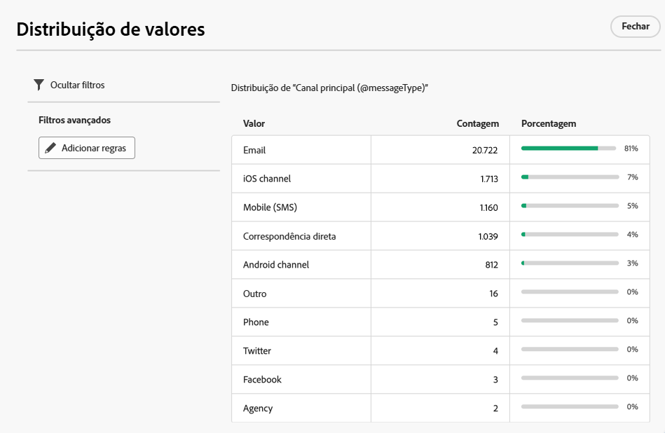

# Trabalhar com pastas {#folders}

>[!CONTEXTUALHELP]
>id="acw_folder_properties"
>title="Propriedades da pasta"
>abstract="Propriedades da pasta"

>[!CONTEXTUALHELP]
>id="acw_folder_security"
>title="Segurança da pasta"
>abstract="Segurança da pasta"

>[!CONTEXTUALHELP]
>id="acw_folder_restrictions"
>title="Restrições da pasta"
>abstract="Restrições da pasta"

>[!CONTEXTUALHELP]
>id="acw_folder_schedule"
>title="Programação da pasta"
>abstract="Programação da pasta"

## Sobre pastas {#about-folders}

Pastas são objetos no Adobe Campaign que permitem organizar os componentes e dados.

É possível criar, renomear, reordenar e mover pastas na árvore de navegação. Você também pode excluí-los com base nos seus direitos.

{zoomable="yes"}

É possível configurar um tipo de pasta. Por exemplo, uma pasta de deliveries. O ícone de pasta muda de acordo com seu tipo.

## Criar uma nova pasta {#create-a-folder}

Para criar uma nova pasta na interface web do Adobe Campaign, siga estas etapas:

1. No **[!UICONTROL Explorer]**, vá para a pasta onde deseja criar sua nova pasta. No menu **[!UICONTROL ...]**, selecione **[!UICONTROL Criar nova pasta]**.

{zoomable="yes"}

Ao criar uma nova pasta, o tipo de pasta assume como padrão o tipo da pasta principal. Neste exemplo, uma pasta é criada na pasta **[!UICONTROL Deliveries]**.

{zoomable="yes"}

1. Altere o tipo de pasta clicando no ícone de tipo de pasta, se necessário, e selecione o tipo desejado na lista apresentada, conforme mostrado abaixo:

{zoomable="yes"}

Configure o tipo de pasta clicando no botão **[!UICONTROL Confirmar]**.

Para criar uma pasta sem um tipo específico, selecione o tipo **[!UICONTROL Pasta genérica]**.

Também é possível [criar e gerenciar pastas no console do Adobe Campaign](https://experienceleague.adobe.com/pt-br/docs/campaign/campaign-v8/config/configuration/folders-and-views).

## Reordenar pastas {#reorder-folders}

Você pode reordenar pastas de acordo com suas necessidades. Para fazer isso, clique em **[!UICONTROL Reordenar pastas]**, conforme mostrado abaixo.

Neste exemplo, a pasta **Deliveries** contém quatro subpastas.

{zoomable="yes"}

Você pode alterar a ordem das pastas **arrastando e soltando** ou usando **setas para cima e para baixo**.

{zoomable="yes"}

## Excluir uma pasta {#delete-a-folder}

>[!CAUTION]
>
>Ao excluir uma pasta, todos os dados armazenados nela também são excluídos.

Para excluir uma pasta, selecione-a na árvore do **[!UICONTROL Explorer]** e clique no menu **[!UICONTROL ...]**. Escolha **[!UICONTROL Excluir pasta]**.

{zoomable="yes"}

## Distribuição de valores em uma pasta {#distribution-values-folder}

A distribuição de valores ajuda você a entender a porcentagem de um valor em uma coluna dentro de uma tabela.

Para visualizar a distribuição de valores em uma pasta, proceda conforme explicado abaixo.

Por exemplo, entre as entregas, talvez você queira saber a distribuição de valores na coluna **Canal**.

Para obter essas informações, vá para a pasta **[!UICONTROL Deliveries]** e clique no ícone **[!UICONTROL Configurar colunas]**.

Na janela **[!UICONTROL Configurar colunas]**, clique no ícone **[!UICONTROL Informações]** relacionado à coluna que você deseja analisar. Em seguida, clique no botão **[!UICONTROL Distribuição de valores]**.

{zoomable="yes"}

Você verá a porcentagem de valores na coluna **[!UICONTROL Canal]**.

{zoomable="yes"}

>[!NOTE]
>
>Para colunas com muitos valores, somente os primeiros vinte valores são exibidos. Uma notificação **[!UICONTROL Carga parcial]** avisa você.

Também é possível visualizar a distribuição de valores para um link.

Na lista de atributos, clique no botão **+** ao lado do link desejado, conforme mostrado abaixo. Isso adiciona o link às **[!UICONTROL Colunas de saída]**. Agora você pode acessar o ícone **[!UICONTROL Informações]**, permitindo exibir a distribuição de seus valores. Para não manter o link nas **[!UICONTROL Colunas de saída]**, clique no botão **[!UICONTROL Cancelar]**.

{zoomable="yes"}

Também é possível visualizar a distribuição de valores em um modelador de query. [Saiba mais aqui](../query/build-query.md#distribution-of-values-in-a-query).

### Filtrar os valores {#filter-values}

Ao usar os **[!UICONTROL Filtros avançados]** na janela de distribuição de valores, você pode filtrar os resultados com base nas condições especificadas.

No exemplo da lista acima, que mostra a distribuição por canal, você pode filtrar para exibir somente deliveries com o status **Concluído**.

{zoomable="yes"}