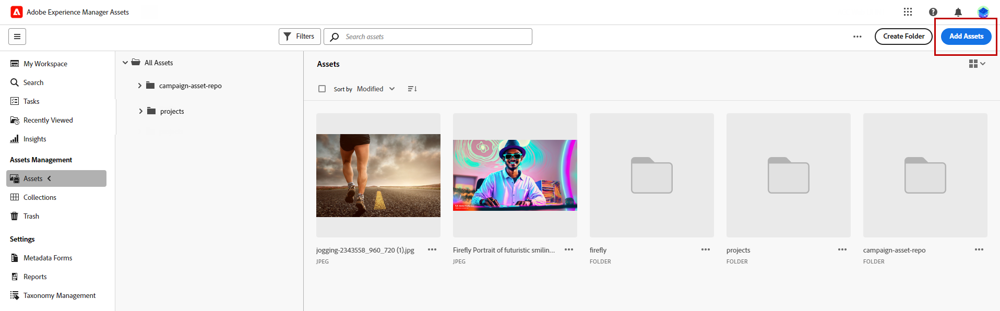

# Gerenciar ativos com [!DNL Adobe Experience Manager Assets as a Cloud Service]{#aem-assets}

## Introdução ao [!DNL Adobe Experience Manager Assets as a Cloud Service] {#get-started-assets-essentials}

O [!DNL Adobe Experience Manager Assets as a Cloud Service] é uma plataforma colaborativa integrada projetada para simplificar seu fluxo de trabalho criativo e centralizar ativos digitais para proporcionar uma entrega de experiência contínua. Ele simplifica a organização, a marcação e a recuperação de ativos de produção aprovados, garantindo a consistência da marca em todas as equipes. Com sua interface fácil de usar, o [!DNL Assets as Cloud Service] permite que você acesse e compartilhe instantaneamente ativos nos aplicativos Adobe Creative e Experience Cloud.

Saiba mais em [documentação do Adobe Experience Manager Assets as a Cloud Service](https://experienceleague.adobe.com/docs/experience-manager-cloud-service/content/assets/home.html?lang=pt-BR){target="_blank"}.

## Fazer upload e inserir ativos{#add-asset}

Para importar arquivos para [!DNL Assets as Cloud Service], procure ou crie a pasta onde os arquivos serão armazenados. Em seguida, insira-os no conteúdo do email.

Para obter mais informações sobre como carregar ativos, consulte a [documentação do Adobe Experience Manager Assets as a Cloud Service](https://experienceleague.adobe.com/docs/experience-manager-cloud-service/content/assets/assets-view/add-delete-assets-view.html?lang=pt-BR){target="_blank"}.

1. Na sua página inicial, acesse o menu avançado e selecione [!DNL Experience Manager Assets].

   {zoomable="yes"}

1. Em **Gerenciamento do Assets**, clique em **Assets** e escolha o repositório para seus ativos no Adobe Campaign.

1. Clique em uma pasta na seção central ou na exibição em árvore para abri-la.

   Você também pode clicar em **[!UICONTROL Criar pasta]** para criar uma nova pasta.

1. Uma vez na pasta selecionada ou criada, clique em **[!UICONTROL Adicionar Assets]** para carregar um novo ativo para sua pasta.

   {zoomable="yes"}

1. No menu **[!UICONTROL Carregar arquivos]**, clique em **[!UICONTROL Procurar]** e escolha entre **[!UICONTROL Procurar arquivos]** ou **[!UICONTROL Procurar pastas]**.

1. Selecione o arquivo que deseja fazer upload. Quando terminar, clique em **[!UICONTROL Carregar]**.

   {zoomable="yes"}

1. Para acessar o menu de gerenciamento avançado de ativos, selecione o ativo que você acabou de fazer upload.

   Para saber mais sobre como gerenciar ativos, consulte esta [página](https://experienceleague.adobe.com/docs/experience-manager-cloud-service/content/assets/assets-view/manage-organize-assets-view.html?lang=pt-BR).

   {zoomable="yes"}

1. Para editar ainda mais seus ativos com o Adobe Photoshop Express, clique duas vezes no ativo. Em seguida, no menu à direita, selecione o ícone **[!UICONTROL Editar modo]**. [Saiba mais](https://experienceleague.adobe.com/docs/experience-manager-cloud-service/content/assets/assets-view/edit-images-assets-view.html?lang=pt-BR#edit-using-express){target="_blank"}.

1. Em [!DNL Adobe Campaign], selecione o menu **[!UICONTROL Seletor de ativos]** no painel esquerdo do designer de email.

   {zoomable="yes"}

1. Selecione a pasta **[!UICONTROL Assets]** criada anteriormente. Você também pode pesquisar seu ativo ou pasta na barra de pesquisa.

   Se necessário, clique em **[!UICONTROL Gerenciar ativos]** para acessar diretamente o espaço de trabalho [!DNL Adobe Experience Manager Assets].

1. Arraste e solte seu ativo no conteúdo de email.

   {zoomable="yes"}

1. Personalize ainda mais seus ativos, como adicionar um link ou texto externo, usando as guias **[!UICONTROL Configurações]** e **[!UICONTROL Estilos]**. [Saiba mais sobre configurações de componentes](../email/content-components.md).

   {zoomable="yes"}