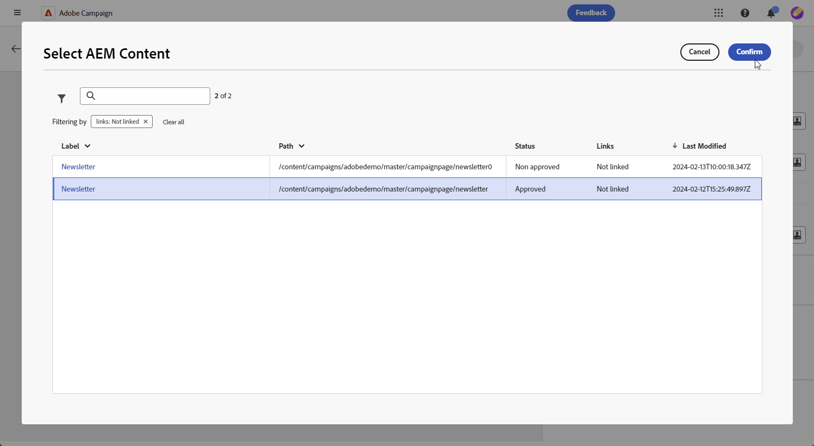

# Gerenciar modelos com [!DNL Adobe Experience Manager as a Cloud Service]{#aem-assets}

## Introdução ao [!DNL Adobe Experience Manager as a Cloud Service]{#create-aem}

A integração da interface da Web do Adobe Campaign com o Adobe Experience Manager facilita o gerenciamento simplificado de conteúdo de delivery de email e formulários diretamente na plataforma do Adobe Experience Manager.

[Saiba mais sobre o Adobe Experience Manager as a Cloud Service](https://experienceleague.adobe.com/docs/experience-manager-cloud-service/content/sites/authoring/getting-started/quick-start.html?lang=en)

## Criar um modelo em [!DNL Adobe Experience Manager as a Cloud Service]{#create-aem-template}

1. Navegue até a instância do autor [!DNL Adobe Experience Manager] e clique em Experiência Adobe no canto superior esquerdo da página. Escolha **[!UICONTROL Sites]** no menu.

1. Acesse **[!UICONTROL Campanhas > Nome da sua marca > Área principal > Nome da sua página]**.

1. Clique em **[!UICONTROL Criar]** e selecione **[!UICONTROL Página]** no menu suspenso.

   

1. Selecione o modelo do **[!UICONTROL Email do Adobe Campaign]** e nomeie o informativo.

   

1. Personalize seu conteúdo de email adicionando componentes, como campos de personalização do Adobe Campaign. [Saiba mais](https://experienceleague.adobe.com/docs/experience-manager-65/content/sites/authoring/aem-adobe-campaign/campaign.html?lang=en#editing-email-content)

1. Quando o email estiver pronto, navegue até o menu **[!UICONTROL Informações da página]** e clique em **[!UICONTROL Iniciar fluxo de trabalho]**.

   

1. Na primeira lista suspensa, selecione **[!UICONTROL Aprovar Adobe Campaign]** como modelo de fluxo de trabalho e clique em **[!UICONTROL Iniciar fluxo de trabalho]**.

1. Um aviso de isenção de responsabilidade será exibido na parte superior da página informando, `This page is subject to the workflow Approve for Adobe Campaign`. Clique em **[!UICONTROL Concluído]** ao lado do aviso de isenção de responsabilidade para confirmar a revisão e clique em **[!UICONTROL Ok]**.

   

1. Clique novamente em **[!UICONTROL Concluir]** e selecione **[!UICONTROL Aprovação de informativo]** na lista suspensa **[!UICONTROL Próxima etapa]**.

Seu boletim informativo agora está pronto e sincronizado no Adobe Campaign.

## Importar um modelo do Adobe Experience Manager as a Cloud Service{#aem-templates-perso}

Quando o template de Experience Manager estiver disponível na Adobe Campaign Web como um template de conteúdo, você poderá identificar e incorporar o conteúdo necessário para o email, incluindo personalização.

1. Na Web do Campaign, no menu **[!UICONTROL Deliveries]**, clique em **[!UICONTROL Criar delivery]**.

1. Na janela de modelo de email, selecione o modelo interno **[!UICONTROL Entrega de email com conteúdo AEM]**.

   

1. Insira um **[!UICONTROL Rótulo]** para a entrega e configure opções adicionais com base nas suas necessidades:

   * **[!UICONTROL Nome interno]**: atribua um identificador exclusivo à entrega.

   * **[!UICONTROL Pasta]**: armazene a entrega em uma pasta específica.

   * **[!UICONTROL Código de entrega]**: use este campo para organizar suas entregas com base em sua própria convenção de nomenclatura.

   * **[!UICONTROL Descrição]**: especifique uma descrição para a entrega.

   * **[!UICONTROL Natureza]**: especifique a natureza do email para fins de classificação.

1. Defina um **[!UICONTROL Público-alvo]** para seu email. [Saiba mais](../email/create-email.md#define-audience)

1. Clique em **[!UICONTROL Editar conteúdo]**.

1. No menu **[!UICONTROL Editar conteúdo]**, clique em **[!UICONTROL Selecionar conteúdo AEM]**.

   

1. Navegue pelo modelo do AEM e selecione aquele que será importado para o Campaign Web.

   

1. Observe que o conteúdo não é sincronizado automaticamente. Se forem feitas alterações nos modelos diretamente no Adobe Experience Manager, basta selecionar **[!UICONTROL Atualizar conteúdo AEM]** para ter a versão mais recente do modelo.

1. Para remover a vinculação entre o Experience Manager e o Campaign ou personalizar ainda mais seu modelo de Experience Manager no Designer de email, clique em **[!UICONTROL Desvincular conteúdo do AEM]**.

   

1. Se você adicionou conteúdo personalizado ao seu modelo de Experience Manager, clique em **[!UICONTROL Simular conteúdo]** para visualizar como ele aparecerá na mensagem usando perfis de teste.

[Saiba mais sobre perfis de pré-visualização e teste](../preview-test/preview-content.md)

1. Ao visualizar a pré-visualização da mensagem, todos os elementos personalizados são substituídos automaticamente pelos dados correspondentes do perfil de teste selecionado.

   Se necessário, perfis de teste adicionais podem ser adicionados através do botão **[!UICONTROL Gerenciar perfis de teste]**.

Seu delivery está pronto para ser enviado.
