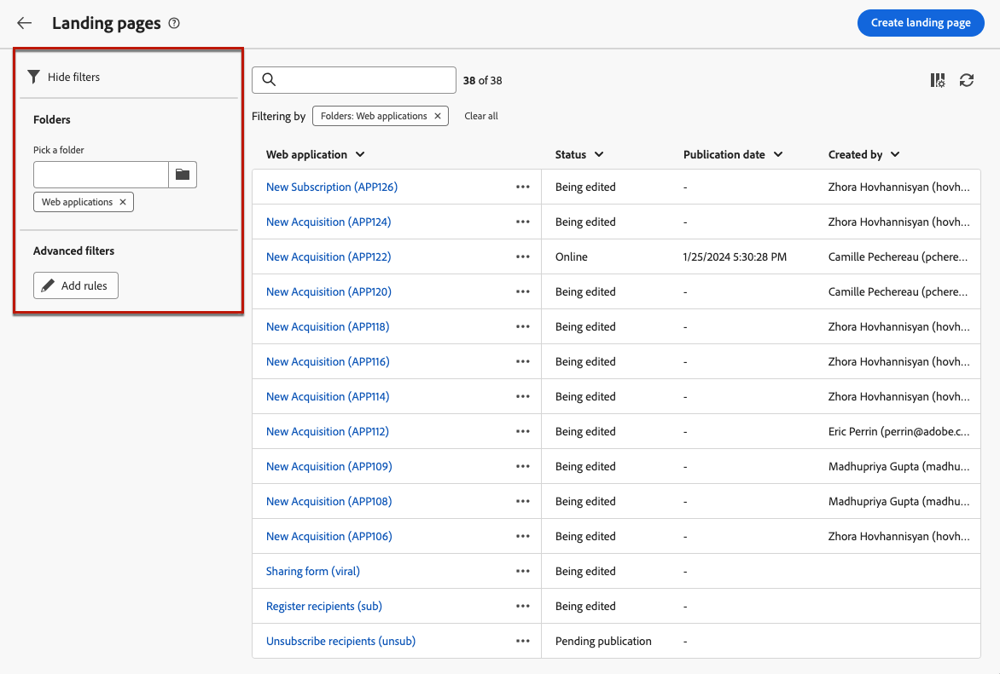

# Criar e publicar landing pages {#create-lp}

>[!CONTEXTUALHELP]
>id="acw_landingpages_menu"
>title="Criar e gerenciar landing pages"
>abstract="O Adobe Campaign permite criar, projetar e compartilhar páginas de destino para direcionar usuários a páginas da web nas quais é possível gerenciar casos de uso de aquisição, assinaturas ou cancelamentos de assinaturas e listas de bloqueio, utilizando como base os modelos integrados."

A interface do usuário da Web do Campaign permite criar, projetar e publicar páginas de aterrissagem. Depois de publicado, você pode inserir um link para o formulário em um delivery. Depois que os recipients clicam nesse link, eles são direcionados para a página de aterrissagem correspondente.

A [!DNL Adobe Campaign] vem com quatro modelos para gerenciar os seguintes casos de uso: **aquisição**, **assinatura**, **cancelamento de assinatura** e **inclui na lista de bloqueios**. [Saiba mais](lp-use-cases.md)

## Acessar páginas de destino {#access-landing-pages}

Para acessar a lista de páginas de aterrissagem, selecione **[!UICONTROL Gerenciamento de campanha]** > **[!UICONTROL Páginas de aterrissagem]** no menu esquerdo.

{zoomable="yes"}

O inventário de **[!UICONTROL Páginas de aterrissagem]** exibe todos os itens criados. Você pode filtrá-los usando o botão **[!UICONTROL Mostrar filtros]**. Você pode restringir os resultados a uma [pasta](../get-started/permissions.md#folders) específica usando a lista suspensa ou adicionar regras usando o [modelador de consultas](../query/query-modeler-overview.md).

{zoomable="yes"}

<!--From this list, you can access the [landing page Live report](../reports/lp-report-live.md) or [landing page Global report](../reports/lp-report-global.md) for published items.-->

>[!CAUTION]
>
>Não é possível exibir ou editar landing pages criadas no console do cliente (formulários web) na interface do usuário da Web do Campaign. Saiba mais na [documentação do console do Campaign](https://experienceleague.adobe.com/docs/campaign/campaign-v8/content/webapps.html?lang=pt-BR){target="_blank"}.

<!--If you unpublish a landing page which is referenced in a message, the link to the landing page will be broken and an error page will be displayed. You cannot delete a published landing page. To delete it, you must first unpublish it.-->

É possível duplicar ou excluir uma landing page. Clique nas reticências ao lado de uma landing page para selecionar a ação desejada.

## Criar uma landing page {#create-landing-page}

>[!CONTEXTUALHELP]
>id="acw_landingpages_properties"
>title="Definir as propriedades da landing page"
>abstract="Preencha os campos de propriedades, como o rótulo, e modifique o esquema, se necessário. Além disso, você pode editar o nome interno, alterar a pasta onde a landing page está armazenada e fornecer uma descrição."

>[!CONTEXTUALHELP]
>id="acw_landingpages_pages_list"
>title="Defina o conteúdo de cada página"
>abstract="Ajuste o conteúdo de cada página que faz parte desta página de destino, como o próprio formulário, a página de confirmação que é exibida ao enviar o formulário ou a página para a qual os usuários são direcionados em caso de erros."

>[!CONTEXTUALHELP]
>id="acw_landingpages_schedule"
>title="Agendar a landing page"
>abstract="Você pode definir uma data inicial e uma data final para sua landing page. Quando a página chegar ao final do período de validade, o formulário não estará mais disponível. A página **Expiração** será exibida em seu lugar."

>[!CONTEXTUALHELP]
>id="acw_landingpages_preload"
>title="Definir opções de pré-carregamento"
>abstract="Quando a opção **Preencher previamente com os dados referenciados no formulário** estiver selecionada, visitantes da página de destino quem correspondem a um perfil do banco de dados terão as informações do seu perfil pré-carregadas automaticamente no formulário. Com a opção **Autorizar ausência de ID** selecionada, qualquer visitante, incluindo usuários anônimos, pode acessar a página de destino."

<!--With the **Skip preloading if no ID** option selected, each profile entered will be added to the database after approval of the form."-->

>[!CONTEXTUALHELP]
>id="acw_landingpages_storage"
>title="Definir opções de armazenamento"
>abstract="A seção de pré-carregamento permite indicar como localizar o registro a ser atualizado no banco de dados."

<!--The main steps to create landing pages are as follows:

{zoomable="yes"}-->

Para criar uma landing page, siga estas etapas:

1. No inventário de **[!UICONTROL Páginas de aterrissagem]**, clique em **[!UICONTROL Criar página de aterrissagem]**.

   {zoomable="yes"}

1. Selecione um modelo:
   * **[!UICONTROL Aquisição]**: este é o modelo padrão para páginas de aterrissagem, que permite capturar e atualizar dados de perfil.
   * **[!UICONTROL Assinatura]**: use este modelo para permitir que os usuários assinem um [serviço](../audience/manage-services.md) específico.
   * **[!UICONTROL Cancelar assinatura]**: este modelo pode ser usado em uma entrega enviada aos assinantes de um serviço, para permitir que eles cancelem a assinatura deste [serviço](../audience/manage-services.md).
   * **[!UICONTROL Incluir na lista de bloqueios]**: este modelo deve ser usado quando um perfil clicar em um link para opção de não participação em uma entrega e não quiser mais ser contatado.

   {zoomable="yes"}

   >[!NOTE]
   >
   >Saiba como implementar os diferentes casos de uso correspondentes a cada modelo em [esta página](lp-use-cases.md).

1. Clique em **[!UICONTROL Create]**.

1. Preencha os campos **[!UICONTROL Propriedades]**, como o rótulo.

   Por padrão, as páginas de aterrissagem são armazenadas na pasta **[!UICONTROL Aplicativos da Web]**. Você pode alterá-lo navegando até o local desejado nas **[!UICONTROL Opções adicionais]**. [Saiba como trabalhar com pastas](../get-started/permissions.md#folders)

   {zoomable="yes"}

1. Na seção **[!UICONTROL Pré-carregamento de dados]**, as duas opções abaixo estão disponíveis:

   * Quando a opção **[!UICONTROL Preencher previamente com os dados referenciados no formulário]** estiver selecionada, visitantes da página de destino quem correspondem a um perfil do banco de dados terão as informações do seu perfil pré-carregadas automaticamente no formulário. O usuário só precisa preencher os campos ausentes e atualizar os valores existentes, se necessário. Isso permite mesclar dados de perfis existentes, em vez de criar duplicatas.

     >[!NOTE]
     >
     >Essa opção é selecionada por padrão para todos os templates de landing page.

   <!--* The **[!UICONTROL Skip preloading if no ID]** option must be selected if you do not wish to update profiles. In this case, each profile entered will be added to the database after approval of the form. This option is used, for example, when the form is posted on a website.-->

   * A opção **[!UICONTROL Autorizar ausência de ID]** permite que qualquer visitante acesse a página de aterrissagem. Desmarcar essa opção impede que visitantes anônimos a usem, o que significa que somente usuários identificados podem acessar e enviar o formulário.

     >[!AVAILABILITY]
     >
     >Esse recurso está na disponibilidade limitada (DL). É restrita aos clientes que estão migrando **do Adobe Campaign Standard para o Adobe Campaign v8** e não pode ser implantada em nenhum outro ambiente.

     Para os modelos **[!UICONTROL Aquisição]** e **[!UICONTROL Assinatura]**, esta opção é selecionada por padrão. Para os modelos **[!UICONTROL Unsubscription]** e **[!UICONTROL Incluir na lista de bloqueios]**, essa opção é desmarcada por padrão e não pode ser modificada<!--as per ticket - TBC? in that case, is it greyed out or doesn't display?-->.

1. Uma landing page pode ter páginas subsequentes. Para adicionar páginas, navegue pela seção **[!UICONTROL Páginas]** e clique no botão **[!UICONTROL Editar conteúdo]** para cada página que você deseja criar para esta página de aterrissagem. O conteúdo de cada página já está pré-preenchido. Edite-as conforme necessário. [Saiba mais](lp-content.md)

   {zoomable="yes"}

1. Na seção **[!UICONTROL Storage]**, a opção **[!UICONTROL Update the preloaded record]** é selecionada por padrão. Ela permite atualizar os perfis armazenados no banco de dados por meio da landing page. A caixa de pré-carregamento permite indicar como localizar o registro a ser atualizado no banco de dados.

   Você também pode escolher entre os campos no contexto atual da landing page, aqueles que serão usados para localizar o perfil correspondente no banco de dados. Para fazer isso, desmarque a opção **[!UICONTROL Atualizar o registro pré-carregado]** e verifique os campos desejados em **[!UICONTROL Opções de reconciliação]**.

   {zoomable="yes"}

1. Crie **[!UICONTROL Dados adicionais]** para armazenar dados internos quando a landing page estiver sendo enviada. Esses dados não estão visíveis para usuários que visitam a página. Somente valores constantes são considerados.

   >[!AVAILABILITY]
   >
   >Esse recurso está na disponibilidade limitada (DL). É restrita aos clientes que estão migrando **do Adobe Campaign Standard para o Adobe Campaign v8** e não pode ser implantada em nenhum outro ambiente.

   {zoomable="yes"}

1. Você pode definir uma data inicial e uma data final para sua landing page. Selecione **[!UICONTROL Habilitar agendamento]** e defina as datas.

   {zoomable="yes"}

   * A landing page é publicada automaticamente na data/hora de início especificada.

     >[!NOTE]
     >
     >Se nenhuma data de início for definida, a landing page será ativada assim que for publicada.

   * Quando a página atingir a data de término, <!--the landing page is automatically unpublished and -->o formulário não estará mais disponível. A página **[!UICONTROL Expiração]** será exibida em seu lugar.

     >[!NOTE]
     >
     >Por motivos de segurança e desempenho da plataforma, a Adobe recomenda que você defina uma data de término.

1. Clique em **[!UICONTROL Revisar e publicar]**.

Depois de definir todas as configurações e [criar](lp-content.md) todas as páginas, você pode [testar](#test-landing-page) e [publicar](#publish-landing-page) sua página de aterrissagem, conforme detalhado abaixo.

## Testar a landing page {#test-landing-page}

>[!CONTEXTUALHELP]
>id="acw_landingpages_simulate"
>title="Simular a landing page"
>abstract="Você pode ver uma pré-visualização da landing page na interface do Campaign Web ou abri-la em uma nova guia do navegador da web."

>[!CONTEXTUALHELP]
>id="ac_preview_lp_profiles"
>title="Visualizar e testar a página de destino"
>abstract="Depois de definir as configurações e o conteúdo da página de destino, você pode usar perfis de teste para visualizar."

Depois que as configurações e o conteúdo da landing page forem definidos, você poderá usar perfis de teste para pré-visualizá-la. Se você inseriu [conteúdo personalizado](../personalization/gs-personalization.md), será possível verificar como esse conteúdo é exibido na página de aterrissagem, usando os dados do perfil de teste.

>[!CAUTION]
>
>Você deve ter perfis de teste disponíveis para poder visualizar suas mensagens e enviar provas. [Saiba mais sobre perfis de teste](../audience/test-profiles.md)

Para testar a landing page, siga estas etapas:

1. Depois de clicar em **[!UICONTROL Revisar e publicar]**, selecione o botão **[!UICONTROL Simular conteúdo]** no painel da página de aterrissagem para acessar a seleção de perfil de teste.

   {zoomable="yes"}

1. Na tela **[!UICONTROL Simular]**, selecione um ou mais perfis de teste.

   As etapas para selecionar perfis de teste são as mesmas que ao testar uma mensagem. Eles estão detalhados na seção [Pré-visualização e teste](../preview-test/preview-test.md).

1. Ao testar uma página de aterrissagem dinâmica (com a opção **[!UICONTROL Serviço da URL]** selecionada - [saiba mais](../landing-pages/create-lp.md#define-actions-on-form-submission)

1. Selecione **[!UICONTROL Abrir visualização]** para testar a página de aterrissagem.

   {zoomable="yes"}

1. A visualização da landing page é aberta em uma nova guia. Os elementos personalizados são substituídos pelos dados do perfil de teste selecionado.

   Se você selecionou a opção **[!UICONTROL Preenchimento prévio com os dados referenciados no formulário]** nas configurações da página de aterrissagem, os campos de formulário serão automaticamente preenchidos com os dados do perfil de teste correspondentes.<!--TBC-->

   {zoomable="yes"}

1. Selecione outros perfis de teste para visualizar a renderização de cada variante da página de aterrissagem.

<!--Can you preview Confirmation/Error/Expiration pages?-->

## Publicar a página de destino {#publish-landing-page}

Quando a landing page estiver pronta e validada, publique-a para disponibilizá-la para uso em um delivery usando o botão correspondente.

Depois de publicado:

* A página de aterrissagem é adicionada à lista de páginas de aterrissagem com o status **[!UICONTROL Publicado]**. Agora ela está ativa e pronta para ser referenciada em seu conteúdo.

* Você pode copiar e colar a **[!UICONTROL URL da página de aterrissagem]** que é exibida na parte superior da página em um navegador da Web para visualizar sua página de aterrissagem.

>[!CAUTION]
>
>Para testar ou aproveitar totalmente sua página de destino, você não deve copiar e colar o link diretamente em um navegador da web ou em suas entregas. Em vez disso, use a função [Simular conteúdo](#test-landing-page) para testá-lo e siga as etapas descritas em [esta seção](lp-use-cases.md) para usar adequadamente sua página de aterrissagem.

{zoomable="yes"}

Você pode monitorar os impactos da sua página de aterrissagem por meio de logs<!--and specific reports-->. Clique no botão **[!UICONTROL Logs]**.
