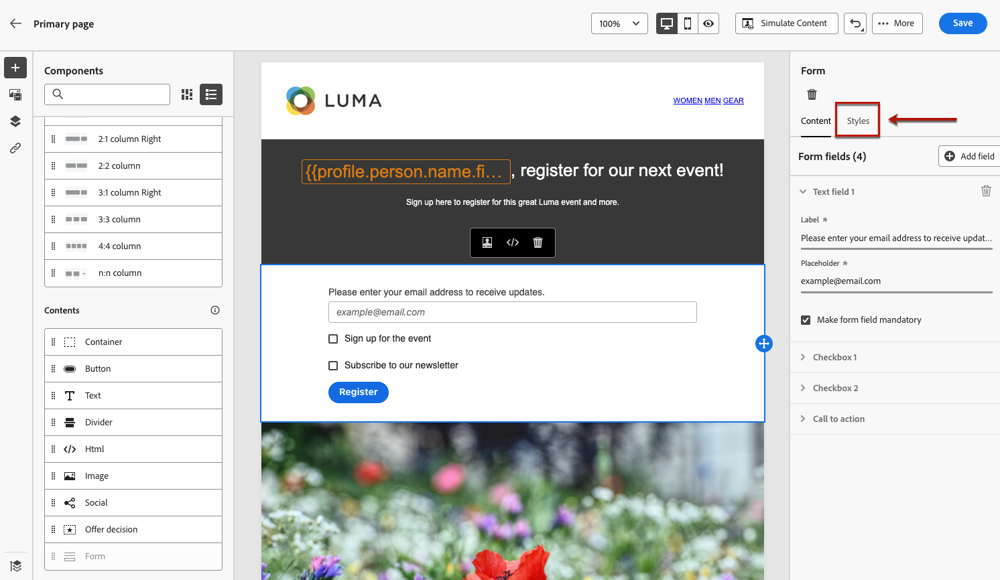

# Definir conteúdo específico da página de destino {#lp-content}

>[!CONTEXTUALHELP]
>id="ac_lp_components"
>title="Usar componentes de conteúdo"
>abstract="Os componentes de conteúdo são espaços reservados de conteúdo vazios que você pode usar para criar o layout de uma página de destino. Para definir um conteúdo específico que permitirá aos usuários selecionar e enviar suas opções, use o componente de formulário."

Ao editar o conteúdo de qualquer página da sua landing page, ela já está pré-preenchida.

A página principal é a página imediatamente exibida aos usuários depois que eles clicam no link para a página de aterrissagem, como a partir de um email ou site. A página principal já está pré-preenchida com o [componente de formulário específico da página de destino](#use-form-component) para permitir que os usuários selecionem e enviem suas escolhas. Você também pode definir [estilos específicos da página de aterrissagem](#lp-form-styles).

Para projetar ainda mais o conteúdo da página de aterrissagem, você pode usar os mesmos componentes de um email. [Saiba mais](../email/content-components.md#add-content-components)

<!--
The content of the **[!UICONTROL Confirmation]**, **[!UICONTROL Error]** and **[!UICONTROL Expiration]** pages is also pre-filled. Edit them as needed.

Set the subscription form to the appropriate fields from the database to make sure it will work correctly.

The landing page default fields are already there for the selected template.

>[!NOTE]
>
>You can also create a click-through landing page without a **[!UICONTROL Form]** component. In that case, the landing page will be displayed to users, but they will not be required to submit any form. This can be useful if you only want to showcase a landing page without requiring any action from your recipients such as opt-in or opt out, or want to provide information that doesn't require user input.

Using the landing page content designer, you can also leverage contextual data coming from the primary page in a subpage. [Learn more](#use-primary-page-context)-->

## Usar o componente de formulário {#use-form-component}

>[!CONTEXTUALHELP]
>id="ac_lp_formfield"
>title="Definir os campos do componente de formulário"
>abstract="Defina como os recipients verão a página de destino e enviarão suas opções."

>[!CONTEXTUALHELP]
>id="acw_landingpages_calltoaction"
>title="O que acontece ao clicar no botão"
>abstract="Defina o que acontecerá depois que as pessoas enviarem o formulário da página de destino."

Para definir um conteúdo específico que permita aos usuários selecionar e enviar suas opções a partir da página de aterrissagem, use o **[!UICONTROL Formulário]** componente. Para fazer isso, siga as etapas abaixo.

1. A página de aterrissagem específica **[!UICONTROL Formulário]** já é exibido na tela para o modelo selecionado.

   >[!NOTE]
   >
   >A variável **[!UICONTROL Formulário]** O componente só pode ser usado uma vez na mesma página.

1. Selecione-o. A variável **[!UICONTROL Conteúdo do formulário]** é exibida na paleta direita para permitir a edição dos diferentes campos do formulário.

   

   >[!NOTE]
   >
   >Alterne para a **[!UICONTROL Estilos]** a qualquer momento para editar os estilos do conteúdo do componente de formulário. [Saiba mais](#lp-form-styles)

1. Expanda o primeiro campo de texto. No **[!UICONTROL Campo de texto 1]** você pode editar o tipo de campo, o campo do banco de dados, o rótulo e o texto que será exibido dentro do campo antes que o usuário preencha o campo.

   

1. Verifique a **[!UICONTROL Tornar campo de formulário obrigatório]** opção, se necessário. Nesse caso, a landing page só poderá ser enviada se o usuário tiver preenchido esse campo.

   >[!NOTE]
   >
   >Se um campo obrigatório não estiver preenchido, uma mensagem de erro será exibida quando o usuário enviar a página.

1. Adicione uma caixa de seleção. Selecione se essa caixa de seleção deve atualizar um serviço ou um campo do banco de dados.

   

   Defina se essa caixa de seleção é para aceitar ou rejeitar os usuários. Selecione entre as duas opções abaixo:

   * **[!UICONTROL Inscrever se marcado]**: os usuários precisam marcar a caixa para consentir (aceitar).
   * **[!UICONTROL Cancelar inscrição se marcado]**: os usuários precisam marcar a caixa para remover seu consentimento (recusa).

1. É possível excluir e adicionar quantos campos de texto e/ou caixas de seleção forem necessários.

1. Depois de ter adicionado todas as caixas de seleção e/ou campos de texto desejados, clique em **[!UICONTROL Chamada para ação]** para expandir a seção correspondente. Ela permite definir o comportamento do botão na variável **[!UICONTROL Formulário]** componente.

   

1. Defina o que acontecerá ao clicar no botão:

   * **[!UICONTROL Página de confirmação]**: O usuário será redirecionado para a **[!UICONTROL Confirmação]** página definida para a página inicial atual.

   * **[!UICONTROL URL de redirecionamento]**: digite o URL da página para a qual os usuários serão redirecionados.

1. Se quiser fazer atualizações adicionais ao enviar o formulário, selecione **[!UICONTROL Atualizações adicionais]**, escolha **[!UICONTROL Opção de participação]** ou **[!UICONTROL Recusar]** e define se deseja atualizar uma lista de assinaturas, o canal ou apenas o endereço de email usado.

   

1. Salve o conteúdo para voltar para o [propriedades da landing page](create-lp.md).

## Definir estilos de formulário de página de destino {#lp-form-styles}

1. Para modificar os estilos do conteúdo do componente de formulário, alterne a qualquer momento para o **[!UICONTROL Estilo]** guia.

   

1. A variável **[!UICONTROL Campos]** A seção é expandida por padrão e permite editar a aparência do campo de texto, como o rótulo e a fonte do espaço reservado, a posição do rótulo, a cor de fundo do campo ou a borda do campo.

   

1. Expanda a **[!UICONTROL Caixas de seleção]** para definir a aparência das caixas de seleção e o texto correspondente. Por exemplo, é possível ajustar a família ou o tamanho da fonte, ou a cor da borda da caixa de seleção.

   

1. Expanda a **[!UICONTROL Botões]** para modificar a aparência do botão no formulário do componente. Por exemplo, você pode alterar a fonte, adicionar uma borda, editar a cor do rótulo ao passar o mouse ou ajustar o alinhamento do botão.

   

   Você pode visualizar algumas de suas configurações, como a cor do rótulo do botão ao passar o mouse, usando o **[!UICONTROL Simular conteúdo]** botão. Saiba mais sobre como testar páginas de destino [aqui](create-lp.md#test-landing-page).

1. Expanda a **[!UICONTROL Layout do formulário]** para editar as configurações de layout, como cor de fundo, preenchimento ou margem.

   

<!--
1. Expand the **[!UICONTROL Form error]** section to adjust the display of the error message that displays in case a problem occurs. Check the corresponding option to preview the error text on the form.

    -->

