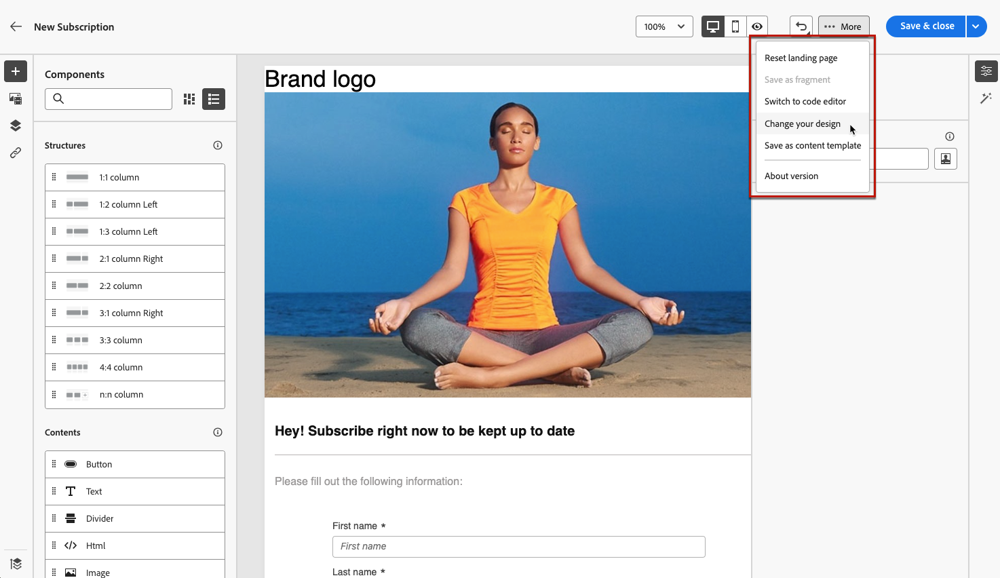

# Trabalhar com modelos de conteúdo de página de aterrissagem {#work-with-templates}

## Salvar uma página como modelo {#save-as-template}

Depois de criar o [conteúdo da página de aterrissagem](lp-content.md), você pode salvá-lo para reutilização futura. Para salvar uma página como modelo, siga as etapas abaixo.

1. Clique no botão **[!UICONTROL Mais]** na parte superior direita da tela.

1. Selecione **[!UICONTROL Salvar como modelo de conteúdo]** no menu suspenso.

   {zoomable="yes"}

1. Adicione um nome para este template.

1. Clique em **[!UICONTROL Salvar]**.

Você pode usar esse template para criar conteúdo na próxima vez que criar uma landing page. Saiba mais na [seção](#use-saved-template) abaixo.

{zoomable="yes"}

## Usar um modelo salvo {#use-saved-template}

<!--Not for GA?-->

1. Ao editar o conteúdo da página de aterrissagem, clique no botão **[!UICONTROL Mais]** e selecione **[!UICONTROL Alterar seu design]**.

   {zoomable="yes"}

1. Confirme sua escolha.

   >[!NOTE]
   >
   >Esta ação exclui e substitui o conteúdo atual pelo conteúdo do novo modelo.

1. A lista de todos os modelos salvos anteriormente aparece na guia **[!UICONTROL Modelos salvos]**. Você pode classificá-los **[!UICONTROL Pelo nome]**, **[!UICONTROL Última modificação]** e **[!UICONTROL Última criação]**.

   {zoomable="yes"}

1. Selecione o template de sua escolha na lista. Depois de selecionado, navegue entre todos os modelos salvos usando as setas para a direita e para a esquerda.

   {zoomable="yes"}

1. Clique em **[!UICONTROL Usar este modelo]**.

1. Edite seu conteúdo conforme desejado usando o designer da landing page.

<!--Primary page templates and subpage templates are managed separately, meaning that you cannot use a primary page template to create a subpage, and vice versa. TBC in Web user interface-->