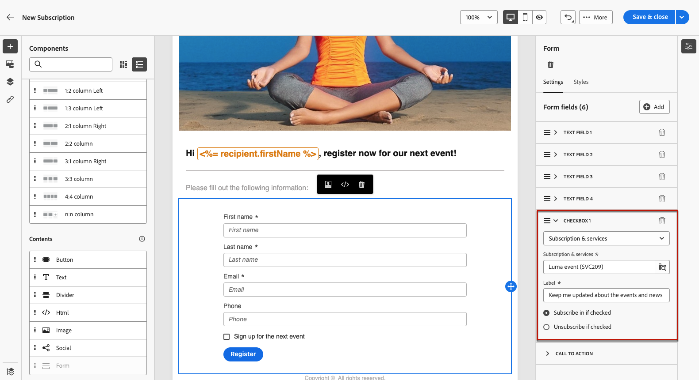

# Como usar uma landing page {#lp-use-cases}

>[!CONTEXTUALHELP]
>id="acw_landingpages_url"
>title="Copie o URL com cuidado"
>abstract="Para testar ou aproveitar totalmente a landing page, não é possível copiar e colar esse link diretamente em um navegador da Web ou em seus deliveries. Use o botão **Simular conteúdo** para testá-la e siga as etapas descritas na documentação para usar corretamente a landing page."

Para usar adequadamente a landing page, você deve referenciá-la como um link em um delivery usando a opção dedicada.

>[!CAUTION]
>
>Para aproveitar totalmente a landing page, não é possível copiar e colar o link exibido no painel do delivery publicado diretamente nos seus deliveries ou em uma página da Web.

No [!DNL Adobe Campaign Web] inferface, quatro templates prontos para uso permitem implementar casos de uso diferentes. No entanto, as etapas principais permanecem as mesmas e são detalhadas abaixo.

1. [Criar uma landing page](create-lp.md#create-landing-page) e selecione o template de sua escolha, de acordo com seu caso de uso.

1. Defina as propriedades e as configurações da landing page.

   {zoom=&quot;yes&quot;}

1. De acordo com seu caso, selecione o **[!UICONTROL Aquisição]**, **[!UICONTROL Inscrição]**, **[!UICONTROL Cancelar assinatura]** ou **[!UICONTROL ➡ Incluir na lista de bloqueios]** página.

1. O conteúdo da página é exibido. Selecione a parte correspondente ao formulário de landing page.

   {zoom=&quot;yes&quot;}

1. Edite o conteúdo de acordo com o template selecionado:

   * [Aquisição](#lp-acquisition)
   * [Assinatura](#lp-subscription)
   * [Cancelamento de assinatura](#lp-unsubscription)
   * [Lista de bloqueios](#lp-denylist)

1. Modifique o restante do conteúdo conforme necessário, salve as alterações e feche o.

1. Edite o **[!UICONTROL Confirmação]** conforme necessário, bem como a **[!UICONTROL Erro]** e **[!UICONTROL Expiração]** páginas. A variável **[!UICONTROL Confirmação]** será exibida aos recipients quando eles enviarem o formulário.

   {zoom=&quot;yes&quot;}

1. [Teste](create-lp.md#test-landing-page) e [publicar](create-lp.md#publish-landing-page) sua landing page.

1. Criar um [email](../email/create-email.md) delivery para direcionar o tráfego para a landing page.

1. [Inserir um link](../email/message-tracking.md#insert-links) no conteúdo da mensagem. Selecionar **[!UICONTROL Landing page]** como o **[!UICONTROL Tipo de link]** e escolha a landing page que você criou.

   {zoom=&quot;yes&quot;}

   >[!NOTE]
   >
   >Para enviar a mensagem, verifique se a landing page selecionada ainda não expirou. [Saiba mais](create-lp.md#create-landing-page)

Depois que receberem o email, se os recipients clicarem no link para a landing page e enviarem o formulário:

* Eles serão direcionados para a página de confirmação.

* Qualquer outra ação definida na página de aterrissagem será aplicada. Por exemplo, os usuários serão inscritos em seu serviço ou não receberão mais comunicações de você.

Abaixo estão alguns exemplos de como você pode usar [!DNL Adobe Campaign] páginas de aterrissagem nos diferentes casos de uso possíveis.

## Aquisição de perfil {#lp-acquisition}

O primeiro template permite adicionar ou atualizar um perfil no banco de dados do Campaign.

1. Quando [criação da sua landing page](create-lp.md#create-landing-page), selecione o **[!UICONTROL Aquisição]** modelo.

1. Nas propriedades da landing page, selecione a variável **[!UICONTROL Preencher previamente com os dados referenciados no formulário]** para pré-carregar qualquer informação existente do perfil e evitar a criação de duplicatas.

1. Selecione o **[!UICONTROL Aquisição]** para editar seu conteúdo.

1. Edite os campos de texto conforme necessário, de acordo com as informações que deseja coletar em seus perfis.

1. Além disso, você pode adicionar uma caixa de seleção que convida os clientes a assinar o serviço de boletim informativo. [Saiba como criar um serviço](../audience/manage-services.md)

   {zoom=&quot;yes&quot;}

1. Ajuste o conteúdo conforme necessário e salve as alterações.

1. Revisão e [publicar](create-lp.md#publish-landing-page) sua landing page.

1. Criar um [email](../email/create-email.md) e [adicionar um link](../email/message-tracking.md#insert-links) à sua landing page.

Depois que eles receberem o email, se os recipients clicarem no link para a landing page e enviarem o formulário, o perfil deles será adicionado ao banco de dados do Campaign ou atualizado com as informações fornecidas.

{zoom=&quot;yes&quot;}

Se optarem por receber seu boletim informativo, serão inscritos no serviço correspondente.

{zoom=&quot;yes&quot;}

## Assinatura de um serviço {#lp-subscription}

Um dos casos de uso mais comuns consiste em convidar seus clientes para [assinar um serviço](../audience/manage-services.md) (como um boletim informativo ou um evento) por meio de uma landing page. Siga as etapas abaixo.

<!--For example, let's say you organize an event next month and you want to launch an event registration campaign. To do this, you're going to send an email including a link to a landing page that will enable your recipients to register for this event. The users who register will be added to the subscription list that you created for this purpose.-->

1. Comece criando um template de confirmação para os usuários que assinam seu evento, para que você possa selecioná-lo facilmente ao criar o serviço. [Saiba mais](../audience/manage-services.md#create-confirmation-message)

   {zoom=&quot;yes&quot;}

1. Crie um serviço de assinatura, que armazenará os usuários registrados em seu evento. [Saiba como criar um serviço](../audience/manage-services.md)

1. Selecione o template criado como o email de confirmação que os usuários receberão ao assinar.

   {zoom=&quot;yes&quot;}

1. [Criar uma landing page](create-lp.md#create-landing-page) para permitir que seus destinatários se registrem no evento. Selecione o **[!UICONTROL Inscrição]** modelo.

1. Selecione o **[!UICONTROL Inscrição]** para editar seu conteúdo.

1. O conteúdo da página é exibido. Selecione a parte correspondente ao formulário de landing page e expanda a **[!UICONTROL Caixa de seleção 1]** seção.

1. No **[!UICONTROL Assinaturas e serviços]** selecione o serviço criado para o evento. Deixe a **[!UICONTROL Inscrever-se se marcado]** opção ativada.

   {zoom=&quot;yes&quot;}
<!--
1. You can add an additional checkbox to offer subscription to your newsletter for example.-->

1. Ajuste o conteúdo conforme necessário e salve as alterações.

1. Revisão e [publicar](create-lp.md#publish-landing-page) sua landing page.

1. Criar um [email](../email/create-email.md) e [adicionar um link](../email/message-tracking.md#insert-links) para direcionar o tráfego para a landing page de registro.

1. Crie o email para anunciar que as inscrições para o seu evento estão abertas.

Depois que eles receberem o email, se seus recipients clicarem no link para a landing page e enviarem o formulário, eles serão direcionados à página de confirmação e adicionados à lista de subscrição.

## Cancelamento de assinatura {#lp-unsubscription}

Você pode permitir que seus clientes cancelem a assinatura de um serviço usando uma landing page.

1. Certifique-se de ter criado um modelo de confirmação para os usuários que cancelaram a assinatura do serviço, para que você possa selecioná-lo facilmente ao criar o serviço. [Saiba mais](../audience/manage-services.md#create-confirmation-message)

1. No seu [subscrição no serviço](../audience/manage-services.md), selecione o template criado como o email de confirmação que os usuários receberão ao cancelar a inscrição.

1. [Criar uma landing page](create-lp.md#create-landing-page). Selecione o **[!UICONTROL Cancelar assinatura]** modelo.

1. Selecione o **[!UICONTROL Cancelar assinatura]** para editar seu conteúdo.

1. O conteúdo da página é exibido. Selecione a parte correspondente ao formulário de landing page.

1. Você pode adicionar um **[!UICONTROL Caixa de seleção]** , selecione o serviço e selecione a **[!UICONTROL Cancelar inscrição se marcado]** opção.

   {zoom=&quot;yes&quot;}

1. Também é possível expandir a variável **[!UICONTROL Chamada para ação]** e selecione o **[!UICONTROL Atualizações adicionais]** opção. Selecione o serviço e marque a opção **[!UICONTROL Recusar]** opção.

   {zoom=&quot;yes&quot;}

1. Ajuste o conteúdo conforme necessário e salve as alterações.

1. Revisão e [publicar](create-lp.md#publish-landing-page) sua landing page.

1. Criar um [email](../email/create-email.md) e [adicionar um link](../email/message-tracking.md#insert-links) para a página de aterrissagem.

Depois que eles receberem o email, se os recipients clicarem no link para a landing page e enviarem o formulário, eles serão direcionados à página de confirmação do cancelamento de subscrição e serão removidos do serviço de subscrição correspondente.

## Lista de bloqueios {#lp-denylist}

Oferecer aos recipients a capacidade de cancelar a inscrição para receber comunicações de uma marca é um requisito legal. Portanto, você sempre deve incluir um **link para cancelar inscrição** em cada email enviado aos recipients. Ao clicar nesse link, os recipients serão direcionados a uma página de aterrissagem que inclui um botão para confirmar a recusa.

Você pode configurar um **[!UICONTROL ➡ Incluir na lista de bloqueios]** página de aterrissagem que permitirá que os usuários recusem todos os deliveries.

1. Quando [criação da sua landing page](create-lp.md#create-landing-page), selecione o **[!UICONTROL ➡ Incluir na lista de bloqueios]** modelo.

1. Selecione o **[!UICONTROL ➡ Incluir na lista de bloqueios]** para editar seu conteúdo.

1. Expanda a **[!UICONTROL Chamada para ação]** e selecione o **[!UICONTROL Atualizações adicionais]** opção.

1. Na lista suspensa correspondente, selecione **[!UICONTROL Canal (email)]** para permitir que seus recipients recusem apenas as comunicações por email. Também é possível selecionar **[!UICONTROL Por todos os canais]** para optá-los por todas as comunicações em todos os canais.

   {zoom=&quot;yes&quot;}

1. Ajuste o conteúdo conforme necessário e salve as alterações.

1. Revisão e [publicar](create-lp.md#publish-landing-page) sua landing page.

1. Criar um [email](../email/create-email.md) e [adicionar um link](../email/message-tracking.md#insert-links) à sua landing page para permitir que os usuários recusem receber comunicações.

Depois que receberem o email, se os recipients clicarem no link para a landing page e enviarem o formulário, eles serão direcionados à página de confirmação do incluo na lista de bloqueios e seu perfil será atualizado com as informações fornecidas.

Para verificar se a escolha do perfil correspondente foi atualizada, navegue até a **[!UICONTROL Perfis]** e selecione esse perfil.

Por exemplo, se você optou por atualizar a variável **[!UICONTROL Canal (email)]** na sua página de aterrissagem, a variável **[!UICONTROL Não contatar mais por e-mail]** será marcada.

{zoom=&quot;yes&quot;}

Este perfil não receberá comunicações por email da sua marca, a menos que faça a assinatura novamente.

