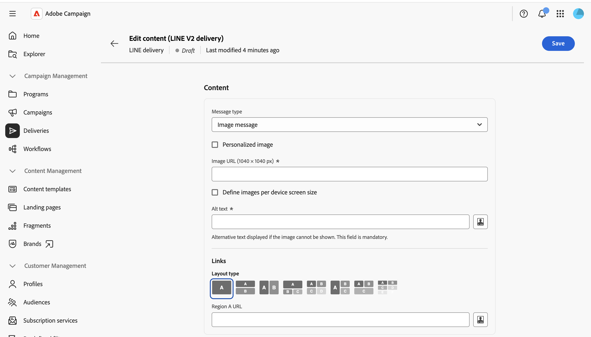

# Enviar uma mensagem LINE {#send-line}

Você pode criar e enviar mensagens LINE aos seus assinantes, usando conteúdo de texto, imagem ou vídeo. Os deliveries LINE podem ser criados como deliveries independentes ou adicionados a um fluxo de trabalho.

Esta página aborda a criação de um delivery LINE independente, mas as mesmas etapas se aplicam ao configurar uma atividade do canal LINE em um workflow.

>[!IMPORTANT]
>
>No momento, a pré-visualização de mensagens não é compatível com deliveries LINE. Revise o conteúdo com cuidado no editor antes de enviar, já que não é possível visualizar a mensagem renderizada antecipadamente.

## Criar um delivery LINE {#create-line-delivery}

1. Navegue até o menu **[!UICONTROL Entregas]** e clique em **[!UICONTROL Criar entrega]**.

1. Escolha **[!UICONTROL LINE]** e selecione um modelo de entrega, como o modelo padrão **[!UICONTROL LINE V2]**. [Saiba mais sobre modelos](../msg/delivery-template.md).

   

1. Clique em **[!UICONTROL Criar entrega]** para confirmar e exibir a tela de configuração de entrega.

1. Insira um **[!UICONTROL Rótulo]** para a entrega e defina opções adicionais ou personalizadas, se necessário. [Saiba mais](../push/create-push.md#configure-push-settings).

   

## Selecionar o público-alvo {#audience}

1. Clique em **[!UICONTROL Selecionar público-alvo]** para direcionar um público-alvo existente ou criar um. O direcionamento para entregas LINE é baseado em **[!UICONTROL assinaturas de visitantes]**. [Saiba mais sobre públicos](../audience/about-recipients.md).

1. Ative a opção **[!UICONTROL Habilitar grupo de controle]** para definir um grupo de controle e medir o impacto da sua entrega. As mensagens não são enviadas para esse grupo de controle, portanto, você pode comparar o comportamento da população que recebeu a mensagem com o comportamento dos contatos que não receberam. [Saiba mais](../audience/control-group.md)

## Definição do conteúdo {#content}

Clique em **[!UICONTROL Editar conteúdo]**.

O editor de conteúdo LINE é exibido.

Um delivery LINE pode conter até cinco mensagens. Clique em **[!UICONTROL Adicionar mensagem]** para adicionar outra mensagem à entrega ou em **[!UICONTROL Remover mensagem]** para excluir uma.

Você pode usar, quando disponível, o editor de personalização para inserir conteúdo dinâmico. [Saiba mais](../personalization/personalize.md).

Cada mensagem usa um dos tipos a seguir.

>[!NOTE]
>
>Somente URLs de imagem e vídeo são suportados. O upload de um arquivo local não está disponível, correspondendo ao comportamento do Console do cliente.

### Mensagem de texto. {#text-message}

Uma mensagem de texto é uma mensagem simples enviada em formato de texto. Basta digitar a mensagem no campo relacionado e usar campos de personalização, se necessário.

### Mensagem da imagem {#image-message}

Uma mensagem de imagem permite enviar uma imagem, opcionalmente dividida em regiões clicáveis, cada uma vinculada a um URL diferente.

* **[!UICONTROL Imagem personalizada]**: defina a imagem dinamicamente por destinatário.
* **[!UICONTROL URL da imagem]**: forneça a URL da sua imagem. O tamanho recomendado é 1040 x 1040 px. Habilite **[!UICONTROL Definir imagens por tamanho de tela do dispositivo]** para fornecer resoluções de imagem diferentes otimizadas para tamanhos de tela diferentes.
* **[!UICONTROL Texto alternativo]**: texto alternativo obrigatório, exibido se a imagem não puder ser carregada.
* **[!UICONTROL Links]**: escolha um layout para dividir sua imagem em uma ou mais regiões clicáveis e, em seguida, atribua uma URL a cada região.

### Mensagem de vídeo {#video-message}

Uma mensagem de vídeo permite enviar um vídeo aos recipients.

* **[!UICONTROL URL do vídeo]**: a URL do seu vídeo. Somente o formato MP4 é compatível.
* **[!UICONTROL URL da imagem de visualização]**: a URL de uma imagem exibida antes da reprodução do vídeo.

## Agendar e enviar {#schedule-send}

1. Depois de definir o conteúdo, clique em **Salvar** e depois clique no ícone voltar para retornar à tela de configuração de entrega.

1. Habilitar **[!UICONTROL Habilitar agendamento]** para enviar em uma data e hora específicas. [Saiba mais](../msg/create-deliveries.md#gs-schedule).

   

1. Quando o conteúdo estiver pronto, clique em **[!UICONTROL Revisar e enviar]**. Isso abre o painel do delivery.

   

1. Clique em **[!UICONTROL Preparar]** e confirme. Se houver erros, corrija-os e clique novamente em **[!UICONTROL Preparar]**.

1. Clique em **[!UICONTROL Enviar]**. Você pode acompanhar os resultados dos **[!UICONTROL Relatórios]** e **[!UICONTROL Logs]** pontos de entrada da entrega.
