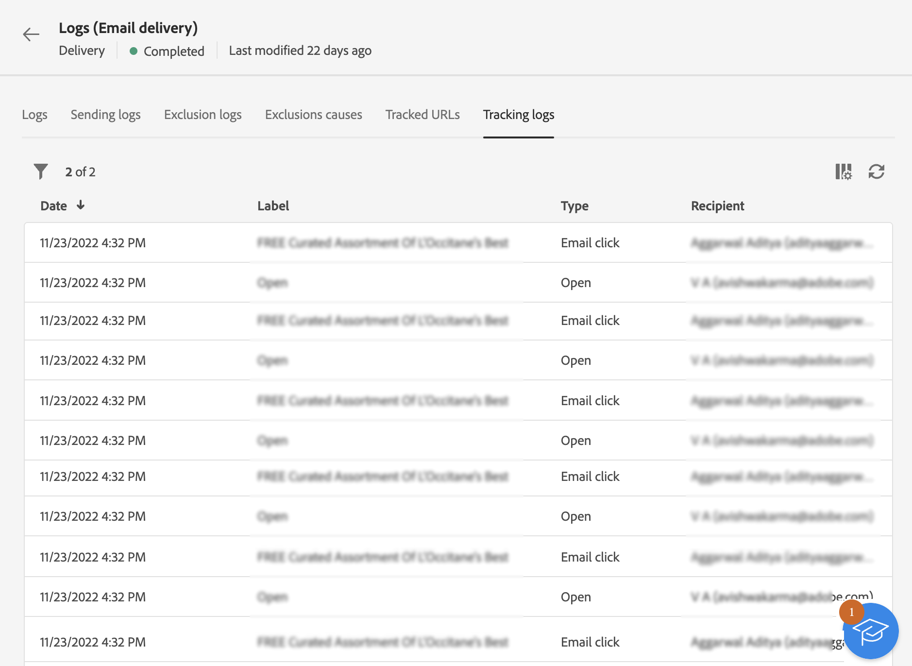

# Monitorar logs da entrega {#delivery-logs}

>[!CONTEXTUALHELP]
>id="acw_deliveries_email_preparation_logs"
>title="Logs de entrega"
>abstract="Os logs de entrega mostram os detalhes do envio. Eles mostram os detalhes do envio, o público-alvo que foi excluído e o motivo, e as informações de rastreamento, como aberturas e cliques."

Depois que o delivery estiver preparado e você clicar em **Enviar** e navegue até os logs do delivery para verificar os dados de avisos, erros, status, exclusões e rastreamento. Esses logs podem ser acessados diretamente do painel de mensagens. Eles mostram os detalhes do envio, o público-alvo que foi excluído e o motivo, e as informações de rastreamento, como aberturas e cliques.

Para visualizar os logs, acesse o painel da entrega e clique no botão **Logs**.

As seguintes guias estão disponíveis:

* [Logs](#logs-tab)
* [Entregas](#deliveries-tab)
* [Exclusões](#exclusion-tab)
* [Causas da exclusão](#exclusion-causes)
* [URLs rastreados](#tracked-urls)
* [Rastreamento](#tracking)

## Logs {#logs-tab}

A guia **Logs** contém todas as mensagens relacionadas à entrega e às provas. Ícones específicos permitem identificar erros ou avisos.

Todas as etapas de validação, avisos e erros são listados. Os ícones coloridos mostram o tipo de mensagem:

* O ícone cinza indica uma mensagem informativa.
* O ícone amarelo indica um erro de processamento não crítico.
* O ícone vermelho indica um erro crítico que impede o envio da entrega. Erros críticos devem ser corrigidos para que o delivery seja enviado.

## Entregas {#deliveries-tab}

A guia **Logs de envio** contém o histórico de todas as ocorrências da entrega. A lista de mensagens enviadas com os status é armazenada aqui. Assim, você pode exibir o status da entrega para cada recipient.

## Exclusões {#exclusion-tab}

A guia **Logs excluídos** lista todas as mensagens excluídas do público-alvo e especifica o motivo da falha no envio.

## Causas da exclusão {#exclusion-causes-tab}

A variável **Causas de exclusão** exibe, para cada causa possível, o número de mensagens que foram excluídas do público-alvo.

## URLs rastreados {#tracked-urls-tab}

A variável **URLs rastreados** A guia reagrupa os URLs contidos nas mensagens enviadas, incluindo o tipo de URL e o URL de origem.

## Rastreamento {#tracking-tab}

A guia **Rastreamento** lista o histórico de rastreamento dessa entrega. Esta guia exibe os dados de rastreamento das mensagens enviadas, ou seja, todas as URLs sujeitas ao rastreamento pelo Adobe Campaign.

>[!NOTE]
>
>Se o rastreamento não estiver ativado para uma entrega, essa guia não será exibida.