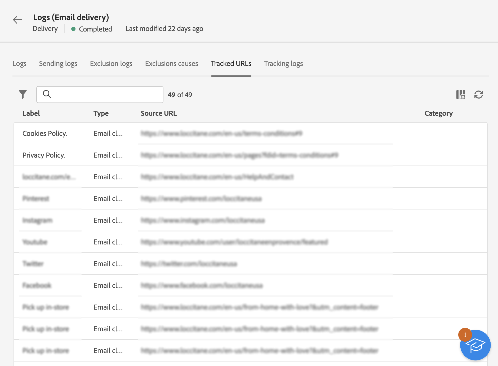

# Monitorar logs de entrega {#delivery-logs}

>[!CONTEXTUALHELP]
>id="acw_deliveries_email_preparation_logs"
>title="Logs de entrega"
>abstract="Os logs de entrega permitem verificar se não há erro."

Após preparar e enviar um email, os logs de entrega permitem verificar se não há erro. Esses logs podem ser acessados diretamente do painel de mensagens. Eles mostram os detalhes do envio, o público-alvo que foi excluído e o motivo, e as informações de rastreamento, como aberturas e cliques.

Para visualizar os logs, acesse o painel da entrega e clique no botão **Logs**.

Várias guias estão disponíveis:

## Logs

A guia **Logs** contém todas as mensagens relacionadas à entrega e às provas. Ícones específicos permitem identificar erros ou avisos.

Todas as etapas de validação, avisos e erros são listados. Os ícones coloridos mostram o tipo de mensagem:

* O ícone cinza indica uma mensagem informativa.
* O ícone amarelo indica um erro de processamento não crítico.
* O ícone vermelho indica um erro crítico que impede o envio da entrega.

## Entregas

A guia **Logs de envio** contém o histórico de todas as ocorrências da entrega. A lista de mensagens enviadas com os status é armazenada aqui. Assim, você pode exibir o status da entrega para cada recipient.

## Exclusões

A guia **Logs excluídos** lista todas as mensagens excluídas do público-alvo e especifica o motivo da falha no envio.

## Causas da exclusão

A guia **Causas da exclusão** exibe o volume (em número de mensagens) das mensagens que foram excluídas do público-alvo.

## URLs rastreados

A guia **URLs rastreados** agrupa os URLs contidos na mensagem enviada, incluindo o tipo de URL e o URL de origem.

## Rastreamento

A guia **Rastreamento** lista o histórico de rastreamento dessa entrega. Esta guia exibe os dados de rastreamento das mensagens enviadas, ou seja, todas as URLs sujeitas ao rastreamento pelo Adobe Campaign.

>[!NOTE]
>
>Se o rastreamento não estiver ativado para uma entrega, essa guia não será exibida.

