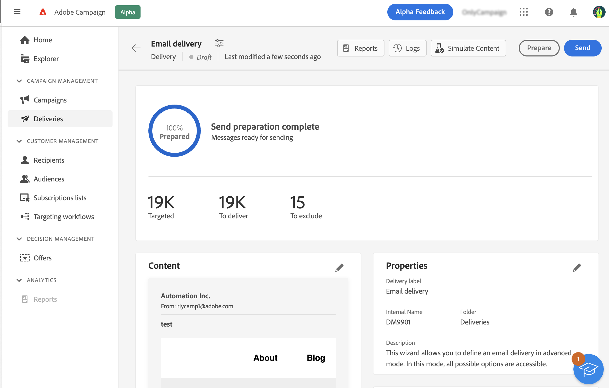

# Preparar e enviar seu email {#prepare-send}

>[!CONTEXTUALHELP]
>id="acw_homepage_card5"
>title="Preparar e enviar seu email"
>abstract="Saiba como preparar seu email e saber mais sobre como enviar KPIs."

<!--

	show how to prepare and send the email + the live kpis in the dashboard

like acc when preparation, target calculated then send
real time KPIs, not in AJO. similar to ACS.
exclusion logs, causes
-->

<!--
send also KPIs
-->

## Preparar o envio{#prepare}

Após definir seu conteúdo, público-alvo e programação, você estará pronto para preparar sua mensagem. Durante a preparação, a população do target é calculada e o conteúdo da mensagem gerado para cada perfil é incluído no target. Quando a preparação for concluída, as mensagens estarão prontas para serem enviadas, imediatamente ou na data e hora programadas. As regras de validação usadas durante a análise são descritas nesta [Documentação do Campaign Classic v7](https://experienceleague.adobe.com/docs/campaign-classic/using/sending-messages/key-steps-when-creating-a-delivery/steps-validating-the-delivery.html#validation-process-with-typologies){target="_blank"}.

Siga as etapas abaixo:

1. No painel do delivery, clique em **Preparar** no canto superior direito e confirme.

   

   O progresso da preparação é exibido. Dependendo do tamanho do público alvo, essa operação pode levar algum tempo.

   >[!NOTE]
   >
   >Você pode interromper a preparação a qualquer momento usando a variável **Parar preparação** botão. Durante a fase de preparação, nenhuma mensagem é enviada. Portanto, você pode iniciar ou parar isso sem correr o risco de afetar nada.

1. Quando a preparação for concluída, verifique os KPIs. Se o número de mensagens para enviar não corresponder às suas expectativas, modifique seu público-alvo e reinicie a preparação.

   

   Estes são os diferentes KPIs exibidos:

   * **Direcionado**: o número de recipients alvos
   * **Para entregar**: o número de mensagens que serão enviadas
   * **Para excluir**: o número de mensagens excluídas por uma regra de tipologia

1. Clique no botão **Logs** e verifique se não há erro. A última mensagem de log exibe mensagens de erro e o número de erros. Para obter mais informações, consulte esta [seção](delivery-logs.md).

   

Se a preparação detectar um erro crítico que impede o envio do delivery, o status da preparação aparecerá como defeituoso no painel do delivery.

Se precisar fazer alterações no delivery após a preparação, será necessário reiniciar a preparação para que essas alterações sejam consideradas.

Quando a preparação estiver concluída sem erro, sua mensagem estará pronta para ser enviada. Para obter mais informações, consulte esta [seção](#send).

## Enviar a mensagem{#send}

Depois que a preparação for concluída, você poderá enviar a mensagem. Essa etapa só é necessária para mensagens enviadas imediatamente. Se a mensagem estiver programada, ela será enviada na data definida.

Siga estas etapas:

1. No painel do delivery, clique em **Enviar** no canto superior direito e confirme.

   

1. O progresso do envio é exibido. Verifique os KPIs exibidos. Você também pode verificar os logs. Para obter mais informações, consulte esta [seção](delivery-logs.md).

   

   Estes são os diferentes KPIs exibidos:

   * **Entregue**: o número de mensagens enviadas com êxito. A porcentagem é baseada no número total de recipients alvos.
   * **Abre**: o número de mensagens abertas. A porcentagem é baseada no número de mensagens entregues.
   * **Cliques**: o número de recipients que clicaram pelo menos uma vez no email. A porcentagem é baseada no número de mensagens entregues.

   >[!NOTE]
   >
   >O **Abre** e **Cliques** os indicadores serão atualizados em tempo real.

   Você pode pausar o envio a qualquer momento e, em seguida, retomar. Se você interromper o delivery enquanto ele estiver sendo enviado, não será possível retomar.
