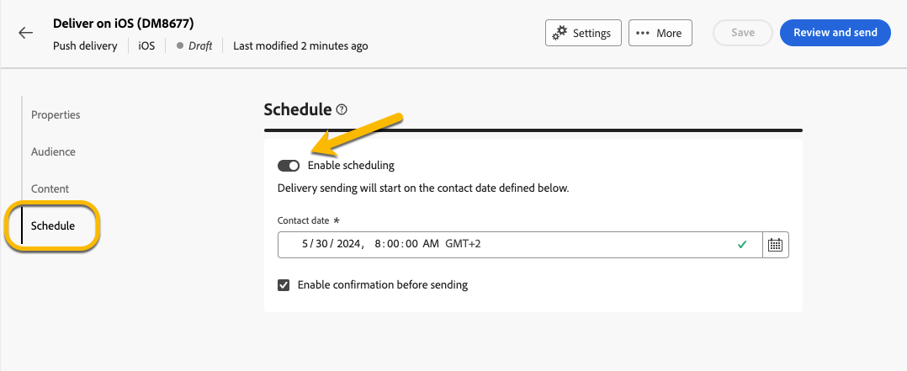

# Agendar o envio de um delivery {#schedule-sending}

Você pode agendar o envio de um delivery. As etapas dependem se é um delivery independente (one-shot) ou se você está trabalhando no contexto de um workflow da campanha.

## Entrega independente

Para deliveries independentes, programe a data e a hora diretamente no delivery. Consulte exemplos abaixo para cada tipo de delivery: email, SMS e notificação por push.

### Email {#schedule-email-standalone}

Para agendar o envio de um delivery de email, siga estas etapas:

1. Na seção **[!UICONTROL Agendar]** das suas propriedades de entrega, ative a opção **[!UICONTROL Habilitar agendamento]**.

1. Defina a data e a hora desejadas para envio e clique no botão **[!UICONTROL Revisar e enviar]**.

   {zoomable="yes"}

>[!NOTE]
>
>Por padrão, a opção **[!UICONTROL Ativar confirmação antes de enviar]** está habilitada. Essa opção exige que você confirme o envio antes que a entrega seja enviada na data e hora programadas. Se precisar enviar o delivery automaticamente na data e hora agendadas, desabilite essa opção.
>

1. Verifique se o agendamento está correto e clique no botão **[!UICONTROL Preparar]**.

{zoomable="yes"}

1. Quando a preparação estiver concluída, as mensagens estarão prontas para serem enviadas. As métricas principais para o delivery são exibidas, incluindo a população total do target, o número de mensagens a serem entregues e o número de recipients excluídos. Clique no botão **[!UICONTROL Enviar como agendado]** para confirmar se a entrega será enviada na data e hora agendadas para o público alvo principal.

{zoomable="yes"}

### SMS

Para agendar o delivery de SMS para uma data e hora específicas, siga as mesmas etapas dos deliveries de email. [Veja acima](#schedule-email-standalone).

{zoomable="yes"}

Você também pode verificar se a programação é aplicada:

{zoomable="yes"}

### Notificações por push

Para agendar um delivery por push independente para uma data e hora específicas, siga as mesmas etapas dos deliveries por email. [Veja acima](#schedule-email-standalone).

{zoomable="yes"}

Você também pode verificar se a programação é aplicada:

{zoomable="yes"}

### Entrega independente em uma campanha

Você pode criar um delivery independente em uma campanha sem usar um fluxo de trabalho. Configure a data e a hora desse delivery conforme explicado acima. A campanha pode ter sua própria programação, incluindo uma data de início e uma data de término. Essa programação não interfere na programação de entrega.

{zoomable="yes"}

## Programar um delivery em um workflow de campanha

No contexto de um fluxo de trabalho de campanha, a prática recomendada é usar a atividade **[!UICONTROL Scheduler]** para aplicar uma data e hora para iniciar o fluxo de trabalho, que envolve o envio da entrega. [Saiba mais sobre o Agendador](../workflows/activities/scheduler.md).

{zoomable="yes"}

Configure a data e a hora na atividade **[!UICONTROL Scheduler]**.

{zoomable="yes"}

>[!NOTE]
>
>Ao usar a atividade **[!UICONTROL Scheduler]** para agendar o envio de sua entrega em um fluxo de trabalho, não ative a opção **[!UICONTROL Habilitar agendamento]** nas configurações de atividade de **[!UICONTROL Entrega]**. Seu delivery será enviado automaticamente.
>

Se você ativar a opção **[!UICONTROL Habilitar agendamento]** nas configurações de atividade de **[!UICONTROL Entrega]** e configurar uma data e hora lá, a entrega aguardará para ser enviada nesta data e hora. Isso significa que, se houver um atraso entre a data de inicialização do workflow e a data de envio, o público-alvo pode não estar atualizado.