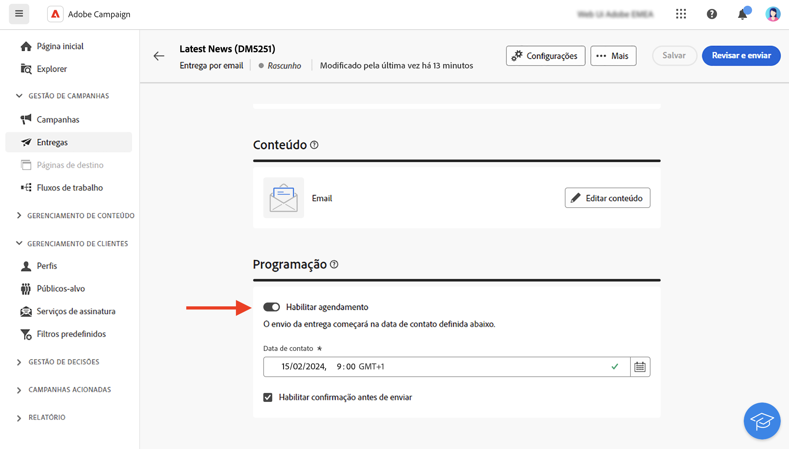

# Criação de uma entrega {#create-delivery}

Você pode criar entregas independentes a partir do menu **[!UICONTROL Entregas]** à esquerda ou criar entregas no contexto de um fluxo de trabalho, incluído ou não em uma campanha.

Navegue pelas guias abaixo para saber como criar uma entrega:

>[!BEGINTABS]

>[!TAB Criação de uma entrega independente]

Para criar uma entrega independente, siga estas etapas:

1. Navegue até o menu **[!UICONTROL Entregas]** no painel de navegação esquerdo e clique no botão **[!UICONTROL Criar entrega]**.

   {zoomable="yes"}

1. Escolha um canal para a entrega. 
1. Defina o público do delivery para o target principal e o grupo de controle. [Saiba mais sobre públicos](../audience/about-recipients.md).

   {zoomable="yes"}{width="70%" align="left"}

1. Defina o conteúdo da mensagem. Saiba mais sobre os canais de entrega e como definir o conteúdo da entrega nestas seções:

   * [Canal de email](../email/create-email.md)
   * [Canal de notificação por push](../push/gs-push.md)
   * [Canal de SMS](../sms/create-sms.md)

1. (Opcional) Defina a entrega [agendamento](#gs-schedule). Se nenhum agendamento for definido, as mensagens serão enviadas imediatamente depois de clicar no botão **[!UICONTROL Enviar]**.
1. Clique no botão **[!UICONTROL Revisar e enviar]** para verificar suas configurações.
1. Use o botão **[!UICONTROL Simular conteúdo]** para testar as configurações de entrega e personalização. Saiba mais simulação de mensagens [nesta seção](../preview-test/preview-test.md).
1. Clique no botão **[!UICONTROL Preparar]** para calcular a população do público-alvo e gerar as mensagens. A etapa de preparação pode levar alguns minutos. Quando a preparação estiver concluída, as mensagens estarão prontas para envio. Em caso de erro, navegue até os **Logs** para verificar alertas e avisos.
1. Verifique os resultados e clique no botão **[!UICONTROL Enviar]** para iniciar o envio de mensagens.
1. Depois que as mensagens forem enviadas, navegue até a seção **Relatórios** para acessar as métricas principais. Saiba mais sobre relatórios de entrega [nesta seção](../reporting/delivery-reports.md).

>[!TAB Criação de uma entrega em um fluxo de trabalho]

Para criar uma entrega em um fluxo de trabalho, siga estas etapas:

1. Crie um fluxo de trabalho ou abra um já existente. [Saiba mais sobre fluxos de trabalho](../workflows/gs-workflow-creation.md#gs-workflow-steps)
1. Adicione e configure uma atividade [**[!UICONTROL Criar público]**](../workflows/activities/build-audience.md).
1. Clique no ícone `+` e selecione uma atividade de entrega: **[!UICONTROL Email]**, **[!UICONTROL SMS]**, **[!UICONTROL Notificação por push (Android)]** ou **[!UICONTROL Notificação por push (iOS)]**. Saiba mais sobre as atividades de canal de entrega em um fluxo de trabalho e como definir o conteúdo de entrega em [esta seção](../workflows/activities/channels.md).

   {zoomable="yes"}

1. Inicie o fluxo de trabalho e verifique os logs.

Também é possível adicionar entregas em uma campanha sem criar um fluxo de trabalho. Para fazer isso, navegue até a guia **[!UICONTROL Entregas]** da campanha e clique no botão **[!UICONTROL Criar entrega]**.

{zoomable="yes"}

As etapas de configuração são semelhantes àquelas para deliveries independentes.

Para obter mais informações sobre como configurar uma campanha e gerenciar os deliveries que pertencem a uma campanha, consulte [esta seção](../campaigns/gs-campaigns.md).

>[!ENDTABS]

## Adicionar personalização {#personalization}

As mensagens entregues pelo Adobe Campaign podem ser personalizadas de várias maneiras. [Saiba mais sobre os recursos de personalização](../personalization/gs-personalization.md).

Use o Campaign para criar conteúdo dinâmico e enviar mensagens personalizadas. Os recursos de personalização podem ser combinados para melhorar suas mensagens e criar uma experiência do usuário personalizada.

Você pode personalizar o conteúdo da mensagem ao:

* Inserir **campos de personalização** dinâmicos

  Os campos de personalização são usados na personalização de primeiro nível das mensagens. Você pode selecionar qualquer campo disponível no banco de dados no editor de personalização. Para um delivery, você pode selecionar qualquer campo relacionado ao recipient, à mensagem ou ao delivery. Esses atributos de personalização podem ser inseridos na linha de assunto ou no corpo das mensagens. [Saiba mais](../personalization/personalize.md)

* Inserindo **fragmentos de expressão** predefinidos

  O Campaign vem com um conjunto de fragmentos de expressão que contêm renderizações específicas que podem ser inseridas em seus deliveries. Por exemplo, você pode adicionar um logotipo, uma mensagem de saudação ou um link para a mirror page da mensagem. Os fragmentos de expressão estão disponíveis em uma entrada dedicada no editor de personalização. Além disso, você pode criar seus próprios fragmentos de expressão para atender às suas necessidades. [Saiba como usar fragmentos de expressão](../content/use-expression-fragments.md)

* Criando **conteúdo condicional**

  Configure o conteúdo condicional para adicionar personalização dinâmica com base no perfil do recipient, por exemplo. Blocos de texto e/ou imagens são inseridos quando uma determinada condição for satisfeita. [Saiba mais](../personalization/conditions.md)

* Adicionando **ofertas personalizadas**

  Insira ofertas personalizadas no conteúdo da mensagem, dependendo da localização do recipient, do tempo atual ou da última ordem de compra. [Saiba mais](../msg/offers.md)

## Visualização e teste de suas entregas

Depois que o conteúdo da mensagem for definido, você poderá pré-visualizá-lo para controlar a renderização das mensagens e verificar as configurações de personalização com perfis de teste. [Saiba mais](../preview-test/preview-test.md)

## Agendar o envio da entrega {#gs-schedule}

>[!CONTEXTUALHELP]
>id="acw_deliveries_email_schedule"
>title="Definir uma data e hora de contato"
>abstract="Defina a data e a hora exata do envio da sua entrega. Ao escolher o horário mais apropriado para a mensagem de marketing, é possível maximizar as taxas de abertura."

Você pode definir a data e a hora exata para enviar suas mensagens. Ao escolher o horário mais apropriado para a mensagem de marketing, é possível maximizar as taxas de abertura.

Para agendar o envio de uma entrega, abra a entrega e navegue até a seção **[!UICONTROL Agendar]**. Use o botão de alternância **[!UICONTROL Habilitar agendamento]** para ativá-lo e defina a data e a hora desejada para o envio. Depois que você envia o delivery, o envio real começa na data de contato definida.

{zoomable="yes"}

Por padrão, a opção **[!UICONTROL Ativar confirmação antes de enviar]** está habilitada. Essa opção exige que você confirme o envio antes que a entrega seja enviada na data e hora programadas. Se precisar enviar a entrega automaticamente na data e hora programadas, desabilite essa opção.

Saiba mais sobre as etapas para enviar uma entrega programada [nesta seção](../monitor/prepare-send.md#schedule-the-send).

## Logs de rastreamento e monitoramento {#gs-tracking-logs}

O monitoramento de deliveries, após serem enviados, é uma etapa essencial para garantir que as campanhas de marketing sejam eficientes e atinjam os clientes.

Você pode monitorar após enviar uma entrega, bem como entender como as falhas de entrega e as quarentenas são gerenciadas.

Saiba mais sobre os recursos de rastreamento e monitoramento [nesta seção](../reporting/gs-reports.md).