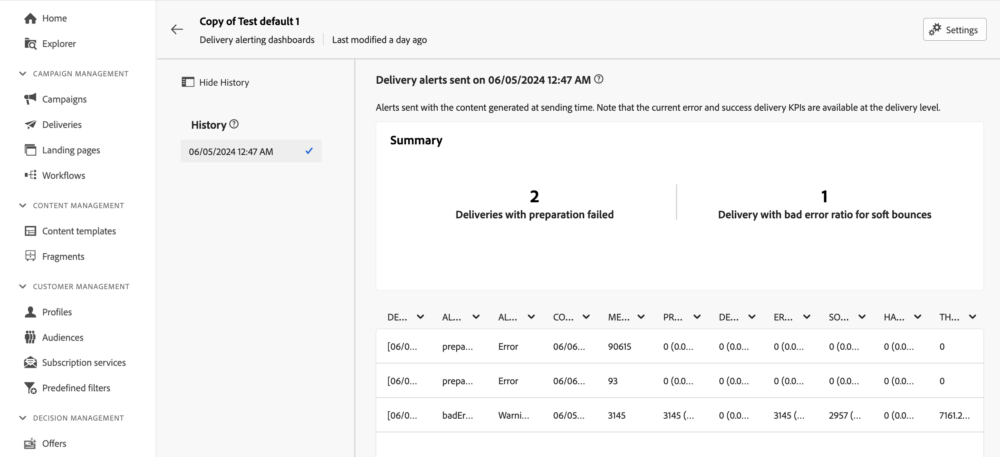

# Painéis de alertas de entrega {#delivery-alerting-dashboards}

>[!CONTEXTUALHELP]
>id="acw_delivery_alerting_dashboards"
>title="Painéis de alertas de entrega"
>abstract="O Alerta de entrega é um sistema de gerenciamento de alertas que permite que grupos de usuários recebam automaticamente notificações por email com informações sobre suas execuções de entrega. Os painéis de alerta de entrega permitem especificar quem receberá alertas de email, escolher e configurar os critérios de alerta a serem usados para enviar esses alertas e acessar o histórico de todas as notificações enviadas."

Os painéis de alerta de delivery permitem especificar quem receberá alertas de email, escolher e configurar os critérios de alerta a serem usados para enviar esses alertas e acessar o histórico de todas as notificações enviadas. Eles podem ser acessados pelo menu **Alertas de Entrega** no painel de navegação esquerdo, na guia **Painéis**.

>[!AVAILABILITY]
>
>Esse recurso está na disponibilidade limitada (DL). É restrita aos clientes que estão migrando **do Adobe Campaign Standard para o Adobe Campaign v8** e não pode ser implantada em nenhum outro ambiente.

## Criar um painel de entrega {#dashboards}

>[!CONTEXTUALHELP]
>id="acw_delery_alerting_dashboard_create"
>title="Criar um painel de alerta de entrega"
>abstract="A criação de um painel de alerta de entrega permite especificar quem receberá os alertas por email, escolher e configurar os critérios de alerta a serem usados para enviar esses alertas e acessar o histórico de todas as notificações enviadas."

>[!CONTEXTUALHELP]
>id="acw_delivery_alerting_create_general"
>title="Parâmetros gerais de alertas de entrega"
>abstract="Especifique as propriedades gerais do painel de alerta de entrega. O campo **Selecionar grupo de alertas** permite especificar o **grupo de operadores** que receberá os alertas enviados por esse painel."

>[!CONTEXTUALHELP]
>id="acw_delivery_alerting_create_criteria_add"
>title="Critérios de alertas de entrega"
>abstract="Nesta seção, adicione os critérios que deseja usar para enviar alertas a partir deste painel. Escolha entre critérios predefinidos ou crie seus próprios critérios para se alinhar às necessidades específicas."

>[!CONTEXTUALHELP]
>id="acw_delivery_alerting_create_criteria_parameters"
>title="Parâmetros de critérios"
>abstract="Os critérios têm valores de parâmetros padrão que definem como eles devem ser aplicados. É possível alterar esses valores para atender às suas necessidades nesta seção."

Para criar um painel de delivery, siga estas etapas:

1. Navegue até o menu **Alertas de Entrega** no painel de navegação esquerdo e clique em **Criar painel de entrega**.

   

1. Nomeie seu painel no campo **Rótulo**. O campo **Nome interno** é preenchido automaticamente e é somente leitura.

1. No campo **Selecionar grupo de alertas**, especifique o **grupo de operadores** para receber os alertas enviados por este painel. Todos os membros do grupo de operadores selecionado receberão os alertas.

   Saiba mais sobre permissões e grupos de operadores na [documentação do Adobe Campaign v8 (console)](https://experienceleague.adobe.com/pt-br/docs/campaign/campaign-v8/admin/permissions/gs-permissions){target="_blank"}

1. Na seção **Critérios de alerta de entrega**, adicione os critérios que deseja usar para enviar alertas. Escolha entre critérios predefinidos ou crie seus próprios critérios para se alinhar às necessidades específicas. [Saiba como trabalhar com critérios](../msg/delivery-alerting-criteria.md)

1. Os critérios têm valores de parâmetro padrão que definem como eles devem ser aplicados. Você pode alterar esses valores para atender às suas necessidades da seção **Parâmetros de critérios**.

   

   Por exemplo, por padrão, o parâmetro de critérios **Tamanho mínimo do público-alvo de entrega** está definido como 50, o que significa que um delivery será incluído no alerta enviado por esse painel somente se for direcionado a pelo menos 50 perfis. Você pode alterar esse parâmetro se quiser incluir deliveries com menos de 50 perfis.

   Expanda a seção abaixo para obter mais informações sobre cada parâmetro de critério:

   +++Parâmetros de critérios disponíveis

   * **Tamanho mínimo do público-alvo da entrega**: por exemplo, se você inserir 100 neste campo, uma notificação será enviada somente para entregas com um público-alvo igual ou maior que 100 destinatários. Esse parâmetro se aplica a todos os critérios.
   * **Período de monitoramento antes e depois da data de contato (em horas)**: Número de horas antes e depois da hora atual. Somente os deliveries com uma data de contato nesse intervalo de tempo são considerados. Esse parâmetro se aplica a todos os critérios. Por padrão, o valor desse campo é definido como 24 horas.
   * **Taxa máxima de erros de rejeição temporária**: uma notificação é enviada para todas as entregas com uma taxa de erro de rejeição temporária maior que o valor especificado. Por padrão, o valor desse campo é definido como 0,05 (5%).
   * **Taxa máxima de erros de rejeição permanente**: uma notificação é enviada para todas as entregas com uma taxa de erro de rejeição permanente maior que o valor especificado. Por padrão, o valor desse campo é definido como 0,05 (5%).
   * **Limite de tempo mínimo para entrega no status &#39;Início pendente&#39; (em minutos)**: uma notificação é enviada para todas as entregas com um status de Início pendente por mais tempo do que a duração especificada neste campo. O status de Início pendente significa que as mensagens ainda não foram consideradas pelo sistema.
   * **Tempo mínimo necessário para o cálculo da taxa de transferência (em minutos)**: somente entregas iniciadas (com status Em andamento) por mais do que a duração especificada são consideradas para as Entregas com critério de taxa de transferência baixa.
   * **Porcentagem máxima de mensagens processadas para o cálculo da taxa de transferência**: somente entregas com uma porcentagem de mensagens processadas inferior à porcentagem especificada são consideradas para as entregas com critério de taxa de transferência baixa.
   * **Taxa de transferência mínima esperada (em mensagens enviadas por hora)**: somente entregas com uma taxa de transferência inferior ao valor especificado são consideradas para as entregas com critério de taxa de transferência baixa.
   * **Taxa mínima de processamento necessária para o critério &#39;Entregas em andamento&#39;**: somente as entregas com uma porcentagem de mensagens processadas maior que a porcentagem especificada são consideradas.

+++

1. Por padrão, os painéis de alerta são desativados, o que significa que os alertas de email vinculados a esse painel não são enviados. Para habilitar o painel imediatamente, alterne a opção **Habilitado** na seção **Geral**, ao lado do campo de seleção do grupo de alerta.

   Você também pode salvar o painel e ativá-lo posteriormente.

   

1. Para salvar o painel de alerta, clique no botão **Salvar**.

O painel de alertas é aberto com dados em branco. Quando estiver pronto para ativá-lo e enviar notificações, clique no botão **Configurações** e alterne a opção **Habilitadas** se ainda não tiver feito isso.

Agora, sempre que um delivery atender aos critérios definidos nesse painel, uma notificação de alerta será enviada para o grupo de operadores especificado.

## Gerenciar painéis de alerta

>[!CONTEXTUALHELP]
>id="acw_delivery_alerting_dashboard_alerts"
>title="Alertas de entrega enviados"
>abstract="Esta seção permite visualizar informações relacionadas aos últimos alertas enviados."

>[!CONTEXTUALHELP]
>id="acw_delivery_alerting_dashboard_history"
>title="Histórico de alertas de entrega"
>abstract="O painel **Histórico** contém todos os alertas enviados deste painel. Clique em um item para acessar os alertas correspondentes enviados naquele momento específico."

Todos os painéis de alertas criados podem ser acessados no menu **Alertas de Entrega**, na guia **Painéis**.

Você pode duplicar ou excluir um painel usando o botão **Mais ações** localizado próximo ao seu nome.

Para acessar uma exibição detalhada de um painel, clique no nome na lista. Nesta tela, você pode visualizar o alerta enviado mais recente. Todos os alertas enviados são listados no painel esquerdo. Clique em um item para acessar os alertas correspondentes enviados naquele momento específico.

Para editar o painel, clique no botão **Configurações** no canto superior direito e faça as alterações desejadas.