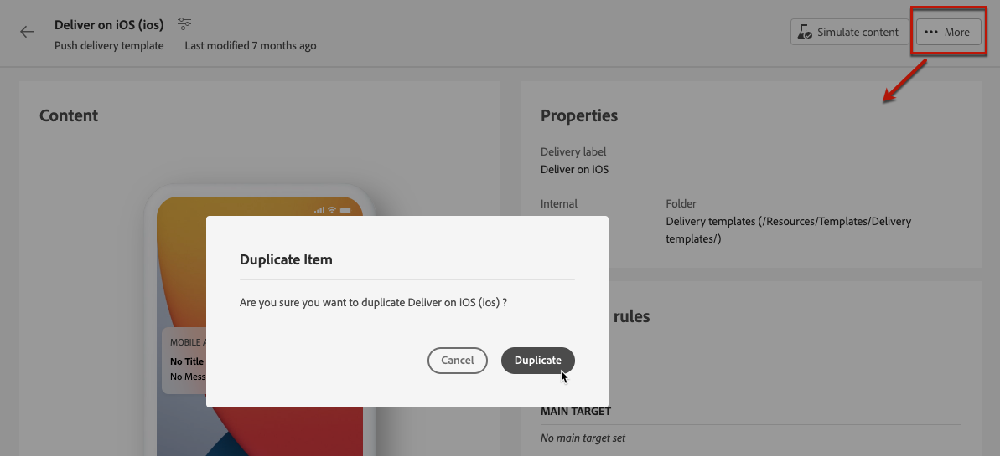

# Trabalho com modelos de entrega {#work-with-delivery-templates}

Para um processo de design acelerado e aprimorado, você pode criar templates do delivery para reutilizar facilmente o conteúdo e as configurações personalizadas em suas campanhas. Essa funcionalidade permite padronizar a aparência criativa para ser mais rápido na execução e na inicialização de campanhas.

Um modelo pode incluir:

* [Tipologias](../advanced-settings/delivery-settings.md#typology)
* O endereço do remetente
* Um [público](../audience/about-audiences.md), incluindo [grupos de controle](../audience/control-group.md)
* Personalizado [conteúdo](../content/edit-content.md)
* [Campos personalizados](../personalization/personalize.md) e [conteúdo condicional](../personalization/conditions.md)
* Links para [mirror page](../content/mirror-page.md) e cancelar assinatura [links](../content/message-tracking.md)
* Outras propriedades de entrega, como validade de recurso, parâmetros de nova tentativa ou configurações de quarentena.

>[!NOTE]
>
>Os modelos de entrega são diferentes de [modelos de conteúdo de email](../content/email-templates.md), que permitem reutilizar somente o conteúdo de suas mensagens.

## Acessar e gerenciar modelos do delivery {#access-manage-templates}

>[!CONTEXTUALHELP]
>id="acw_delivery_templates"
>title="Trabalho com modelos de entrega"
>abstract="Use modelos de entrega para criar e salvar facilmente suas entregas existentes para uso futuro."
>additional-url="https://experienceleague.adobe.com/docs/campaign-web/v8/msg/delivery-template.html?lang=pt-BR#copy-an-existing-template" text="Duplicação de um modelo já existente"
>additional-url="https://experienceleague.adobe.com/docs/campaign-web/v8/msg/delivery-template.html?lang=pt-BR#convert-an-existing-delivery" text="Conversão de uma entrega em um modelo"

Para acessar a lista de modelos de conteúdo, selecione **[!UICONTROL Campaign Management]** > **[!UICONTROL Entregas]** no menu esquerdo e navegue até a janela **Modelos** guia.

Todos os modelos que foram [criado](#create-a-delivery-template) no ambiente atual são exibidas.

É possível filtrar modelos de conteúdo em canais e pastas. Você também pode definir filtros avançados criando uma regra usando atributos de delivery. [Saiba mais sobre o construtor de regras](../audience/segment-builder.md)

Para editar um modelo, clique no item desejado na lista. A partir daí:

* Você pode modificar o conteúdo, as propriedades, o público-alvo e qualquer oferta anexada a ele.
* Você também pode testar seu template. [Saiba mais](#test-template)

Para excluir ou [duplicado](#copy-an-existing-template) um modelo, selecione a ação correspondente no campo **[!UICONTROL Mais ações]** menu, no menu **[!UICONTROL Modelos]** ou em uma tela de edição de modelo.

>[!NOTE]
>
>Quando um template é editado ou excluído, os deliveries criados usando esse template não são afetados.

## Criar um modelo da entrega {#create-a-delivery-template}

Para criar um template do delivery, você pode:
* Duplicação de um template existente - [Saiba mais](#copy-an-existing-template)
* Converter um delivery existente em um template - [Saiba mais](#convert-an-existing-delivery)
* Criar um template do delivery do zero - [Saiba mais](#create-a-new-template)

### Duplicação de um template de delivery existente {#copy-an-existing-template}

O Campaign vem com um conjunto de modelos integrados para cada canal: email, push, SMS. A maneira mais fácil de criar um modelo de entrega é duplicar e personalizar um modelo integrado.

>[!NOTE]
>
>Você também pode duplicar qualquer modelo personalizado.

Para duplicar um modelo de entrega, siga as etapas abaixo:

1. Navegue até a guia **Modelos** no menu esquerdo **Entregas.** [Saiba mais](#access-manage-templates)
1. Clique em **[!UICONTROL Mais ações]** à direita do nome do modelo desejado e selecione  **[!UICONTROL Duplicar]**.

   Você também pode selecionar um modelo na lista e selecionar essa opção na tela de edição do modelo.

1. Confirme a duplicação.

   

1. O novo painel de modelo é aberto na tela central. Edite as configurações do template conforme necessário.

   

1. Clique em **[!UICONTROL Revisão]** botão para salvar e revisar o modelo. Você ainda pode editar todas as configurações, excluí-las e duplicá-las.

   

1. Teste a renderização do template, se necessário. [Saiba mais](#test-template)

O novo modelo é adicionado à variável [**Modelos** lista](#access-manage-templates). Agora você pode selecioná-lo ao criar uma nova entrega.

### Conversão de uma entrega em um modelo {#convert-an-existing-delivery}

Qualquer entrega pode ser convertida em um modelo para ações futuras de entrega repetida.

Para salvar um delivery como template, siga as etapas abaixo:

1. Vá para a **[!UICONTROL Gerenciamento de campanhas]** > **[!UICONTROL Entregas]** menu.
1. No **[!UICONTROL Procurar]** clique na guia **[!UICONTROL Mais ações]** à direita do nome do delivery desejado e selecione **[!UICONTROL Copiar como modelo]**.

   

1. Confirme a duplicação.

1. O novo painel de modelo é aberto na tela central. Edite as configurações do template conforme necessário.

1. Clique em **[!UICONTROL Revisão]** botão para salvar e revisar o modelo. Você ainda pode editar todas as configurações, excluí-las e duplicá-las.

1. Teste a renderização do template, se necessário. [Saiba mais](#test-template)

O novo modelo é adicionado à variável [**Modelos** lista](#access-manage-templates). Agora você pode selecioná-lo ao criar uma nova entrega.

### Criar um novo modelo de entrega {#create-a-new-template}

>[!NOTE]
>
>Para evitar erros de configuração, a Adobe recomenda que você [duplique um modelo integrado](#copy-an-existing-template) e personalize suas propriedades ao invés de criar um novo modelo.

Para configurar um modelo de entrega do zero, siga as etapas abaixo:

1. Navegue até a guia **Modelos** no menu esquerdo **Entregas.** [Saiba mais](#access-manage-templates)
1. Clique no botão **[!UICONTROL Criar modelo]**.

   

1. Selecione o canal que deseja usar para o modelo.
1. O modelo de entrega integrado para esse canal é usado por padrão para ajudar você a criar seu próprio modelo. Use o botão dedicado à direita do canal selecionado para selecionar outro template, se necessário.

   

1. Clique em **[!UICONTROL Criar modelo]** botão novamente.

1. Definir as propriedades do template, [público](../audience/add-audience.md) e conteúdo dependendo do canal selecionado.

   >[!NOTE]
   >
   >Saiba mais sobre os canais de entrega e como projetar os respectivos conteúdos nas seções abaixo:
   >
   > * [Canal de email](../email/create-email.md)
   > * [Canal de notificação por push](../push/gs-push.md)
   > * [Canal de SMS](../sms/create-sms.md)

1. Clique em **[!UICONTROL Revisão]** botão para salvar e revisar o modelo. Você ainda pode editar todas as configurações, excluí-las e duplicá-las.

1. Teste a renderização do template, se necessário. [Saiba mais](#test-template)

O novo modelo é adicionado à variável [**Modelos** lista](#access-manage-templates). Agora você pode selecioná-lo ao criar uma nova entrega.

## Testar um template de delivery {#test-template}

Você pode testar a renderização de qualquer template do delivery, seja criado do zero ou de um conteúdo existente. Para isso, siga as etapas abaixo.

1. Navegue até o **Modelos** guia pelo menu **[!UICONTROL Gerenciamento de campanhas]** > **[!UICONTROL Entregas]** e selecione qualquer modelo. [Saiba mais](#access-manage-templates)

1. Clique em **[!UICONTROL Simular conteúdo]** botão na parte superior direita da tela.

   

1. Selecione um ou mais perfis de teste para verificar a renderização de email. Você também pode selecionar perfis reais do banco de dados.

1. Alterne entre os diferentes perfis para obter uma representação personalizada da mensagem de acordo com o perfil selecionado.

   <!--[Learn more on test profiles](../preview-test/test-deliveries.md#recipients)-->

   Você também pode ajustar o nível de zoom e escolher a exibição da área de trabalho ou móvel.

   

1. Feche a janela para voltar à tela de edição de modelo.

>[!NOTE]
>
>Não é possível usar a renderização de email ou enviar provas em um template do delivery.

* [Saiba mais sobre visualização de conteúdo de email](../preview-test/preview-content.md)

* [Saiba mais sobre visualização de conteúdo de SMS](../sms/content-sms.md)

* [Saiba mais sobre visualização de conteúdo de push](../push/gs-push.md)

