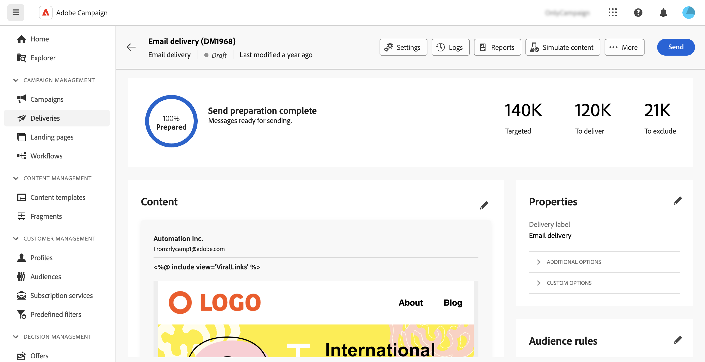

# Acessar entregas {#work-with-deliveries}

>[!CONTEXTUALHELP]
>id="acw_deliveries_list"
>title="Entregas"
>abstract="Uma entrega é uma comunicação que é enviada para um público-alvo em um canal específico: email, SMS ou push. Nesta tela, você pode editar, duplicar e excluir as entregas existentes. Também é possível exibir relatórios de entregas concluídas. Clique no botão **Criar entrega** para adicionar uma nova entrega."

## Acessar entregas {#access}

>[!CONTEXTUALHELP]
>id="acw_deliveries_additional_target"
>title="Público-alvo adicional"
>abstract="Essas regras só podem ser alteradas no console do cliente."

Os deliveries podem ser acessados no menu **[!UICONTROL Deliveries]**, no painel de navegação esquerdo. Todos os deliveries criados no console do cliente ou na interface do usuário da Web aparecem nesta lista. Nessa tela, é possível monitorar todos os deliveries existentes, duplicá-los ou excluí-los ou criar novos.

Para abrir um delivery, clique no nome na lista. A entrega é aberta, permitindo executar várias ações, como editar parâmetros, verificar a execução ou monitorar o desempenho usando relatórios dedicados.

>[!NOTE]
>
>Se você abrir uma entrega criada no console do cliente, a seção **[!UICONTROL Destino adicional]** poderá ser exibida para o público-alvo. Isso indica que vários targets foram configurados para este delivery. Esses parâmetros só podem ser modificados no console.
>
>{zoomable="yes"}

## Duplicação de uma entrega {#delivery-duplicate}

É possível criar uma cópia de uma entrega existente, ou na lista de entregas ou no painel de entregas.

Para duplicar uma entrega da lista de entregas, siga estas etapas:

1. Clique no botão de três pontos à direita, ao lado do nome da entrega a ser duplicada.
1. Selecione **[!UICONTROL Duplicar]**.
1. Confirme a duplicação. O novo painel do delivery é aberto na tela central.

Para duplicar uma entrega do painel, siga estas etapas:

1. Abra a entrega e clique no botão **[!UICONTROL ...Mais]** na seção superior da tela.
1. Selecione **[!UICONTROL Duplicar]**.
1. Confirme a duplicação. O novo delivery substitui o delivery atual na tela central.

## Excluir uma entrega {#delivery-delete}

Os deliveries são excluídos da lista de delivery, seja da entrada de delivery principal no painel esquerdo ou da lista de delivery de uma campanha.

Para excluir uma entrega da lista de entregas, siga estas etapas:

1. Clique no botão de três pontos à direita, ao lado do nome do delivery a ser excluído.
1. Selecione **[!UICONTROL Delete]**.
1. Confirmar exclusão.

Todas as entregas estão disponíveis nessas listas, mas as entregas criadas em um fluxo de trabalho não podem ser excluídas nelas. Para excluir um delivery criado no contexto de um workflow, exclua a atividade de delivery do workflow.

Para excluir uma entrega de um fluxo de trabalho, siga estas etapas:

1. Selecione a atividade de delivery.
1. Clique no ícone **[!UICONTROL Excluir]** no painel direito.
1. Confirmar exclusão. Se o delivery tiver nós filhos, escolha excluí-los também ou mantê-los.

