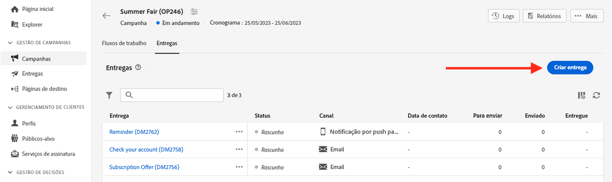

# Introdução a mensagens{#gs-messages}

>[!CONTEXTUALHELP]
>id="acw_deliveries_list"
>title="Entregas"
>abstract="Navegue pela lista de entregas. É possível visualizar seu status, principais KPIs e datas de contato e modificação. É possível filtrar a lista por estado, data de contato ou canal. Clique no botão “Criar entrega” para adicionar uma nova entrega. Selecione uma entrega para visualizar seu conteúdo, público-alvo e detalhes."

Com o Adobe Campaign, e possível enviar campanhas entre canais, incluindo emails, SMS, notificações por push e medir a eficácia usando vários relatórios dedicados.

Essas mensagens são projetadas e enviadas através de entregas, além disso podem ser personalizadas para cada destinatário. Essas entregas podem ser independentes ou incluídas no contexto de uma campanha de marketing.

O Adobe Campaign v8 vem com os seguintes canais de entrega: email, SMS e aplicativos móveis.

<table style="table-layout:fixed">
    <tr style="border: 0;">
    <td>
    
    
<a href="../email/create-email.md"><strong>Criar emails</strong>
    

    

    </td>
    <td>
    
    

    <a href="../push/gs-push.md"><strong>Criar notificações por push</strong></a>
    

    

    </td>
    <td>
    
    

    <a href="../sms/create-sms.md"><strong>Criar mensagens SMS</strong></a>
    

    

    </td>
    </tr>
    </table>

## Criação de uma entrega {#create-delivery}

É possível criar entregas independentes a partir do menu esquerdo **[!UICONTROL Entregas]**, ou criar entregas no contexto de uma campanha de marketing, no menu esquerdo **[!UICONTROL Campanhas]**.

Navegue pelas guias abaixo para saber como criar uma entrega:

>[!BEGINTABS]

>[!TAB Criação de uma entrega independente]

Para criar uma entrega independente, siga estas etapas:

1. Navegue até o menu **[!UICONTROL Entregas]** no painel de navegação esquerdo e clique no botão **[!UICONTROL Criar entrega]**.

   

1. Escolha um canal para a entrega. Saiba mais sobre canais de entrega e como definir um conteúdo de entrega nestas seções:

   * [Canal de email](../email/create-email.md)
   * [Canal de notificação por push](../push/gs-push.md)
   * [Canal de SMS](../sms/create-sms.md)

1. Defina o público da entrega, para o público-alvo principal e o grupo de controle. Saiba mais sobre públicos-alvo [nesta seção](../audience/about-audiences.md).
1. Definir o conteúdo da mensagem.
1. (opcional) Defina a programação da entrega. Se nenhuma programação for definida, as mensagens serão enviadas imediatamente após clicar no botão **[!UICONTROL Enviar]**.
1. Clique no botão  **[!UICONTROL Revisar e enviar]** para verificar suas configurações.
1. Use o botão **[!UICONTROL Simular conteúdo]** para testar a entrega e as configurações de personalização. Saiba mais simulação de mensagens [nesta seção](../preview-test/preview-test.md).
1. Clique no botão **[!UICONTROL Preparar]** para calcular a população alvo e gerar as mensagens. A etapa de preparação pode levar alguns minutos. Quando a preparação estiver concluída, as mensagens estarão prontas para envio. Em caso de erro, navegue até os **Logs** para verificar os alertas e avisos.
1. Verifique os resultados e clique no botão **[!UICONTROL Enviar]** para iniciar o envio das mensagens.
1. Depois que as mensagens forem enviadas, navegue até a seção **Relatórios** para acessar as métricas principais. Saiba mais sobre relatórios de entrega [nesta seção](../reporting/delivery-reports.md).

>[!TAB Criação de uma entrega em uma campanha]

Para criar uma entrega em uma campanha, siga estas etapas:

1. Crie uma campanha ou abra uma já existente. Saiba mais sobre [campanhas de marketing](../campaigns/gs-campaigns.md).
1. Crie um workflow ou abra um já existente.
1. Adicione e configure uma atividade **[!UICONTROL Criar público-alvo]** e clique no botão `+`.

   

   A atividade **[!UICONTROL Criar público-alvo]** está detalhada [nesta seção](../workflows/activities/build-audience.md).

1. Selecione uma atividade de entrega: **[!UICONTROL Email]**, **[!UICONTROL SMS]**, **[!UICONTROL Notificação por push (Android)]** ou **[!UICONTROL Notificação por push (iOS)]**. Saiba mais sobre as atividades do canal de entrega em um workflow e como definir um conteúdo de entrega nesta [seção](../workflows/activities/about-activities.md#channel).
1. Inicie o workflow e verifique os logs.

Também é possível adicionar entregas em uma campanha sem criar um workflow. Para fazer isso, navegue até a guia **[!UICONTROL Entregas]** da campanha e clique no botão **[!UICONTROL Criar entrega]**.

As etapas de configuração são semelhantes às das entregas independentes.

Para obter mais informações sobre como configurar uma campanha e gerenciar entregas que pertencem a uma campanha, consulte [esta seção](../campaigns/gs-campaigns.md).

>[!ENDTABS]

## Adicionar personalização{#personalization}

As mensagens entregues pelo Adobe Campaign podem ser personalizadas de várias maneiras. [Saiba mais sobre os recursos de personalização](../personalization/gs-personalization.md).

Use o Campaign para criar conteúdo dinâmico e enviar mensagens personalizadas. Os recursos de personalização podem ser combinados para melhorar suas mensagens e criar uma experiência do usuário personalizada.

Você pode personalizar o conteúdo da mensagem ao:

* Inserir **campos de personalização** dinâmicos

  Os campos de personalização são usados na personalização de primeiro nível das mensagens. Você pode selecionar qualquer campo disponível no banco de dados no editor de personalização. Para uma entrega, é possível selecionar qualquer campo relacionado ao recipient, à mensagem ou à entrega. Esses atributos de personalização podem ser inseridos na linha de assunto ou no corpo das mensagens. [Saiba mais](../personalization/personalize.md)

* Inserção de **blocos de conteúdo** predefinidos

  O Campaign vem com um conjunto de blocos de personalização contendo uma renderização específica que você pode inserir nas entregas. Por exemplo, você pode adicionar um logotipo, uma mensagem de saudação ou um link para a mirror page da mensagem. Os blocos de conteúdo estão disponíveis em uma entrada dedicada no editor de personalização. [Saiba mais](../personalization/personalize.md#ootb-content-blocks)

* Criação de **conteúdo condicional**

  Configure o conteúdo condicional para adicionar personalização dinâmica com base no perfil do destinatário, por exemplo. Blocos de texto e/ou imagens são inseridos quando uma determinada condição for satisfeita. [Saiba mais](../personalization/conditions.md)

* Adição de **ofertas personalizadas**

  Insira ofertas personalizadas no conteúdo da mensagem, dependendo do local do destinatário, do clima atual ou da última compra.

## Visualização e teste de suas entregas

Depois que o conteúdo da mensagem for definido, você poderá visualizá-lo para controlar a renderização das mensagens e verificar as configurações de personalização com perfis de teste. [Saiba mais](../preview-test/preview-test.md)

## Logs de rastreamento e monitoramento{#gs-tracking-logs}

O monitoramento de entregas após o envio é uma etapa essencial para garantir que as campanhas de marketing sejam eficientes e atinjam os clientes.

Você pode monitorar após enviar uma entrega, bem como entender como as falhas de entrega e as quarentenas são gerenciadas.

Saiba mais sobre os recursos de rastreamento e monitoramento [nesta seção](../reporting/gs-reports.md).

## Duplicação de uma entrega {#delivery-duplicate}

É possível criar uma cópia de uma entrega existente, ou na lista de entregas ou no painel de entregas.

Para duplicar uma entrega da lista de entregas, siga estas etapas:

1. Clique no botão de três pontos à direita, ao lado do nome da entrega a ser duplicada.
1. Selecione  **[!UICONTROL Duplicar]**.
1. Confirme a duplicação: o novo painel de entrega será aberto na tela central.

Para duplicar uma entrega do painel, siga estas etapas:

1. Abra a entrega e clique no botão **[!UICONTROL ...Mais]** na seção superior da tela.
1. Selecione **[!UICONTROL Duplicar]**.
1. Confirme a duplicação: a nova entrega substituirá a entrega atual na tela central.

## Excluir uma entrega {#delivery-delete}

As entregas são excluídas na lista de entregas - seja da entrada da entrega principal no painel esquerdo ou da lista de entregas de uma campanha.

Para excluir uma entrega da lista de entregas, siga estas etapas:

1. Clique no botão de três pontos à direita, ao lado do nome da entrega a ser duplicada.
1. Selecione **[!UICONTROL Excluir]**.
1. Confirmar exclusão.

Todas as entregas estão disponíveis nessas listas, mas as entregas criadas em um workflow não podem ser excluídas nelas. Para excluir uma entrega criada no contexto de um workflow, será necessário excluir a atividade de entrega do workflow.

Para excluir uma entrega de um workflow, siga estas etapas:

1. Selecionar a atividade de entrega.
1. Clique no ícone de **[!UICONTROL Excluir]** no painel direito.
1. Confirmar exclusão. Se a entrega tiver nós derivados, você poderá optar por excluí-los também ou mantê-los.

