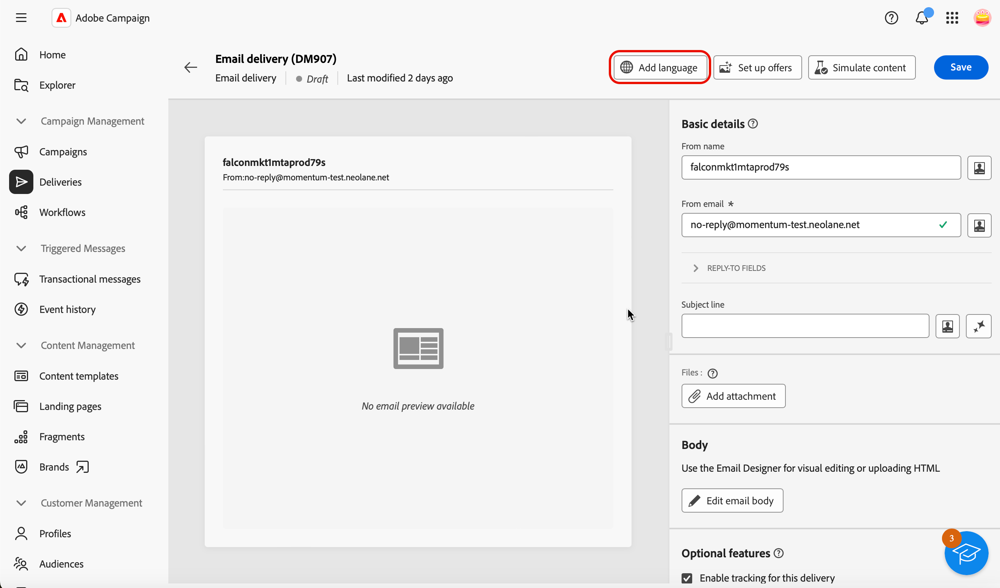
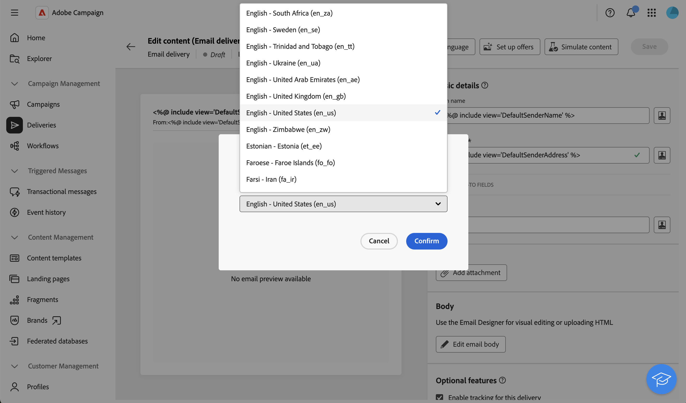

# Configurar uma entrega multilíngue {#multilingual-delivery}

>[!CONTEXTUALHELP]
>id="acw_deliveries_email_multilingual"
>title="Adicionar idiomas"
>abstract="Nesta guia, você encontrará uma lista de idiomas para o envio da entrega. É possível adicionar mais idiomas clicando no botão Adicionar idioma ou duplicando outro idioma por meio dessa guia."

>[!CONTEXTUALHELP]
>id="acw_multilingual_file_upload"
>title="Importar variantes de idioma"
>abstract="Use esta caixa de diálogo para adicionar uma variante de idioma importando um arquivo CSV. O arquivo preenche automaticamente todos os campos disponíveis para o idioma selecionado. Você pode arrastar e soltar o arquivo ou escolhê-lo no computador antes de confirmar."

Na interface da Web do Campaign, você pode configurar seus deliveries como multilíngues, o que permite enviar mensagens com base no idioma preferencial de um perfil. Quando nenhuma preferência é definida, a mensagem é enviada no idioma padrão.

Em um delivery multilíngue, o gerenciamento de idiomas é baseado em variantes. Cada variante representa um idioma. Durante a criação do delivery, você pode adicionar várias variantes de idioma para corresponder ao número de idiomas necessários na mensagem. Também é possível alterar o idioma padrão a qualquer momento após adicionar essas variantes.

O recurso multilíngue está disponível atualmente para email, notificações por push, mensagens transacionais e SMS.

>[!AVAILABILITY]
>
>Notificações por push multilíngues, mensagens transacionais e SMS só estão disponíveis para um conjunto de organizações (disponibilidade limitada) e serão implantadas globalmente em uma versão futura. Seu servidor deve ser atualizado para a versão 8.8.2 ou posterior.

Para configurar deliveries multilíngues, siga estas etapas principais:

1. Adicionar uma variante de idioma, [leia mais](#add-variant)
1. Definir o conteúdo de cada variante, [leia mais](#define-content)
1. Gerenciar variantes de idioma, [leia mais](#manage-variant)

## Adicionar uma variante de idioma{#add-variant}

Para criar variantes de idioma, siga estas etapas:

1. No painel de entrega, clique no ícone de lápis para acessar a tela de edição de conteúdo de entrega e clique em **[!UICONTROL Adicionar idioma]**.

   >[!IMPORTANT]
   >
   >O botão **[!UICONTROL Adicionar idioma]** só estará disponível se a dimensão de destino contiver o esquema **Idioma**. Para saber mais sobre esquemas e dimensões de destino, consulte a [documentação detalhada](../audience/targeting-dimensions.md).

   {zoomable="yes"}

1. No menu suspenso **Adicionar idioma**, selecione o idioma a ser adicionado e confirme.

   O primeiro idioma adicionado é automaticamente definido como padrão e o conteúdo existente se torna a versão padrão. Quando idiomas adicionais são adicionados, o conteúdo é copiado inicialmente do idioma padrão.

   {zoomable="yes"}

   >[!NOTE]
   >
   >Os idiomas disponíveis nesta lista dependem dos valores que foram definidos pelo atributo **Language** (valores como: system, user, dbenum, etc.). Saiba mais sobre o gerenciamento de enumeração nesta [seção](../administration/enumerations.md).

1. Repita essa operação para adicionar outros idiomas. O painel **[!UICONTROL Idiomas]**, à esquerda, mostra a lista de idiomas escolhidos, o número de idiomas e o idioma padrão.

   Por exemplo, se você tiver escolhido inglês, francês e sueco, poderá ver esses três idiomas conforme mostrado abaixo:

   {zoomable="yes"}

   Para saber como gerenciar variantes de idioma, consulte esta [seção](#manage-variant).

## Definir o conteúdo de cada variante{#define-content}

Depois que os idiomas forem definidos, defina o conteúdo da entrega para cada idioma.

1. Na tela de edição de conteúdo de entrega, selecione um idioma no painel **[!UICONTROL Idiomas]**, à esquerda.

   {zoomable="yes"}

1. Defina o conteúdo da mensagem para esse idioma. Saiba mais nesta [seção](../msg/create-deliveries.md).

1. Repita essa operação para cada idioma.

<!--
>[!BEGINTABS]

>[!TAB Email delivery]

1. From the delivery content edition screen, choose a language and click the **[!UICONTROL Edit email body]** button. You can also hover over the email preview and select **[!UICONTROL Open email designer]**.

    {zoomable="yes"}

1. Define the content of your email for this language. [Read more](../email/get-started-email-designer.md#start-authoring)

1. Repeat this operation for each language.

>[!TAB SMS delivery]

1. From the delivery content edition screen, choose a language.

1. Edit the content of the SMS message for this language. [Read more](../sms/create-sms.md)

    {zoomable="yes"}

1. Repeat this operation for each language.

>[!ENDTABS]

-->

Para visualizar a entrega, clique no botão **[!UICONTROL Simular conteúdo]** e escolha perfis. Verifique se o conteúdo correto é exibido para cada perfil.

{zoomable="yes"}

## Gerenciar variantes de idioma{#manage-variant}

No painel esquerdo, todas as informações sobre variantes de idioma são exibidas. Para excluir todos os idiomas, clique no botão expandir e clique em **[!UICONTROL Excluir todas as variantes]**.

{zoomable="yes"}

Na lista de variantes de idioma, você pode executar as seguintes ações:

* **Editar**: alterar o idioma enquanto mantém o conteúdo associado.
* **Definir como padrão**: definir o idioma como o padrão. Quando um perfil não tem idioma definido, a mensagem é enviada no idioma padrão.
* **Duplicar**: duplique o conteúdo definido para este idioma e escolha uma variante diferente.
* **Excluir**: excluir a variante e seu conteúdo associado.

{zoomable="yes"}

