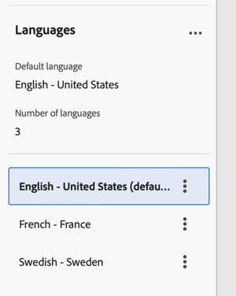

# Configurar uma entrega multilíngue {#multilingual-delivery}

>[!CONTEXTUALHELP]
>id="acw_deliveries_email_multilingual"
>title="Adicionar idiomas"
>abstract="Nesta guia, você encontrará uma lista de idiomas para o envio da entrega. É possível adicionar mais idiomas clicando no botão Adicionar idioma ou duplicando outro idioma por meio dessa guia."

>[!CONTEXTUALHELP]
>id="acw_multilingual_file_upload"
>title="Importar variantes de idioma"
>abstract="Use esta caixa de diálogo para adicionar uma variante de idioma importando um arquivo CSV. O arquivo preenche automaticamente todos os campos disponíveis para o idioma selecionado. Você pode arrastar e soltar o arquivo ou escolhê-lo no computador antes de confirmar."

Na interface da Web do Campaign, você pode configurar seus deliveries como multilíngues, o que permite enviar mensagens com base no idioma preferencial de um perfil. Quando nenhuma preferência é definida, a mensagem é enviada no idioma padrão.

Em um delivery multilíngue, o gerenciamento de idiomas é baseado em variantes. Cada variante representa um idioma. Durante a criação do delivery, você pode adicionar várias variantes de idioma para corresponder ao número de idiomas necessários na mensagem. Também é possível alterar o idioma padrão a qualquer momento após adicionar essas variantes.

O recurso multilíngue está disponível atualmente para email, notificações por push, mensagens transacionais e SMS.

Para configurar deliveries multilíngues, siga estas etapas principais:

1. Adicionar uma variante de idioma, [leia mais](#add-variant)
1. Definir o conteúdo de cada variante, [leia mais](#define-content)
1. Gerenciar variantes de idioma, [leia mais](#manage-variant)

## Adicionar uma variante de idioma{#add-variant}

Para criar variantes de idioma, siga estas etapas:

1. No painel de entrega, clique no ícone de lápis para acessar a tela de edição de conteúdo de entrega e clique em **[!UICONTROL Adicionar idioma]**.

   >[!IMPORTANT]
   >
   >O botão **[!UICONTROL Adicionar idioma]** só estará disponível se a dimensão de destino contiver o esquema **Idioma**. Para saber mais sobre esquemas e dimensões de destino, consulte a [documentação detalhada](../audience/targeting-dimensions.md).

   {zoomable="yes"}

1. No menu suspenso **Adicionar idioma**, selecione o idioma a ser adicionado e confirme. Para notificações por push, você também pode [carregar um arquivo CSV](#csv-upload) para importar todas as variantes de idioma de uma só vez.

   O primeiro idioma adicionado é automaticamente definido como padrão e o conteúdo existente se torna a versão padrão. Quando idiomas adicionais são adicionados, o conteúdo é copiado inicialmente do idioma padrão.

   {zoomable="yes"}

   >[!NOTE]
   >
   >Os idiomas disponíveis nesta lista dependem dos valores que foram definidos pelo atributo **Language** (valores como: system, user, dbenum, etc.). Saiba mais sobre o gerenciamento de enumeração nesta [seção](../administration/enumerations.md).

1. Repita essa operação para adicionar outros idiomas. O painel **[!UICONTROL Idiomas]**, à esquerda, mostra a lista de idiomas escolhidos, o número de idiomas e o idioma padrão.

   Por exemplo, se você tiver escolhido inglês, francês e sueco, poderá ver esses três idiomas conforme mostrado abaixo:

   {zoomable="yes"}

   Para saber como gerenciar variantes de idioma, consulte esta [seção](#manage-variant).

## Definir o conteúdo de cada variante{#define-content}

Depois que os idiomas forem definidos, defina o conteúdo da entrega para cada idioma.

1. Na tela de edição de conteúdo de entrega, selecione um idioma no painel **[!UICONTROL Idiomas]**, à esquerda.

   {zoomable="yes"}

1. Defina o conteúdo da mensagem para esse idioma. Saiba mais nesta [seção](../msg/create-deliveries.md).

1. Repita essa operação para cada idioma.

<!--
>[!BEGINTABS]

>[!TAB Email delivery]

1. From the delivery content edition screen, choose a language and click the **[!UICONTROL Edit email body]** button. You can also hover over the email preview and select **[!UICONTROL Open email designer]**.

    {zoomable="yes"}

1. Define the content of your email for this language. [Read more](../email/get-started-email-designer.md#start-authoring)

1. Repeat this operation for each language.

>[!TAB SMS delivery]

1. From the delivery content edition screen, choose a language.

1. Edit the content of the SMS message for this language. [Read more](../sms/create-sms.md)

    {zoomable="yes"}

1. Repeat this operation for each language.

>[!ENDTABS]

-->

Para visualizar a entrega, clique no botão **[!UICONTROL Simular conteúdo]** e escolha perfis. Verifique se o conteúdo correto é exibido para cada perfil.

{zoomable="yes"}

## Gerenciar variantes de idioma{#manage-variant}

No painel esquerdo, todas as informações sobre variantes de idioma são exibidas. Para excluir todos os idiomas, clique no botão expandir e clique em **[!UICONTROL Excluir todas as variantes]**.

{zoomable="yes"}

Na lista de variantes de idioma, você pode executar as seguintes ações:

* **Editar**: alterar o idioma enquanto mantém o conteúdo associado.
* **Definir como padrão**: definir o idioma como o padrão. Quando um perfil não tem idioma definido, a mensagem é enviada no idioma padrão.
* **Duplicar**: duplique o conteúdo definido para este idioma e escolha uma variante diferente.
* **Excluir**: excluir a variante e seu conteúdo associado.

{zoomable="yes"}

## Importar variantes de idioma do CSV (notificações por push) {#csv-upload}

Para notificações por push, você pode preencher rapidamente todas as variantes de idioma carregando um arquivo CSV com seu conteúdo multilíngue. Esse recurso simplifica a criação de campanhas multilíngues, permitindo preparar conteúdo offline e importá-lo em massa.

* **Eficiência**: adicionar vários idiomas e seu conteúdo em uma única operação
* **Consistência**: garantir mensagens uniformes em todas as variantes de idioma
* **Collaboration**: permitir que as equipes de conteúdo preparem traduções em ferramentas de planilha conhecidas
* **Gerenciamento em massa**: gerencie e atualize facilmente um grande número de variantes de idioma

### Pré-requisitos {#csv-best-practices}

Siga estas práticas recomendadas para garantir uma importação bem-sucedida de CSV:

* **Usar a estrutura de coluna exata**: todas as 14 colunas devem estar presentes no arquivo CSV, mesmo que você deixe algumas em branco. Colunas ausentes causarão falha na importação. Você pode usar uma ordem diferente, mas todas as colunas devem estar presentes.
* **Corresponder nomes de coluna exatamente**: os nomes de coluna diferenciam maiúsculas de minúsculas. Use `title` não `Title`, `badge` não `Bbadge`, `locale` não `Locale`.
* **Usar códigos de localidade em minúsculas**: Formatar códigos de localidade como `en_us`, `fr_fr`, `de_de` (minúsculas com sublinhado), não `en_US` ou `en-us`.
* **Preencher colunas obrigatórias**: as colunas `locale` e `language` devem conter valores para cada linha. Valores vazios causarão falha na importação.
* **Manter localidades exclusivas**: cada código de localidade deve aparecer apenas uma vez no arquivo CSV. Locais duplicados serão rejeitados.
* **Salvar como UTF-8**: sempre salve seu arquivo CSV com codificação UTF-8 para suportar caracteres internacionais corretamente.
* **Conteúdo com vírgulas entre aspas**: Se o título ou o corpo da mensagem contiver vírgulas, coloque todo o campo entre aspas duplas: `"Hello, welcome!"`.
* **Usar valores numéricos corretamente**: Para colunas de sinalizador (isContentAvailable, isMutableContent, silentPush), use `1` para verdadeiro, `0` para falso ou deixe em branco para padrão.
* **Validar formato JSON**: se estiver usando a coluna customFields, verifique se o JSON está formatado corretamente: `{"key":"value"}` com aspas e colchetes corretos.
* **Testar com o mínimo de dados primeiro**: comece com um CSV de idioma simples de 2 a 3 para verificar seu formato antes de criar arquivos grandes.

>[!NOTE]
>
>A estrutura da coluna está detalhada nesta [seção](#csv-columns).

### Importar o arquivo CSV {#csv-steps}

Para importar variantes de idioma de um arquivo CSV, siga estas etapas:

1. No editor de conteúdo de entrega, clique em **[!UICONTROL Adicionar idioma]**.

   {zoomable="yes"}

1. Selecione o arquivo CSV arrastando-o e soltando-o na área de upload ou clique em para navegar no computador.

   O sistema valida o formato e o conteúdo do arquivo. Se a validação falhar, as mensagens de erro indicarão quais colunas ou dados estão incorretos. Corrija os problemas no arquivo CSV e faça upload novamente. Consulte esta [seção](#csv-troubleshooting).

   {zoomable="yes"}

1. Revise o conteúdo importado no painel Variantes de idioma para confirmar todas as traduções carregadas corretamente.

   {zoomable="yes"}

### Estrutura da coluna {#csv-columns}

Esta é a estrutura de coluna correta a ser usada:

>[!NOTE]
>
>Você pode usar uma ordem diferente, mas todas as colunas devem estar presentes. Para obter mais práticas recomendadas, consulte esta [seção](#csv-best-practices).

1. **título**: título da notificação (obrigatório)
1. **messageBody**: corpo da mensagem de notificação (obrigatório)
1. **som**: Nome do arquivo de som (por exemplo, `default`, `custom_sound.mp3`) - deixe em branco para padrão
1. **selo**: número de selo a ser exibido no ícone do aplicativo (iOS) - use apenas números
1. **deeplinkURI**: URL do deep link a ser aberto quando a notificação for tocada - deixe em branco se não for usado
1. **categoria**: identificador de categoria de notificação para ações personalizadas (iOS) - deixe em branco se não for usado
1. **iosMediaAttachmentURL**: URL do anexo de mídia para notificações do iOS - deixe em branco se não for usado
1. **androidMediaAttachmentURL**: URL do anexo de mídia para notificações do Android - deixe em branco se não for usado
1. **isContentAvailable**: sinalizador de conteúdo disponível (iOS) - use `1` para verdadeiro, `0` para falso, deixe em branco para padrão (0)
1. **isMutableContent**: sinalizador de conteúdo mutável (iOS) - use `1` para verdadeiro, `0` para falso, deixe em branco para padrão (0)
1. **customFields**: dados personalizados no formato JSON (por exemplo, `{"key1":"value1","key2":"value2"}`) - deixe em branco se não forem usados
1. **localidade**: código de idioma (obrigatório) - por exemplo, `en_us`, `fr_fr`, `de_de` - **obrigatório, deve ser exclusivo por linha**
1. **idioma**: Nome do idioma (obrigatório) - por exemplo, `English-United States`, `French-France` - **obrigatório**
1. **silentPush**: sinalizador de push silencioso - usar `1` para push silencioso, `0` para regular, deixar em branco para padrão (0)

### Exemplo de arquivo CSV {#csv-examples}

Este é um exemplo básico com os campos obrigatórios:

```csv
title,messageBody,sound,badge,deeplinkURI,category,iosMediaAttachmentURL,androidMediaAttachmentURL,isContentAvailable,isMutableContent,customFields,locale,language,silentPush
Welcome!,Thank you for joining us,,,,,,,,,, en_us,English-United States,0
Bienvenue !,Merci de nous avoir rejoint,,,,,,,,,,fr_fr,French-France,0
Willkommen!,Vielen Dank für Ihre Anmeldung,,,,,,,,,, de_de,German-Germany,0
¡Bienvenido!,Gracias por unirte a nosotros,,,,,,,,,, es_es,Spanish-Spain,0
```

Veja um exemplo com campos opcionais:

```csv
title,messageBody,sound,badge,deeplinkURI,category,iosMediaAttachmentURL,androidMediaAttachmentURL,isContentAvailable,isMutableContent,customFields,locale,language,silentPush
Welcome!,Thank you for joining us,default,1,,,https://example.com/welcome-en.jpg,https://example.com/welcome-en.jpg,,,, en_us,English-United States,0
Bienvenue !,Merci de nous avoir rejoint,default,1,,,https://example.com/welcome-fr.jpg,https://example.com/welcome-fr.jpg,,,, fr_fr,French-France,0
Willkommen!,Vielen Dank für Ihre Anmeldung,default,1,,,https://example.com/welcome-de.jpg,https://example.com/welcome-de.jpg,,,, de_de,German-Germany,0
¡Bienvenido!,Gracias por unirte a nosotros,default,1,,,https://example.com/welcome-es.jpg,https://example.com/welcome-es.jpg,,,, es_es,Spanish-Spain,0
```

Veja um exemplo com campos personalizados

```csv
title,messageBody,sound,badge,deeplinkURI,category,iosMediaAttachmentURL,androidMediaAttachmentURL,isContentAvailable,isMutableContent,customFields,locale,language,silentPush
New Collection,Discover our latest products,default,1,,,,,,,"{"campaign":"summer2025","segment":"premium"}",en_us,English-United States,0
Nouvelle Collection,Découvrez nos derniers produits,default,1,,,,,,,"{"campaign":"summer2025","segment":"premium"}",fr_fr,French-France,0
```

>[!NOTE]
>
>Para notificações por push avançadas com carrosséis ou botões de ação, o Campaign usa um método de configuração diferente da importação de CSV. Configure conteúdo avançado de push diretamente no editor de entrega após importar conteúdo multilíngue básico.

### Personalization em arquivos CSV {#csv-personalization}

Para usar campos de personalização em seu conteúdo CSV, você precisa usar `<span>` tags:

```csv
title,messageBody,sound,badge,deeplinkURI,category,iosMediaAttachmentURL,androidMediaAttachmentURL,isContentAvailable,isMutableContent,customFields,locale,language,silentPush
"Hello <span class=""nl-dce-field nl-dce-done"" data-nl-expr=""recipient.firstName"">recipient.firstName</span>","Your order has shipped!",,,,,,,,,,en_us,English-United States,0
"Bonjour <span class=""nl-dce-field nl-dce-done"" data-nl-expr=""recipient.firstName"">recipient.firstName</span>","Votre commande a été expédiée !",,,,,,,,,,fr_fr,French-France,0
```

Durante o delivery, o Campaign substitui esses espaços reservados pelos dados reais do recipient.

### Solução de problemas {#csv-troubleshooting}

| Erro | Causa | Solução |
|-------|-------|----------|
| Colunas obrigatórias ausentes | O arquivo CSV não contém todas as 14 colunas | Verifique se o CSV tem todas as 14 colunas na ordem exata mostrada acima. Use valores vazios para colunas não usadas. |
| Valores de localidade/idioma inválidos | as colunas local ou idioma estão vazias | As colunas de localidade e idioma devem ter valores para cada linha |
| Localidades duplicadas | O mesmo código de localidade aparece várias vezes | Cada valor de localidade deve ser exclusivo - remova as linhas duplicadas |
| Problemas de codificação de arquivo | O arquivo CSV usa codificação incompatível | Salve seu arquivo CSV com codificação UTF-8 |
| Incompatibilidade de coluna | As linhas têm números de colunas diferentes do cabeçalho | Verifique se todas as linhas têm exatamente 14 colunas correspondentes ao cabeçalho |
| Valores numéricos inválidos | selo, isContentAvailable, isMutableContent ou silentPush contém valores não numéricos | Use apenas números: 0 ou 1 para sinalizadores ou deixe em branco para padrão |
| JSON malformado | A coluna customFields contém JSON inválido | Verifique se a sintaxe JSON está correta: `{"key":"value"}` ou deixe em branco |
| Incompatibilidade de maiúsculas e minúsculas do nome da coluna | Os nomes das colunas não correspondem exatamente | Os nomes das colunas fazem distinção entre maiúsculas e minúsculas - use os nomes exatos mostrados acima (por exemplo, `badge`, não `Badge` ou `BADGE`) |

>As práticas recomendadas estão listadas nesta [seção](#csv-best-practices). A estrutura da coluna está detalhada nesta [seção](#csv-columns).

