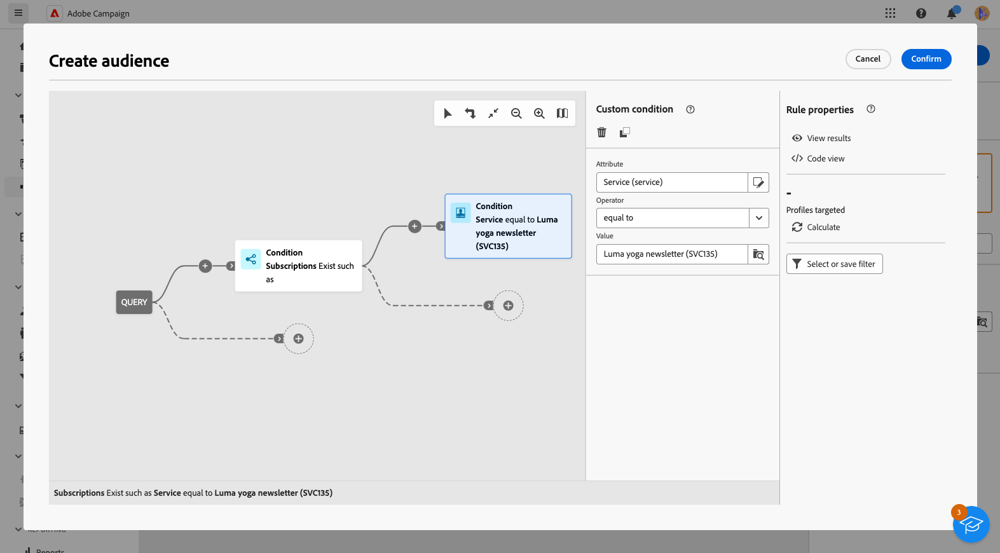

# Enviar mensagens aos assinantes de um serviço {#send-to-subscribers}

Você pode criar serviços de assinatura no Adobe Campaign e enviar mensagens aos assinantes. Saiba como criar serviços de assinaturas [nesta página](../audience//manage-services.md#create-service).

Para enviar mensagens aos assinantes, crie um público-alvo específico para identificá-los e, em seguida, crie o delivery conforme detalhado abaixo.

1. Criar um público-alvo. Um novo workflow é criado automaticamente. [Saiba mais sobre públicos-alvo](../audience/create-audience.md)

1. Para melhorar a compreensão, altere o nome do fluxo de trabalho no campo **Rótulo** das configurações do fluxo de trabalho. [Saiba como definir configurações de fluxo de trabalho](../workflows/workflow-settings.md)

1. Abra a atividade **[!UICONTROL Criar público-alvo]** e selecione **[!UICONTROL Criar público-alvo]**. [Saiba como configurar uma atividade Criar público-alvo](../workflows/activities/build-audience.md)

   {zoomable="yes"}

1. No fluxo de criação de público, selecione as seguintes condições personalizadas: **[!UICONTROL Existem assinaturas]**, como **[!UICONTROL Serviço]**, que é igual ao serviço que você definiu. Neste exemplo, selecione seu **informativo sobre a Luma yoga**.

   {zoomable="yes"}

1. Selecione **[!UICONTROL Confirmar]** e clique em **[!UICONTROL Iniciar]** para executar o fluxo de trabalho.

1. Criar um delivery. As etapas para criar uma entrega estão detalhadas em [esta página](../msg/gs-messages.md#create-delivery).
1. Navegue até as configurações de entrega e altere o target mapping padrão para **Assinaturas (nms:subscriptions)**.

   {zoomable="yes"}

1. Na seção principal do target do delivery, selecione o público-alvo criado acima.

   {zoomable="yes"}

1. Crie o conteúdo da mensagem, teste e envie a entrega, conforme detalhado em [esta seção](../preview-test/preview-test.md).

   {zoomable="yes"}

Seu delivery é enviado somente aos assinantes desse serviço.
