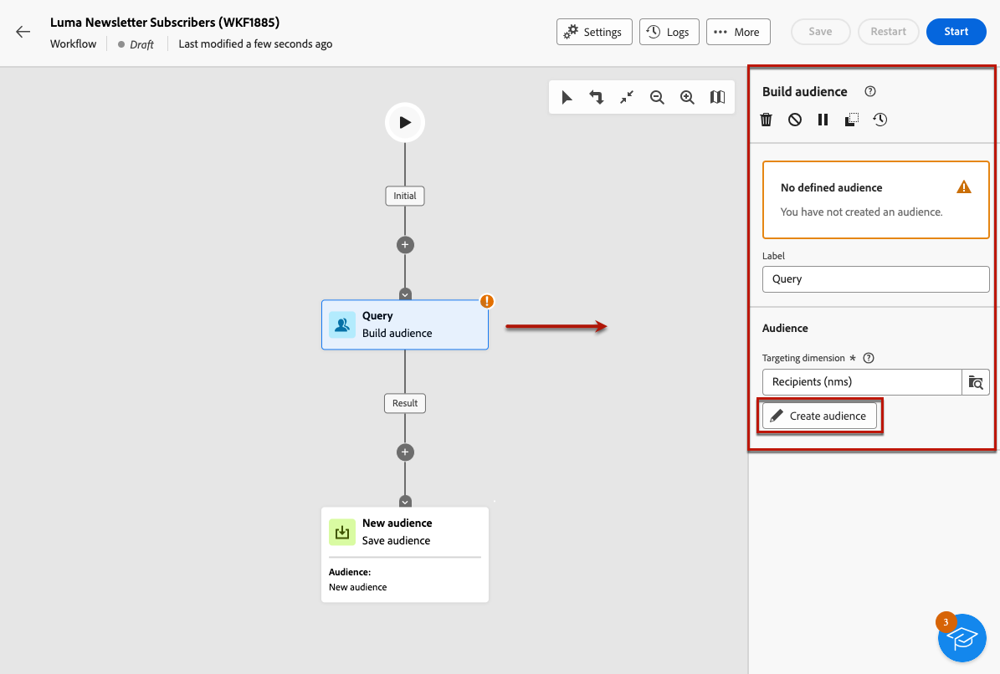
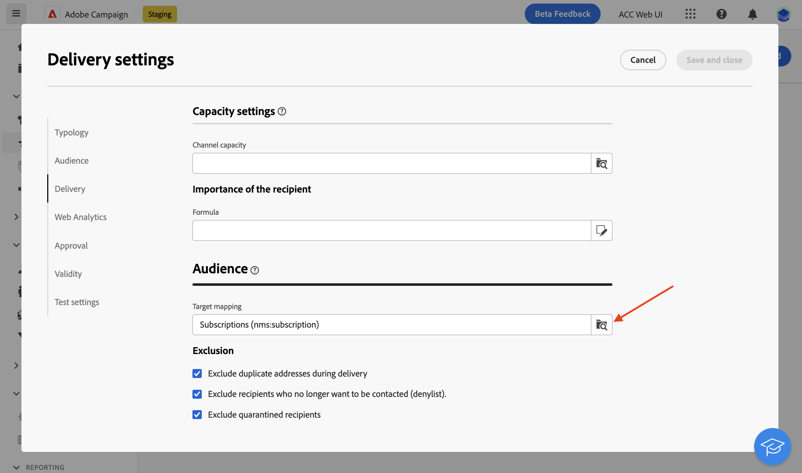

# Enviar mensagens aos assinantes de um serviço {#send-to-subscribers}

Você pode criar serviços de assinatura no Adobe Campaign e enviar mensagens aos assinantes. Saiba como criar serviços de subscrições no [esta página](../audience//manage-services.md#create-service).

Para enviar mensagens aos assinantes, crie um público-alvo específico para identificá-los e, em seguida, crie o delivery conforme detalhado abaixo.

1. Criar um público-alvo. Um novo workflow é criado automaticamente. [Saiba mais sobre públicos](../audience/create-audience.md)

1. Para melhorar a compreensão, altere o nome do workflow nas configurações do workflow **Rótulo** campo. [Saiba como definir configurações de fluxo de trabalho](../workflows/workflow-settings.md)

1. Abra o **[!UICONTROL Criar público-alvo]** e selecione **[!UICONTROL Criar público]**. [Saiba como configurar uma atividade Criar público-alvo](../workflows/activities/build-audience.md)

   

1. No fluxo de criação de público-alvo, selecione as seguintes condições personalizadas: **[!UICONTROL Assinaturas]** existem, como **[!UICONTROL Serviço]** é igual ao serviço definido. Neste exemplo, selecione o **Informativo sobre ioga em Luma**.

   

1. Selecionar **[!UICONTROL Confirmar o]** e clique em **[!UICONTROL Início]** para executar o workflow.

1. Criar um delivery. As etapas para criar um delivery estão detalhadas em [esta página](../msg/gs-messages.md#create-delivery).
1. Navegue até as configurações de entrega e altere o target mapping padrão para **Assinaturas (nms:subscriptions)**.

   

1. Na seção principal do target do delivery, selecione o público-alvo criado acima.

   

1. Crie o conteúdo da mensagem, teste e envie o delivery, conforme detalhado em [nesta seção](../preview-test/preview-test.md).

   

Seu delivery é enviado somente aos assinantes desse serviço.
