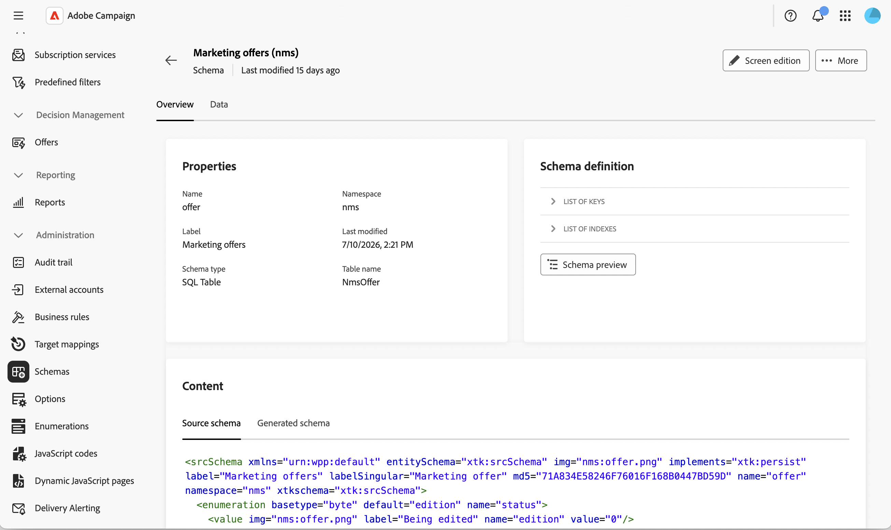
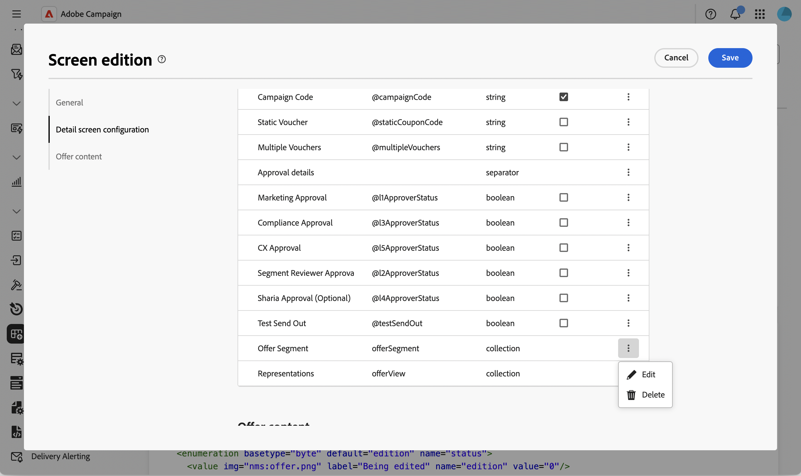

# Adicionar uma lista editável ao schema de ofertas {#offer-editable-list}

Ao [estender o [!DNL nms:offer] esquema](../administration/schemas.md) com um link de coleção personalizado, como um conjunto de segmentos vinculados a uma oferta, você pode expô-lo como uma lista editável diretamente na seção **[!UICONTROL Opções personalizadas]** da oferta. Em vez de gerenciar os registros relacionados por meio de uma tela separada, a coleção é renderizada como uma lista nos detalhes da oferta e você pode criar novos registros relacionados em linha por meio de uma caixa de diálogo dedicada.

>[!NOTE]
>
>No momento, esse recurso está disponível somente para o schema de ofertas.

## Adicionar um campo de link da coleção {#add-field}

1. Estenda o esquema [!DNL nms:offer] com sua coleção personalizada e navegue até o menu **[!UICONTROL Esquemas]**, abra o esquema **[!UICONTROL Ofertas de marketing]** e clique em **[!UICONTROL Edição de tela]**. [Saiba mais](../administration/schemas-browse-access.md#screen-def).

   {zoomable="yes"}

1. Na seção **[!UICONTROL Configuração da tela de detalhes]**, clique no ícone de reticências acima da tabela **[!UICONTROL Lista de campos personalizados]** e escolha **[!UICONTROL Selecionar atributos]**. [Saiba mais](../administration/schemas-custom-fields.md).

   {zoomable="yes"}

1. Navegue pelos atributos e selecione o link da coleção personalizada, identificado pelo ícone de coleção.

   {zoomable="yes"}

   >[!NOTE]
   >
   >Os campos de link da coleção não podem ser obrigatórios e não oferecem suporte a subatributos. Por padrão, elas abrangem duas colunas no formulário.

1. Confirme sua seleção. O link da coleção é adicionado à tabela **[!UICONTROL Lista de campos personalizados]**, com a **[!UICONTROL coleção]** como seu tipo.

   {zoomable="yes"}

## Configurar a lista editável da coleção {#configure-list}

1. Clique no ícone de reticências na linha do campo da coleção e escolha **[!UICONTROL Editar]** para abrir a caixa de diálogo **[!UICONTROL Configurações do link da coleção]**.

   {zoomable="yes"}

1. Na guia **[!UICONTROL Geral]**, defina opcionalmente uma condição **[!UICONTROL Visível se]** ou habilite **[!UICONTROL Somente leitura]**.

   {zoomable="yes"}

1. Na guia **[!UICONTROL Configuração da tela]**, clique em **[!UICONTROL Selecionar atributos]** e selecione os atributos a serem usados ao adicionar um novo elemento à lista, por exemplo, um nome de segmento e um campo personalizado.

   {zoomable="yes"}

1. Na guia **[!UICONTROL Layout]**, mantenha ou limpe **[!UICONTROL Duas colunas]**.

1. Clique em **[!UICONTROL Confirmar]** e **[!UICONTROL Salvar]** a definição da tela.

## Usar a lista editável em uma oferta {#use-list}

1. No menu esquerdo, clique em **Ofertas** e abra uma oferta. [Leia mais](create-offer.md#create)

   {zoomable="yes"}

1. Acesse as propriedades da oferta. A coleção é renderizada como uma lista na seção **Opções personalizadas**.

   {zoomable="yes"}

1. Clique em **[!UICONTROL Adicionar]** para exibir os atributos configurados, preencha-os e clique em **[!UICONTROL Confirmar]**. O novo elemento é adicionado à lista.

   É possível adicionar vários elementos à mesma lista, e o detalhe da oferta pode conter mais de uma lista editável.

1. Clique em **[!UICONTROL Save]**.

<!--
Each element added through the editable list creates a new related record. For instance, adding a segment to an offer generates the following payload:

```xml
<offer ...>
  <offerSegment segmentName="..." _operation="insert"/>
</offer>
```
-->