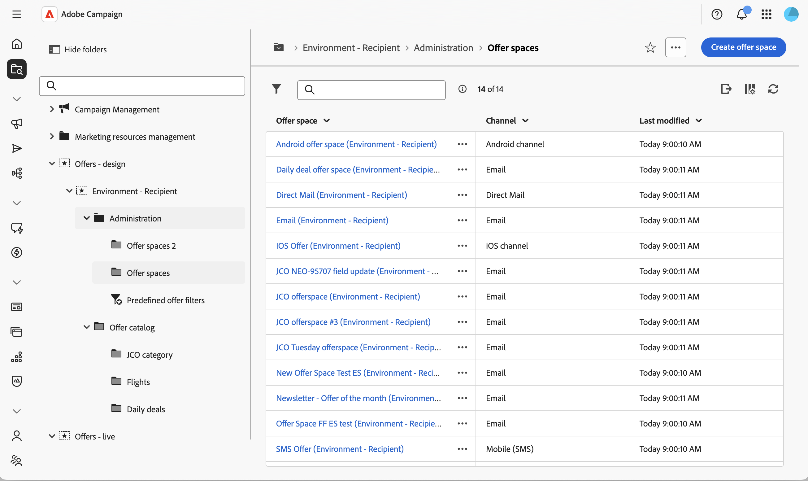
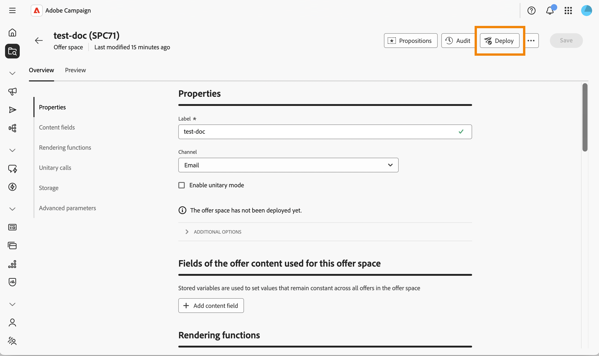
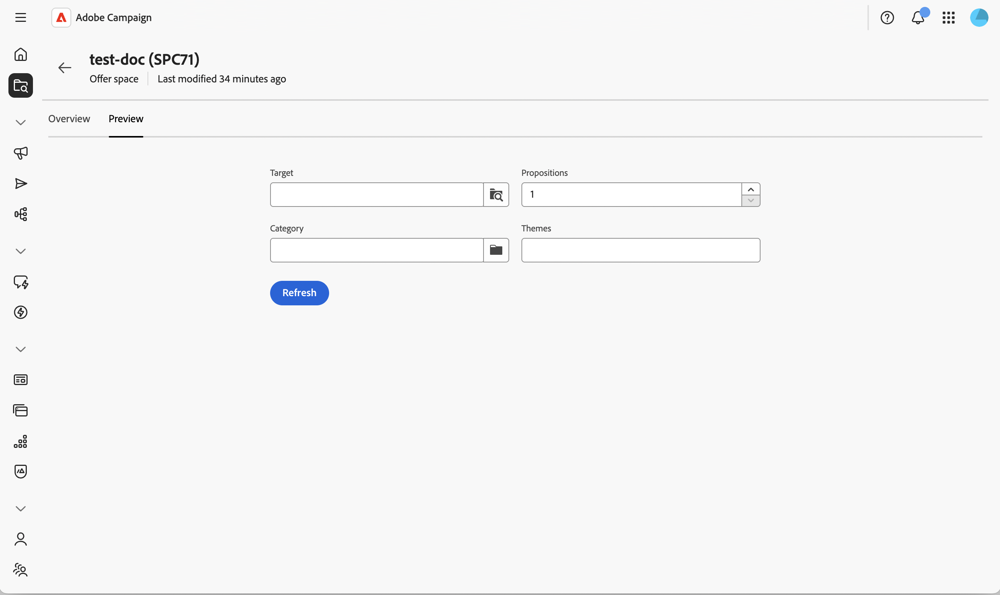

# Criar e gerenciar espaços de oferta {#offer-space}

Um **espaço de ofertas** define onde e como uma oferta é exposta a um contato: qual canal ela usa (email, correspondência direta, SMS, Web de entrada etc.), quais campos de conteúdo a oferta pode usar e como a representação final é criada. Um único ambiente pode conter vários espaços de oferta — um para cada ponto de exposição.

Um espaço de ofertas não é um canal por si só. Ele representa um local específico onde a oferta é exibida em um canal. Dois banners na mesma página da Web normalmente correspondem a dois espaços de oferta diferentes. Para obter o modelo conceitual completo, consulte a [documentação do Campaign v8](https://experienceleague.adobe.com/docs/campaign/campaign-v8/offers/interaction-offer-spaces.html){target="_blank"}.

## Criar ou modificar um espaço de oferta{#create-offer-space}

Os espaços de oferta são armazenados na pasta de ambiente de oferta. Para procurar os espaços de oferta disponíveis na sua plataforma, abra o **[!UICONTROL Explorer]**, navegue até o ambiente de oferta e selecione a subpasta que os contém.

{zoomable="yes"}

Aqui, é possível abrir um espaço de ofertas existente ou criar um novo clicando em **[!UICONTROL Criar espaço de ofertas]**.

{zoomable="yes"}

### Definir as propriedades {#properties}

Esta seção permite:

* Insira um **[!UICONTROL Rótulo]** para o espaço de oferta.
* Selecione o **[!UICONTROL Canal]** que corresponde ao ponto de exposição (email, correspondência direta, SMS, Web, etc.).
* Selecione **[!UICONTROL Habilitar modo unitário]** se este espaço de oferta também precisar suportar chamadas unitárias (em tempo real, oferta única) para o mecanismo de oferta, além de chamadas de entrega em massa.

### Definir os campos de conteúdo {#content-fields}

Os campos de conteúdo listam os atributos que podem ser editados no nível da oferta e reutilizados pela função de renderização. A ordem em que você adiciona os campos no espaço de ofertas orienta a ordem em que eles são expostos na seção de oferta **[!UICONTROL Conteúdo]**.

Por padrão, cada oferta é enviada com os seguintes campos de conteúdo prontos para uso: **[!UICONTROL Título]**, **[!UICONTROL URL de Destino]**, **[!UICONTROL URL da Imagem]**, **[!UICONTROL Conteúdo do HTML]** e **[!UICONTROL Conteúdo de texto]**. É possível estender esta lista com qualquer campo personalizado necessário à sua renderização — por exemplo, um **conteúdo curto**, uma **URL rastreada** ou qualquer atributo adicionado por meio da extensão de esquema.

Clique em **[!UICONTROL Adicionar campo de conteúdo]** e selecione o atributo a ser exposto no esquema de oferta ou clique em **[!UICONTROL Editar expressão]** para definir uma expressão personalizada.

>[!IMPORTANT]
>
>Para tornar um atributo personalizado editável a partir da seção de oferta **[!UICONTROL Content]**, o atributo também deve ser declarado na seção **[!UICONTROL Offer content]** do esquema [!DNL nms:offer]. Saiba mais em [Trabalhar com esquemas](../administration/schemas.md).

### Configurar as funções de renderização {#rendering}

As funções de renderização criam a representação da oferta final a partir dos campos de conteúdo. Você pode escolher entre a renderização padrão — que simplesmente gera o conteúdo como está — ou uma função personalizada que combina os campos com HTML, XML ou texto.

Selecione a guia **[!UICONTROL Renderização do HTML]**, **[!UICONTROL Renderização de XML]** ou **[!UICONTROL Renderização de texto]** e habilite **[!UICONTROL Sobrecarregar a função de renderização]** para ativá-la.

Use o editor de expressão para gravar a função de renderização. Você pode fazer referência aos campos de conteúdo definidos no espaço, aos atributos de oferta e a qualquer função do [editor de expressão](../query/expression-editor.md).

>[!NOTE]
>
>Se nenhuma função de renderização estiver definida, o conteúdo da oferta será retornado como está usando os atributos prontos para uso. A função de renderização XML só pode ser usada quando **[!UICONTROL Habilitar modo unitário]** está selecionado no espaço de oferta.

### Configurar o status do armazenamento e da apresentação {#storage}

Esta seção permite controlar como as propostas geradas por meio deste espaço são persistentes e como seu status evolui ao longo do ciclo de vida:

* **[!UICONTROL Desabilitar a inserção de propostas]** — Impede que propostas geradas por meio deste espaço de ofertas sejam inseridas na tabela de armazenamento de propostas.

* **[!UICONTROL Status]** na proposta — Status aplicado à proposta no momento em que o mecanismo de oferta a retorna (normalmente **[!UICONTROL Apresentado]** para entregas de saída).

* **[!UICONTROL Status]** sobre aceitação — Status aplicado quando o destinatário interage com a oferta (normalmente **[!UICONTROL Accepted]**).

Os valores de status disponíveis correspondem à lista usada pelo Console do cliente. Para obter mais informações, consulte a [documentação do Campaign v8](https://experienceleague.adobe.com/docs/campaign/campaign-v8/offers/interaction-offer-spaces.html#offer-proposition-statuses){target="_blank"} na documentação do console.

<!--
>[!NOTE]
>
>Status updates run asynchronously through the tracking workflow. For an outbound delivery containing a tracked link, the status of the proposition is automatically switched to **[!UICONTROL Presented]** when the delivery reaches the **[!UICONTROL Sent]** state. To trigger the **[!UICONTROL Interested]** status from a click, add the `_urlType="11"` attribute to the link. The full **inbound interaction** URL syntax (for example to apply the **[!UICONTROL Rejected]** status from a web app) must be configured in the client console — see [Inbound interaction status update](https://experienceleague.adobe.com/docs/campaign/campaign-v8/offers/interaction-offer-spaces.html#configuring-the-status-when-the-proposition-is-accepted){target="_blank"}.
-->

### Definir configurações avançadas {#advanced}

Esta seção permite que você defina a **[!UICONTROL Identificação de destino]**. Clique em **[!UICONTROL Adicionar]** e selecione um ou vários atributos de **[!UICONTROL Destinatário]** ou clique em **[!UICONTROL Editar expressão]** para definir uma expressão personalizada. Esta configuração é opcional para um espaço de ofertas básico. Para obter referência e comportamento completos, consulte a [documentação do Campaign v8](https://experienceleague.adobe.com/docs/campaign/campaign-v8/offers/interaction-offer-spaces.html){target="_blank"}.

Os espaços de oferta criados no **canal da Web de entrada** também exigem que o site seja configurado para exibir a oferta e chamar o mecanismo de Oferta. Essa integração é realizada no Console do Cliente — consulte [Apresentar ofertas em tempo real](https://experienceleague.adobe.com/docs/campaign/campaign-v8/offers/interaction-present-offers.html){target="_blank"} e [Configurar a integração do mecanismo de oferta](https://experienceleague.adobe.com/docs/campaign/campaign-v8/offers/interaction-integration.html){target="_blank"} na documentação do Campaign v8.

## Implantar o espaço de oferta {#deploy}

Um espaço de oferta deve ser implantado antes de ser usado em um delivery. Salve o espaço de ofertas e clique em **Implantar**. O status da implantação é refletido no espaço de oferta.

{zoomable="yes"}

## Pré-visualizar o espaço de oferta {#preview}

A visualização permite simular como uma oferta é selecionada e renderizada para um determinado target.

1. No espaço de ofertas, selecione a guia **[!UICONTROL Visualizar]**, ao lado de **[!UICONTROL Visão geral]**.

   {zoomable="yes"}

1. Selecione um perfil de destino e execute a visualização. As ofertas correspondentes são retornadas com a representação produzida pela função de renderização.

>[!NOTE]
>
>Se nenhuma proposta for retornada, verifique as regras de qualificação das ofertas e a configuração do espaço.

Em seguida, [crie uma oferta](create-offer.md) no catálogo e atribua-a a este espaço.
