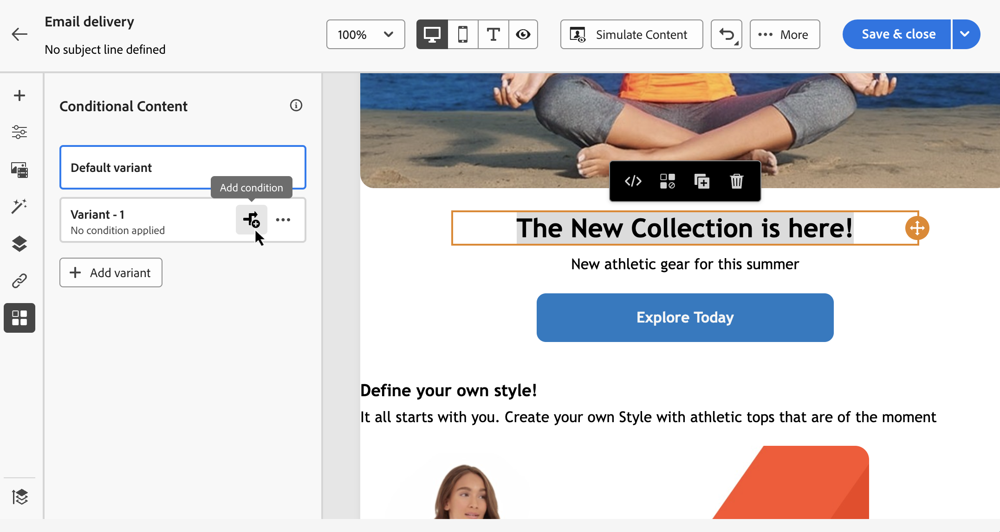

# Criar conteúdo condicional{#add-conditions}

>[!CONTEXTUALHELP]
>id="acw_conditional_content"
>title="Adicionar conteúdo condicional"
>abstract="Configure campos de conteúdo condicional para criar personalizações dinâmicas avançadas com base nos dados do perfil do destinatário. Blocos de texto, links, linha de assunto e/ou imagens são substituídos no conteúdo da mensagem quando uma determinada condição é atendida."

## Introdução ao conteúdo condicional {#gs}

O conteúdo condicional é um recurso poderoso que permite criar personalização dinâmica com base nos dados de perfil do recipient, substituindo automaticamente blocos de texto e imagens quando determinadas condições são atendidas. Esse recurso pode elevar suas campanhas a novos patamares e fornecer experiências personalizadas e altamente direcionadas ao seu público-alvo.

Ao configurar campos de conteúdo condicional, você pode criar personalização dinâmica avançada com base no perfil do recipient, por exemplo. Blocos de texto, links, linha de assunto e/ou imagens são substituídos no conteúdo da mensagem quando uma determinada condição é atendida. Por exemplo, você pode exibir &quot;Sr.&quot; ou &quot;Sra.&quot; de acordo com o valor do campo Gênero no banco de dados do Adobe Campaign ou incluir um link diferente com base no idioma preferencial do recipient.

Para criar conteúdo condicional, você precisa criar condições no **editor de expressão** usando funções auxiliares específicas. Esse método está disponível para todos os canais de entrega, em qualquer campo em que você possa acessar o editor de expressão, como a linha de assunto ou links de email e componentes de conteúdo de texto/botão. [Saiba como acessar o editor de expressão](gs-personalization.md#access)

Além do editor de expressão, você pode aproveitar um **construtor de conteúdo condicional** dedicado ao criar um email que permite criar várias variantes para um elemento do seu corpo de email. [Saiba como criar conteúdo condicional em emails](#condition-condition-builder)

## Criar condições no editor de expressão {#condition-perso-editor}

Para definir o conteúdo condicional para um delivery usando o editor de expressão, siga as etapas abaixo. Neste exemplo, queremos criar conteúdo condicional com base no idioma dos recipients (francês ou inglês).

1. Abra um delivery e navegue até a seção de edição de conteúdo.

1. Localize o campo ao qual deseja adicionar conteúdo condicional. Por exemplo, você pode adicionar conteúdo condicional a uma mensagem SMS.

1. Clique no ícone **[!UICONTROL Abrir caixa de diálogo de personalização]** ao lado do campo para abrir o editor de expressão.

   {zoomable="yes"}

1. No editor de personalização, navegue até o menu **[!UICONTROL Condições]** à esquerda.

1. Para começar a criar sua condição, clique no ícone &quot;+&quot; ao lado da função **If**. A seguinte linha foi adicionada à tela central:`<% if (<FIELD>==<VALUE>) { %>Insert content here<% } %>`

   * Substitua `<FIELD>` por um campo de personalização, como o idioma do destinatário: `recipient.language`.
   * Substitua `<VALUE>` pelo valor a ser satisfeito. Por exemplo, `'French'`.
   * Substitua `Ìnsert content here` pelo conteúdo que você deseja exibir para os perfis que atendem à condição especificada.

     {zoomable="yes"}{width="800" align="center"}

1. Especifique o conteúdo que deve ser exibido se os recipients não atenderem à condição. Para fazer isso, use uma função auxiliar **else**:

   1. Coloque o cursor antes da marca de fechamento de expressão `%>` e clique no `+` ao lado da função **Else**.

   1. Substitua `Ìnsert content here` pelo conteúdo que você deseja exibir para os perfis que não atendem à condição da função if.

   {zoomable="yes"}{width="800" align="center"}

   Você também pode usar a função auxiliar **else if** para criar condições com várias variantes de conteúdo. Por exemplo, a expressão abaixo exibe três variantes de uma mensagem dependendo do idioma dos recipients:

   {zoomable="yes"}{width="800" align="center"}

   >[!NOTE]
   >
   >Cada vez que uma função auxiliar é adicionada, as marcas de abertura (`<%`) e fechamento (`%>`) são adicionadas automaticamente antes e depois da função.
   >
   >Exemplo após adicionar uma função auxiliar &quot;Else&quot; dentro de uma expressão: >
   >
   >`<% if (<FIELD>==<VALUE>) { %>Insert content here<% } <% else { %> Insert content here<% } %>%>`
   >
   >Remova essas tags para evitar erros de sintaxe. Neste exemplo, a expressão corrigida após a remoção das marcas de função **else** é:
   >
   >`<% if (<FIELD>==<VALUE>) { %>Insert content here<% } else { %> Insert content here<% } %>`

1. Quando a condição estiver pronta, você poderá salvar o conteúdo e verificar a renderização simulando o conteúdo.

## Criar conteúdo condicional em emails {#condition-condition-builder}

O conteúdo condicional em emails pode ser criado de duas maneiras:
* No editor de expressão, criando uma condição com funções auxiliares,
* Em um construtor de conteúdo condicional dedicado que pode ser acessado ao criar um email.

A seção a seguir fornece instruções passo a passo sobre como criar condições usando o recurso de conteúdo condicional do Designer de email. Informações detalhadas sobre como criar condições usando o editor de expressão estão disponíveis [aqui](#condition-perso-editor).

Neste exemplo, queremos criar uma mensagem de email com várias variantes com base no idioma dos recipients. Siga estas etapas:

1. Crie ou abra um delivery de email, edite seu conteúdo e clique no botão **[!UICONTROL Editar corpo do email]** para abrir o espaço de trabalho de design de email.

1. Selecione um componente de conteúdo e clique no ícone **[!UICONTROL Habilitar conteúdo condicional]**.

   {zoomable="yes"}{width="800" align="center"}

1. O painel **[!UICONTROL Conteúdo Condicional]** é aberto no lado esquerdo da tela. Nesse painel, você pode criar várias variantes do componente de conteúdo selecionado usando condições.

1. Configure sua primeira variante. Passe o mouse sobre a **[!UICONTROL Variante - 1]** no painel **[!UICONTROL Conteúdo Condicional]** e clique no botão **[!UICONTROL Adicionar condição]**.

   {zoomable="yes"}{width="800" align="center"}

1. O modelador de consultas é aberto. Ela permite criar uma condição filtrando os dados de perfil do recipient. [Saiba como trabalhar com o modelador de consultas](../query/query-modeler-overview.md).

   Quando a condição da primeira variante da mensagem estiver pronta, clique em **[!UICONTROL Confirmar]**. Neste exemplo, estamos criando uma regra direcionada a recipients cujo idioma é &quot;francês&quot;.

   {zoomable="yes"}{width="800" align="center"}

1. A regra agora está associada à variante. Para melhorar a compreensão, recomendamos renomear a variante clicando no menu de reticências.

1. Configure como o componente deve ser exibido se a regra for atendida ao enviar a mensagem. Neste exemplo, queremos exibir o texto em francês se for o idioma preferencial do recipient.

   {zoomable="yes"}{width="800" align="center"}

1. Adicione quantas variantes forem necessárias para o componente de conteúdo. Você pode alternar entre as variantes a qualquer momento para verificar como o componente de conteúdo será exibido com base em suas regras condicionais.

   >[!NOTE]
   >Se nenhuma das regras definidas nas variantes for atendida ao enviar a mensagem, o componente de conteúdo exibirá o conteúdo definido na **[!UICONTROL Variante padrão]** do painel **[!UICONTROL Conteúdo condicional]**.

## Usar variáveis para conteúdo condicional {#variables-conditional}

As variáveis podem ser usadas para conteúdo condicional no seu delivery.

Saiba mais sobre [adição de variáveis a uma entrega](../advanced-settings/delivery-settings.md#variables-delivery).

Escolha o elemento no qual deseja colocar um conteúdo condicional.

{zoomable="yes"}

Para usar sua variável, configure a condição usando o botão **[!UICONTROL Editar expressão]**, conforme mostrado abaixo.
Neste exemplo, esta imagem é exibida quando o valor da variável é `launch`.

{zoomable="yes"}

Você também pode criar outra variante com o valor `reminder`, por exemplo, onde uma imagem diferente é exibida.
