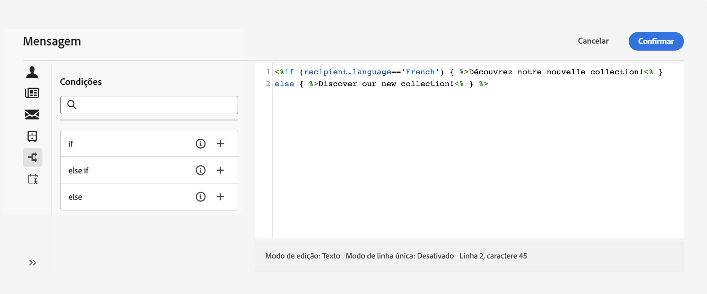
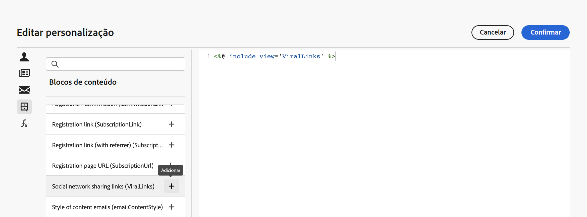

# Introdução a conteúdo dinâmico {#gs-dynamic-content}

>[!CONTEXTUALHELP]
>id="acw_targetdata_personalization_dashboard"
>title="Personalização"
>abstract="O editor de expressão permite selecionar, organizar, personalizar e validar todos os dados para criar uma experiência personalizada para o seu conteúdo. É possível personalizar suas mensagens para cada destinatário aproveitando os dados do perfil e criar conteúdo condicional para adaptar sua mensagem a cada um deles, mostrando apenas conteúdo que lhes seja relevante. Além disso, os blocos de personalização estão disponíveis para adicionar conteúdo personalizado predefinido em suas entregas."

Como profissional de marketing, é fundamental direcionar o público-alvo que está genuinamente interessado em suas ofertas e engajá-lo com fornecimento de conteúdo eficaz e relevante. Dada a variedade diversificada de destinatários que você encontra, criar vários conteúdos de marketing para atrair pessoas diferentes, pode ser demorado e dispendioso. É aqui que o conteúdo dinâmico entra em cena.

Os recursos de conteúdo dinâmico da Web do Adobe Campaign permitem personalizar o conteúdo com base nas informações coletadas sobre os recipients. Ao utilizar o conteúdo dinâmico, você garante que seus esforços de marketing sejam mais relevantes, evitando o anúncio de produtos ou serviços indesejados ou desnecessários. Essa abordagem torna o conteúdo mais atraente e aumenta a probabilidade de ele ser lido. Além disso, permite personalizar o conteúdo, fazendo com que os destinatários sintam que estão recebendo informações de uma pessoa em vez de uma máquina.

## Como tornar seu conteúdo dinâmico? {#make-content-dyn}

Você pode tornar o conteúdo da mensagem dinâmico inserindo construções JavaScript no editor de expressão do Campaign Web. No envio da mensagem, essas expressões são interpretadas pelo Adobe Campaign para entregar o conteúdo correto a cada um dos destinatários:

* **Personalizar suas mensagens** para cada destinatário específico aproveitando dados de perfil, como nome, interesses, onde vive, o que comprou e muito mais. É possível selecionar qualquer campo disponível no banco de dados do editor de personalização relacionado ao destinatário, à mensagem ou à entrega. Esses atributos de personalização podem ser inseridos na linha de assunto ou no corpo das mensagens. A sintaxe a seguir insere a cidade do destinatário no conteúdo: &lt;%= recipient.location.city %>.

  {width="800" align="center"}

* **Criar conteúdo condicional** para adaptar suas entregas a cada destinatário e mostrar apenas conteúdo relevante para um determinado cliente, com base nas informações que você tem sobre ele. Isso permite exibir imagens e/ou blocos de texto específicos com base em condições. Por exemplo, adapte um banner de email com base na assinatura do destinatário de um serviço específico.

  {width="800" align="center"}

* **Usar blocos de personalização** para economizar tempo e aproveitar o conteúdo personalizado facilmente reutilizável em suas mensagens. O Campaign vem com um conjunto de blocos de personalização contendo uma renderização específica que você pode inserir nas entregas. Por exemplo, é possível adicionar um logotipo, uma saudação ou um link para a mirror page de uma mensagem de email. Os blocos de conteúdo estão disponíveis em uma entrada dedicada no editor de personalização.

  {width="800" align="center"}

## Acesso ao editor de expressão {#access}

O Adobe Campaign Web fornece um editor de expressão, onde você pode selecionar, organizar, personalizar e validar todos os dados para criar uma experiência personalizada para o seu conteúdo. O editor de expressão está disponível para todos os canais, em todos os campos com o ícone de **[!UICONTROL Abrir caixa de diálogo de personalização]**, como o campo da linha de assunto ou links de email e componentes de conteúdo de texto/botão.

Estes são alguns exemplos de como acessar o editor de expressão, dependendo do conteúdo que deseja tornar dinâmico:

* *Acesso ao editor de expressão a partir do campo Nome do remetente*

  {width="800" align="center"}

* *Acesso ao editor de expressão a partir de um componente de texto de email*

  {width="800" align="center"}

* *Acesso ao editor de expressão a partir de um link em um email*

  {width="800" align="center"}

>[!NOTE]
>
>Além do editor de expressão, ao criar um email, você também pode aproveitar um construtor de conteúdo condicional dedicado. [Saiba como criar conteúdo condicional em emails](conditions.md)

## Vamos nos aprofundar um pouco mais {#dive-deeper}

Agora que você entende como tornar seu conteúdo dinâmico, é hora de se aprofundar nestas seções de documentação para começar a trabalhar com o recurso.

<table style="table-layout:fixed"><tr style="border: 0;">
<td>

<a href="personalize.md"><strong>Adicionar personalização</strong></a>

</td>
<td>

<a href="conditions.md"><strong>Adicionar conteúdo condicional</strong>

</td>
<td>

<a href="content-blocks.md"><strong>Adicionar blocos de conteúdo integrados</strong></a>

</td>
</tr></table>
