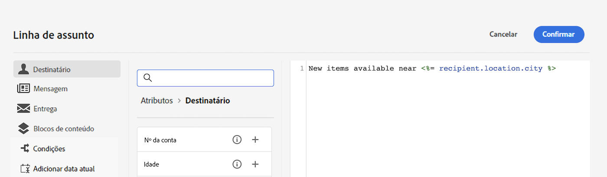
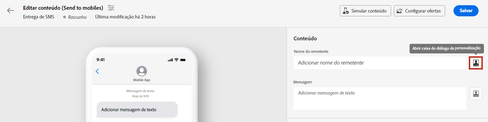
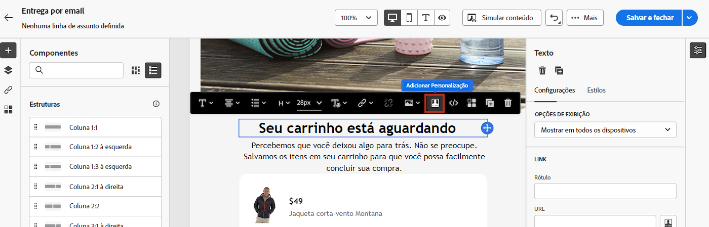
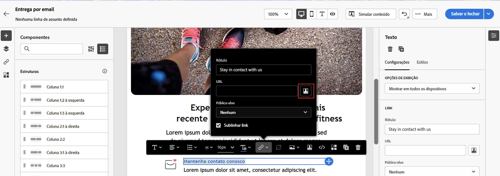

# Introdução ao conteúdo dinâmico

Para aproveitar ao máximo cada campanha de marketing, o Adobe Campaign oferece uma maneira de fornecer conteúdo dinâmico personalizado que fala com os clientes em seu nível. Com base nos dados do perfil, use os recursos de personalização para criar uma experiência personalizada para diferentes grupos e indivíduos: você pode adaptar suas mensagens a cada recipient específico, aproveitando os dados e as informações que tem sobre eles. Pode ser seu nome, interesses, onde vivem, o que compraram e muito mais.

Use o Campaign para criar conteúdo dinâmico e enviar mensagens personalizadas. Os recursos de personalização podem ser combinados para melhorar suas mensagens e criar uma experiência do usuário personalizada.

## Como tornar seu conteúdo dinâmico?

É possível tornar o conteúdo da mensagem dinâmico inserindo:

* **Campos de personalização**: os campos de personalização são usados para a personalização de primeiro nível de suas mensagens. Você pode selecionar qualquer campo disponível no banco de dados no editor de personalização. Para uma entrega, é possível selecionar qualquer campo relacionado ao recipient, à mensagem ou à entrega. Esses atributos de personalização podem ser inseridos na linha de assunto ou no corpo das mensagens. A sintaxe a seguir insere a cidade do recipient no conteúdo: &lt;%= recipient.location.city %>.

  {width="800" align="center"}

* **Conteúdo condicional**: configure o conteúdo condicional para adicionar conteúdo com base no perfil do recipient, por exemplo. Blocos de texto e/ou imagens são inseridos quando uma determinada condição for satisfeita. Você pode definir a versão alternativa do conteúdo quando a condição não for verdadeira.

* **Blocos de conteúdo incorporados**: o Campaign vem com um conjunto de blocos de personalização que contêm uma renderização específica que pode ser inserida em seus deliveries. Por exemplo, você pode adicionar um logotipo, uma mensagem de saudação ou um link para a mirror page de uma mensagem de email. Os blocos de conteúdo estão disponíveis em uma entrada dedicada no editor de personalização.

  {width="800" align="center"}

## Acessar o editor de expressão {#access}

O Adobe Campaign V8 Web fornece um editor de expressão onde você pode selecionar, organizar, personalizar e validar todos os dados para criar uma experiência personalizada para o seu conteúdo. O editor de expressão está disponível para todos os canais, em todos os campos com o **[!UICONTROL Abrir caixa de diálogo de personalização]** ícone, como o campo da linha de assunto ou links de email e componentes de conteúdo de texto/botão.

Estes são alguns exemplos de como acessar o editor de expressão dependendo do conteúdo que você deseja tornar dinâmico:

* *Acessando o editor de expressão no campo Nome do remetente*

  {width="800" align="center"}

* *Acesso ao editor de expressão por meio de um componente de texto de email*

  {width="800" align="center"}

* *Acesso ao editor de expressão por meio de um link em um email*

  {width="800" align="center"}

>[!NOTE]
>
>Além do editor de expressão, você também pode aproveitar um construtor de conteúdo condicional dedicado ao criar um email. [Saiba como criar conteúdo condicional em emails](conditions.md)

## Vamos nos aprofundar um pouco mais

Agora que você entende como tornar seu conteúdo dinâmico, é hora de se aprofundar nessas seções de documentação para começar a trabalhar com o recurso.

<table style="table-layout:fixed"><tr style="border: 0;">
<td>

<a href="personalize.md"><strong>Adicionar personalização</strong></a>

</td>
<td>

<a href="conditions.md"><strong>Adicionar conteúdo condicional</strong>

</td>
<td>

<a href="content-blocks.md"><strong>Adicionar blocos de conteúdo incorporados</strong></a>

</td>
</tr></table>
