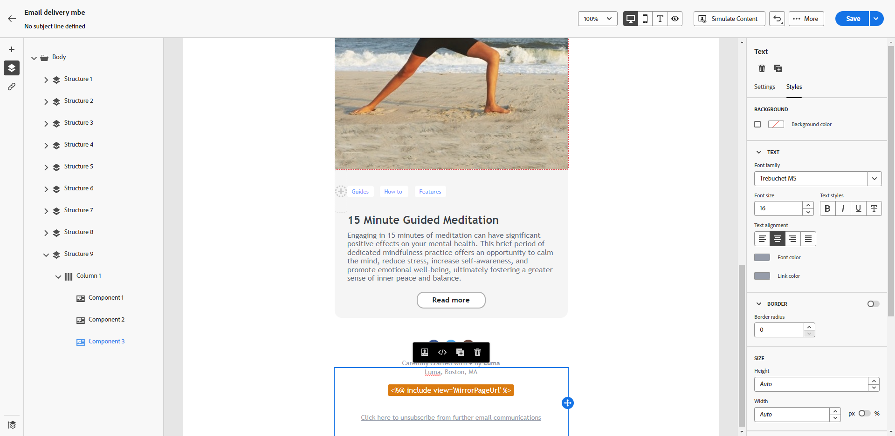
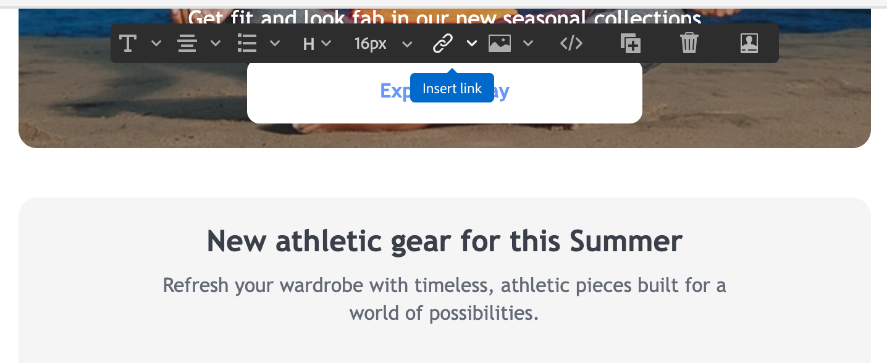

# Personalize seu conteúdo{#add-personalization}

Para aproveitar ao máximo cada campanha de marketing, o Adobe Campaign oferece uma maneira de fornecer conteúdo personalizado que fala com os clientes em seu nível. Com base nos dados do perfil, use os recursos de personalização para criar uma experiência personalizada para diferentes grupos e indivíduos: você pode adaptar suas mensagens a cada recipient específico, aproveitando os dados e as informações que tem sobre eles. Pode ser seu nome, interesses, onde vivem, o que compraram e muito mais.

Use o Campaign para criar conteúdo dinâmico e enviar mensagens personalizadas. Os recursos de personalização podem ser combinados para melhorar suas mensagens e criar uma experiência do usuário personalizada.

Você pode personalizar o conteúdo da mensagem ao:

* Inserir **campos de personalização** dinâmicos

   Os campos de personalização são usados na personalização de primeiro nível das mensagens. Você pode selecionar qualquer campo disponível no banco de dados no editor de personalização. Para uma entrega, é possível selecionar qualquer campo relacionado ao recipient, à mensagem ou à entrega. Esses atributos de personalização podem ser inseridos na linha de assunto ou no corpo de suas mensagens.

   

   A sintaxe a seguir insere a cidade do recipient no conteúdo: &lt;%= recipient.location.city %>.

* Inserção de **blocos de conteúdo** predefinidos

   O Campaign vem com um conjunto de blocos de personalização contendo uma renderização específica que você pode inserir nas entregas. Por exemplo, você pode adicionar um logotipo, uma mensagem de saudação ou um link para a mirror page de uma mensagem de email. Os blocos de conteúdo estão disponíveis em uma entrada dedicada no editor de personalização.

   

* Criar **conteúdo condicional**

   Configure o conteúdo condicional para adicionar personalização dinâmica com base no perfil do recipient, por exemplo. Blocos de texto e/ou imagens são inseridos quando uma determinada condição é verdadeira. Você pode definir a versão alternativa do conteúdo quando a condição não for verdadeira.

## Personalizar a linha de assunto de uma mensagem {#personalize-subject-line}

Para adicionar personalização ao campo **[!UICONTROL Linha de assunto]** da mensagem, siga as etapas abaixo:

1. Abra um delivery e clique em **[!UICONTROL Editar conteúdo]**.
1. Clique em **[!UICONTROL Abrir caixa de diálogo de personalização]** ícone à direita do **[!UICONTROL Linha de assunto]** para emails ou o campo **[!UICONTROL Título]** campos para deliveries por push/SMS.

   {width="600"}

1. Insira a linha de assunto ou o título e selecione os atributos de personalização a serem adicionados.

1. Clique em **[!UICONTROL Confirmar]** para validar. Os atributos de personalização são adicionados ao conteúdo.

## Personalizar seu conteúdo de email {#personalize-emails}

Para personalizar o conteúdo do email, abra a mensagem no Designer de email e:

1. Clique dentro de um bloco de texto.
1. Na barra de ferramentas contextual, selecione **[!UICONTROL Adicionar personalização]**.

   

1. Insira o nome do recipient no editor de personalização e confirme.

   

   O atributo de personalização é adicionado ao conteúdo do email.

   Você pode simular o conteúdo para verificar a renderização. [Saiba mais](../preview-test/preview-content.md)

   

1. Para adicionar um bloco de conteúdo ao seu email, aplique as mesmas etapas e selecione um bloco de conteúdo do último ícone:

   

1. Depois de inserido, o bloco de conteúdo é adicionado ao conteúdo do email. Ele é adaptado automaticamente ao perfil do recipient quando a personalização é gerada, na etapa de preparação do delivery.

   

## Personalizar links em seus emails {#personalize-links}

Para personalizar um **link**:

1. Selecione um bloco de texto ou uma imagem.
1. Na barra de ferramentas contextual, selecione **Inserir link**.

   

1. Insira o rótulo do link e use o botão **Inserir link** para personalizar o link.

   

1. Use o editor de personalização para definir e personalizar o link e confirme.

   

## Personalize suas ofertas {#personalize-offers}

Também é possível acessar o editor de personalização ao adicionar conteúdo do tipo texto às representações das ofertas. Saiba mais [nesta seção](../content/offers.md).

## Blocos de conteúdo incorporados {#ootb-content-blocks}

Os blocos de conteúdo incorporados são:

* **[!UICONTROL Habilitado pelo Adobe Campaign]**: insere o logotipo &quot;Habilitado pelo Adobe Campaign&quot;.
* **[!UICONTROL Formatting function for proper nouns]**: gera a função JavaScript **[!UICONTROL toSmartCase]**, que coloca a primeira letra de cada palavra em maiúscula.
* **[!UICONTROL Saudações]**: insere saudações com o nome completo do recipient, seguido de vírgula. Exemplo: “Olá, fulano,”.
* **[!UICONTROL Inserir logotipo]**: insere um logotipo, que é definido nas configurações de instância.
* **[!UICONTROL Link para mirror page]**: insere um link para a [mirror page](../content/mirror-page.md). O formato padrão é: &quot;Caso não consiga visualizar esta mensagem corretamente, clique aqui.&quot;
* **[!UICONTROL URL de mirror page]**: insere o URL da mirror page, permitindo que os criadores da entrega verifiquem o link.
* **[!UICONTROL Oferecer URL de aceitação no modo unitário]**: insere um URL que permite definir uma oferta como **[!UICONTROL Aceita]**. (Este bloco estará disponível se o módulo Interação estiver habilitado)
* **[!UICONTROL Registration confirmation]**: insere um link que permite confirmar a assinatura.
* **[!UICONTROL Registration link]**: insere um link de assinatura. Esse link é definido nas configurações da instância. O conteúdo padrão é: &quot;Para se registrar, clique aqui&quot;.
* **[!UICONTROL Registration link (with referrer)]**: insere um link de assinatura, permitindo identificar o visitante e a entrega. Esse link é definido nas configurações da instância.
* **[!UICONTROL URL da página de registro]**: insere um URL para assinatura
* **[!UICONTROL Estilo de emails de conteúdo]** e **[!UICONTROL Estilo de notificação]**: geram um código que formata um email com estilos HTML predefinidos.
* **[!UICONTROL Link para cancelar assinatura]**: insere um link que permite cancelar a inscrição de todas as entregas (lista de bloqueios). O conteúdo padrão associado é: &quot;Você está recebendo esta mensagem porque esteve em contato com ***nome da organização*** ou um afiliado. Para não receber mais mensagens de ***nome da organização*** clique aqui.&quot;
