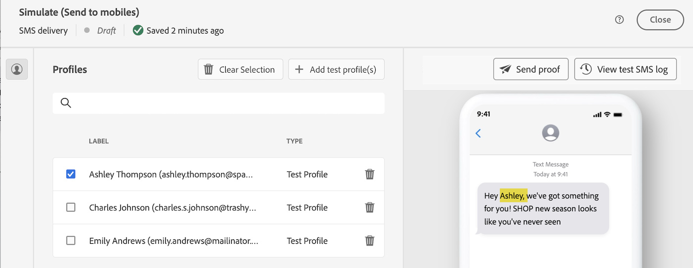

# Personalize seu conteúdo {#add-personalization}

A personalização pode ser adicionada a qualquer delivery usando o editor de expressão, que é acessível em todos os campos com o **[!UICONTROL Abrir caixa de diálogo de personalização]** ícone, como o campo da linha de assunto ou links de email e componentes de conteúdo de texto/botão. [Saiba onde adicionar conteúdo dinâmico](gs-personalization.md/#access)

## Sintaxe de personalização {#syntax}

Uma tag de personalização sempre usa a seguinte sintaxe: `<%=table.field%>`. Por exemplo, para inserir o nome do recipient, armazenado na tabela de recipients, a tag de personalização usa a sintaxe &lt;%= recipient.lastName %>.

Quando um delivery é preparado, essas tags são interpretadas automaticamente pelo Adobe Campaign e substituídas pelo valor do campo para um determinado recipient. A substituição física pode ser exibida ao simular o conteúdo.

## Adicionar tags de personalização {#add}

Para adicionar tags de personalização em um delivery, abra o editor de expressão usando o **[!UICONTROL Abrir caixa de diálogo de personalização]** ícone acessível a partir de campos de edição de tipo de texto, como a linha de assunto ou o corpo do SMS. [Saiba onde adicionar conteúdo dinâmico](gs-personalization.md/#access)

O editor de expressão é exibido. Os campos de personalização são organizados em três menus, localizados à esquerda da tela. Esses menus dão acesso a todos os campos disponíveis no banco de dados do Adobe Campaign.

| Menu | Descrição |
|-----|------------|
|  | A variável **[!UICONTROL Aplicativo de assinantes]** lista todos os campos relacionados aos assinantes de um aplicativo, como o terminal ou o sistema operacional usado. *Esse menu está disponível somente para notificações por push* |
|  | A variável **[!UICONTROL Recipient]** lista todos os campos definidos na tabela de recipients, como nome, idade ou endereço dos recipients. |
|  | A variável **[!UICONTROL Mensagem]** lista todos os campos relacionados aos logs do delivery, ou seja, todas as mensagens enviadas aos recipients ou dispositivos em todos os canais, como a data do último evento com um determinado recipient |
|  | A variável **[!UICONTROL Entrega]** O menu lista todos os campos relacionados aos parâmetros necessários para executar deliveries, como canal de delivery, rótulo, etc. |

>[!NOTE]
>
>Por padrão, cada menu mostra todos os campos dentro da tabela selecionada (Recipients, / Message / Delivery). Se quiser incluir campos de tabelas vinculadas à tabela selecionada, ative a opção **[!UICONTROL Exibir atributos avançados]** opção localizada abaixo da lista.

Para adicionar um campo de personalização, coloque o cursor no local desejado no conteúdo e clique no botão + para inseri-lo.

Quando o conteúdo estiver pronto, você poderá salvá-lo e testar a renderização da personalização simulando o conteúdo. No exemplo abaixo, estamos personalizando uma mensagem SMS com os nomes dos perfis direcionados.

*Adicionar a tag de personalização ao conteúdo da mensagem*

*Simular a renderização da personalização para um determinado perfil de teste*

