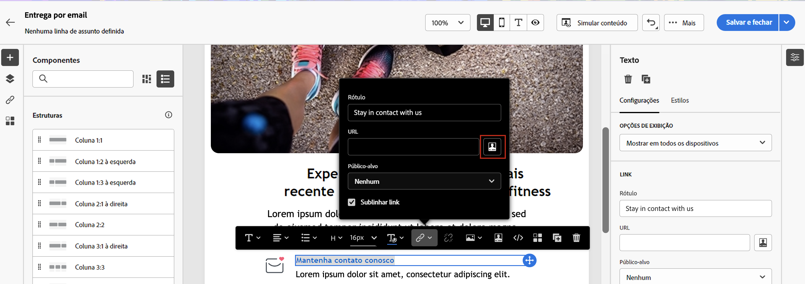

# Personalize seu conteúdo{#add-personalization}

## Personalizar a linha de assunto de uma mensagem {#personalize-subject-line}

Para adicionar personalização ao campo **[!UICONTROL Linha de assunto]** da mensagem, siga as etapas abaixo:

1. Abra um delivery e clique em **[!UICONTROL Editar conteúdo]**.
1. Clique em **[!UICONTROL Abrir caixa de diálogo de personalização]** ícone à direita do **[!UICONTROL Linha de assunto]** para emails ou o campo **[!UICONTROL Título]** campos para deliveries por push/SMS.

   {width="600"}

1. Insira a linha de assunto ou o título e selecione os atributos de personalização a serem adicionados.

1. Clique em **[!UICONTROL Confirmar]** para validar. Os atributos de personalização são adicionados ao conteúdo.

## Personalizar seu conteúdo de email {#personalize-emails}

Para personalizar o conteúdo do email, abra a mensagem no Designer de email e:

1. Clique dentro de um bloco de texto.
1. Na barra de ferramentas contextual, selecione **[!UICONTROL Adicionar personalização]**.

   

1. Insira o nome do recipient no editor de personalização e confirme.

   

   O atributo de personalização é adicionado ao conteúdo do email.

   Você pode simular o conteúdo para verificar a renderização. [Saiba mais](../preview-test/preview-content.md)

   

1. Para adicionar um bloco de conteúdo ao seu email, aplique as mesmas etapas e selecione um bloco de conteúdo do último ícone:

   

1. Depois de inserido, o bloco de conteúdo é adicionado ao conteúdo do email. Ele é adaptado automaticamente ao perfil do destinatário quando a personalização é gerada na etapa de preparação da entrega.

   

## Personalizar links em seus emails {#personalize-links}

Para personalizar um **link**:

1. Selecione um bloco de texto ou uma imagem.
1. Na barra de ferramentas contextual, selecione **Inserir link**.

   

1. Insira o rótulo do link e use o botão **Inserir link** para personalizar o link.

   

1. Use o editor de personalização para definir e personalizar o link e confirme.

   

## Personalize suas ofertas {#personalize-offers}

Também é possível acessar o editor de personalização ao adicionar conteúdo do tipo texto às representações das ofertas. Saiba mais [nesta seção](../content/offers.md).

