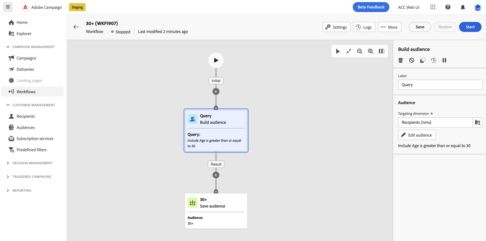

# Trabalhar com filtros predefinidos {#predefined-filters}

>[!CONTEXTUALHELP]
>id="acw_homepage_card3"
>title="Gerenciamento de filtro predefinido"
>abstract="O Campaign Web agora oferece uma interface simples para gerenciar e personalizar facilmente filtros predefinidos para atender às suas necessidades específicas. Crie uma vez e salve para uso futuro."

>[!CONTEXTUALHELP]
>id="acw_predefined-filters-dashboard"
>title="Filtros predefinidos"
>abstract="O Campaign Web agora oferece uma interface simples para gerenciar e personalizar facilmente filtros predefinidos para atender às suas necessidades específicas. Crie uma vez e salve para uso futuro."

Filtros predefinidos são filtros personalizados que são criados e salvos para estarem disponíveis para uso futuro. Eles podem ser usados como atalhos durante qualquer operação de filtragem com o construtor de regras, por exemplo, ao filtrar uma lista de dados ou criar o público-alvo de um delivery.

Você pode usar filtros incorporados existentes para acessar um subconjunto específico de seus dados ou criar seus próprios filtros predefinidos e salvá-los.

## Criar um filtro predefinido {#create-predefined-filter}

>[!CONTEXTUALHELP]
>id="acw_predefined-filters-creation"
>title="Criar um filtro predefinido"
>abstract="Insira um rótulo para o filtro predefinido e selecione a tabela à qual ele se aplica. Abra as opções adicionais para adicionar uma descrição e definir este filtro como favorito. Em seguida, use o botão &quot;Criar regra&quot; para definir as condições de filtragem."

>[!CONTEXTUALHELP]
>id="acw_predefined-filters-rules"
>title="Criar as regras de filtro predefinidas"
>abstract="Para definir as condições de filtragem do filtro personalizado, clique no botão &quot;Criar regra&quot;."

### Criar um filtro no construtor de regras {#create-from-rule-builder}

É possível salvar um filtro personalizado no construtor de regras para disponibilizá-lo para uso futuro. Siga estas etapas:

1. Abra o construtor de regras e defina as condições de filtragem. No exemplo abaixo, você filtra os recipients que vivem em Madri.
1. Clique em **Selecionar ou salvar filtro** e selecione **Salvar como filtro**.

   

1. Selecionar **Criar um novo filtro** e insira um nome e uma descrição para esse filtro.

   

   Você pode salvar o filtro como um favorito, se necessário. Saiba mais [nesta seção](#fav-filter).

1. Clique em **Confirmar o** para salvar as alterações.

Seu filtro personalizado agora está disponível no **Filtros predefinidos** e acessível a todos os usuários do Campaign.

### Criar um filtro na lista de filtros {#create-filter-from-list}

Você pode criar um filtro nas **Filtros predefinidos** no menu esquerdo. Para fazer isso, siga as etapas abaixo:

1. Navegue pelo **Filtros predefinidos** no menu esquerdo.
1. Clique em **Criar filtro** botão.
1. Insira o nome do filtro e, no campo **Tipo de documento** selecione o schema ao qual se aplica. O esquema padrão é `Recipients(nms)`.

   Você pode salvar o filtro como um favorito, se necessário. Saiba mais [nesta seção](#fav-filter).

1. Defina a regra para o filtro. Por exemplo, perfis com mais de 30 anos.

   

1. Salve as alterações. O filtro é adicionado à lista de filtros predefinidos.

## Salvar seu filtro como favorito {#fav-filter}

Ao criar um filtro predefinido, você pode ativar a variável **Salvar como favorito** se quiser ver esse filtro predefinido nos favoritos.

Quando um filtro é salvo como favorito, ele fica disponível para todos os usuários na **Filtros favoritos** da lista de criação de filtros, conforme mostrado abaixo:

## Usar um filtro predefinido {#use-predefined-filter}

Filtros predefinidos estão disponíveis ao definir propriedades de regra. Para acessar filtros predefinidos, escolha a **Selecionar filtro personalizado** opção na lista suspensa do construtor de regras.

Em seguida, você pode acessar a lista completa de filtros predefinidos disponíveis para o contexto atual.

Também é possível usar os atalhos de filtro disponíveis no **Filtros favoritos** seção do menu suspenso. Saiba mais sobre favoritos em [nesta seção](#fav-filter).

Por exemplo, para criar um público-alvo a partir de um filtro predefinido, siga estas etapas:

1. Navegue pelo **Públicos-alvo** no menu esquerdo.
1. Clique em **Criar público-alvo** botão.
1. Insira o nome do público-alvo e clique no ícone **Criar público-alvo** botão.
1. Selecione o **Query** atividade e, no painel direito, clique em **Criar público** botão.

   

1. No **Botão Selecionar ou salvar filtro**, escolha o **Selecionar filtro personalizado** opção.

   

1. Navegue até o filtro predefinido que será usado para criar o público-alvo, selecione-o e confirme.

   

1. Verifique as propriedades da regra desse filtro e confirme.

   

   Agora o filtro é usado como uma consulta no **Query** atividade.

   

1. Salve as alterações e clique no link **Início** botão para criar o público-alvo e disponibilizá-lo na lista de públicos-alvo.

## Gerenciar filtros predefinidos {#manage-predefined-filter}

Filtros predefinidos são todos agrupados na entrada dedicada do menu de navegação esquerdo.

Nessa lista, é possível criar um novo filtro conforme detalhado acima e:

* editar um filtro existente e alterar suas regras e propriedades
* duplicar um filtro predefinido
* excluir um filtro predefinido

Você pode adicionar um filtro predefinido como um favorito para obter acesso rápido ao criar suas regras. Saiba mais [nesta seção](#fav-filter).

## Filtros predefinidos embutidos {#ootb-predefined-filter}

O Campaign vem com um conjunto de filtros predefinidos, criados no console do cliente. Esses filtros podem ser usados para definir públicos e regras. Eles não devem ser modificados.
