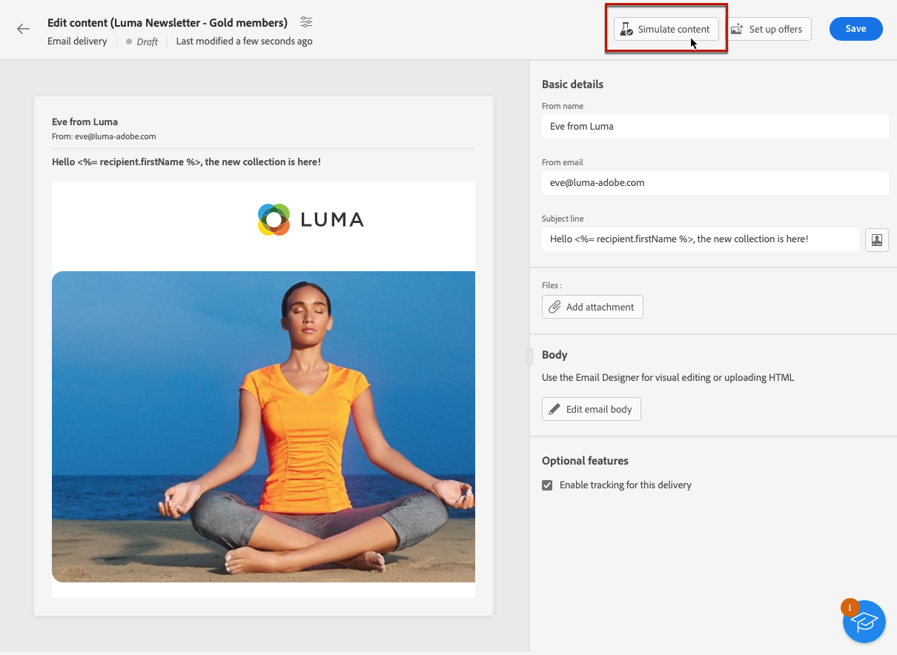

# Visualizar conteúdo do delivery {#preview-content}

Use o [!DNL Campaign] recurso de simulação de conteúdo para pré-visualizar o conteúdo da mensagem antes de enviá-la. Isso permite controlar a personalização e verificar como ela é exibida aos recipients.

Para pré-visualizar o conteúdo do delivery, siga as etapas abaixo.

1. Navegue até a tela de edição de conteúdo do seu delivery.

   <!--email [Edit content](../content/edit-content.md) screen or to the [Email Designer](../content/get-started-email-designer.md).-->

1. Clique em **[!UICONTROL Simular conteúdo]** botão.

   

1. Para selecionar os perfis que serão usados para visualizar seu conteúdo personalizado, use:

   * **[!UICONTROL Adicionar perfil(s) de teste]** para pré-visualização de mensagens de email e SMS

   * **[!UICONTROL Adicionar assinantes]** para visualizar deliveries por push

1. Você pode combinar perfis de teste e perfis para visualizar sua mensagem de email ou SMS.

   * A guia **[!UICONTROL Perfis de teste]** lista todos os seed addresses, que são recipients adicionais e fictícios no banco de dados.

     >[!NOTE]
     >
     >Perfis de teste podem ser criados no [!DNL Campaign] console no **[!UICONTROL Recursos]** > **[!UICONTROL Campaign Management]** > **[!UICONTROL Seed addresses]** pasta. Saiba mais em [Documentação do Campaign v8 (console)](https://experienceleague.adobe.com/docs/campaign/campaign-v8/audience/add-profiles/test-profiles.html){target="_blank"}

   * A guia **[!UICONTROL Perfis]** lista todos os recipients armazenados na pasta **[!UICONTROL Perfis e públicos alvo]** do console do [!DNL Campaign] [Saiba mais](https://experienceleague.adobe.com/docs/campaign/campaign-v8/audience/view-profiles.html){target="_blank"}

   

1. Clique em **[!UICONTROL Selecionar]** para confirmar a seleção.

   Uma pré-visualização do conteúdo do delivery é exibida no painel direito do **[!UICONTROL Simular]** tela. Os elementos personalizados são substituídos pelos dados do perfil selecionado no painel esquerdo.

   

1. Se você tiver adicionado vários perfis, é possível alternar entre eles na lista para visualizar o conteúdo do delivery correspondente. Você também pode adicionar mais perfis de teste e limpar a seleção usando os botões correspondentes no painel esquerdo.

1. Para deliveries de email, você pode ajustar a variável **[!UICONTROL Nível de zoom]** e visualize seu conteúdo no desktop ou dispositivo móvel usando o ícone dedicado no canto superior direito.

1. No **[!UICONTROL Simular]** também é possível:
   * Enviar deliveries de teste para recipients específicos para validação - [Saiba mais](proofs.md)
   * Acessar os logs dos deliveries de teste enviados - [Saiba mais](proofs.md#access-proofs)
   * Somente para email, verifique a renderização do conteúdo da mensagem em clientes de email populares - [Saiba mais](email-rendering.md)

