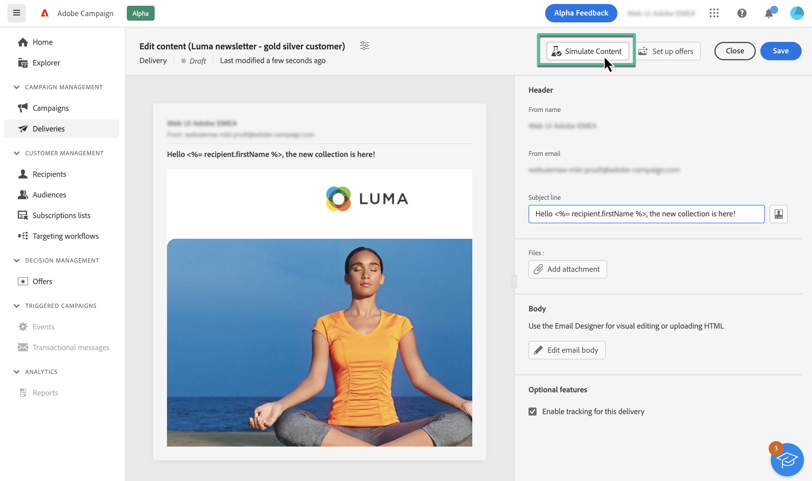
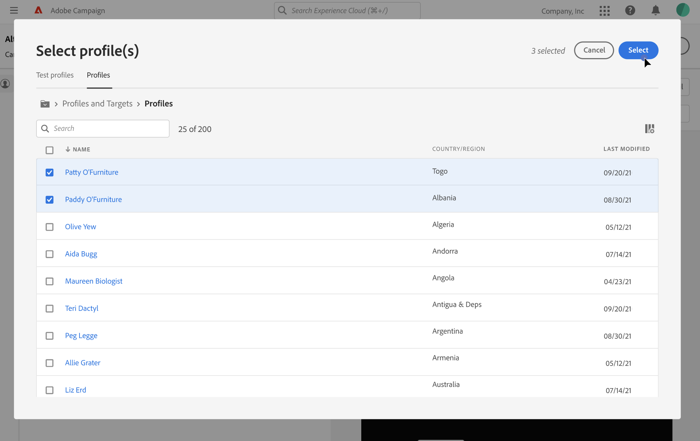

# Visualizar conteúdo de email {#preview}

>[!CONTEXTUALHELP]
>id="acw_homepage_card4"
>title="Visualização inteligente do seu conteúdo"
>abstract="O Adobe Campaign permite usar perfis para visualizar o conteúdo do email antes de enviá-lo, verificar a personalização e como os recipients o verão."

O Adobe Campaign permite visualizar o conteúdo do email antes de enviá-lo, verificar a personalização e como ele é exibido aos recipients.

Para visualizar o conteúdo do email, siga estas etapas:

1. Acesse a tela de criação de conteúdo de email e clique no botão **[!UICONTROL Simular conteúdo]** botão.

   

1. Selecione um ou vários perfis clicando no botão **[!UICONTROL Selecionar perfil(s)]** , em seguida, use o **[!UICONTROL Testar perfis]** e **[!UICONTROL Perfis]** guias para escolher:

   * O **Testar perfis** contém seed addresses, que são recipients adicionais e fictícios no banco de dados. Eles podem ser criados no console do Adobe Campaign na **[!UICONTROL Recursos]** / **[!UICONTROL Campaign Management]** / **[!UICONTROL Seed addresses]** pasta.
   * O **Perfis** lista todos os destinatários armazenados no **[!UICONTROL Perfis e metas]** no console Campaign.

   Você pode combinar perfis de teste e perfis para visualizar seu email.

   

1. Depois que os perfis forem selecionados, uma visualização do email será exibida no painel direito. Os elementos personalizados são substituídos pelos dados do perfil selecionado no painel esquerdo.

   Se você tiver adicionado vários perfis, é possível alternar entre eles na lista para visualizar o email correspondente.

   >[!NOTE]
   >
   >Você pode visualizar a renderização do seu conteúdo em diferentes dispositivos (desktop, dispositivos móveis, tablet), clicando no ícone dedicado no canto superior direito.

   

