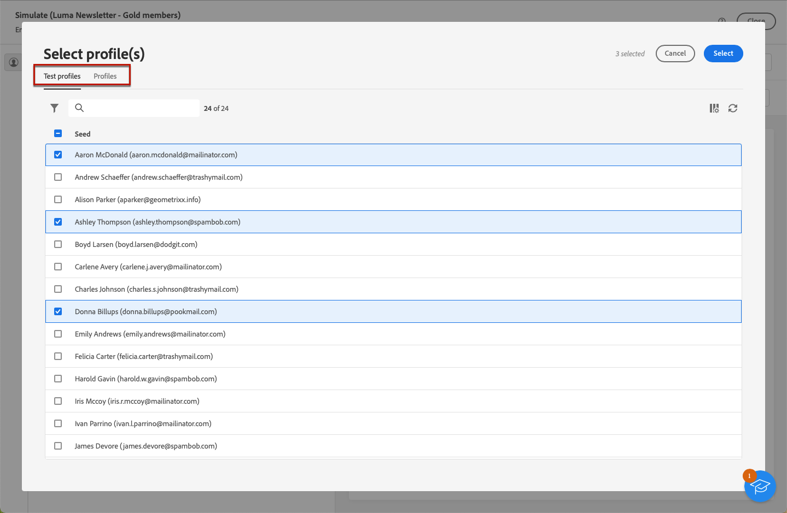

# Visualizar conteúdo de email {#preview-content}

Use o [!DNL Campaign] recurso de simulação de conteúdo para visualizar o conteúdo do seu email antes de enviá-lo. Isso permite controlar a personalização e verificar como ela é exibida aos recipients.

Para pré-visualizar o conteúdo do seu email, siga as etapas abaixo.

1. Navegue até o email [Editar conteúdo](../content/edit-content.md) ou para o [Email Designer](../content/get-started-email-designer.md).

1. Clique em **[!UICONTROL Simular conteúdo]** botão.

   

1. Use o **[!UICONTROL Adicionar perfil(s) de teste]** para selecionar os perfis que serão usados para visualizar seu conteúdo personalizado.

1. Você pode combinar perfis de teste e perfis tradicionais para visualizar o email.

   * A guia **[!UICONTROL Perfis de teste]** lista todos os seed addresses, que são recipients adicionais e fictícios no banco de dados.

      >[!NOTE]
      >
      >Perfis de teste podem ser criados no [!DNL Campaign] console no **[!UICONTROL Recursos]** > **[!UICONTROL Campaign Management]** > **[!UICONTROL Seed addresses]** pasta. [Saiba mais](https://experienceleague.adobe.com/docs/campaign-classic/using/sending-messages/using-seed-addresses/creating-seed-addresses.html){target="_blank"}

   * A guia **[!UICONTROL Perfis]** lista todos os recipients armazenados na pasta **[!UICONTROL Perfis e públicos alvo]** do console do [!DNL Campaign] [Saiba mais](https://experienceleague.adobe.com/docs/campaign/campaign-v8/audience/view-profiles.html){target="_blank"}

   

1. Clique em **[!UICONTROL Selecionar]** para confirmar a seleção em ambas as guias.

   Uma pré-visualização do email é exibida no painel direito do **[!UICONTROL Simular]** tela. Os elementos personalizados são substituídos pelos dados do perfil selecionado no painel esquerdo.

   

1. Se você tiver adicionado vários perfis, é possível alternar entre eles na lista para visualizar o conteúdo do email correspondente. Você também pode adicionar mais perfis de teste e limpar a seleção usando os botões correspondentes no painel esquerdo.

1. Você pode ajustar a variável **[!UICONTROL Nível de zoom]** e visualize seu conteúdo no desktop ou dispositivo móvel usando o ícone dedicado no canto superior direito.

1. No **[!UICONTROL Simular]** também é possível:
   * Verificar a renderização de email em clientes de email populares - [Saiba mais](email-rendering.md)
   * Enviar emails de teste para recipients específicos para validação - [Saiba mais](proofs.md)

