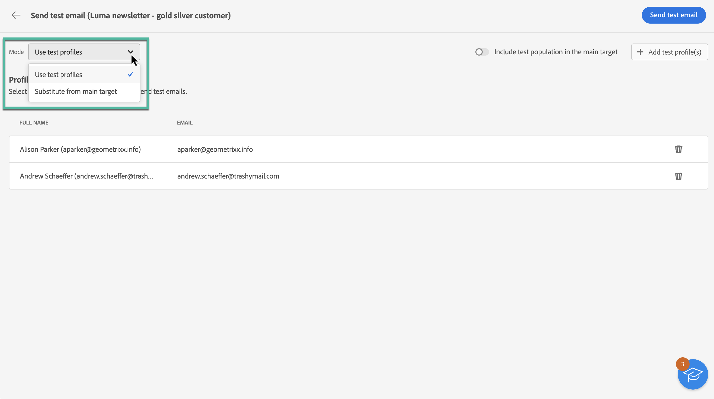

# Enviar emails de teste {#send-proofs}

O envio de emails de teste é uma etapa importante na validação da campanha de email e na identificação de possíveis problemas. Ao enviar emails de teste, você pode verificar vários elementos, como links, links para opção de não participação, imagens e mirror pages, bem como detectar quaisquer erros.

Os emails de teste podem ser enviados para dois tipos de recipients:

* **Testar perfis**: envie emails de teste para seed addresses, que são recipients adicionais e fictícios no banco de dados. Eles podem ser criados no console do Adobe Campaign na **[!UICONTROL Recursos]** / **[!UICONTROL Campaign Management]** / **[!UICONTROL Seed addresses]** pasta.

* **Substituição do target principal**: envie emails de teste para um endereço de email específico ao representar um perfil existente. Isso permite que você experimente o email como os recipients, fornecendo uma representação precisa da mensagem que o perfil receberá.

## Selecione os recipients do teste {#recipients}

1. Acesse a tela de simulação de conteúdo de email e clique no botão **[!UICONTROL Teste]** botão.

   

1. Use o **[!UICONTROL Modo]** lista suspensa para escolher o tipo de recipients que receberá o email de teste:

   * **Testar perfis**: enviar o email de teste para seed addresses, que são recipients adicionais e fictícios no banco de dados,

   * **Substituição do target principal**: envie o email de teste para um endereço de email específico ao representar um perfil existente. Isso permite que você experimente o email como os recipients, fornecendo uma representação precisa da mensagem que o perfil receberá.

   

   >[!NOTE]
   >
   >Por padrão, a variável **[!UICONTROL Testar perfis]** está selecionado. Se você já tiver selecionado perfis para visualizar o email na tela de simulação de conteúdo, esses perfis serão pré-selecionados como recipients de teste. Você pode limpar a seleção e/ou adicionar outros recipients.

1. Para enviar emails de teste para perfis de substituição, escolha **[!UICONTROL Substituição do target]** em seguida, siga estas etapas:

   1. Clique no botão **[!UICONTROL Adicionar endereço]** e especifique o endereço de email que receberá o email de teste.

      Você pode inserir qualquer endereço de email. Isso permite enviar emails de teste para qualquer usuário, mesmo que ele não seja usuário do Adobe Campaign V8.

   1. Selecione o perfil no público-alvo a ser usado para enviar o email de teste. Você também pode permitir que o Adobe Campaign selecione um perfil aleatório no target.

   1. Confirme o recipient e repita a operação para adicionar quantos endereços forem necessários.

      

1. Após selecionar os recipients do teste, você pode enviar o email de teste. [Saiba como enviar emails de teste](#send)

   >[!NOTE]
   >
   >Se desejar enviar a mensagem de email final para os recipients do email de teste, ative a opção **[!UICONTROL Incluir população de teste no target principal]** ativada.

## Envie o email de teste {#send}

Para enviar o email de teste para os recipients selecionados, clique em **[!UICONTROL Enviar email de teste]** em seguida, confirme o envio.

Envie quantos emails de teste forem necessários até concluir o conteúdo do seu delivery. Feito isso, você pode enviar o email para o público-alvo principal. [Saiba como preparar e enviar seu email](../monitor/prepare-send.md)

## Acessar emails de teste enviados {#access-proofs}

Depois que os emails de teste forem enviados, você poderá acessar logs dedicados do **[!UICONTROL Exibir log de email de teste]** botão.

Esses logs permitem acessar todos os emails de teste enviados para o delivery selecionado e visualizar estatísticas específicas relacionadas ao envio. [Saiba como monitorar logs do delivery](../monitor/delivery-logs.md)

Você também pode acessar emails de teste enviados da lista de deliveries, como qualquer delivery.

