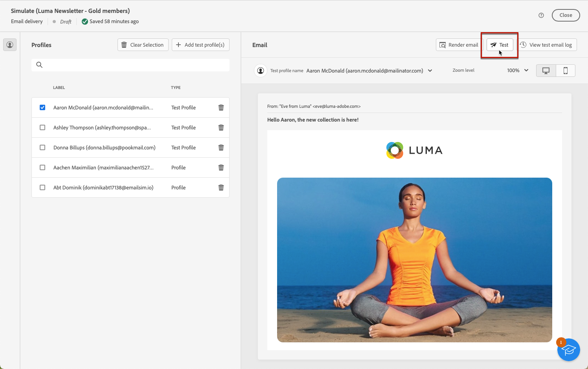

# Enviar emails de teste {#send-test-emails}

**[!UICONTROL Adobe Campaign]** permite testar uma mensagem antes de enviá-la para o público principal.

O envio de emails de teste é uma etapa importante na validação da campanha de email e na identificação de possíveis problemas.

Os recipients de um teste podem verificar vários elementos, como links, links para opção de não participação, imagens e mirror pages, bem como detectar erros na renderização, conteúdo, configurações de personalização e configuração de email.

## Selecione os recipients de teste {#test-recipients}

Os emails de teste podem ser enviados para dois tipos de recipients:

* **Perfis de teste** - enviar emails de teste para seed addresses, que são recipients adicionais e fictícios no banco de dados. Eles podem ser criados na variável [!DNL Campaign] console no **[!UICONTROL Recursos]** > **[!UICONTROL Campaign Management]** > **[!UICONTROL Seed addresses]** pasta. Saiba mais em [Documentação do Campaign v8 (console)](https://experienceleague.corp.adobe.com/docs/campaign/campaign-v8/audience/add-profiles/test-profiles.html){target="_blank"}

* **Substituir do público alvo principal** - enviar emails de teste para um endereço de email específico representando um perfil existente. Isso permite visualizar a experiência de email dos recipients, fornecendo uma representação precisa da mensagem que o perfil recebe.

Para selecionar os recipients do teste de email, siga as etapas abaixo.

1. Acessar o email [Editar conteúdo](../content/edit-content.md) ou para o [Email Designer](../content/get-started-email-designer.md)e, em seguida, clique na guia **[!UICONTROL Simular conteúdo]** botão.

1. Clique em **[!UICONTROL Teste]** botão.

   

1. Use a lista suspensa **[!UICONTROL Modo]** para escolher o tipo de recipients que receberão o email de teste:

   * **Perfis de teste** para direcionar destinatários fictícios

   * **Substituir do público alvo principal** para enviar um teste para um endereço de email específico ao exibir dados de um perfil existente.

   

   >[!NOTE]
   >
   >Por padrão, a variável **[!UICONTROL Usar perfis de teste]** está selecionado. Se já tiver selecionado perfis para visualizar o email na tela de simulação de conteúdo, esses perfis serão pré-selecionados como recipients de teste. Você pode limpar a seleção e/ou adicionar outros recipients.

1. Para enviar emails de teste para perfis de substituição, escolha o **[!UICONTROL Substituir do público alvo]** e siga estas etapas:

   1. Clique no botão **[!UICONTROL Adicionar endereço]** e especifique o endereço de email que receberá o email de teste.

      Você pode inserir qualquer endereço de email. Isso permite enviar emails de teste para qualquer usuário, mesmo que ele não utilize o [!DNL Adobe Campaign].

   1. Selecione o perfil do público alvo a ser usado como substituto. Você também pode permitir [!DNL Adobe Campaign] selecione um perfil aleatório no target. Os dados de perfil do perfil selecionado serão exibidos no email de teste.

   1. Confirme o recipient e repita a operação para adicionar quantos endereços forem necessários.

      

1. Depois que os recipients de teste forem selecionados, você poderá [enviar o email de teste](#send-test).

   >[!NOTE]
   >
   >Para enviar também a mensagem de email final aos recipients do email de teste, selecione o **[!UICONTROL Incluir população de teste no público alvo principal]** opção.

## Enviar o email de teste {#send-test}

Para enviar o email de teste para os recipients selecionados, siga as etapas abaixo.

1. Clique em **[!UICONTROL Enviar email de teste]**.

1. Confirme o envio.

   

1. Envie quantos emails de teste forem necessários até concluir o conteúdo da sua entrega.

Quando isso for concluído, você poderá [preparar e enviar seu email](../monitor/prepare-send.md) ao target principal.

## Acessar emails de teste enviados {#access-proofs}

Depois que os emails de teste forem enviados, você poderá acessar os logs dedicados por meio do botão **[!UICONTROL Exibir log de email de teste]**.

Esses logs permitem acessar todos os emails de teste enviados para a entrega selecionada e visualizar estatísticas específicas relacionadas ao envio. [Saiba como monitorar os logs de entrega](../monitor/delivery-logs.md)

Você também pode acessar os emails de teste enviados do [lista de entregas](../msg/gs-messages.md), como qualquer delivery.

