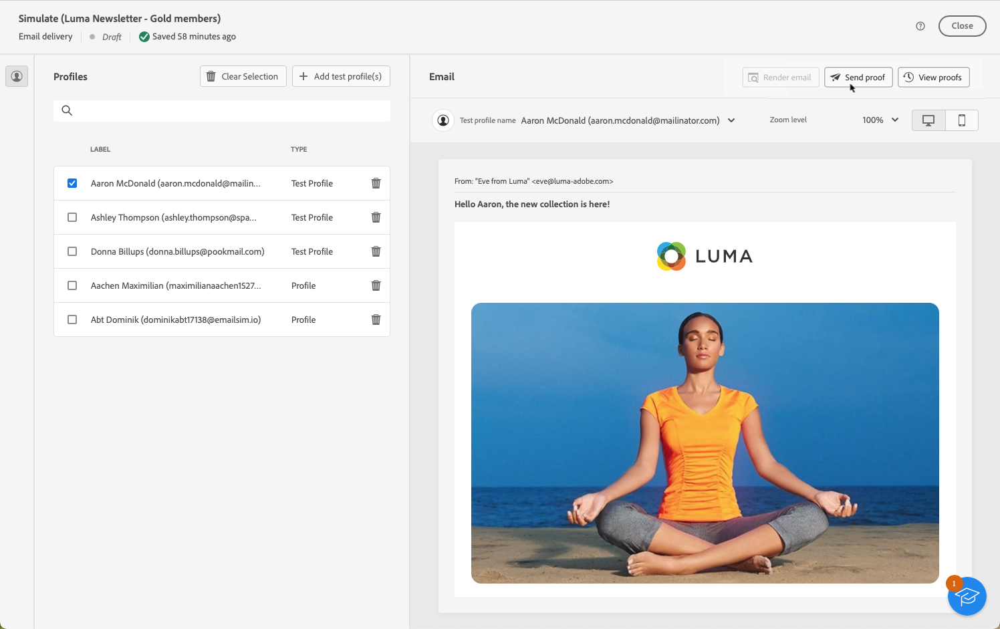
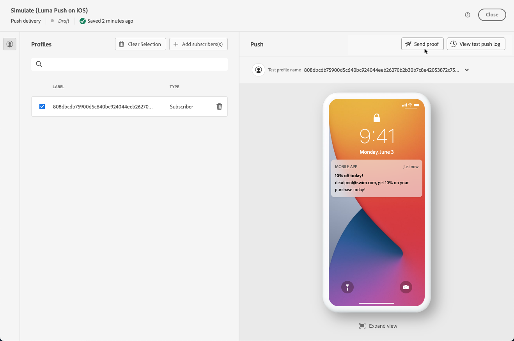

# Enviar entregas de teste {#send-test-deliveries}

>[!CONTEXTUALHELP]
>id="acw_email_preview_mode"
>title="Modo de visualização"
>abstract="Visualize e teste a mensagem incluindo a população de teste ao público-alvo principal."

**[!UICONTROL Adobe Campaign]** permite testar uma mensagem antes de enviá-la para o público principal.

O envio de deliveries de teste (anteriormente conhecidos como &quot;provas&quot;) é uma etapa importante para validar sua campanha e identificar possíveis problemas.

Os recipients de um teste podem verificar vários elementos, como links, links para opção de não participação, imagens ou mirror pages, bem como detectar erros na renderização, conteúdo, configurações de personalização e configuração do delivery.

## Selecione os recipients de teste {#test-recipients}

>[!CONTEXTUALHELP]
>id="acw_email_preview_option_test_target"
>title="População de teste"
>abstract="Selecione um modo de população de teste."

De acordo com o canal que você está usando, as mensagens de teste podem ser enviadas para três tipos de recipients:

* [Perfis de teste](#test-profiles) - Enviar **testar emails e SMS** para seed addresses, que são recipients adicionais no banco de dados.

  Eles podem ser criados na variável [!DNL Campaign] console no **[!UICONTROL Recursos]** > **[!UICONTROL Campaign Management]** > **[!UICONTROL Seed addresses]** pasta. Saiba mais em [Documentação do Campaign v8 (console)](https://experienceleague.adobe.com/docs/campaign/campaign-v8/audience/add-profiles/test-profiles.html){target="_blank"}

* [Substituir do público alvo principal](#substitution-profiles) - Enviar **testar emails e SMS** para um endereço de email ou número de telefone específico ao representar um perfil existente.

  Isso permite experimentar a mensagem da mesma maneira que os recipients, fornecendo uma representação precisa do conteúdo que o perfil receberá.

* [Assinantes](#subscribers) - Enviar **testar notificações por push** aos assinantes fictícios adicionados ao banco de dados.

  Assim como perfis de teste, eles podem ser criados no [!DNL Campaign] console no **[!UICONTROL Recursos]** > **[!UICONTROL Campaign Management]** > **[!UICONTROL Seed addresses]** pasta. Saiba mais em [Documentação do Campaign v8 (console)](https://experienceleague.adobe.com/docs/campaign/campaign-v8/audience/add-profiles/test-profiles.html){target="_blank"}

Para selecionar os recipients de um delivery de teste, siga as etapas abaixo, de acordo com o tipo de perfis que deseja usar.

### Perfis de teste {#test-profiles}

>[!CONTEXTUALHELP]
>id="acw_deliveries_simulate_test_mode"
>title="Público-alvo da prova"
>abstract="É possível fazer upload de um segundo arquivo como “público-alvo de prova” se desejar testar a entrega antes de enviar para o público-alvo principal."

>[!CONTEXTUALHELP]
>id="acw_deliveries_simulate_test_upload"
>title="Fazer upload de perfis"
>abstract="É possível fazer upload de um segundo arquivo com perfis adicionais se quiser testar a entrega com um conjunto diferente do conjunto usado como o público-alvo principal."

>[!CONTEXTUALHELP]
>id="acw_deliveries_simulate_test_sample"
>title="Arquivo de modelo"
>abstract="A formatação do arquivo precisa ser igual à do arquivo original. Formatos de arquivo compatíveis: txt, csv. Tamanho máximo do arquivo: 15 MB. Usar a primeira linha como cabeçalho da coluna."

1. Navegue até a tela de edição de conteúdo do seu delivery de email ou SMS e clique no link **[!UICONTROL Simular conteúdo]** botão.

1. Clique em **[!UICONTROL Teste]** botão.

   >[!NOTE]
   >
   >Se você já tiver selecionado perfis para [visualizar seu delivery](preview-content.md), elas serão listadas no painel esquerdo.

   

1. No **[!UICONTROL Modo]** selecione **[!UICONTROL Perfis de teste]** para direcionar recipients fictícios que receberão o email de teste ou a delivery de SMS.

   

1. Se você já tiver selecionado perfis para [visualizar a mensagem](preview-content.md) na tela de simulação de conteúdo, esses perfis são pré-selecionados como recipients de teste. Você pode limpar sua seleção e/ou adicionar outros recipients usando o **[!UICONTROL Adicionar perfil(s) de teste]** botão.

   >[!NOTE]
   >
   >Por padrão, a variável **[!UICONTROL Usar perfis de teste]** está selecionado.

1. Para enviar também a mensagem final aos recipients do delivery de teste, selecione o **[!UICONTROL Incluir população de teste no público alvo principal]** opção.

1. Depois que os perfis de teste forem selecionados, você poderá [enviar o delivery de teste](#send-test).

### Perfis de substituição {#substitution-profiles}

Para enviar um email ou SMS de teste para um endereço de email ou número de telefone específico ao exibir dados de um perfil existente do [!DNL Campaign] banco de dados, use perfis de substituição.

1. Antes de enviar um teste, defina um público-alvo de direcionamento para sua entrega. [Saiba mais](../audience/about-audiences.md)

1. Navegue até a tela de edição de conteúdo do seu delivery de email ou SMS e clique no link **[!UICONTROL Simular conteúdo]** botão.

1. Clique em **[!UICONTROL Teste]** botão.

   

1. No **[!UICONTROL Modo]** selecione **[!UICONTROL Substituir do público alvo principal]** para enviar um teste para um endereço de email ou número de telefone específico ao exibir dados de um perfil existente.

   >[!CAUTION]
   >
   >Se você não selecionou um [público](../audience/about-audiences.md) para o seu delivery, a variável **[!UICONTROL Substituir do público alvo principal]** estará acinzentada e não será possível selecionar perfis de substituição.

1. Clique em **[!UICONTROL Adicionar endereço]** e especifique o endereço de email ou número de telefone que receberá o delivery de teste.

   

   >[!NOTE]
   >
   >Você pode inserir qualquer endereço de email ou número de telefone. Isso permite enviar deliveries de teste para qualquer recipient, mesmo que não sejam usuários do [!DNL Adobe Campaign].

1. Selecione o perfil do target definido para o delivery a ser usado como substituto. Você também pode permitir [!DNL Adobe Campaign] selecione um perfil aleatório no target. Os dados do perfil selecionado serão exibidos no delivery de teste.

1. Confirme o recipient e repita a operação para adicionar quantos endereços de email ou números de telefone forem necessários.

   

1. Para enviar também a mensagem final aos recipients do delivery de teste, selecione o **[!UICONTROL Incluir população de teste no público alvo principal]** opção.

1. Depois que os perfis de substituição forem selecionados, você poderá [enviar o delivery de teste](#send-test).

### Assinantes {#subscribers}

Ao trabalhar com notificações por push, os deliveries de teste só podem ser enviados aos assinantes. Para selecioná-los, siga as etapas abaixo.

1. Navegue até a tela de edição de conteúdo do seu delivery e clique no link **[!UICONTROL Simular conteúdo]** botão.

1. Clique em **[!UICONTROL Teste]** botão.

   

1. Se você já tiver selecionado assinantes para [pré-visualizar o delivery](preview-content.md) na tela content simulation, esses perfis são pré-selecionados como assinantes de teste.

   Você pode limpar sua seleção e/ou adicionar mais assinantes usando o botão dedicado.

   

1. Para enviar também a notificação por push final aos assinantes de teste, selecione o **[!UICONTROL Incluir população de teste no público alvo principal]** opção.

1. Depois que os assinantes forem selecionados, você poderá [enviar o delivery de teste](#send-test).

## Enviar o delivery de teste {#send-test}

Para enviar o delivery de teste para os recipients selecionados, siga as etapas abaixo.

1. Clique em **[!UICONTROL Enviar teste]** botão.

1. Confirme o envio.

   

1. Envie quantos testes forem necessários até concluir o conteúdo do delivery.

Depois de concluído, você pode preparar e enviar o delivery para o target principal. Saiba mais nas seções dedicadas abaixo:

* [Envie seu email](../monitor/prepare-send.md)
* [Enviar sua notificação por push](../push/send-push.md#send-push)
* [Enviar a entrega de SMS](../sms/send-sms.md#send-sms)

## Acesso a deliveries de teste enviados {#access-proofs}

Depois que os deliveries de teste forem enviados, você poderá acessar logs dedicados no **[!UICONTROL Exibir log de teste]** botão.

Esses logs permitem acessar todos os testes enviados para o delivery selecionado e visualizar estatísticas específicas relacionadas ao envio. [Saiba como monitorar os logs de entrega](../monitor/delivery-logs.md)

Você também pode acessar testes enviados do [lista de entregas](../msg/gs-messages.md), como qualquer delivery.

