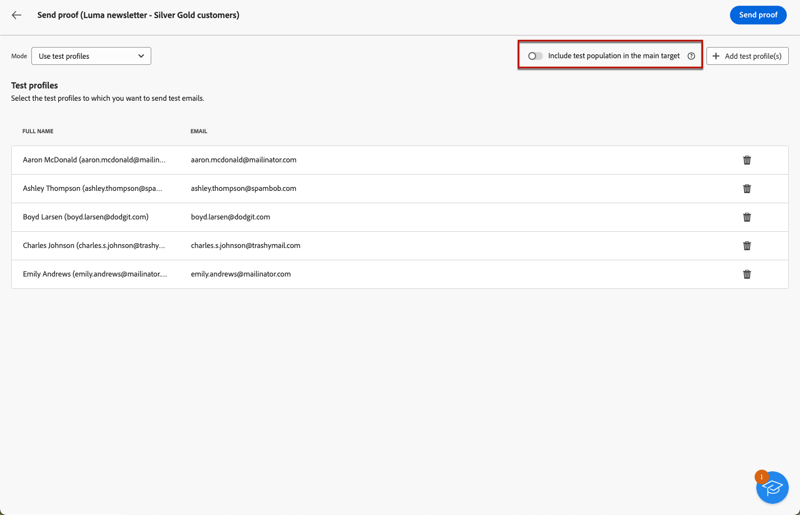

# Enviar provas {#send-test-deliveries}

>[!CONTEXTUALHELP]
>id="acw_email_preview_mode"
>title="Modo de visualização"
>abstract="Visualize e teste a mensagem incluindo a população de teste ao público-alvo principal."

>[!CONTEXTUALHELP]
>id="acw_deliveries_additional_proof_target"
>title="Público-alvo adicional da prova"
>abstract="Essas regras só podem ser alteradas no console do cliente."

Depois que o conteúdo da mensagem for definido, você poderá pré-visualizá-lo e testá-lo enviando provas para perfis de teste. Se você inseriu conteúdo personalizado, é possível verificar como esse conteúdo é exibido na mensagem, usando os dados do perfil de teste.

Para detectar possíveis erros nas configurações de conteúdo ou personalização da mensagem, envie provas para perfis de teste antes de enviá-las para o público-alvo. Uma prova deve ser enviada sempre que uma alteração for feita, para validar o conteúdo mais recente. O envio de provas é uma etapa importante na validação da campanha e na identificação de possíveis problemas. Os recipients de prova podem verificar vários elementos, como links, links para opção de não participação, imagens ou mirror pages, bem como detectar erros na renderização, conteúdo, configurações de personalização e configuração do delivery.

## Simular conteúdo com perfis de teste {#simulate-content-test-deliveries}

>[!CONTEXTUALHELP]
>id="acw_email_preview_option_test_target"
>title="População de teste"
>abstract="Selecione um modo de população de teste."

Antes de enviar uma prova, defina um público-alvo para o seu delivery. [Saiba mais](../audience/add-audience.md)

Para começar a testar o conteúdo da mensagem:

1. Edite o conteúdo do seu delivery.
1. Clique no botão **[!UICONTROL Simular conteúdo]**.
1. Clique no botão **[!UICONTROL Enviar prova]** para enviar provas.

   {zoomable="yes"}

1. Selecione os recipients da prova.

   Dependendo do canal de mensagem, as provas podem ser enviadas para os seguintes tipos de recipients:

   * Para SMS e emails, você pode usar [perfis de teste](#test-profiles), que são destinatários adicionais específicos no banco de dados. Você também pode usar o modo [substituição do target principal](#substitution-profiles), que envia a prova para um endereço de teste de email ou número de telefone, e usa dados de personalização de um perfil existente. Isso permite experimentar a mensagem da mesma maneira que os recipients, fornecendo uma representação precisa do conteúdo que o perfil receberá.

   * Para mensagens por push, você pode usar [assinantes](#subscribers), que são assinantes fictícios adicionados ao banco de dados. Eles são criados no console [!DNL Campaign]. Saiba mais na [documentação do Campaign v8 (console do cliente)](https://experienceleague.adobe.com/docs/campaign/campaign-v8/audience/add-profiles/test-profiles.html?lang=pt-BR){target="_blank"}

   A configuração detalhada para cada modo está disponível abaixo.

## Usar perfis de teste {#test-profiles}

>[!CONTEXTUALHELP]
>id="acw_deliveries_simulate_test_mode"
>title="Público-alvo da prova"
>abstract="É possível fazer upload de um segundo arquivo como “público-alvo de prova” se desejar testar a entrega antes de enviar para o público-alvo principal."

>[!CONTEXTUALHELP]
>id="acw_deliveries_simulate_test_upload"
>title="Fazer upload de perfis"
>abstract="É possível fazer upload de um segundo arquivo com perfis adicionais se quiser testar a entrega com um conjunto diferente do conjunto usado como o público-alvo principal."

>[!CONTEXTUALHELP]
>id="acw_deliveries_simulate_test_sample"
>title="Arquivo de modelo"
>abstract="A formatação do arquivo precisa ser igual à do arquivo original. Formatos de arquivo compatíveis: txt, csv. Tamanho máximo do arquivo: 15 MB. Usar a primeira linha como cabeçalho da coluna."

>[!CONTEXTUALHELP]
>id="acw_sms_preview_option_app_target"
>title="Incluir perfis de teste no público-alvo principal"
>abstract="Habilite essa opção para também enviar a mensagem final para os destinatários da prova."

Os perfis de teste são recipients adicionais no banco de dados. Eles são criados no menu **[!UICONTROL Gerenciamento de clientes]** > **[!UICONTROL Perfis]**. [Saiba mais](../audience/test-profiles.md#create-test-profiles)

As etapas para enviar provas para perfis de teste são detalhadas abaixo.

1. A partir do conteúdo da sua entrega, clique no botão **[!UICONTROL Simular conteúdo]** e no botão **[!UICONTROL Enviar prova]**.

1. Na lista suspensa **[!UICONTROL Modo]**, escolha **[!UICONTROL Perfis de teste]** para direcionar destinatários fictícios que receberão a prova ou a entrega de SMS.

   {zoomable="yes"}

1. Se você já tiver selecionado os perfis para [visualizar a mensagem](preview-content.md) na tela de simulação de conteúdo, esses perfis serão pré-selecionados como destinatários de provas. Você pode limpar sua seleção e/ou adicionar outros destinatários usando o botão **[!UICONTROL Adicionar perfil(s) de teste]**.

1. Ao navegar pelo perfil de teste ou pelas listas de perfis, você pode usar filtros para refinar a pesquisa. Por exemplo, você pode definir uma regra para localizar todos os perfis de teste com o status **[!UICONTROL Prospecto]**. Saiba como adicionar regras usando o [modelador de consultas](../query/query-modeler-overview.md).

   {zoomable="yes"}

1. Para enviar também a mensagem final aos recipients da prova, selecione a opção **[!UICONTROL Incluir população de teste no target principal]**.

   {zoomable="yes"}

1. Após selecionar os perfis de teste, você pode [enviar a prova](#send-test).

## Substituir dados do perfil {#substitution-profiles}

Use a substituição de perfil para enviar provas para um endereço de email ou número de telefone específico, ao exibir dados de um perfil existente do banco de dados do [!DNL Adobe Campaign]. Esse modo só poderá ser selecionado se o público-alvo da entrega for definido.

Para substituir os dados do perfil do target principal, siga as etapas abaixo:

1. A partir do conteúdo da sua entrega, clique no botão **[!UICONTROL Simular conteúdo]** e no botão **[!UICONTROL Enviar prova]**.

1. Na lista suspensa **[!UICONTROL Modo]**, escolha **[!UICONTROL Substituir do destino principal]** para enviar uma prova para um endereço de email ou número de telefone específico enquanto exibe dados de um perfil existente.

   >[!CAUTION]
   >
   >Se você não tiver selecionado um [público-alvo](../audience/about-recipients.md) para sua entrega, a opção **[!UICONTROL Substituir do público-alvo principal]** ficará esmaecida e você não poderá selecionar perfis de substituição. Além disso, mesmo que um público-alvo seja selecionado para deliveries do tipo recorrentes, essa opção ainda estará esmaecida, pois o delivery principal é um template.

1. Clique no botão **[!UICONTROL Adicionar endereço]** e especifique o endereço de email ou o número de telefone que receberá a prova.

   {zoomable="yes"}

   >[!NOTE]
   >
   >Você pode inserir qualquer endereço de email ou número de telefone. Isso permite enviar provas para qualquer destinatário, mesmo que ele não seja usuário do [!DNL Adobe Campaign].

1. Selecione o perfil do target definido para o delivery a ser usado como substituto. Você também pode deixar [!DNL Adobe Campaign] selecionar um perfil aleatório do público-alvo. Os dados de perfil do perfil selecionado serão exibidos na prova.

1. Confirme o recipient e repita a operação para adicionar quantos endereços de email ou números de telefone forem necessários.

   {zoomable="yes"}

1. Para enviar também a mensagem final aos recipients da prova, selecione a opção **[!UICONTROL Incluir população de teste no target principal]**.

1. Após selecionar os perfis de substituição, você pode [enviar a prova](#send-test).

## Enviar provas para assinantes de aplicativos {#subscribers}

Ao criar com notificações por push, as provas só podem ser enviadas aos assinantes do aplicativo. Para selecioná-los, siga as etapas abaixo.

1. A partir do conteúdo da sua entrega por push, clique no botão **[!UICONTROL Simular conteúdo]** e no botão **[!UICONTROL Enviar prova]**.

   {zoomable="yes"}

1. Se você já tiver selecionado assinantes para [pré-visualizar a entrega](preview-content.md) na tela de simulação de conteúdo, esses perfis serão pré-selecionados como assinantes de teste.

   Você pode limpar sua seleção e/ou adicionar mais assinantes usando o botão dedicado.

   {zoomable="yes"}

1. Para enviar também a notificação por push final aos assinantes de teste, selecione a opção **[!UICONTROL Incluir população de teste no público alvo principal]**.

1. Após selecionar os assinantes, você pode [enviar a prova](#send-test).

## Enviar a prova {#send-test}

Para enviar a prova aos recipients selecionados, siga as etapas abaixo.

1. Clique no botão **[!UICONTROL Enviar prova]**.

1. Confirme o envio.

   {zoomable="yes"}

1. Envie quantas provas forem necessárias até finalizar o conteúdo do delivery.

Depois de concluído, você pode preparar e enviar o delivery para o target principal. Saiba mais nas seções dedicadas abaixo:

* [Envie seu email](../monitor/prepare-send.md)
* [Enviar sua notificação por push](../push/send-push.md#send-push)
* [Enviar a entrega de SMS](../sms/send-sms.md#send-sms)

## Acesso a provas enviadas {#access-test-deliveries}

Depois que as provas forem enviadas, você poderá acessar os logs na tela **[!UICONTROL Simular conteúdo]**.

Esses logs permitem que você acesse todas as provas enviadas para o delivery selecionado e visualize estatísticas específicas relacionadas ao envio. [Saiba como monitorar os logs de entrega](../monitor/delivery-logs.md)

{zoomable="yes"}

Você também pode acessar provas enviadas na [lista de entrega](../msg/gs-messages.md), como qualquer entrega.

{zoomable="yes"}