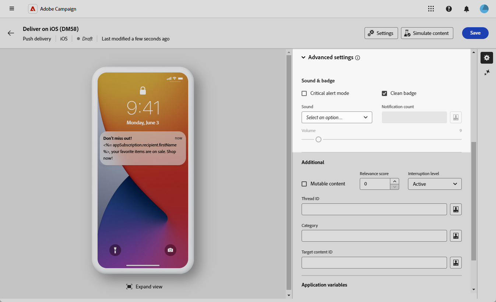
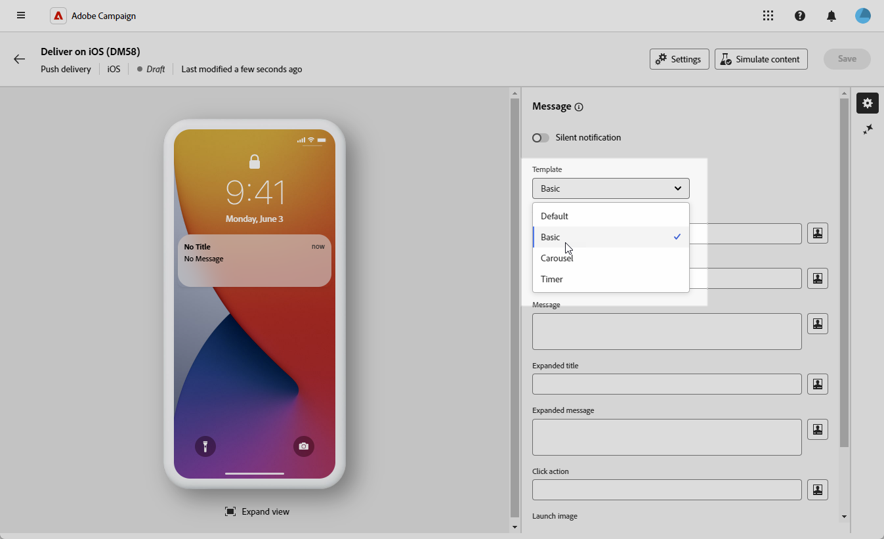
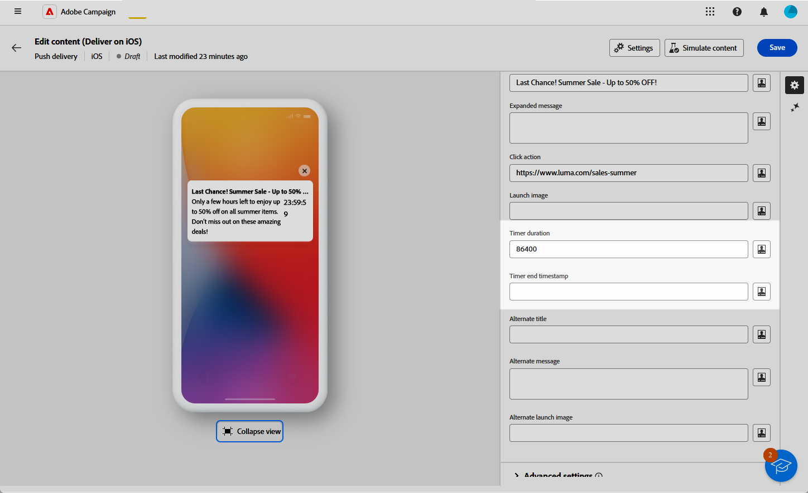

# Criar uma entrega de push avançada para iOS {#rich-push}

>[!IMPORTANT]
>
>Antes de criar uma Notificação por push avançada, é necessário configurar o conector V2. Consulte [esta página](https://experienceleague.adobe.com/pt-br/docs/campaign-classic/using/sending-messages/sending-push-notifications/configure-the-mobile-app/configuring-the-mobile-application) para obter o procedimento detalhado.

## Definir o conteúdo da notificação {#push-message}

Depois que o delivery de push for criado, defina o conteúdo usando um dos seguintes templates:

* **Padrão** permite enviar notificações com um ícone simples e uma imagem que o acompanha.
* **Básico** pode incluir texto, imagens e botões em suas notificações.
* O **Carrossel** permite enviar notificações com texto e várias imagens pelas quais os usuários podem passar.
* **Timer** inclui um timer de contagem regressiva ativo em suas notificações.

Navegue pelas guias abaixo para saber mais sobre como personalizar esses modelos.

>[!BEGINTABS]

>[!TAB Padrão]

1. No menu suspenso **[!UICONTROL Modelo]**, selecione **[!UICONTROL Padrão]**.

   

1. No campo **[!UICONTROL Título]**, insira o rótulo do título que deve aparecer na lista de notificações disponível no centro de notificações.

   Este campo define o valor do parâmetro **title** da carga de notificação do iOS.

1. Opcionalmente, adicione um **[!UICONTROL Subtítulo]**, que corresponde ao parâmetro **subtítulo** da carga de notificação do iOS.

1. Insira o conteúdo da mensagem no campo **[!UICONTROL Mensagem]**.

1. Use o Editor de expressão para definir o conteúdo, personalizar dados e adicionar conteúdo dinâmico. [Saiba mais](../personalization/personalize.md)

   

1. Para personalizar ainda mais sua notificação por push, escolha uma URL da **[!UICONTROL Imagem do Launch]** para adicionar à sua notificação por push.

1. No menu suspenso **[!UICONTROL Configurações avançadas]**, navegue até a guia **[!UICONTROL Som e selo]** para personalizar configurações adicionais, como opções de som e selo para suas notificações. [Saiba mais](#sound-badge)

   

1. Para mais personalizações, explore as **[!UICONTROL opções adicionais]** disponíveis para suas notificações por push. [Saiba mais](#push-advanced)

   

1. No menu **[!UICONTROL Variáveis de aplicativo]**, suas **[!UICONTROL Variáveis de aplicativo]** são adicionadas automaticamente. Eles permitem definir o comportamento da notificação, como configurar uma tela de aplicativo específica para ser exibida quando o usuário ativar a notificação.

Depois de definir o conteúdo da mensagem, use assinantes de teste para pré-visualizar e testar a mensagem.

>[!TAB Básico]

1. No menu suspenso **[!UICONTROL Modelo]**, selecione **[!UICONTROL Básico]**.

   

1. Para redigir a mensagem, digite o texto nos campos **[!UICONTROL Título]**, **[!UICONTROL Título estendido]**, **[!UICONTROL Mensagem]** e **[!UICONTROL Mensagem expandida]**.

   O texto **[!UICONTROL Mensagem]** aparece no modo de exibição recolhido, enquanto a **[!UICONTROL Mensagem expandida]** é exibida quando a notificação é expandida.

   

1. Use o Editor de expressão para definir o conteúdo, personalizar dados e adicionar conteúdo dinâmico. [Saiba mais](../personalization/personalize.md)

1. Opcionalmente, adicione um **[!UICONTROL Subtítulo]**, que corresponde ao parâmetro **subtítulo** da carga de notificação do iOS.

1. Adicione a URL que define a **[!UICONTROL Ação de clique]** associada a um clique do usuário em sua notificação. Isso determina o comportamento quando o usuário interage com a notificação, como abrir uma tela específica ou executar uma ação específica no aplicativo.

1. Para personalizar ainda mais sua notificação por push, escolha uma URL da **[!UICONTROL Imagem do Launch]** para adicionar à sua notificação por push.

1. No menu suspenso **[!UICONTROL Configurações avançadas]**, navegue até a guia **[!UICONTROL Som e selo]** para personalizar configurações adicionais, como opções de som e selo para suas notificações. [Saiba mais](#sound-badge)

   

1. No menu **[!UICONTROL Opções de cor]**, insira códigos de cor hexadecimais para a **[!UICONTROL Cor do plano de fundo da notificação]**, **[!UICONTROL Cor do plano de fundo da notificação]** e **[!UICONTROL Cor do texto da mensagem]**.

   

1. Para mais personalizações, explore as **[!UICONTROL opções adicionais]** disponíveis para suas notificações por push. [Saiba mais](#push-advanced)

1. No menu **[!UICONTROL Variáveis de aplicativo]**, suas **[!UICONTROL Variáveis de aplicativo]** são adicionadas automaticamente. Eles permitem definir o comportamento da notificação, como configurar uma tela de aplicativo específica para ser exibida quando o usuário ativar a notificação.

Depois de definir o conteúdo da mensagem, use assinantes de teste para pré-visualizar e testar a mensagem.

>[!TAB Carrossel]

1. No menu suspenso **[!UICONTROL Modelo]**, selecione **[!UICONTROL Carrossel]**.

   

1. Para redigir a mensagem, digite o texto nos campos **[!UICONTROL Título]**, **[!UICONTROL Título estendido]**, **[!UICONTROL Mensagem]** e **[!UICONTROL Mensagem expandida]**.

   O texto **[!UICONTROL Mensagem]** aparece no modo de exibição recolhido, enquanto a **[!UICONTROL Mensagem expandida]** é exibida quando a notificação é expandida.

   

1. Use o Editor de expressão para definir o conteúdo, personalizar dados e adicionar conteúdo dinâmico. [Saiba mais](../personalization/personalize.md)

1. Opcionalmente, adicione um **[!UICONTROL Subtítulo]**, que corresponde ao parâmetro **subtítulo** da carga de notificação do iOS.

1. Adicione a URL que define a **[!UICONTROL Ação de clique]** associada a um clique do usuário em sua notificação. Isso determina o comportamento quando o usuário interage com a notificação, como abrir uma tela específica ou executar uma ação específica no aplicativo.

1. Escolha como o **[!UICONTROL Carrossel]** é operado:

   * **[!UICONTROL Automático]**: percorre automaticamente imagens como slides, fazendo a transição em intervalos predefinidos.
   * **[!UICONTROL Manual]**: permite que os usuários deslizem manualmente entre slides para navegar pelas imagens.

1. Clique em **[!UICONTROL Adicionar imagem]** e digite a URL da **[!UICONTROL Imagem]**, o **[!UICONTROL Texto]** e o **[!UICONTROL URI da Ação]**.

   Certifique-se de incluir no mínimo três imagens e no máximo cinco imagens.

   

1. Manipule a ordem das imagens com as setas para baixo e para cima.

1. No menu suspenso **[!UICONTROL Configurações avançadas]**, navegue até a guia **[!UICONTROL Som e selo]** para personalizar configurações adicionais, como opções de som e selo para suas notificações. [Saiba mais](#sound-badge)

1. No menu **[!UICONTROL Opções de cor]**, insira códigos de cor hexadecimais para a **[!UICONTROL Cor do plano de fundo da notificação]**, **[!UICONTROL Cor do plano de fundo da notificação]** e **[!UICONTROL Cor do texto da mensagem]**.

   

1. Para mais personalizações, explore as **[!UICONTROL opções adicionais]** disponíveis para suas notificações por push. [Saiba mais](#push-advanced)

1. No menu **[!UICONTROL Variáveis de aplicativo]**, suas **[!UICONTROL Variáveis de aplicativo]** são adicionadas automaticamente. Eles permitem definir o comportamento da notificação, como configurar uma tela de aplicativo específica para ser exibida quando o usuário ativar a notificação.

Depois de definir o conteúdo da mensagem, use assinantes de teste para pré-visualizar e testar a mensagem.

>[!TAB Temporizador]

1. No menu suspenso **[!UICONTROL Tipo de notificação]**, selecione **[!UICONTROL Temporizador]**.

   

1. Para redigir a mensagem, digite o texto nos campos **[!UICONTROL Título]**, **[!UICONTROL Título estendido]**, **[!UICONTROL Mensagem]** e **[!UICONTROL Mensagem expandida]**.

   O texto **[!UICONTROL Mensagem]** aparece no modo de exibição recolhido, enquanto a **[!UICONTROL Mensagem expandida]** é exibida quando a notificação é expandida.

   

1. Use o Editor de expressão para definir o conteúdo, personalizar dados e adicionar conteúdo dinâmico. [Saiba mais](../personalization/personalize.md)

1. Opcionalmente, adicione um **[!UICONTROL Subtítulo]**, que corresponde ao parâmetro **subtítulo** da carga de notificação do iOS.

1. Adicione a URL que define a **[!UICONTROL Ação de clique]** associada a um clique do usuário em sua notificação. Isso determina o comportamento quando o usuário interage com a notificação, como abrir uma tela específica ou executar uma ação específica no aplicativo.

1. Para personalizar ainda mais sua notificação por push, escolha uma URL da **[!UICONTROL Imagem do Launch]** para adicionar à sua notificação por push.

1. Defina a **[!UICONTROL Duração do temporizador]** em segundos ou o **[!UICONTROL Carimbo de data/hora de término do temporizador]** como um carimbo de data/hora de época específico.

   

1. Digite o texto e a imagem que serão exibidos depois que o timer expirar nos campos **[!UICONTROL Título alternativo]**, **[!UICONTROL Mensagem alternativa]** e **[!UICONTROL Imagem de inicialização alternativa]**.

   

1. No menu suspenso **[!UICONTROL Configurações avançadas]**, navegue até a guia **[!UICONTROL Som e selo]** para personalizar configurações adicionais, como opções de som e selo para suas notificações. [Saiba mais](#sound-badge)

1. No menu **[!UICONTROL Opções de cor]**, insira códigos de cor hexadecimais para a **[!UICONTROL Cor do plano de fundo da notificação]**, **[!UICONTROL Cor do plano de fundo da notificação]** e **[!UICONTROL Cor do texto da mensagem]**.

1. Para mais personalizações, explore as **[!UICONTROL opções adicionais]** disponíveis para suas notificações por push. [Saiba mais](#push-advanced)

1. No menu **[!UICONTROL Variáveis de aplicativo]**, suas **[!UICONTROL Variáveis de aplicativo]** são adicionadas automaticamente. Eles permitem definir o comportamento da notificação, como configurar uma tela de aplicativo específica para ser exibida quando o usuário ativar a notificação.

Depois de definir o conteúdo da mensagem, use assinantes de teste para pré-visualizar e testar a mensagem.

>[!ENDTABS]

## Configurações avançadas de notificações por push {#push-advanced}

### Opções de som e selo {#sound-badge}

| Parâmetro | Descrição |
|-----------|-------------|
| **[!UICONTROL Modo de alerta crítico]** | Ative esta opção para adicionar som à sua notificação, mesmo se o telefone do usuário estiver configurado no modo de foco ou sem áudio. |
| **[!UICONTROL Limpar medalha]** | Ative essa opção para atualizar o valor do selo. |
| **[!UICONTROL Som]** | Defina o som que será reproduzido quando o dispositivo receber sua notificação. |
| **[!UICONTROL Contagem de notificações]** | Defina um número para ser exibido diretamente no ícone do aplicativo, indicando o número de novas notificações não lidas. |
| **[!UICONTROL Volume]** | Defina o volume do som (de 0 a 100). Os sons devem ser incluídos no aplicativo e definidos quando o serviço é criado. |

### Opções de cor {#color}

| Parâmetro | Descrição |
|-----------|-------------|
| **[!UICONTROL Cor de fundo da notificação]** | Defina a cor do plano de fundo da sua notificação usando códigos de cor hexadecimais. |
| **[!UICONTROL Cor do título]** | Defina a cor do seu título usando códigos de cor hexadecimais. |
| **[!UICONTROL Cor do texto da mensagem]** | Defina a cor do texto usando códigos de cor hexadecimal. |

### Opções avançadas {#notification-options}

| Parâmetro | Descrição |
|-----------|-------------|
| **[!UICONTROL Conteúdo mutável]** | Habilite esta opção para permitir que o aplicativo móvel baixe conteúdo de mídia. |
| **[!UICONTROL Conteúdo disponível]** | Ative essa opção para permitir que sua notificação acione atualizações em segundo plano em dispositivos iOS, mesmo quando o aplicativo não estiver aberto ativamente. Isso garante que conteúdo como mensagens ou atualizações de dados possam ser processados e armazenados na caixa de entrada do aplicativo, sem exigir interação do usuário. Quando selecionado, o sinalizador `content-available: 1` é adicionado à carga `aps` em conformidade com os padrões do Serviço de Notificação por Push (APNS) da Apple. |
| **[!UICONTROL Pontuação de relevância]** | Defina uma pontuação de relevância de 0 a 100. O sistema usa essa opção para classificar notificações no resumo de notificações. |
| **[!UICONTROL Nível de interrupção]** | <ul><li>**Ativo**: definido por padrão, o sistema apresenta a notificação imediatamente, ativa a tela e pode reproduzir um som. As notificações não interrompem os modos de foco.</li><li>**Passivo**: o sistema adiciona a notificação à lista de notificações sem ativar a tela ou reproduzir um som. As notificações não interrompem os modos de foco.</li><li>**Sensível ao tempo**: o sistema apresenta a notificação imediatamente, ativa a tela, pode reproduzir um som e interrompe os modos de foco. Esse nível não requer permissão especial da Apple.</li><li>**Crítico**: o sistema apresenta a notificação imediatamente, ativa a tela e ignora os modos de foco e a opção de mudo. Observe que esse nível requer permissão especial da Apple.</li></ul> |
| **[!UICONTROL Thread-id]** | Defina o identificador usado para agrupar notificações relacionadas. |
| **[!UICONTROL Categoria]** | Defina o nome da ID da categoria, que exibirá botões de ação. Essas notificações fornecem ao usuário uma maneira mais rápida de realizar tarefas diferentes em resposta a uma notificação sem abrir o aplicativo ou navegar até ele. |
| **[!UICONTROL ID do conteúdo do Target]** | Defina um identificador usado para definir qual janela de aplicativo será apresentada quando a notificação for aberta. |