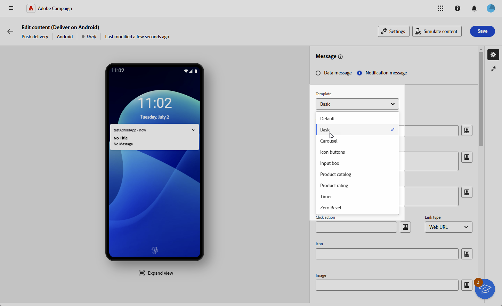
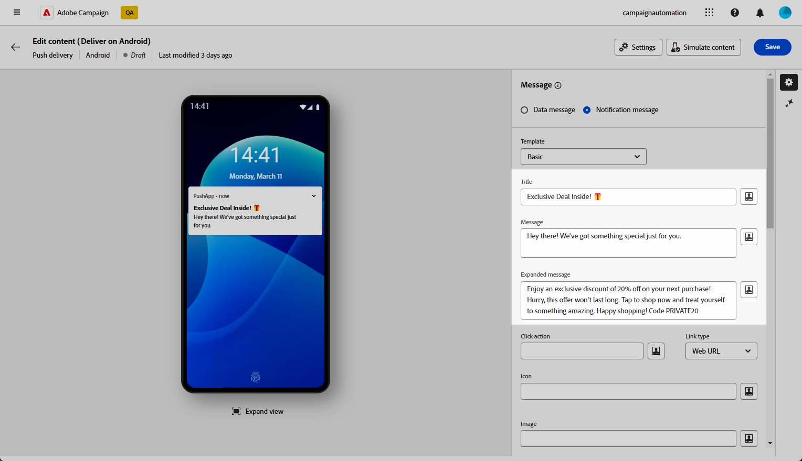
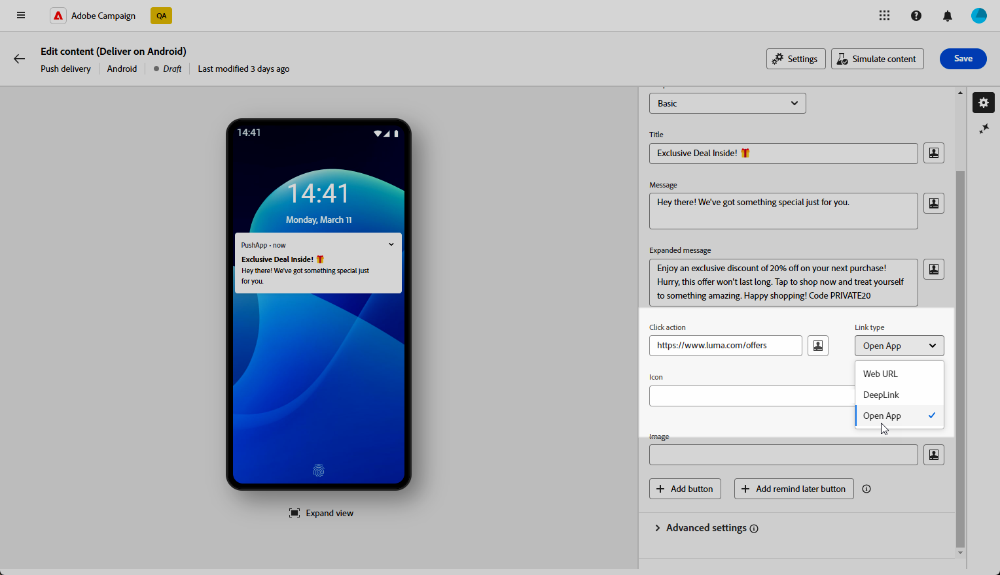
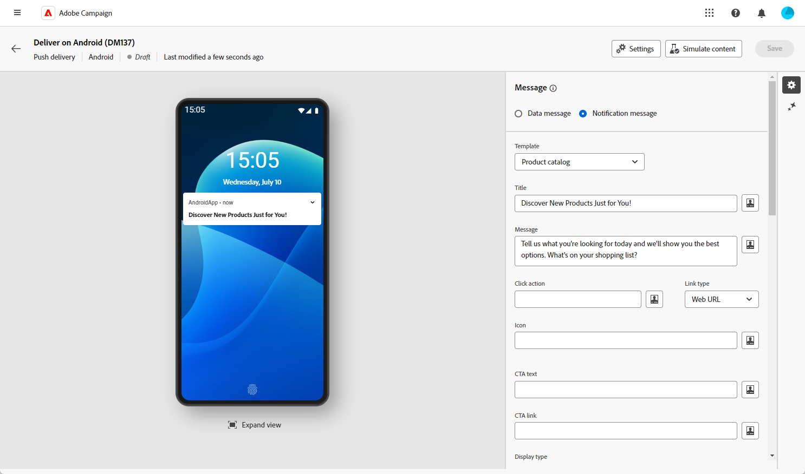
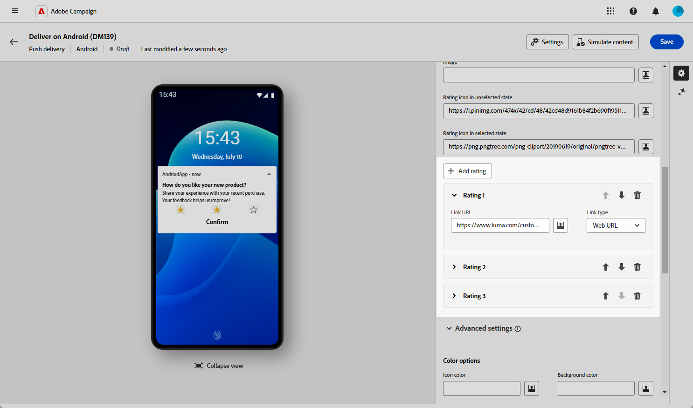
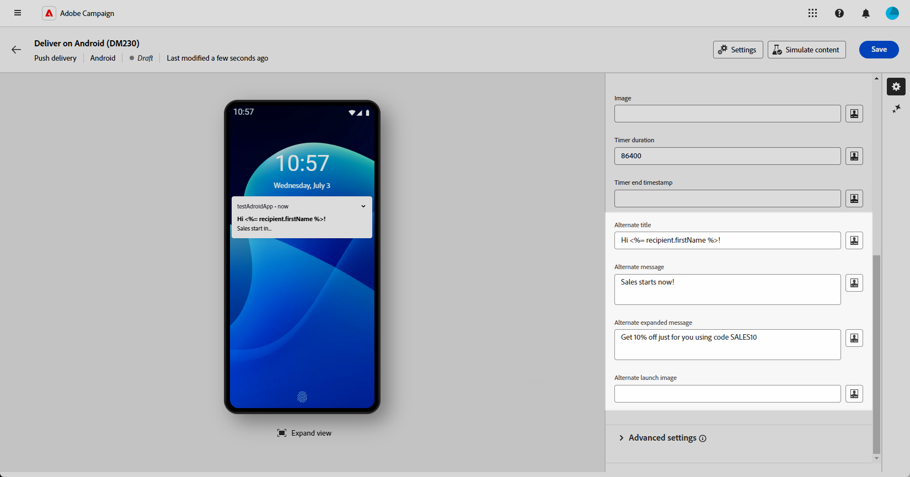
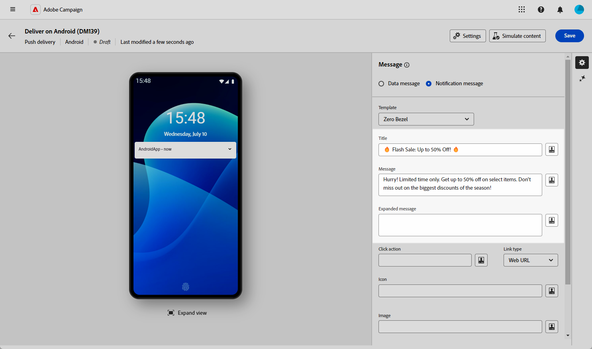

# Criar uma entrega de push avançada para Android {#rich-push}

>[!CONTEXTUALHELP]
>id="acw_deliveries_push_remind_later"
>title="Botão Lembrar mais tarde"
>abstract="O botão **Lembrar mais tarde** fornece a opção de agendar um lembrete. O campo Carimbo de data/hora exige um valor que represente a época em segundos."

>[!IMPORTANT]
>
>* Esse recurso exige a atualização para o Campaign v8.6.3 <!--or v8.7.2-->. Saiba mais nas [notas de versão](https://experienceleague.adobe.com/pt-br/docs/campaign/campaign-v8/releases/release-notes){target="_blank"} do console do cliente do Campaign v8.
>
>* Antes de criar uma Notificação por push avançada, primeiro é necessário configurar o conector V2. Consulte [esta página](https://experienceleague.adobe.com/en/docs/campaign-classic/using/sending-messages/sending-push-notifications/configure-the-mobile-app/configuring-the-mobile-application-android#configuring-external-account-android){target="_blank"} para obter o procedimento detalhado.

Com o Firebase Cloud Messaging, você pode escolher entre dois tipos de mensagens:

* A **[!UICONTROL Mensagem de dados]** é manipulada pelo aplicativo cliente. Essas mensagens são enviadas diretamente para o aplicativo móvel, que gera e exibe uma notificação do Android no dispositivo. As mensagens de dados contêm somente as variáveis personalizadas do aplicativo.

* A **[!UICONTROL Mensagem de notificação]**, manipulada automaticamente pelo FCM SDK. O FCM exibe automaticamente a mensagem nos dispositivos dos usuários em nome do aplicativo do cliente. As mensagens de notificação contêm um conjunto predefinido de parâmetros e opções, mas ainda podem ser personalizadas com variáveis de aplicativo personalizadas.

{zoomable="yes"}

## Definir o conteúdo da notificação {#push-message}

Depois que o delivery de push é criado, é possível definir seu conteúdo usando um dos seguintes templates:

* **Padrão** permite enviar notificações com um ícone simples e uma imagem que o acompanha.

* **Básico** pode incluir texto, imagens e botões em suas notificações.

* O **Carrossel** permite enviar notificações com texto e várias imagens pelas quais os usuários podem passar.

* **Botões de ícone** permitem enviar notificações com um ícone e uma imagem correspondente.

* A **caixa de entrada** reúne os comentários e as entradas de usuário diretamente por meio da notificação.

* O **Catálogo de produtos** exibe uma variedade de imagens de produtos.

* **A classificação de produto** permite que os usuários forneçam comentários e classifiquem os produtos.

* **Timer** inclui um timer de contagem regressiva ativo em suas notificações.

* O **Painel sem Formatação** usa a superfície de plano de fundo inteira para uma imagem, com o texto sobreposto perfeitamente.

Navegue pelas guias abaixo para saber mais sobre como personalizar esses modelos.

>[!BEGINTABS]

>[!TAB Padrão]

1. No menu suspenso **[!UICONTROL Modelo]**, selecione **[!UICONTROL Padrão]**.

   

1. Para redigir a mensagem, digite o texto nos campos **[!UICONTROL Título]** e **[!UICONTROL Mensagem]**.

   

1. Use o Editor de expressão para definir o conteúdo, personalizar os dados e adicionar conteúdo dinâmico. [Saiba mais](../personalization/personalize.md)

1. Defina a **[!UICONTROL Ação de clique]** associada a um clique do usuário em sua notificação. Isso determina o comportamento quando o usuário interage com a notificação, como abrir uma tela específica ou executar uma ação específica no aplicativo.

1. Para personalizar ainda mais sua notificação por push, você pode escolher uma URL da **[!UICONTROL Imagem]** para adicionar à sua notificação por push e o **[!UICONTROL Ícone]** da notificação para exibir nos dispositivos de seus perfis.

   

1. Defina as **[!UICONTROL Configurações avançadas]** de sua notificação por push. [Saiba mais](#push-advanced)

Depois de definir o conteúdo da mensagem, você pode usar assinantes de teste para pré-visualizar e testar a mensagem.

>[!TAB Básico]

1. No menu suspenso **[!UICONTROL Modelo]**, selecione **[!UICONTROL Básico]**.

   

1. Para redigir a mensagem, digite o texto nos campos **[!UICONTROL Título]**, **[!UICONTROL Mensagem]** e **[!UICONTROL Mensagem expandida]**.

   O texto **[!UICONTROL Mensagem]** aparece no modo de exibição recolhido enquanto a **[!UICONTROL Mensagem expandida]** é exibida quando a notificação é expandida.

   

1. Use o Editor de expressão para definir o conteúdo, personalizar os dados e adicionar conteúdo dinâmico. [Saiba mais](../personalization/personalize.md)

1. Adicione a URL que define a **[!UICONTROL Ação de clique]** associada a um clique do usuário em sua notificação. Isso determina o comportamento quando o usuário interage com a notificação, como abrir uma tela específica ou executar uma ação específica no aplicativo.

1. Selecione o **[!UICONTROL Tipo de link]** da URL que você adicionou ao campo **[!UICONTROL Ação de clique]**:

   * **[!UICONTROL URL da Web]**: as URLs da Web direcionam os usuários para o conteúdo online. Ao clicar em, eles solicitam que o navegador da Web padrão do dispositivo abra e navegue até o URL designado.

   * **[!UICONTROL Deeplink]**: deep links são URLs que direcionam os usuários para seções específicas dentro de um aplicativo, mesmo que ele esteja fechado. Quando clicada, uma caixa de diálogo pode ser exibida, permitindo que os usuários escolham entre vários aplicativos capazes de manipular o link.

   * **[!UICONTROL Abrir aplicativo]**: as URLs de aplicativos abertos permitem que você se conecte diretamente ao conteúdo de um aplicativo. Ela permite que o aplicativo se estabeleça como o manipulador padrão para um tipo específico de link, ignorando a caixa de diálogo de desambiguação.

   Para obter mais informações sobre como lidar com Links de aplicativos da Android, consulte a [documentação de Desenvolvedores da Android](https://developer.android.com/training/app-links).

   

1. Para personalizar ainda mais sua notificação por push, você pode escolher uma URL da **[!UICONTROL Imagem]** para adicionar à sua notificação por push e o **[!UICONTROL Ícone]** da notificação para exibir nos dispositivos de seus perfis.

1. Clique no **[!UICONTROL Botão Adicionar]** e preencha os seguintes campos:

   * **[!UICONTROL Rótulo]**: texto exibido no botão.
   * **[!UICONTROL URI do link]**: especifique o URI a ser executado ao clicar no botão.
   * **[!UICONTROL Tipo de link]**: tipo de link **[!UICONTROL URL da Web]**, **[!UICONTROL Deeplink]** ou **[!UICONTROL Abrir Aplicativo]**.

   Você tem a opção de incluir até três botões na sua notificação por push. Se você optar pelo **[!UICONTROL botão Lembrar mais tarde]**, poderá incluir no máximo dois botões.

   

1. Clique no botão **[!UICONTROL Adicionar lembrete mais tarde]** para adicionar uma opção Lembrar-me mais tarde à sua notificação por push. Insira um **[!UICONTROL Rótulo]** e **[!UICONTROL Carimbo de data/hora]**.

   O campo Timestamp espera um valor que representa a época em segundos.

   

1. Defina as **[!UICONTROL Configurações avançadas]** de sua notificação por push. [Saiba mais](#push-advanced)

Depois de definir o conteúdo da mensagem, você pode usar assinantes de teste para pré-visualizar e testar a mensagem.

>[!TAB Carrossel]

1. No menu suspenso **[!UICONTROL Modelo]**, selecione **[!UICONTROL Carrossel]**.

   

1. Para redigir a mensagem, digite o texto nos campos **[!UICONTROL Título]**, **[!UICONTROL Mensagem]** e **[!UICONTROL Mensagem expandida]**.

   O texto **[!UICONTROL Mensagem]** aparece no modo de exibição recolhido enquanto a **[!UICONTROL Mensagem expandida]** é exibida quando a notificação é expandida.

   

1. Use o Editor de expressão para definir o conteúdo, personalizar os dados e adicionar conteúdo dinâmico. [Saiba mais](../personalization/personalize.md)

1. Adicione a URL que define a **[!UICONTROL Ação de clique]** associada a um clique do usuário em sua notificação. Isso determina o comportamento quando o usuário interage com a notificação, como abrir uma tela específica ou executar uma ação específica no aplicativo.

1. Selecione o **[!UICONTROL Tipo de link]** da URL que você adicionou ao campo **[!UICONTROL Ação de clique]**:

   * **[!UICONTROL URL da Web]**&#x200B;L: URLs da Web direcionam usuários para conteúdo online. Ao clicar em, eles solicitam que o navegador da Web padrão do dispositivo abra e navegue até o URL designado.

   * **[!UICONTROL Deeplink]**: deep links são URLs que direcionam os usuários para seções específicas dentro de um aplicativo, mesmo que ele esteja fechado. Quando clicada, uma caixa de diálogo pode ser exibida, permitindo que os usuários escolham entre vários aplicativos capazes de manipular o link.

   * **[!UICONTROL Abrir aplicativo]**: as URLs de aplicativos abertos permitem que você se conecte diretamente ao conteúdo de um aplicativo. Ela permite que o aplicativo se estabeleça como o manipulador padrão para um tipo específico de link, ignorando a caixa de diálogo de desambiguação.

   Para obter mais informações sobre como lidar com Links de aplicativos da Android, consulte a [documentação de Desenvolvedores da Android](https://developer.android.com/training/app-links).

   

1. Para personalizar ainda mais sua notificação por push, você pode escolher o **[!UICONTROL Ícone]** da notificação para exibir nos dispositivos de seus perfis.

1. Escolha como o **[!UICONTROL Carrossel]** é operado:

   * **[!UICONTROL Automático]**: percorre automaticamente imagens como slides, fazendo a transição em intervalos predefinidos.
   * **[!UICONTROL Manual]**: permite que os usuários deslizem manualmente entre slides para navegar pelas imagens.

     Habilite a opção **[!UICONTROL Filmstrip]** para incluir visualizações das imagens anteriores e seguintes ao lado do slide principal.

1. Clique em **[!UICONTROL Adicionar imagem]** e insira a URL da imagem e o texto.

   Certifique-se de incluir no mínimo três imagens e no máximo cinco imagens.

   

1. Manipule a ordem das imagens com as setas para baixo e para cima.

1. Defina as **[!UICONTROL Configurações avançadas]** de sua notificação por push. [Saiba mais](#push-advanced)

Depois de definir o conteúdo da mensagem, você pode usar assinantes de teste para pré-visualizar e testar a mensagem.

>[!TAB Botões de ícone]

1. No menu suspenso **[!UICONTROL Modelo]**, selecione **[!UICONTROL Botões de ícone]**.

   

1. Adicione a URL que define a **[!UICONTROL Ação de clique]** associada a um clique do usuário em sua notificação. Isso determina o comportamento quando o usuário interage com a notificação, como abrir uma tela específica ou executar uma ação específica no aplicativo.

1. Selecione o **[!UICONTROL Tipo de link]** da URL que você adicionou ao campo **[!UICONTROL Ação de clique]**:

   * **[!UICONTROL URL da Web]**: as URLs da Web direcionam os usuários para o conteúdo online. Ao clicar em, eles solicitam que o navegador da Web padrão do dispositivo abra e navegue até o URL designado.

   * **[!UICONTROL Deeplink]**: deep links são URLs que direcionam os usuários para seções específicas dentro de um aplicativo, mesmo que ele esteja fechado. Quando clicada, uma caixa de diálogo pode ser exibida, permitindo que os usuários escolham entre vários aplicativos capazes de manipular o link.

   * **[!UICONTROL Abrir aplicativo]**: as URLs de aplicativos abertos permitem que você se conecte diretamente ao conteúdo de um aplicativo. Ela permite que o aplicativo se estabeleça como o manipulador padrão para um tipo específico de link, ignorando a caixa de diálogo de desambiguação.

   Para obter mais informações sobre como lidar com Links de aplicativos da Android, consulte a [documentação de Desenvolvedores da Android](https://developer.android.com/training/app-links).

   

1. Para personalizar ainda mais sua notificação por push, você pode escolher o **[!UICONTROL Ícone]** da notificação para exibir nos dispositivos de seus perfis.

1. Adicione a URL da sua **[!UICONTROL imagem do botão Cancelar]**.

1. Clique em **[!UICONTROL Ícone Adicionar]**, insira sua **URL da imagem**, **[!UICONTROL URI do link]** e escolha seu **[!UICONTROL Tipo de link]**.

   Certifique-se de incluir no mínimo três ícones e no máximo cinco ícones.

   

1. Manipule a ordem das imagens com as setas para baixo e para cima.

1. Defina as **[!UICONTROL Configurações avançadas]** de sua notificação por push. [Saiba mais](#push-advanced)

   

Depois de definir o conteúdo da mensagem, você pode usar assinantes de teste para pré-visualizar e testar a mensagem.

>[!TAB Caixa de entrada]

1. No menu suspenso **[!UICONTROL Tipo de notificação]**, selecione **[!UICONTROL Caixa de entrada]**.

   

1. Para redigir a mensagem, digite o texto nos campos **[!UICONTROL Título]**, **[!UICONTROL Mensagem]** e **[!UICONTROL Mensagem expandida]**.

   O texto **[!UICONTROL Mensagem]** aparece no modo de exibição recolhido enquanto a **[!UICONTROL Mensagem expandida]** é exibida quando a notificação é expandida.

   

1. Use campos de personalização dinâmicos para definir conteúdo, personalizar dados e adicionar conteúdo dinâmico. [Saiba mais](../personalization/personalize.md)

1. Adicione a URL que define a **[!UICONTROL Ação de clique]** associada a um clique do usuário em sua notificação. Isso determina o comportamento quando o usuário interage com a notificação, como abrir uma tela específica ou executar uma ação específica no aplicativo.

1. Selecione o **[!UICONTROL Tipo de link]** da URL que você adicionou ao campo **[!UICONTROL Ação de clique]**:

   * **[!UICONTROL URL da Web]**: as URLs da Web direcionam os usuários para o conteúdo online. Ao clicar em, eles solicitam que o navegador da Web padrão do dispositivo abra e navegue até o URL designado.

   * **[!UICONTROL Deeplink]**: deep links são URLs que direcionam os usuários para seções específicas dentro de um aplicativo, mesmo que ele esteja fechado. Quando clicada, uma caixa de diálogo pode ser exibida, permitindo que os usuários escolham entre vários aplicativos capazes de manipular o link.

   * **[!UICONTROL Abrir aplicativo]**: as URLs de aplicativos abertos permitem que você se conecte diretamente ao conteúdo de um aplicativo. Ela permite que o aplicativo se estabeleça como o manipulador padrão para um tipo específico de link, ignorando a caixa de diálogo de desambiguação.

   Para obter mais informações sobre como lidar com Links de aplicativos da Android, consulte a [documentação de Desenvolvedores da Android](https://developer.android.com/training/app-links).

1. Para personalizar ainda mais sua notificação por push, você pode escolher uma URL da **[!UICONTROL Imagem]** para adicionar à sua notificação por push e o **[!UICONTROL Ícone]** da notificação para exibir nos dispositivos de seus perfis.

1. Preencha as seguintes opções para sua **Caixa de entrada**:

   * **[!UICONTROL Nome do receptor de entrada]**: insira o nome ou identificador do receptor da entrada.
   * **[!UICONTROL Texto de entrada]**: insira o texto para a **Caixa de entrada**.
   * **[!UICONTROL Texto do feedback]**: insira o texto a ser exibido após uma resposta.
   * **[!UICONTROL Imagem de feedback]**: adicione a URL da imagem exibida após uma resposta.

   

1. Defina as **[!UICONTROL Configurações avançadas]** de sua notificação por push. [Saiba mais](#push-advanced)

Depois de definir o conteúdo da mensagem, você pode usar assinantes de teste para pré-visualizar e testar a mensagem.

>[!TAB Catálogo de produtos]

1. No menu suspenso **[!UICONTROL Tipo de notificação]**, selecione **[!UICONTROL Catálogo de produtos]**.

   

1. Para redigir a mensagem, digite o texto nos campos **[!UICONTROL Título]** e **[!UICONTROL Mensagem]**.

   

1. Use campos de personalização dinâmicos para definir conteúdo, personalizar dados e adicionar conteúdo dinâmico. [Saiba mais](../personalization/personalize.md)

1. Adicione a URL que define a **[!UICONTROL Ação de clique]** associada a um clique do usuário em sua notificação. Isso determina o comportamento quando o usuário interage com a notificação, como abrir uma tela específica ou executar uma ação específica no aplicativo.

1. Selecione o **[!UICONTROL Tipo de link]** da URL que você adicionou ao campo **[!UICONTROL Ação de clique]**:

   * **[!UICONTROL URL da Web]**: as URLs da Web direcionam os usuários para o conteúdo online. Ao clicar em, eles solicitam que o navegador da Web padrão do dispositivo abra e navegue até o URL designado.

   * **[!UICONTROL Deeplink]**: deep links são URLs que direcionam os usuários para seções específicas dentro de um aplicativo, mesmo que ele esteja fechado. Quando clicada, uma caixa de diálogo pode ser exibida, permitindo que os usuários escolham entre vários aplicativos capazes de manipular o link.

   * **[!UICONTROL Abrir aplicativo]**: as URLs de aplicativos abertos permitem que você se conecte diretamente ao conteúdo de um aplicativo. Ela permite que o aplicativo se estabeleça como o manipulador padrão para um tipo específico de link, ignorando a caixa de diálogo de desambiguação.

   Para obter mais informações sobre como lidar com Links de aplicativos da Android, consulte a [documentação de Desenvolvedores da Android](https://developer.android.com/training/app-links).

1. Para personalizar ainda mais sua notificação por push, você pode escolher o **[!UICONTROL Ícone]** da notificação para exibir nos dispositivos de seus perfis.

1. Insira seu **texto de Clique para Ação** e a **imagem**.

1. Escolha seu **[!UICONTROL Tipo de exibição]** entre Horizontal ou Vertical.

1. Preencha as informações dos itens do **[!UICONTROL Catálogo]**.

   Certifique-se de incluir no mínimo três itens e no máximo cinco.

   

1. Manipule a ordem das imagens com as setas para baixo e para cima.

1. Defina as **[!UICONTROL Configurações avançadas]** de sua notificação por push. [Saiba mais](#push-advanced)

Depois de definir o conteúdo da mensagem, você pode usar assinantes de teste para pré-visualizar e testar a mensagem.

>[!TAB Classificação do produto]

1. No menu suspenso **[!UICONTROL Tipo de notificação]**, selecione **[!UICONTROL Classificação do produto]**.

   

1. Para redigir a mensagem, digite o texto nos campos **[!UICONTROL Título]**, **[!UICONTROL Mensagem]** e **[!UICONTROL Mensagem expandida]**.

   O texto **[!UICONTROL Mensagem]** aparece no modo de exibição recolhido enquanto a **[!UICONTROL Mensagem expandida]** é exibida quando a notificação é expandida.

   

1. Adicione a URL que define a **[!UICONTROL Ação de clique]** associada a um clique do usuário em sua notificação. Isso determina o comportamento quando o usuário interage com a notificação, como abrir uma tela específica ou executar uma ação específica no aplicativo.

1. Selecione o **[!UICONTROL Tipo de link]** da URL que você adicionou ao campo **[!UICONTROL Ação de clique]**:

   * **[!UICONTROL URL da Web]**: as URLs da Web direcionam os usuários para o conteúdo online. Ao clicar em, eles solicitam que o navegador da Web padrão do dispositivo abra e navegue até o URL designado.

   * **[!UICONTROL Deeplink]**: deep links são URLs que direcionam os usuários para seções específicas dentro de um aplicativo, mesmo que ele esteja fechado. Quando clicada, uma caixa de diálogo pode ser exibida, permitindo que os usuários escolham entre vários aplicativos capazes de manipular o link.

   * **[!UICONTROL Abrir aplicativo]**: as URLs de aplicativos abertos permitem que você se conecte diretamente ao conteúdo de um aplicativo. Ela permite que o aplicativo se estabeleça como o manipulador padrão para um tipo específico de link, ignorando a caixa de diálogo de desambiguação.

   Para obter mais informações sobre como lidar com Links de aplicativos da Android, consulte a [documentação de Desenvolvedores da Android](https://developer.android.com/training/app-links).

1. Para personalizar ainda mais sua notificação por push, você pode escolher uma URL da **[!UICONTROL Imagem]** para adicionar à sua notificação por push e o **[!UICONTROL Ícone]** da notificação para exibir nos dispositivos de seus perfis.

1. Adicione seu ícone de **[!UICONTROL Classificação no estado não selecionado]** e seu ícone de **[!UICONTROL Classificação no estado selecionado]** URLs.

   

1. Clique em **[!UICONTROL Adicionar classificação]** e insira seu **[!UICONTROL URI do link]** e **[!UICONTROL Tipo de link]**.

   Certifique-se de incluir no mínimo três classificações e no máximo cinco.

   

1. Manipule a ordem das imagens com as setas para baixo e para cima.

1. Defina as **[!UICONTROL Configurações avançadas]** de sua notificação por push. [Saiba mais](#push-advanced)

Depois de definir o conteúdo da mensagem, você pode usar assinantes de teste para pré-visualizar e testar a mensagem.

>[!TAB Temporizador]

1. No menu suspenso **[!UICONTROL Tipo de notificação]**, selecione **[!UICONTROL Temporizador]**.

   

1. Para redigir a mensagem, digite o texto nos campos **[!UICONTROL Título]** e **[!UICONTROL Mensagem]**.

   Use campos de personalização dinâmicos para definir conteúdo, personalizar dados e adicionar conteúdo dinâmico. [Saiba mais](../personalization/personalize.md)

   

1. Adicione a URL que define a **[!UICONTROL Ação de clique]** associada a um clique do usuário em sua notificação. Isso determina o comportamento quando o usuário interage com a notificação, como abrir uma tela específica ou executar uma ação específica no aplicativo.

1. Selecione o **[!UICONTROL Tipo de link]** da URL que você adicionou ao campo **[!UICONTROL Ação de clique]**:

   * **[!UICONTROL URL da Web]**: as URLs da Web direcionam os usuários para o conteúdo online. Ao clicar em, eles solicitam que o navegador da Web padrão do dispositivo abra e navegue até o URL designado.

   * **[!UICONTROL Deeplink]**: deep links são URLs que direcionam os usuários para seções específicas dentro de um aplicativo, mesmo que ele esteja fechado. Quando clicada, uma caixa de diálogo pode ser exibida, permitindo que os usuários escolham entre vários aplicativos capazes de manipular o link.

   * **[!UICONTROL Abrir aplicativo]**: as URLs de aplicativos abertos permitem que você se conecte diretamente ao conteúdo de um aplicativo. Ela permite que o aplicativo se estabeleça como o manipulador padrão para um tipo específico de link, ignorando a caixa de diálogo de desambiguação.

   Para obter mais informações sobre como lidar com Links de aplicativos da Android, consulte a [documentação de Desenvolvedores da Android](https://developer.android.com/training/app-links).

   

1. Para personalizar ainda mais sua notificação por push, você pode escolher uma URL da **[!UICONTROL Imagem]** para adicionar à sua notificação por push e o **[!UICONTROL Ícone]** da notificação para exibir nos dispositivos de seus perfis.

1. Defina a **[!UICONTROL Duração do temporizador]** em segundos ou o **[!UICONTROL Carimbo de data/hora de término do temporizador]** como um carimbo de data/hora de época específico.

   

1. Digite o texto e a imagem que serão exibidos depois que o timer expirar nos campos **[!UICONTROL Título alternativo]**, **[!UICONTROL Mensagem alternativa]**, **[!UICONTROL Mensagem expandida alternativa]** e **[!UICONTROL Imagem de inicialização alternativa]**.

   

1. Defina as **[!UICONTROL Configurações avançadas]** de sua notificação por push. [Saiba mais](#push-advanced)

Depois de definir o conteúdo da mensagem, você pode usar assinantes de teste para pré-visualizar e testar a mensagem.

>[!TAB Sem painel]

1. No menu suspenso **[!UICONTROL Tipo de notificação]**, selecione **[!UICONTROL Zero bezel]**.

   

1. Para redigir a mensagem, digite o texto nos campos **[!UICONTROL Título]**, **[!UICONTROL Mensagem]** e **[!UICONTROL Mensagem expandida]**.

   O texto **[!UICONTROL Mensagem]** aparece no modo de exibição recolhido enquanto a **[!UICONTROL Mensagem expandida]** é exibida quando a notificação é expandida.

   

1. Use campos de personalização dinâmicos para definir conteúdo, personalizar dados e adicionar conteúdo dinâmico. [Saiba mais](../personalization/personalize.md)

1. Adicione a URL que define a **[!UICONTROL Ação de clique]** associada a um clique do usuário em sua notificação. Isso determina o comportamento quando o usuário interage com a notificação, como abrir uma tela específica ou executar uma ação específica no aplicativo.

1. Selecione o **[!UICONTROL Tipo de link]** da URL que você adicionou ao campo **[!UICONTROL Ação de clique]**:

   * **[!UICONTROL URL da Web]**: as URLs da Web direcionam os usuários para o conteúdo online. Ao clicar em, eles solicitam que o navegador da Web padrão do dispositivo abra e navegue até o URL designado.

   * **[!UICONTROL Deeplink]**: deep links são URLs que direcionam os usuários para seções específicas dentro de um aplicativo, mesmo que ele esteja fechado. Quando clicada, uma caixa de diálogo pode ser exibida, permitindo que os usuários escolham entre vários aplicativos capazes de manipular o link.

   * **[!UICONTROL Abrir aplicativo]**: as URLs de aplicativos abertos permitem que você se conecte diretamente ao conteúdo de um aplicativo. Ela permite que o aplicativo se estabeleça como o manipulador padrão para um tipo específico de link, ignorando a caixa de diálogo de desambiguação.

   Para obter mais informações sobre como lidar com Links de aplicativos da Android, consulte a [documentação de Desenvolvedores da Android](https://developer.android.com/training/app-links).

1. Para personalizar ainda mais sua notificação por push, você pode escolher uma URL da **[!UICONTROL Imagem]** para adicionar à sua notificação por push e o **[!UICONTROL Ícone]** da notificação para exibir nos dispositivos de seus perfis.

   

1. Escolha o **[!UICONTROL Estilo de notificação recolhido]** para a notificação, se ela exibirá principalmente uma imagem ou texto.

1. Defina as **[!UICONTROL Configurações avançadas]** de sua notificação por push. [Saiba mais](#push-advanced)

Depois de definir o conteúdo da mensagem, você pode usar assinantes de teste para pré-visualizar e testar a mensagem.

>[!ENDTABS]

## Configurações avançadas de notificações por push {#push-advanced}

{zoomable="yes"}

| Parâmetro | Descrição |
|---------|---------|
| **[!UICONTROL Cor do ícone]** | Defina a cor do ícone com seus códigos de cor hexadecimal. |
| **[!UICONTROL Cor do título]** | Defina a cor do Título com os códigos de cor hexadecimal. |
| **[!UICONTROL Cor do texto da mensagem]** | Defina a cor do texto da mensagem com os códigos de cor hexadecimal. |
| **[!UICONTROL Cor do temporizador]** | Defina a cor do Timer com os códigos de cor hexadecimal. |
| **[!UICONTROL Cor de fundo da notificação]** | Defina a cor do plano de fundo da Notificação com os códigos de cor hexadecimal. |
| **[!UICONTROL Som]** | Defina o som que será reproduzido quando o dispositivo receber sua notificação. |
| **[!UICONTROL Contagem de Notificações]** | Defina o número de novas informações não lidas a serem exibidas diretamente no ícone do aplicativo. Isso permite que o usuário veja rapidamente o número de notificações pendentes. |
| **[!UICONTROL ID do canal]** | Defina a ID do canal da sua notificação. O aplicativo deve criar um canal com essa ID de canal antes que qualquer notificação com essa ID de canal seja recebida. |
| **[!UICONTROL Marca]** | Defina um identificador usado para substituir notificações existentes na gaveta de notificações. Isso ajuda a evitar o acúmulo de várias notificações e garante que somente a notificação relevante mais recente seja exibida. |
| **[!UICONTROL Priority]** | Defina o nível de prioridade da sua notificação, que pode ser padrão, mínimo, baixo ou alto. O nível de prioridade determina a importância e a urgência da notificação, influenciando como ela é exibida e se pode ignorar determinadas configurações do sistema. Para obter mais informações, consulte a [documentação do FCM](https://firebase.google.com/docs/reference/fcm/rest/v1/projects.messages#notificationpriority). |
| **[!UICONTROL Visibilidade]** | Defina o nível de visibilidade de sua notificação, que pode ser público, privado ou secreto. O nível de visibilidade determina quanto do conteúdo da notificação é exibido na tela de bloqueio e em outras áreas confidenciais. Para obter mais informações, consulte a [documentação do FCM](https://firebase.google.com/docs/reference/fcm/rest/v1/projects.messages#visibility). |
| **[!UICONTROL Notificação fixa]** | Quando ativada, a notificação permanece visível mesmo depois que o usuário clica nela.  Se desativada, a notificação é automaticamente descartada quando o usuário interage com ela. O comportamento fixo permite que notificações importantes persistam na tela por períodos mais longos. |
| **[!UICONTROL Variáveis de aplicativo]** | Permite definir o comportamento da notificação. Essas variáveis são totalmente personalizáveis e incluídas com parte do conteúdo da mensagem enviada para o dispositivo móvel. |