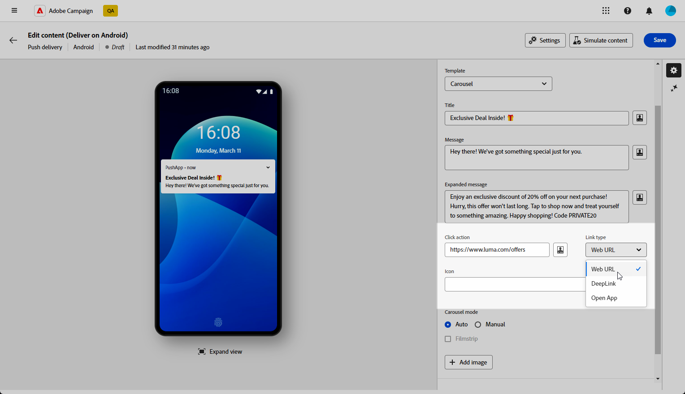

# Criar uma entrega de push avançada do Android {#rich-push}

Com o Firebase Cloud Messaging, você pode escolher entre dois tipos de mensagens:

* A variável **[!UICONTROL Mensagem de dados]** é manipulada pelo aplicativo do cliente. Essas mensagens são enviadas diretamente para o aplicativo móvel, que gera e exibe uma notificação do Android no dispositivo. As mensagens de dados contêm somente as variáveis personalizadas do aplicativo.

* A variável **[!UICONTROL Mensagem de notificação]**, manipulada automaticamente pelo SDK do FCM. O FCM exibe automaticamente a mensagem nos dispositivos dos usuários em nome do aplicativo do cliente. As mensagens de notificação contêm um conjunto predefinido de parâmetros e opções, mas ainda podem ser personalizadas com variáveis de aplicativo personalizadas.

{zoomable=&quot;yes&quot;}

## Definir o conteúdo da notificação {#push-message}

Depois que o delivery de push é criado, é possível definir seu conteúdo. Três modelos estão disponíveis:

* **Modelo padrão** O permite enviar notificações com um ícone simples e uma imagem que o acompanha.

* **Modelo básico** O pode incluir texto, imagens e botões em suas notificações.

* **Modelo do carrossel** O permite enviar notificações com texto e várias imagens que os usuários podem passar.

Navegue pelas guias abaixo para saber mais sobre como personalizar esses modelos.

>[!BEGINTABS]

>[!TAB Modelo padrão]

1. No **[!UICONTROL Modelo]** selecione **[!UICONTROL Padrão]**.

   

1. Para redigir a mensagem, insira o texto na caixa **[!UICONTROL Título]** e **[!UICONTROL Mensagem]** campos.

   

1. Use o Editor de expressão para definir o conteúdo, personalizar os dados e adicionar conteúdo dinâmico. [Saiba mais](../personalization/personalize.md)

1. Defina o **[!UICONTROL Ação Clicar]** associado a um usuário, clique em sua notificação. Isso determina o comportamento quando o usuário interage com a notificação, como abrir uma tela específica ou executar uma ação específica no aplicativo.

1. Para personalizar ainda mais sua notificação por push, você pode escolher um **[!UICONTROL Imagem]** URL a ser adicionado à sua notificação por push e ao do **[!UICONTROL Ícone]** para exibir nos dispositivos dos perfis.

   

1. Configure o **[!UICONTROL Configurações avançadas]** da sua notificação por push. [Saiba mais](#push-advanced)

Depois de definir o conteúdo da mensagem, você pode usar assinantes de teste para pré-visualizar e testar a mensagem.

>[!TAB Modelo básico]

1. No **[!UICONTROL Modelo]** selecione **[!UICONTROL Básico]**.

   

1. Para redigir a mensagem, insira o texto na caixa **[!UICONTROL Título]**, **[!UICONTROL Mensagem]** e **[!UICONTROL Mensagem expandida]** campos.

   A variável **[!UICONTROL Mensagem]** o texto aparece na exibição recolhida enquanto a variável **[!UICONTROL Mensagem expandida]** é exibido quando a notificação é expandida.

   

1. Use o Editor de expressão para definir o conteúdo, personalizar os dados e adicionar conteúdo dinâmico. [Saiba mais](../personalization/personalize.md)

1. Adicione o URL que define o **[!UICONTROL Ação Clicar]** associado a um usuário, clique em sua notificação. Isso determina o comportamento quando o usuário interage com a notificação, como abrir uma tela específica ou executar uma ação específica no aplicativo.

1. Selecione o **[!UICONTROL Tipo de link]** do URL adicionado à **[!UICONTROL Ação Clicar]** campo:

   * **[!UICONTROL URL da Web]**: os URLs da Web direcionam os usuários para o conteúdo online. Ao clicar em, eles solicitam que o navegador da Web padrão do dispositivo abra e navegue até o URL designado.

   * **[!UICONTROL Deeplink]**: deep links são URLs que orientam os usuários para seções específicas em um aplicativo, mesmo que ele esteja fechado. Quando clicada, uma caixa de diálogo pode ser exibida, permitindo que os usuários escolham entre vários aplicativos capazes de manipular o link.

   * **[!UICONTROL Abrir aplicativo]**: os URLs de aplicativos abertos permitem que você se conecte diretamente ao conteúdo em um aplicativo. Ela permite que o aplicativo se estabeleça como o manipulador padrão para um tipo específico de link, ignorando a caixa de diálogo de desambiguação.

   Para obter mais informações sobre como lidar com links de aplicativos do Android, consulte [Documentação de desenvolvedores do Android](https://developer.android.com/training/app-links).

   

1. Para personalizar ainda mais sua notificação por push, você pode escolher um **[!UICONTROL Imagem]** URL a ser adicionado à sua notificação por push e ao do **[!UICONTROL Ícone]** para exibir nos dispositivos dos perfis.

1. Clique em **[!UICONTROL Botão Adicionar]** e preencha os seguintes campos:

   * **[!UICONTROL Rótulo]**: Texto exibido no botão.
   * **[!UICONTROL URI do link]**: especifique o URI que será executado ao clicar no botão.
   * **[!UICONTROL Tipo de link]**: Tipo de link **[!UICONTROL URL da Web]**, **[!UICONTROL Deeplink]** ou **[!UICONTROL Abrir aplicativo]**.

   Você tem a opção de incluir até três botões na sua notificação por push. Se você optar pela opção **[!UICONTROL Botão Lembrar mais tarde]**, você só pode incluir no máximo dois botões.

   

1. Clique em **[!UICONTROL Adicionar lembrete depois]** botão para adicionar uma opção Lembre-me mais tarde à sua notificação por push. Insira um **[!UICONTROL Rótulo]** e **[!UICONTROL Carimbo de data e hora]**.

   O campo Timestamp espera um valor que representa uma época em segundos.

   

1. Configure o **[!UICONTROL Configurações avançadas]** da sua notificação por push. [Saiba mais](#push-advanced)

Depois de definir o conteúdo da mensagem, você pode usar assinantes de teste para pré-visualizar e testar a mensagem.

>[!TAB Modelo do carrossel]

1. No **[!UICONTROL Modelo]** selecione **[!UICONTROL Carrossel]**.

   

1. Para redigir a mensagem, insira o texto na caixa **[!UICONTROL Título]**, **[!UICONTROL Mensagem]** e **[!UICONTROL Mensagem expandida]** campos.

   A variável **[!UICONTROL Mensagem]** o texto aparece na exibição recolhida enquanto a variável **[!UICONTROL Mensagem expandida]** é exibido quando a notificação é expandida.

   

1. Use o Editor de expressão para definir o conteúdo, personalizar os dados e adicionar conteúdo dinâmico. [Saiba mais](../personalization/personalize.md)

1. Adicione o URL que define o **[!UICONTROL Ação Clicar]** associado a um usuário, clique em sua notificação. Isso determina o comportamento quando o usuário interage com a notificação, como abrir uma tela específica ou executar uma ação específica no aplicativo.

1. Selecione o **[!UICONTROL Tipo de link]** do URL adicionado à **[!UICONTROL Ação Clicar]** campo:

   * **[!UICONTROL URL da Web]**L: Os URLs da Web direcionam os usuários para o conteúdo online. Ao clicar em, eles solicitam que o navegador da Web padrão do dispositivo abra e navegue até o URL designado.

   * **[!UICONTROL Deeplink]**: deep links são URLs que orientam os usuários para seções específicas em um aplicativo, mesmo que ele esteja fechado. Quando clicada, uma caixa de diálogo pode ser exibida, permitindo que os usuários escolham entre vários aplicativos capazes de manipular o link.

   * **[!UICONTROL Abrir aplicativo]**: os URLs de aplicativos abertos permitem que você se conecte diretamente ao conteúdo em um aplicativo. Ela permite que o aplicativo se estabeleça como o manipulador padrão para um tipo específico de link, ignorando a caixa de diálogo de desambiguação.

   Para obter mais informações sobre como lidar com links de aplicativos do Android, consulte [Documentação de desenvolvedores do Android](https://developer.android.com/training/app-links).

   

1. Para personalizar ainda mais sua notificação por push, você pode escolher o **[!UICONTROL Ícone]** para exibir nos dispositivos dos perfis.

1. Escolha como o **[!UICONTROL carrossel]** é operado:

   * **[!UICONTROL Automático]**: o circula automaticamente pelas imagens como slides, fazendo a transição em intervalos predefinidos.
   * **[!UICONTROL Manual]**: permite que os usuários deslizem manualmente entre slides para navegar pelas imagens.

     Ativar o **[!UICONTROL Filmstrip]** opção para incluir visualizações das imagens anteriores e seguintes ao lado do slide principal.

1. Clique em **[!UICONTROL Adicionar imagem]** e insira o URL da imagem e o texto.

   Certifique-se de incluir no mínimo três imagens e no máximo cinco imagens.

   

1. Manipule a ordem das imagens com as setas para baixo e para cima.

1. Configure o **[!UICONTROL Configurações avançadas]** da sua notificação por push. [Saiba mais](#push-advanced)

Depois de definir o conteúdo da mensagem, você pode usar assinantes de teste para pré-visualizar e testar a mensagem.

>[!ENDTABS]

## Configurações avançadas de notificações por push {#push-advanced}

{zoomable=&quot;yes&quot;}

| Parâmetro | Descrição |
|---------|---------|
| **[!UICONTROL Cor do ícone]** | Defina a cor do ícone com seus códigos de cor hexadecimal. |
| **[!UICONTROL Cor do título]** | Defina a cor do Título com os códigos de cor hexadecimal. |
| **[!UICONTROL Cor do texto da mensagem]** | Defina a cor do texto da mensagem com os códigos de cor hexadecimal. |
| **[!UICONTROL Cor do plano de fundo da notificação]** | Defina a cor do plano de fundo da Notificação com os códigos de cor hexadecimal. |
| **[!UICONTROL Som]** | Defina o som que será reproduzido quando o dispositivo receber sua notificação. |
| **[!UICONTROL Contagem de notificações]** | Defina o número de novas informações não lidas a serem exibidas diretamente no ícone do aplicativo. Isso permite que o usuário veja rapidamente o número de notificações pendentes. |
| **[!UICONTROL ID do canal]** | Defina a ID do canal da sua notificação. O aplicativo deve criar um canal com essa ID de canal antes que qualquer notificação com essa ID de canal seja recebida. |
| **[!UICONTROL Tag]** | Defina um identificador usado para substituir notificações existentes na gaveta de notificações. Isso ajuda a evitar o acúmulo de várias notificações e garante que somente a notificação relevante mais recente seja exibida. |
| **[!UICONTROL Priority]** | Defina o nível de prioridade da sua notificação, que pode ser padrão, mínimo, baixo ou alto. O nível de prioridade determina a importância e a urgência da notificação, influenciando como ela é exibida e se pode ignorar determinadas configurações do sistema. Para obter mais informações, consulte a [documentação do FCM](https://firebase.google.com/docs/reference/fcm/rest/v1/projects.messages#notificationpriority). |
| **[!UICONTROL Visibilidade]** | Defina o nível de visibilidade de sua notificação, que pode ser público, privado ou secreto. O nível de visibilidade determina quanto do conteúdo da notificação é exibido na tela de bloqueio e em outras áreas confidenciais. Para obter mais informações, consulte [Documentação do FCM](https://firebase.google.com/docs/reference/fcm/rest/v1/projects.messages#visibility). |
| **[!UICONTROL Notificação adesiva]** | Quando ativada, a notificação permanece visível mesmo depois que o usuário clica nela.  Se desativada, a notificação é automaticamente descartada quando o usuário interage com ela. O comportamento fixo permite que notificações importantes persistam na tela por períodos mais longos. |
| **[!UICONTROL Variáveis do aplicativo]** | Permite definir o comportamento da notificação. Essas variáveis são totalmente personalizáveis e incluídas com parte do conteúdo da mensagem enviada para o dispositivo móvel. |
