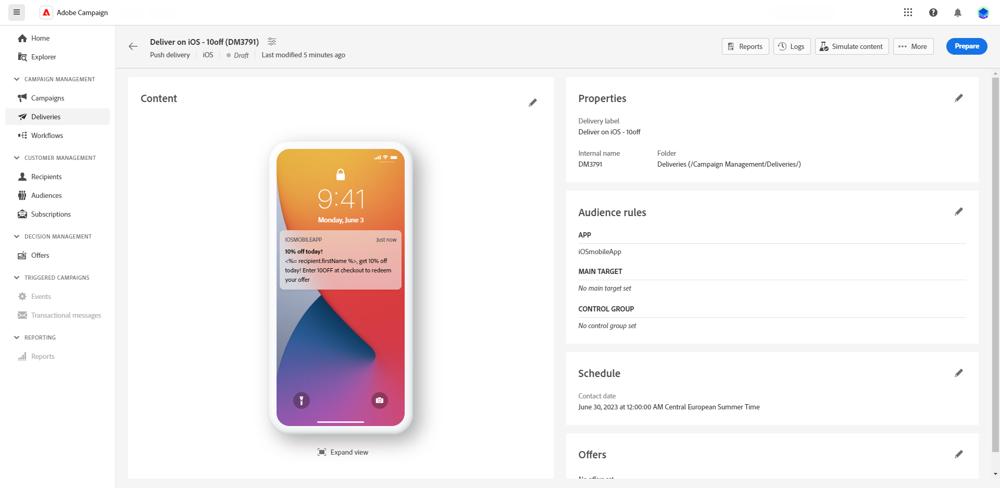

# Visualizar e enviar uma entrega por push {#send-push-delivery}

## Pré-visualizar o delivery de notificação por push {#preview-push}

Depois de definir o conteúdo da mensagem, você pode utilizar assinantes de teste para visualizar e testar a mensagem. Se você incluiu conteúdo personalizado, poderá examinar como esse conteúdo é exibido na mensagem usando os dados do perfil de teste. Isso permite garantir que a mensagem esteja sendo renderizada corretamente e que os elementos personalizados estejam sendo incorporados adequadamente.

As principais etapas para visualizar sua notificação por push são as seguintes. Mais detalhes sobre como visualizar deliveries estão disponíveis em [nesta seção](../preview-test/preview-content.md).

1. Na página de conteúdo do delivery, use **[!UICONTROL Simular conteúdo]** para visualizar seu conteúdo personalizado.

   {zoomable=&quot;yes&quot;}

1. Clique em **[!UICONTROL Adicionar assinante(s)]** para selecionar um ou vários perfis para visualizar seus dados no conteúdo da notificação por push.

   <!--Once your test subscribers are selected, click **[!UICONTROL Select]**.
    {zoomable="yes"}-->

1. No painel direito, você encontrará uma pré-visualização da notificação por push, em que os elementos personalizados são substituídos dinamicamente por dados do perfil selecionado.

   {zoomable=&quot;yes&quot;}

Agora você pode revisar e enviar a notificação por push para o público-alvo.

## Testar sua entrega de notificação por push {#test-push}

Usar **Adobe Campaign**, você pode enviar provas antes de enviá-las para o público-alvo principal. Essa etapa é importante para validar o delivery e identificar quaisquer problemas.
Os recipients de teste podem revisar elementos como links, imagens e configurações de personalização, garantindo o desempenho ideal e detectando erros. Esse processo ajuda a refinar e otimizar as notificações por push antes de atingir o público principal. [Saiba como enviar provas](../preview-test/test-deliveries.md#subscribers)

{zoomable=&quot;yes&quot;}

## Enviar a entrega de notificação por push {#send-push}

1. Após personalizar o conteúdo da notificação por push, clique em **[!UICONTROL Revisar e enviar]** do seu **[!UICONTROL Entrega]** página.

   {zoomable=&quot;yes&quot;}

1. Clique em **[!UICONTROL Preparar]** acompanhamento dos progressos e das estatísticas fornecidos.

   Se ocorrer algum erro, consulte o menu Logs para obter informações detalhadas sobre a falha.

   {zoomable=&quot;yes&quot;}

1. Envie as mensagens clicando em **[!UICONTROL Enviar]** para continuar com o processo final de envio.

1. Confirme a ação de envio clicando no ícone **[!UICONTROL Enviar]**.

   Se o delivery por push tiver sido agendado, clique no link **[!UICONTROL Enviar conforme agendado]** botão. Saiba mais sobre a programação de delivery em [nesta seção](../msg/gs-messages.md#schedule-the-delivery-sending).

   {zoomable=&quot;yes&quot;}

Depois que o delivery for enviado, você poderá rastrear os KPIs (indicadores principais de desempenho) na página do delivery e os dados na **[!UICONTROL Logs]** menu.

Agora você pode começar a medir o impacto de sua mensagem com relatórios integrados. [Saiba mais](../reporting/push-report.md)
