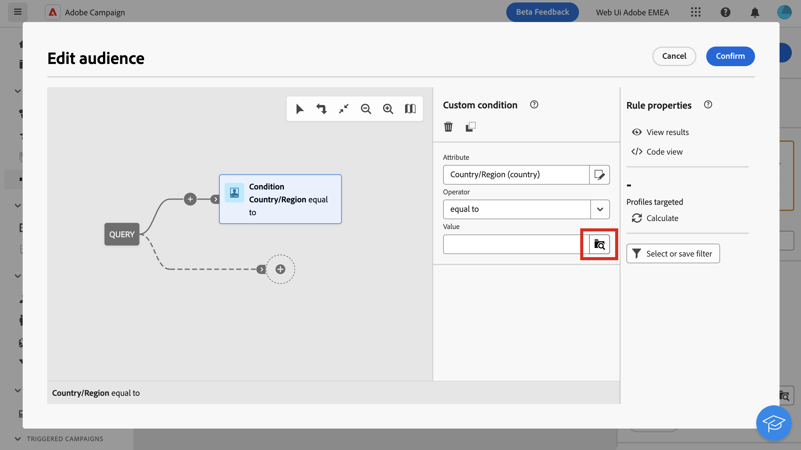
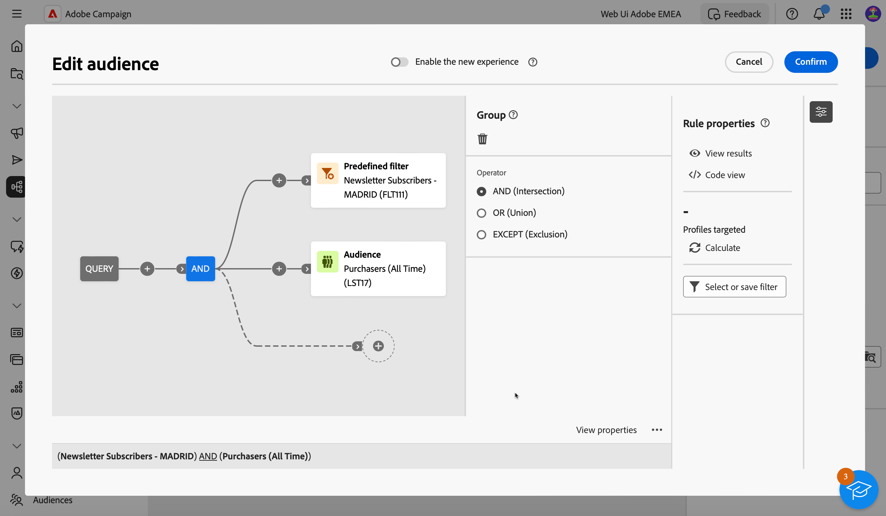
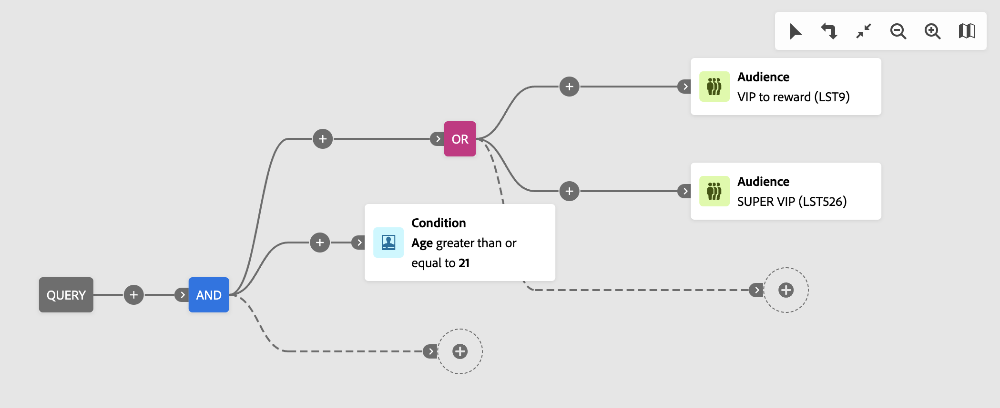
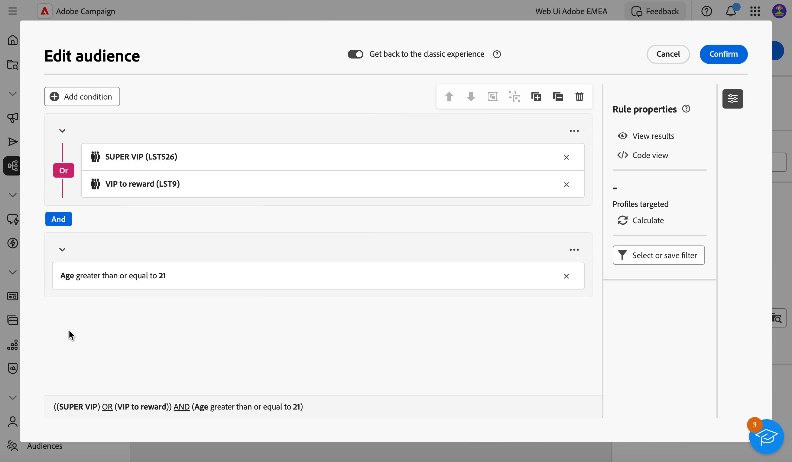

# Criar a primeira consulta {#build-query}

Para começar a criar uma consulta, acesse o modelador de consultas do local de sua escolha, dependendo da ação que deseja executar. O modelador de consultas é aberto com uma tela em branco. Clique no botão **+** para configurar o primeiro nó da consulta.

>[!IMPORTANT]
>
>Uma interface totalmente nova para o modelador de Consulta está disponível. O novo construtor de regras permite criar a consulta com mais facilidade graças à interface simplificada. Para alternar para essa experiência, pressione o botão de alternância no canto superior direito. Você pode voltar para o modelador de Query clássico a qualquer momento que desejar simplesmente pressionando o botão de alternância de volta para desativar a nova interface. Você pode aplicar os mesmos princípios que o modelador de consultas nessa nova interface.
>{zoomable="yes"}

Você pode adicionar dois tipos de elementos:

* **Os componentes de filtragem** (Condição personalizada, Selecionar público, Filtro predefinido) permitem que você crie suas próprias regras, selecione um público ou use um filtro predefinido para refinar sua consulta. Elas são adicionadas no início da query e em transições pontilhadas. [Saiba como trabalhar com componentes de filtragem](#filtering)

  Exemplo: *Recipients que assinaram o boletim informativo &quot;Esportes&quot;*, *Recipients que vivem em Nova York*, *Recipients que vivem em São Francisco*

>[!BEGINTABS]

>[!TAB Modelador de consulta clássico]

{zoomable="yes"}

>[!TAB Novo Construtor de regras]

{zoomable="yes"}

>[!ENDTABS]

* **Operadores de grupo** (AND, OR, EXCEPT) permitem agrupar componentes de filtragem no diagrama. Eles são adicionados em transições existentes antes de um componente de filtragem. [Saiba como trabalhar com operadores](#filtering)

  Exemplo: *Recipients que são Super VIP **AND** VIP para premiar **OR** VIP Demo, **EXCEPT** recipients com menos de 21 anos e acima de 45.

>[!BEGINTABS]

>[!TAB Modelador de consulta clássico]

{zoomable="yes"}

>[!TAB Novo construtor de regras]

{zoomable="yes"}

>[!ENDTABS]

## Distribuição de valores em uma consulta {#distribution-values-query}

A distribuição de valores mostra a porcentagem de cada valor de um campo em uma tabela, com base nos parâmetros de consulta atuais. Conhecer a distribuição de valores em um query ajuda a refinar a segmentação.

Para acessar essa opção, em sua query, clique no botão de seleção de atributo, conforme mostrado abaixo. Em seguida, clique no ícone **[!UICONTROL Informações]** ao lado do atributo selecionado. Você pode acessar o botão **[!UICONTROL Distribuição de valores]**.

{zoomable="yes"}

>[!NOTE]
>
>* Para campos com muitos valores, somente os primeiros vinte valores são exibidos. Nesses casos, uma notificação **[!UICONTROL Carga parcial]** avisa você.
>* A opção **[!UICONTROL Distribuição de valores]** está acessível em todos os seletores de atributos. [Saiba como selecionar atributos](../get-started/attributes.md)
>* Você pode adicionar condições aos resultados usando os **[ !Afiltros avançados]**. [Saiba mais aqui](../get-started/work-with-folders.md#filter-the-values).

## Adicionar componentes de filtragem {#filtering}

Os componentes de filtragem permitem refinar a consulta usando:

* **[Condições personalizadas](#custom-condition)**: filtre sua consulta criando sua própria condição com atributos do banco de dados e expressões avançadas.
* **[Públicos](#audiences)**: filtre sua consulta usando um público existente.
* **[Filtro predefinido](#predefined-filters)**: filtre sua consulta usando filtros predefinidos existentes.

### Configurar uma ação personalizada {#custom-condition}

>[!CONTEXTUALHELP]
>id="acw_orchestration_querymodeler_customcondition"
>title="Condição personalizada"
>abstract="As condições personalizadas são componentes de filtragem que permitem filtrar sua consulta criando sua própria condição com atributos do banco de dados e expressões avançadas."

Para filtrar sua consulta usando uma condição personalizada, siga estas etapas:

1. Clique no botão **+** no nó desejado e selecione **[!UICONTROL Condição personalizada]**. O painel de propriedades de condição personalizada é aberto no lado direito.

1. No campo **Atributo**, selecione o atributo do banco de dados que você deseja usar para criar sua condição. A lista de atributos inclui todos os atributos do banco de dados do Campaign, incluindo atributos de tabelas vinculadas. [Saiba como selecionar atributos e adicioná-los aos favoritos](../get-started/attributes.md)

   {zoomable="yes"}

   >[!NOTE]
   >
   >O botão **Editar expressão** permite usar o editor de expressão da Web do Campaign para definir manualmente uma expressão usando campos do banco de dados e funções auxiliares. [Saiba como editar expressões](expression-editor.md)

1. Selecione o operador a ser aplicado na lista suspensa. Vários operadores estão disponíveis para uso. Observe que os operadores disponíveis na lista suspensa dependem do tipo de dados do atributo.

   +++Lista de operadores disponíveis

   | Operador | Finalidade | Exemplo |
   |---|---|---|
   | Igual a | Retorna um resultado idêntico aos dados inseridos na segunda coluna de valor. | Last name (@lastName) equal to &#39;Jones&#39; retornará apenas destinatários cujo sobrenome seja Jones. |
   | Diferente de | Retorna todos os valores não idênticos ao valor inserido. | Idioma (@language) não é igual a &#39;English&#39;. |
   | Maior que | Retorna um valor maior que o valor digitado. | Age (@age) greater than 50 retornará todos os valores maiores que &#39;50&#39;, como &#39;51&#39;, &#39;52&#39;. |
   | Menor que | Retorna um valor menor que o valor digitado. | Creation date (@created) before &#39;DaysAgo(100)&#39; retornará todos os destinatários criados menos de 100 dias atrás. |
   | Maior que ou igual a | Retorna todos os valores iguais ou maiores que o valor digitado. | Age (@age) greater than or equal to &#39;30&#39; retornará todos os destinatários maiores de 30 anos ou mais. |
   | Menor que ou igual a | Retorna todos os valores iguais ou inferiores ao valor inserido. | Age (@age) less than or equal to &#39;60&#39; retornará todos os destinatários com 60 anos ou menos. |
   | Incluído em | Retorna resultados incluídos nos valores indicados. Esses valores devem ser separados por vírgula. | Birth date (@birthDate) is included in &#39;12/10/1979,12/10/1984&#39; retornará os destinatários nascidos entre essas datas. |
   | Não está em | Funciona como o operador Is included in. Aqui, os recipients são excluídos com base nos valores inseridos. | A data de nascimento (@birthDate) não está incluída em &#39;12/10/1979,12/10/1984&#39;. Os recipients nascidos nessas datas não serão retornados. |
   | Está vazio | Retorna os resultados que correspondem a um valor vazio na segunda coluna de valor. | Mobile (@mobilePhone) is empty retorna todos os destinatários que não têm número de celular. |
   | Não está vazio | Funciona de forma inversa ao operador Is empty. Não é necessário inserir dados na segunda coluna de valor. | O email (@email) não está vazio. |
   | Começa com | Retorna resultados iniciando com o valor inserido. | Account # (@account) starts with &#39;32010&#39;. |
   | Não começa com | Retorna resultados que não começam com o valor inserido. | Account # (@account) não começa com &#39;20&#39;. |
   | Contém | Retorna resultados contendo pelo menos o valor inserido. | Email domain (@domain) contains &#39;mail&#39; retornará todos os nomes de domínio que contêm &#39;mail&#39;, como &#39;gmail.com&#39;. |
   | Não contém | Retorna resultados não contendo o valor digitado. | O domínio de email (@domain) não contém &#39;vo&#39;. Nomes de domínio contendo &#39;vo&#39;, como &#39;voila.fr&#39;, não aparecerão nos resultados. |
   | Curtir | Semelhante ao operador Contains, permite inserir um caractere curinga % no valor. | Sobrenome (@lastName) como &#39;Jon%s&#39;. O caractere curinga atua como um &quot;joker&quot; para encontrar nomes como &quot;Jones&quot;. |
   | Not like | Semelhante ao operador Contains, permite inserir um caractere curinga % no valor. | Sobrenome (@lastName) diferente de &#39;Smi%h&#39;. Os destinatários que têm &#39;Smith&#39; como sobrenome não serão retornados. |

   +++

1. No campo **Value**, defina o valor esperado. Você também pode usar o editor de expressão da Web do Campaign para definir manualmente uma expressão usando campos do banco de dados e funções auxiliares. Para fazer isso, clique no botão **Editar expressão**. [Saiba como editar expressões](expression-editor.md)

   *Exemplo de consulta retornando todos os perfis com 21 anos ou mais:*

>[!BEGINTABS]

>[!TAB Modelador de consulta clássico]

{zoomable="yes"}

>[!TAB Novo construtor de regras]

{zoomable="yes"}

>[!ENDTABS]

Para atributos do tipo data, os valores predefinidos estão disponíveis usando a opção **[!UICONTROL Predefinições]**.

>[!BEGINTABS]

>[!TAB Modelador de consulta clássico]

{zoomable="yes"}

>[!TAB Novo construtor de regras]

{zoomable="yes"}

>[!ENDTABS]

#### Condições personalizadas em tabelas vinculadas (links 1-1 e 1-N){#links}

As condições personalizadas permitem consultar tabelas vinculadas à tabela usada atualmente pela regra. Isso inclui tabelas com um link de cardinalidade 1-1 ou tabelas de coleção (link 1-N).

Para um link **1-1**, navegue até a tabela vinculada, selecione o atributo desejado e defina o valor esperado.

Você também pode selecionar diretamente um link de tabela no seletor de **Valor** e confirmar. Nesse caso, os valores disponíveis para a tabela selecionada precisam ser selecionados usando um seletor dedicado, como mostrado no exemplo abaixo.

+++Exemplo de consulta

Aqui, a consulta está direcionando marcas cujo rótulo é &quot;running&quot;.

1. Navegue dentro da tabela **Marca** e selecione o atributo **Etiqueta**.

   {zoomable="yes"}{width="85%" align="center"}

1. Defina o valor esperado para o atributo.

   {zoomable="yes"}{width="85%" align="center"}

Esta é uma amostra de consulta em que um link de tabela foi selecionado diretamente. Os valores disponíveis para esta tabela devem ser selecionados em um seletor dedicado.

{zoomable="yes"}{width="85%" align="center"}

+++

Para um link **1-N**, você pode definir subcondições para refinar sua consulta, como mostrado no exemplo abaixo.

+++Exemplo de consulta

Aqui, o query é direcionado a recipients que fizeram compras relacionadas ao produto BrewMaster, para um valor total de pelo menos 100$.

1. Selecione a tabela **Compras** e confirme.

   {zoomable="yes"}{width="50%" align="center"}

1. Uma transição de saída é adicionada, permitindo criar subcondições.

   {zoomable="yes"}{width="85%" align="center"}

1. Selecione o atributo **Preço** e direcione compras de US$ 1000 ou mais

   {zoomable="yes"}{width="85%" align="center"}

1. Adicione subcondições para atender às suas necessidades. Aqui adicionamos uma condição aos perfis do público-alvo que compraram um produto BrewMaster.

   {zoomable="yes"}{width="85%" align="center"}

+++

#### Trabalhar com dados agregados {#aggregate}

As condições personalizadas permitem executar operações agregadas. Para fazer isso, você precisa selecionar diretamente um atributo de uma tabela de coleção:

1. Navegue dentro da tabela de coleção desejada e selecione o atributo no qual deseja executar uma operação agregada.

   {zoomable="yes"}{width="85%" align="center"}

1. No painel de propriedades, alterne a opção **Aggregate data** e selecione a função de agregação desejada.

>[!BEGINTABS]

>[!TAB Modelador de consulta clássico]

{zoomable="yes"}{width="85%" align="center"}

>[!TAB Novo construtor de regras]

{zoomable="yes"}{width="85%" align="center"}

>[!ENDTABS]

### Selecionar um público-alvo {#audiences}

>[!CONTEXTUALHELP]
>id="acw_orchestration_querymodeler_selectaudience"
>title="Selecionar público-alvo"
>abstract="A opção **Selecionar público-alvo** permite escolher o público-alvo pelo qual deseja filtrar a sua consulta."

Para filtrar sua query usando um público existente, siga estas etapas:

>[!BEGINTABS]

>[!TAB Modelador de consulta clássico]

1. Clique no botão **+** no nó desejado e escolha **[!UICONTROL Selecionar público-alvo]**.

1. O painel de propriedades **Selecionar público-alvo** é aberto no lado direito. Escolha o público-alvo que deseja usar para filtrar o query.

   *Exemplo de consulta retornando todos os perfis que pertencem ao público-alvo do &quot;Festival Goers&quot;:*

   {zoomable="yes"}

>[!TAB Novo construtor de regras]

1. Clique no botão **Expandir** ao lado do botão **[!UICONTROL Adicionar condição]** e escolha **[!UICONTROL Selecionar público-alvo]**.

1. O painel de propriedades **Selecionar público-alvo** é aberto no lado direito. Escolha o público-alvo que deseja usar para filtrar o query.

   *Exemplo de consulta retornando todos os perfis que pertencem ao público-alvo da &quot;Coffee Works&quot;:*

   {zoomable="yes"}

>[!ENDTABS]

### Usar um filtro predefinido {#predefined-filters}

>[!CONTEXTUALHELP]
>id="acw_orchestration_querymodeler_predefinedfilter"
>title="Filtro predefinido"
>abstract="A opção **Filtro predefinido** permite selecionar um filtro predefinido na lista de filtros personalizados ou nos favoritos."

Para filtrar sua query usando um filtro predefinido, siga estas etapas:

>[!BEGINTABS]

>[!TAB Modelador de consulta clássico]

1. Clique no botão **+** no nó desejado e selecione **[!UICONTROL Filtro predefinido]**.

1. O painel de propriedades **Filtro predefinido** é aberto no lado direito. Selecione um filtro predefinido na lista de filtros personalizados ou nos favoritos.

   *Exemplo de consulta retornando todos os perfis correspondentes ao filtro predefinido &quot;Clientes inativos&quot;:*

   {zoomable="yes"}

>[!TAB Novo construtor de regras]

1. Clique no botão **Expandir** ao lado do botão **[!UICONTROL Adicionar condição]** e selecione **[!UICONTROL Filtro predefinido]**.

1. O painel de propriedades **Filtro predefinido** é aberto no lado direito. Selecione um filtro predefinido na lista de filtros personalizados ou nos favoritos.

   *Exemplo de consulta retornando todos os perfis correspondentes ao filtro predefinido &quot;Clientes inativos&quot;:*

   {zoomable="yes"}

>[!ENDTABS]

### Copiar e colar componentes {#copy}

O modelador de query permite copiar um ou vários componentes de filtragem e colá-los no final de uma transição. Essa operação pode ser executada na tela de consulta atual ou em qualquer tela na instância.

>[!NOTE]
>
>A seleção copiada é mantida enquanto você estiver trabalhando na instância. Se você fizer logoff e logon novamente, sua seleção não estará mais disponível para colagem.

>[!IMPORTANT]
>
>No momento, é impossível copiar e colar componentes na experiência do Construtor de novas regras. Para seguir estas próximas etapas, clique no botão **[!UICONTROL Voltar à experiência clássica]** na parte superior para usar o modelador de Consulta Clássica.

Para copiar e colar componentes de filtragem, siga estas etapas:

1. Selecione o componente de filtragem que deseja copiar clicando nele na tela de consulta. Para selecionar vários componentes, use a ferramenta de seleção múltipla disponível na barra de ferramentas, localizada no canto superior direito da tela.

1. Clique no botão **[!UICONTROL Copiar]** no painel de propriedades do componente ou na faixa de opções azul na parte inferior da tela se tiver selecionado vários componentes.

   | Copiar um único componente | Copiar vários componentes |
   |  ---  |  ---  |
   | {zoomable="yes"}{width="200" align="center" zoomable="yes"} | {zoomable="yes"}{width="200" align="center" zoomable="yes"} |

1. Para colar o(s) componente(s), clique no botão + no final da transição desejada e selecione **Colar n itens**.

   {zoomable="yes"}

## Combinar componentes de filtragem com operadores {#operators}

>[!CONTEXTUALHELP]
>id="acw_orchestration_querymodeler_group"
>title="Grupo"
>abstract="Nesse painel, é possível alterar o operador usado para vincular as condições do filtro."

Sempre que um novo componente de filtragem é adicionado à consulta, ele é automaticamente vinculado ao outro componente por um operador **AND**. Isso significa que os resultados dos dois componentes de filtragem são combinados.

Neste exemplo, adicionamos novos componentes de filtragem do tipo público-alvo na segunda transição. O componente está vinculado à condição de filtro predefinida com um operador **AND**, o que significa que os resultados da consulta incluem destinatários direcionados pelo filtro predefinido &quot;Assinantes do Boletim Informativo - MADRID&quot; E pertencentes ao público-alvo &quot;Compradores (Todos os Tempos)&quot;.

>[!BEGINTABS]

>[!TAB Modelador de consulta clássico]

{zoomable="yes"}

Para alterar o operador usado para vincular as condições do filtro, clique nele e selecione o operador desejado no painel **Grupo** que será aberto no lado direito.

Os operadores disponíveis são:

* **AND (Interseção)**: combina resultados que correspondem a todos os componentes de filtragem nas transições de saída.
* **OR (União)**: inclui resultados que correspondem a pelo menos um dos componentes de filtragem nas transições de saída.
* **EXCETO (Exclusão)**: exclui resultados que correspondem a todos os componentes de filtragem na transição de saída.

{zoomable="yes"}

Além disso, você pode criar grupos intermediários de componentes agrupando componentes em um mesmo grupo e vinculando-os. Dessa forma, o operador AND será colocado por padrão, e você poderá alterá-lo para o operador desejado.

>[!TAB Novo construtor de regras]

{zoomable="yes"}

Para alterar o operador usado para vincular as condições do filtro, clique nele, ele será alterado para OR, EXCETO e, em seguida, de volta para AND e selecione o operador desejado.

Os operadores disponíveis são:

* **AND (Interseção)**: combina resultados que correspondem a todos os componentes de filtragem nas transições de saída.
* **OR (União)**: inclui resultados que correspondem a pelo menos um dos componentes de filtragem nas transições de saída.
* **EXCETO (Exclusão)**: exclui resultados que correspondem a todos os componentes de filtragem na transição de saída.

{zoomable="yes"}

>[!ENDTABS]

No exemplo abaixo, criamos um grupo intermediário para incluir resultados dos públicos &quot;VIP para premiar&quot; ou &quot;Super VIP&quot;.

>[!BEGINTABS]

>[!TAB Modelador de consulta clássico]

{zoomable="yes"}

>[!TAB Novo construtor de regras]

{zoomable="yes"}

>[!ENDTABS]

## Verificar e validar sua consulta

>[!CONTEXTUALHELP]
>id="acw_orchestration_querymodeler_ruleproperties"
>title="Propriedades da regra"
>abstract="Depois de criar a consulta na tela, é possível verificá-la usando o painel **Propriedades da regra** localizado no lado direito. Esse painel permite exibir os dados resultantes, recuperar uma versão de código SQL da consulta e verificar o número de registros direcionados. Use o botão **Selecionar ou salvar filtro** para salvar sua consulta como um filtro predefinido ou substituir o conteúdo da tela por um filtro."

Depois de criar a consulta na tela, você pode verificá-la usando o painel **Propriedades da regra**, localizado no lado direito. Esse painel é exibido ao criar uma consulta para criar um público-alvo. As operações disponíveis são:

* **Exibir resultados:** Exibe os dados resultantes da sua consulta.
* **Visualização de código**: exibe uma versão baseada em código da consulta no SQL.
* **Calcular**: atualiza e exibe o número de registros direcionados por sua consulta.
* **Selecionar ou salvar filtro**: escolha um filtro predefinido existente para usar na tela ou salve sua consulta como um filtro predefinido para reutilização futura. [Saiba como trabalhar com filtros predefinidos](../get-started/predefined-filters.md)

  >[!IMPORTANT]
  >
  >Selecione um filtro predefinido no painel de propriedades Regra para substituir a consulta criada na tela pelo filtro selecionado.

Quando a consulta estiver pronta, clique no botão **[!UICONTROL Confirmar]** no canto superior direito para salvá-la.

>[!BEGINTABS]

>[!TAB Modelador de consulta clássico]

Você pode modificar sua query a qualquer momento abrindo-a. Lembre-se de que, ao abrir uma consulta existente, ela é exibida em uma exibição simplificada, sem a visibilidade dos botões **+**. Para adicionar novos elementos à consulta, selecione um componente ou operador na tela para exibir os botões **+**.

{zoomable="yes"}

>[!TAB Novo Construtor de regras]

Você pode modificar sua consulta a qualquer momento abrindo-a e, para isso, clique no botão **[!UICONTROL Adicionar condição]** no canto superior esquerdo.

{zoomable="yes"}

>[!ENDTABS]
