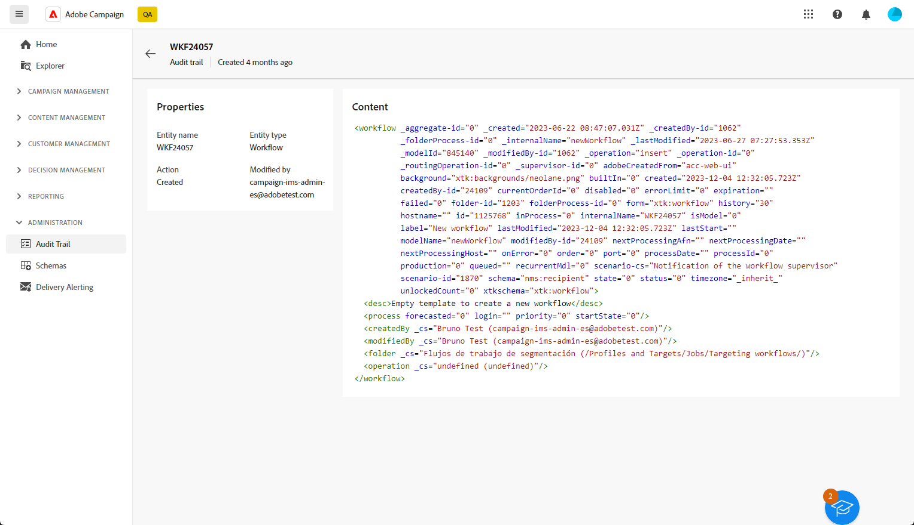

# Trilha de auditoria {#audit-trail}

Na Interface do Usuário da Web do Adobe Campaign, o recurso **[!UICONTROL Trilha de auditoria]** fornece aos usuários total visibilidade de todas as modificações feitas em entidades importantes na sua instância, normalmente aquelas que afetam significativamente a operação suave da instância.

>[!IMPORTANT]
>
>* A interface da Web do Adobe Campaign não audita alterações feitas em direitos de usuário, modelos, personalização ou campanhas.
>* Somente os administradores da instância podem gerenciar a trilha de auditoria.

O recurso **[!UICONTROL Trilha de auditoria]** registra constantemente um log detalhado de ações e eventos que ocorrem na instância do Adobe Campaign em tempo real. Ele oferece um método conveniente para acessar um registro cronológico de dados, abordando queries, como o status dos workflows, os indivíduos mais recentes para modificá-los ou as atividades executadas pelos usuários na instância.

+++ Saiba mais sobre entidades disponíveis de Trilha de auditoria

* **A trilha de auditoria do esquema do Source** permite monitorar atividades e modificações recentes feitas em seus esquemas no console do cliente do Campaign v8.

  Para obter informações detalhadas sobre schemas, consulte a [Documentação do Campaign v8](https://experienceleague.adobe.com/en/docs/campaign/campaign-v8/developer/shemas-forms/schemas).

* A **trilha de auditoria do fluxo de trabalho** permite acompanhar atividades e alterações recentes feitas nos fluxos de trabalho, incluindo seus estados atuais, como:

   * Start
   * Pause
   * Stop
   * Restart
   * Limpeza, que é igual ao histórico de Expurgação da ação
   * Simular, que é igual à ação Iniciar no modo de simulação
   * Wakeup, que é igual à ação Executar tarefas pendentes agora
   * Unconditional Stop

  Para obter mais informações sobre fluxos de trabalho, consulte esta [página](../workflows/gs-workflows.md).

* A **Trilha de auditoria de opção** permite monitorar atividades e modificações recentes feitas em suas opções no Campaign v8.

  Para obter mais informações sobre opções, consulte esta [página](https://experienceleague.adobe.com/en/docs/campaign-classic/using/installing-campaign-classic/appendices/configuring-campaign-options).

* **Trilha de auditoria de entrega** permite que você verifique as atividades e as últimas modificações feitas em suas entregas.

  Para obter mais informações sobre entregas, consulte esta [página](../msg/gs-deliveries.md).

* **Conta externa** permite que você verifique modificações feitas em contas externas no Campaign v8, usadas por processos técnicos, como workflows técnicos ou workflows da campanha.

  Para obter mais informações sobre contas externas, consulte esta [página](../administration/external-account.md).

* **O mapeamento de entrega** permite monitorar atividades e modificações recentes feitas no mapeamento de entrega no Campaign v8.

  Para obter mais informações sobre mapeamento de entrega, consulte esta [página](https://experienceleague.adobe.com/en/docs/campaign/campaign-v8/audience/add-profiles/target-mappings).

* O **Aplicativo Web** permite verificar as modificações feitas em formulários Web no Campaign v8, usados para criar páginas com campos de entrada e seleção e que podem incluir dados do banco de dados.

  Para obter mais informações sobre aplicativos Web, consulte esta [página](https://experienceleague.adobe.com/en/docs/campaign/campaign-v8/content/webapps).

* A **Oferta** permite que você verifique as atividades e as últimas modificações feitas em suas ofertas.

  Para obter mais informações sobre ofertas, consulte esta [página](../msg/offers.md).

* **Operador** permite monitorar atividades e modificações recentes feitas aos seus Operadores no Campaign v8.

  Para obter mais informações sobre operadores, consulte esta [página](https://experienceleague.adobe.com/en/docs/campaign/campaign-v8/offers/interaction-settings/interaction-operators).

+++

## Acessando a Trilha de auditoria {#accessing-audit-trail}

Para acessar a **[!UICONTROL Trilha de auditoria]** da sua instância:

1. No menu **[!UICONTROL Administração]**, selecione **[!UICONTROL Trilha de auditoria]**.

   

1. A janela **[!UICONTROL Trilha de auditoria]** é aberta com a lista de suas entidades. A Interface do usuário da Web do Adobe Campaign audita as ações de criação, edição e exclusão de workflows, opções, deliveries e esquemas.

   Selecione uma das entidades para saber mais sobre as últimas modificações.

1. A janela **[!UICONTROL Entidade de auditoria]** fornece informações detalhadas sobre a entidade escolhida, como:

   * **[!UICONTROL Tipo]**: Fluxo de Trabalho, Opções, Entregas ou Esquemas.
   * **[!UICONTROL Entidade]**: nome interno de suas atividades.
   * **[!UICONTROL Modificado por]**: nome de usuário da última pessoa que modificou esta entidade.
   * **[!UICONTROL Ação]**: última ação executada nesta entidade, Criada, Modificada ou Excluída.
   * **[!UICONTROL Data de modificação]**: data da última ação executada nesta entidade.

   O bloco de código fornece mais informações sobre o que foi alterado exatamente em sua entidade.

   