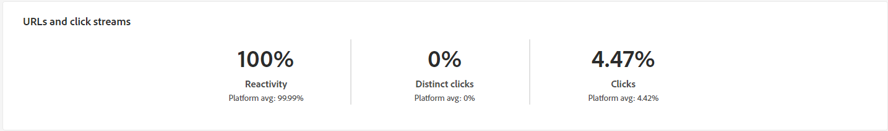

# Relatórios de campanha para o canal de email {#campaign-reports-email-channel}

Cada relatório de campanha é dividido em widgets diferentes detalhando o sucesso e os erros da campanha. Para o canal de email, os relatórios e as métricas são detalhados abaixo. Saiba como acessar os relatórios de campanha no [esta página](campaign-reports.md).

## Resumo da entrega {#delivery-summary-email}

>[!CONTEXTUALHELP]
>id="acw_campaign_reporting_deliveries_overview"
>title="Visão geral da entrega"
>abstract="A **Visão geral da entrega** fornece indicadores principais de desempenho (KPIs) que contêm informações detalhadas sobre o engajamento de visitantes com a entrega de email."

### Visão geral da entrega {#delivery-summary-email-ovv}

A variável **[!UICONTROL Visão geral da entrega]** O relatório do fornece indicadores principais de desempenho (KPIs) que fornecem informações detalhadas sobre como os visitantes se envolvem com o delivery de email. As métricas estão detalhadas abaixo.

+++Saiba mais sobre Métricas de relatório da campanha de email.

* **[!UICONTROL Total enviado]**: Número total de mensagens processadas durante a preparação do delivery.

* **[!UICONTROL Entregue]**: Número de mensagens enviadas com êxito em relação ao número total de mensagens enviadas.

* **[!UICONTROL Rejeições]**: Total de erros acumulados durante o processamento de delivery e retorno automático em relação ao número total de mensagens enviadas.

* **[!UICONTROL Aberturas distintas]**: número total de recipients alvos que abriram uma mensagem pelo menos uma vez.

* **[!UICONTROL Cliques distintos]**: Número total de recipients distintos que clicaram em um delivery pelo menos uma vez.

+++

### Estatísticas iniciais do público-alvo {#delivery-summary-email-initial-target}

>[!CONTEXTUALHELP]
>id="acw_campaign_reporting_deliveries_target"
>title="Estatísticas iniciais do público-alvo"
>abstract="A tabela Estatísticas iniciais do público-alvo exibe os dados relativos aos destinatários"

A tabela **[!UICONTROL Estatísticas iniciais do público-alvo]** exibe dados relativos aos destinatários. As métricas estão detalhadas abaixo.

+++Saiba mais sobre Métricas de relatório da campanha de email.

* **[!UICONTROL Público inicial]**: Número total de recipients alvos.

* **[!UICONTROL Mensagem a ser entregue]**: Número total de mensagens a serem entregues após a preparação do delivery.

* **[!UICONTROL Rejeitado por regras]**: Número total de endereços ignorados durante a análise ao aplicar as regras: endereço em falta, em quarentena, na inclui na lista de bloqueios, etc.

+++

### Estatísticas de execução {#delivery-summary-email-exec-stats}

>[!CONTEXTUALHELP]
>id="acw_campaign_reporting_email_exec_stats"
>title="Estatísticas de execução"
>abstract="A tabela **Estatísticas de execução** detalha o sucesso da entrega: mensagens a serem entregues, sucesso, erros e novas quarentenas."

A variável **[!UICONTROL Estatísticas de execução]** A tabela detalha o sucesso do delivery. As métricas estão detalhadas abaixo.

+++Saiba mais sobre Métricas de relatório da campanha de email.

* **[!UICONTROL Mensagem a ser entregue]**: Número total de mensagens a serem entregues após a preparação do delivery.

* **[!UICONTROL Sucesso]**: Número de mensagens processadas com êxito em relação ao número de mensagens a serem entregues.

* **[!UICONTROL Erros]**: Número total de erros acumulados durante os deliveries e o processamento automático de reassociação em relação ao número de mensagens a serem entregues.

* **[!UICONTROL Novos em quarentena]**: Número total de endereços colocados em quarentena após um delivery com falha (usuário desconhecido, domínio inválido) em relação ao número de mensagens a serem entregues.

  Os tipos de erro de email estão listados no [Documentação do Adobe Campaign v8 (console do cliente)](https://experienceleague.adobe.com/docs/campaign/campaign-v8/send/failures/delivery-failures.html#email-error-types){target="_blank"}.

+++

### Estatísticas de reação {#delivery-summary-email-reaction-stats}

>[!CONTEXTUALHELP]
>id="acw_campaign_reporting_email_reaction_stats"
>title="Estatísticas de reação"
>abstract="A tabela **Estatísticas de reação** mostra os dados disponíveis para a atividade do destinatário da sua entrega: número de aberturas, assinaturas, cancelamentos de assinatura, cliques no link da mirror page."

A variável **[!UICONTROL Estatísticas de reação]** A tabela contém os dados disponíveis para a atividade do recipient para o seu delivery. As métricas estão detalhadas abaixo.

+++Saiba mais sobre Métricas de relatório da campanha de email.

* **[!UICONTROL Aberturas distintas]**: número total de recipients alvos que abriram uma mensagem pelo menos uma vez.

* **[!UICONTROL Opens]**: Número de recipients alvos distintos para este domínio que abriram uma mensagem pelo menos uma vez.

* **[!UICONTROL Cancelamentos de assinatura]**: número de recipients que clicaram em unsubscriptions para o período relacionado.

* **[!UICONTROL Mirror page]**: Número de recipients que clicaram no link da mirror page.

* **[!UICONTROL Encaminhamentos]**: Número de recipients que clicaram para encaminhar o email.
+++

### Fluxos de cliques gerados {#delivery-summary-email-click-streams}

>[!CONTEXTUALHELP]
>id="acw_campaign_reporting_email_click_streams"
>title="Fluxos de cliques gerados"
>abstract="A tabela **Fluxos de clique gerados** mostra os dados disponíveis relativos a como seus destinatários interagiram com a entrega."

A variável **[!UICONTROL Fluxos de clique gerados]** A tabela exibe dados relativos a como seus recipients interagiram com o delivery. As métricas estão detalhadas abaixo.

+++Saiba mais sobre Métricas de relatório da campanha de email.

* **[!UICONTROL Cliques distintos]**: Número total de recipients distintos que clicaram em um delivery pelo menos uma vez.

* **[!UICONTROL Clicks]** : Número total de cliques nos links nos deliveries.

* **[!UICONTROL Reactivity]**: Taxa do número de recipients alvos que clicaram em um delivery em relação ao número estimado de recipients alvos que abriram um delivery.

+++

## Não entregues {#non-deliverables-email}

### Detalhamento de erros por tipo {#delivery-summary-email-breakdown-per-type}

>[!CONTEXTUALHELP]
>id="acw_campaign_reporting_error_type"
>title="Detalhamento de erros por tipo"
>abstract="A tabela e o gráfico **Detalhamento de erros por tipo** contêm os dados disponíveis para cada tipo de erro encontrado: usuário desconhecido, caixa de entrada cheia, domínio inválido e muito mais."

A variável **[!UICONTROL Detalhamento de erros por tipo]** A tabela e o gráfico contêm os dados disponíveis para possíveis erros encontrados para cada tipo de domínio. As métricas estão detalhadas abaixo.

Os erros exibidos nesse relatório acionam o processo de quarentena. Para obter mais informações sobre gestão de quarentena, consulte [Documentação do Campaign v8 (console do cliente)](https://experienceleague.adobe.com/docs/campaign/campaign-v8/campaigns/send/failures/delivery-failures.html?lang=pt-BR){target="_blank"}.

+++Saiba mais sobre Métricas de relatório da campanha de email.

* **[!UICONTROL User unknown]** : Tipo de erro gerado durante o delivery para indicar que o endereço de email é inválido.

* **[!UICONTROL invalid domain]** : Tipo de erro gerado ao enviar um delivery para indicar que o domínio do endereço de email está errado ou não existe.

* **[!UICONTROL Caixa de entrada cheia]**: Tipo de erro gerado após cinco tentativas de delivery para indicar que a caixa de entrada dos recipients contém muitas mensagens.

* **[!UICONTROL Account disabled]** : Tipo de erro gerado ao enviar um delivery para indicar que o endereço não existe mais.

* **[!UICONTROL Recusado]**: Tipo de erro gerado quando um endereço é rejeitado pelo IAP (Provedor de Acesso à Internet), por exemplo, ao seguir uma regra de segurança da aplicação (software antispam).

* **[!UICONTROL Unreachable]** : Tipo de erro que ocorre na string de distribuição de mensagens: incidente na retransmissão SMTP, domínio temporariamente inacessível, etc

* **[!UICONTROL Not connected]** : Tipo de erro para indicar que o celular do recipient está desligado ou sem rede no momento do envio.

+++

### Detalhamento de erros por domínio {#delivery-summary-email-breakdown-per-domain}

>[!CONTEXTUALHELP]
>id="acw_campaign_reporting_error_domain"
>title="Detalhamento de erros por domínio"
>abstract="A tabela e o gráfico **Detalhamento de erros por domínio** exibem os dados disponíveis para cada tipo de erro encontrado, dependendo de cada domínio."

A variável **[!UICONTROL Detalhamento de erros por domínio]** A tabela e o gráfico contêm os dados disponíveis para possíveis erros encontrados com cada domínio. As métricas são comuns com **[!UICONTROL Detalhamento de erros por tipo]** tabela e gráfico detalhados acima.

## Indicadores de rastreamento {#tracking-indicators-email}

### Estatísticas de entrega {#delivery-summary-email-statistics}

>[!CONTEXTUALHELP]
>id="acw_delivery_campaign_delivery_statistics_summary"
>title="Estatísticas de entrega"
>abstract="O gráfico **Estatísticas de entrega** detalha o sucesso da entrega e os erros que ocorreram."

A variável **[!UICONTROL Estatísticas de entrega]** As métricas do fornecem indicadores principais de desempenho (KPIs) que fornecem informações detalhadas sobre os dados disponíveis para emails enviados. As métricas estão detalhadas abaixo.

+++Saiba mais sobre Métricas de relatório da campanha de email.

* **[!UICONTROL Sucesso]**: Número de mensagens processadas com êxito em relação ao número de mensagens a serem entregues.

* **[!UICONTROL Aberturas distintas]**: número total de recipients alvos que abriram uma mensagem pelo menos uma vez.

* **[!UICONTROL Opens]**: Número de recipients alvos distintos para este domínio que abriram uma mensagem pelo menos uma vez.

* **[!UICONTROL Cliques no link para opção de não participação]**: Número de cliques no link unsubscription.

* **[!UICONTROL Clicks on the mirror link]**: Número de cliques no link para a mirror page.

* **[!UICONTROL Estimation of forwards]**: Estimativa do número de emails encaminhados pelos recipients alvos.
+++

### Índice de abertura e click-through {#delivery-summary-open-rate}

>[!CONTEXTUALHELP]
>id="acw_campaign_reporting_open_clickthrough"
>title="Índice de abertura e click-through"
>abstract="A tabela **Índice de abertura e click-through** exibe dados relativos ao engajamento dos destinatários com a entrega."

A variável **[!UICONTROL Índice de abertura e click-through]** A tabela exibe dados relativos aos recipients. As métricas estão detalhadas abaixo.

+++Saiba mais sobre Métricas de relatório da campanha de email.

* **[!UICONTROL Enviado]**: Número total de mensagens enviadas.

* **[!UICONTROL Complaints]**: Número de mensagens deste domínio relatadas como indesejáveis pelo recipient.

* **[!UICONTROL Opens]**: Número de recipients alvos distintos para este domínio que abriram uma mensagem pelo menos uma vez.

* **[!UICONTROL Clicks]**: Número de recipients alvos distintos que clicaram no mesmo delivery pelo menos uma vez.

* **[!UICONTROL Raw reactivity]**: Porcentagem do número de recipients que clicaram em um delivery pelo menos uma vez em comparação ao número de recipients que abriram um delivery pelo menos uma vez.
+++

## Fluxos de clique e URLs {#url-email}

>[!CONTEXTUALHELP]
>id="acw_campaign_reporting_urls_clickstreams"
>title="Fluxos de clique e URLs"
>abstract="O relatório **Fluxos de clique e URLs** fornece indicadores principais de desempenho (KPIs) com informações detalhadas sobre os URLs mais clicados durante uma entrega."

O relatório **[!UICONTROL Fluxos de clique e URLs]** fornece indicadores principais de desempenho (KPIs) com informações detalhadas sobre os URLs mais clicados durante uma entrega. As métricas estão detalhadas abaixo.

+++Saiba mais sobre Métricas de relatório da campanha de email.

* **[!UICONTROL Reactivity]**: Taxa do número de recipients alvos que clicaram em um delivery em relação ao número estimado de recipients alvos que abriram um delivery.

* **[!UICONTROL Cliques distintos]**: Número total de recipients distintos que clicaram em um delivery pelo menos uma vez.

* **[!UICONTROL Clicks]** : Número total de cliques nos links nos deliveries.

* **[!UICONTROL Platform average]**: Essa taxa média, exibida em cada taxa (reatividade, cliques distintos e cliques acumulados), é calculada para deliveries enviados nos seis meses anteriores. Somente os deliveries com a mesma tipologia e no mesmo canal são considerados. Provas são excluídas.
+++

### Os 10 links mais visitados {#top10-campaign-report-email}

>[!CONTEXTUALHELP]
>id="acw_campaign_reporting_urls_clickstreams_top10"
>title="Os 10 links mais visitados"
>abstract="O gráfico e a tabela **Os 10 links mais visitados** contêm os dados disponíveis relativos ao comportamento do destinatário em cada link."

A variável **[!UICONTROL Os 10 links mais visitados]** o gráfico e a tabela contêm os dados disponíveis para o comportamento do recipient por link. As métricas estão detalhadas abaixo.

+++Saiba mais sobre Métricas de relatório da campanha de email.

* **[!UICONTROL Clicks]** : Número total de cliques nos links nos deliveries.

* **[!UICONTROL Porcentagem]**: Porcentagem de usuários que interagiram com o delivery.

+++

### Detalhamento dos cliques ao longo do tempo {#campaign-report-email-breakdown-clicks}

>[!CONTEXTUALHELP]
>id="acw_delivery_campaign_urls_click_breakdown"
>title="Detalhamento dos cliques ao longo do tempo"
>abstract="O gráfico **Detalhamento dos cliques ao longo do tempo** mostra os dados disponíveis relativos ao comportamento do destinatário em cada link."

o **[!UICONTROL Detalhamento dos cliques ao longo do tempo]** o gráfico contém os dados disponíveis para o comportamento do recipient por link.

## Atividades do usuário {#user-activities-email}

>[!CONTEXTUALHELP]
>id="acw_campaign_reporting_user_activities"
>title="Atividades do usuário"
>abstract="O gráfico **Atividades do usuário** mostra o detalhamento de aberturas e cliques na forma de um gráfico."

A variável **[!UICONTROL Atividades do usuário]** O relatório mostra o detalhamento de aberturas e cliques no formulário de um gráfico. As métricas para esse relatório são detalhadas abaixo.

{align="center"}

+++Saiba mais sobre Métricas de relatório de delivery de email.

* **[!UICONTROL Clicks]** : Número total de cliques nos links nos deliveries.

* **[!UICONTROL Opens]**: Número de recipients alvos distintos para este domínio que abriram uma mensagem pelo menos uma vez.

+++
