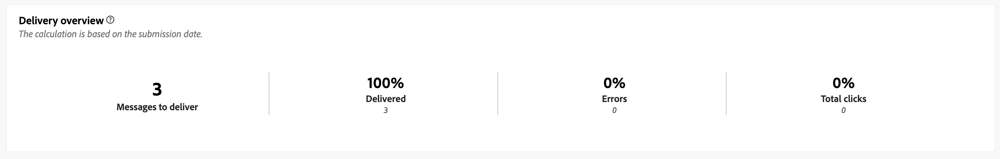

# Relatórios de campanha para o canal push {#campaign-reports-push-channel}

Cada relatório de campanha é dividido em widgets diferentes detalhando o sucesso e os erros da campanha. Para o canal de push, os relatórios e as métricas são detalhados abaixo. Saiba como acessar seus relatórios de campanha em [esta página](campaign-reports.md).

## Resumo da entrega {#delivery-summary-push}

>[!CONTEXTUALHELP]
>id="acw_campaign_reporting_push_deliveries_overview"
>title="Visão geral da entrega"
>abstract="O relatório **Visão geral da entrega** fornece indicadores principais de desempenho (KPIs) com informações detalhadas sobre o engajamento de visitantes com a entrega de notificações por push."

O relatório **[!UICONTROL Visão geral da entrega]** fornece KPIs (indicadores-chave de desempenho) que fornecem informações detalhadas sobre como seus visitantes se envolvem com a entrega de notificação por push. As métricas estão detalhadas abaixo.

{zoomable="yes"}

+++Saiba mais sobre Métricas de relatório de campanha por push.

* **[!UICONTROL Mensagens a serem entregues]**: número total de mensagens processadas durante a preparação da entrega.

* **[!UICONTROL Entregues]**: número de mensagens enviadas com êxito em relação ao número total de mensagens enviadas.

* **[!UICONTROL Erros]**: Número total de erros acumulados durante o processamento de entrega e retorno automático, em relação ao número total de mensagens enviadas.

* **[!UICONTROL Total de cliques]**: número total de recipients distintos que clicaram em um delivery pelo menos uma vez.

+++

### Estatísticas iniciais do público-alvo {#delivery-summary-push-initial-target}

>[!CONTEXTUALHELP]
>id="acw_campaign_reporting_push_target"
>title="Estatísticas iniciais do público-alvo"
>abstract="A tabela **Estatísticas iniciais do público-alvo** exibe dados relativos aos destinatários."

A tabela **[!UICONTROL Estatísticas iniciais do público-alvo]** exibe os dados relativos aos seus destinatários. As métricas estão detalhadas abaixo.

{zoomable="yes"}

+++Saiba mais sobre Métricas de relatório de campanha por push.

* **[!UICONTROL Público-alvo inicial]**: número total de destinatários direcionados.

* **[!UICONTROL Mensagem a ser entregue]**: Número total de mensagens a serem entregues após a preparação da entrega.

* **[!UICONTROL Rejected by rules]**: Número total de endereços ignorados durante a análise ao aplicar regras, como endereço ausente, em quarentena ou em durante a inclui na lista de bloqueios.

+++

### Estatísticas de execução {#delivery-summary-push-exec-stats}

>[!CONTEXTUALHELP]
>id="acw_campaign_reporting_push_exec_stats"
>title="Estatísticas de execução"
>abstract="A tabela **Estatísticas de execução** detalha o sucesso da entrega: mensagens a serem entregues, sucesso, erros e novas quarentenas."

A tabela **[!UICONTROL Estatísticas de execução]** detalha o sucesso da sua entrega. As métricas estão detalhadas abaixo.

{zoomable="yes"}

+++Saiba mais sobre Métricas de relatório de campanha por push.

* **[!UICONTROL Mensagem a ser entregue]**: Número total de mensagens a serem entregues após a preparação da entrega.

* **[!UICONTROL Success]**: Número de mensagens processadas com êxito em relação ao número de mensagens a serem entregues.

* **[!UICONTROL Erros]**: Número total de erros acumulados durante as entregas e o processamento automático de reassociação, em relação ao número de mensagens a serem entregues.

* **[!UICONTROL Novas quarentenas]**: Número total de endereços colocados em quarentena após uma entrega com falha (registro inválido, rejeição de mensagem ou erro de carga, por exemplo), em relação ao número de mensagens a serem entregues.

  Os tipos de erro de notificações por push estão listados na [documentação do Adobe Campaign v8 (console do cliente)](https://experienceleague.adobe.com/docs/campaign/campaign-v8/send/failures/delivery-failures.html?lang=pt-BR#push-error-types){target="_blank"}.

+++

### Fluxos de cliques gerados {#delivery-summary-push-click-streams}

>[!CONTEXTUALHELP]
>id="acw_campaign_reporting_push_click_streams"
>title="Fluxos de cliques gerados"
>abstract="A tabela **Fluxos de clique gerados** mostra os dados disponíveis relativos a como seus destinatários interagiram com a entrega."

A tabela **[!UICONTROL Fluxos de cliques gerados]** exibe dados relativos a como seus destinatários interagiram com sua entrega. As métricas estão detalhadas abaixo.

{zoomable="yes"}

+++Saiba mais sobre Métricas de relatório de campanha por push.

* **[!UICONTROL Cliques únicos]**: número total de recipients distintos que clicaram em um delivery pelo menos uma vez.

* **[!UICONTROL Total de cliques]**: número total de cliques nos links nas entregas.

* **[!UICONTROL Reatividade]**: taxa do número de recipients alvos que clicaram em uma entrega em relação ao número estimado de recipients alvos que abriram uma entrega.

+++
