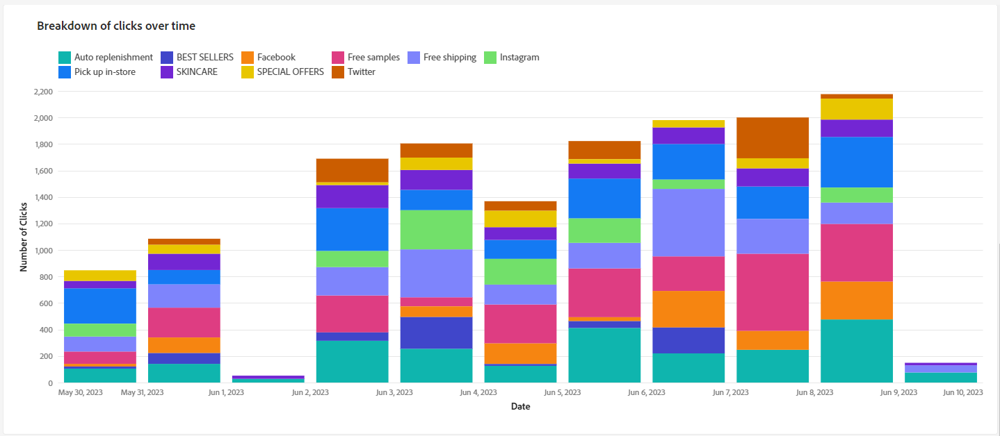

# Relatórios de campanha {#campaign-reports}

O relatório Campanha é dividido em diferentes widgets detalhando o sucesso e os erros da campanha.

A página do relatório Campanha será exibida com as seguintes guias:

* [Canal de email](#email-channel)
* [Canal de SMS](#sms-channel)
* [Canal push](#push-channel)

Para acessar o relatório de Campanha, clique em Reports no painel da campanha.

## Canal de email {#email-channel}

### Resumo da entrega {#delivery-summary-email}

* **[!UICONTROL Visão geral da entrega]** O fornece indicadores principais de desempenho (KPIs) que fornecem informações detalhadas sobre como os visitantes se envolvem com o delivery de email.

  

  +++Saiba mais sobre Métricas de relatório da campanha de email.

   * **[!UICONTROL Total enviado]**: Número total de mensagens processadas durante a análise de delivery.

   * **[!UICONTROL Entregue]**: Número de mensagens enviadas com êxito em relação ao número total de mensagens enviadas.

   * **[!UICONTROL Rejeições]**: Total de erros acumulados durante o processamento de delivery e retorno automático em relação ao número total de mensagens enviadas.

   * **[!UICONTROL Aberturas distintas]**: número total de recipients alvos que abriram uma mensagem pelo menos uma vez.

   * **[!UICONTROL Cliques distintos]**: Número total de recipients distintos que clicaram em um delivery pelo menos uma vez.

+++

* **[!UICONTROL Estatísticas iniciais do público-alvo]** A tabela exibe dados relativos aos seus destinatários:

  

  +++Saiba mais sobre Métricas de relatório da campanha de email.

   * **[!UICONTROL Público inicial]**: Número total de recipients alvos.

   * **[!UICONTROL Mensagem a ser entregue]**: Número total de mensagens a serem entregues após a análise de delivery.

   * **[!UICONTROL Rejeitado por regras]**: Número total de endereços ignorados durante a análise ao aplicar as regras: endereço em falta, em quarentena, na inclui na lista de bloqueios, etc.

+++

* **[!UICONTROL Estatísticas de execução]** A tabela detalha o sucesso do delivery.

  

  +++Saiba mais sobre Métricas de relatório da campanha de email.

   * **[!UICONTROL Mensagem a ser entregue]**: Número total de mensagens a serem entregues após a análise de delivery.

   * **[!UICONTROL Sucesso]**: Número de mensagens processadas com êxito em relação ao número de mensagens a serem entregues.

   * **[!UICONTROL Erros]**: Número total de erros acumulados durante os deliveries e o processamento automático de reassociação em relação ao número de mensagens a serem entregues.

   * **[!UICONTROL Novos em quarentena]**: Número total de endereços colocados em quarentena após um delivery com falha (usuário desconhecido, domínio inválido) em relação ao número de mensagens a serem entregues.

+++

* **[!UICONTROL Estatísticas de reação]** A tabela contém os dados disponíveis para a atividade do recipient para o seu delivery.

  

  +++Saiba mais sobre Métricas de relatório da campanha de email.

   * **[!UICONTROL Aberturas distintas]**: número total de recipients alvos que abriram uma mensagem pelo menos uma vez.

   * **[!UICONTROL Opens]**: Número de recipients alvos distintos para este domínio que abriram uma mensagem pelo menos uma vez.

   * **[!UICONTROL Cancelamentos de assinatura]**: número de recipients que clicaram em unsubscriptions para o período relacionado.

   * **[!UICONTROL Mirror page]**: Número de recipients que clicaram no link da mirror page.

   * **[!UICONTROL Encaminhamentos]**: Número de recipients que clicaram para encaminhar o email.
+++

* **[!UICONTROL Fluxos de clique gerados]** A tabela exibe dados relativos a como seus recipients interagiram com o delivery.

  

  +++Saiba mais sobre Métricas de relatório da campanha de email.

   * **[!UICONTROL Cliques distintos]**: Número total de recipients distintos que clicaram em um delivery pelo menos uma vez.

   * **[!UICONTROL Clicks]** : Número total de cliques nos links nos deliveries.

   * **[!UICONTROL Reactivity]**: Taxa do número de recipients alvos que clicaram em um delivery em relação ao número estimado de recipients alvos que abriram um delivery.

+++

### Não entregues {#non-deliverables-email}

* **[!UICONTROL Detalhamento de erros por tipo]** e **[!UICONTROL Detalhamento de erros por domínio]** tabelas e gráficos contêm os dados disponíveis para possíveis erros encontrados com cada domínio.

  Os erros exibidos nesse relatório acionam o processo de quarentena. Para obter mais informações sobre gestão de quarentena, consulte [Documentação do Campaign v8 (console)](https://experienceleague.adobe.com/docs/campaign/campaign-v8/campaigns/send/failures/delivery-failures.html?lang=pt-BR){target="_blank"}.

  

  +++Saiba mais sobre Métricas de relatório da campanha de email.

   * **[!UICONTROL User unknown]** : Tipo de erro gerado durante o delivery para indicar que o endereço de email é inválido.

   * **[!UICONTROL invalid domain]** : Tipo de erro gerado ao enviar um delivery para indicar que o domínio do endereço de email está errado ou não existe.

   * **[!UICONTROL Caixa de entrada cheia]**: Tipo de erro gerado após cinco tentativas de delivery para indicar que a caixa de entrada dos recipients contém muitas mensagens.

   * **[!UICONTROL Account disabled]** : Tipo de erro gerado ao enviar um delivery para indicar que o endereço não existe mais.

   * **[!UICONTROL Recusado]**: Tipo de erro gerado quando um endereço é rejeitado pelo IAP (Provedor de Acesso à Internet), por exemplo, ao seguir uma regra de segurança da aplicação (software antispam).

   * **[!UICONTROL Unreachable]** : Tipo de erro que ocorre na string de distribuição de mensagens: incidente na retransmissão SMTP, domínio temporariamente inacessível, etc

   * **[!UICONTROL Não conectado]**: Tipo de erro para indicar que o celular do recipient está desligado ou sem rede no momento do envio.

+++

### Indicadores de rastreamento {#tracking-indicators-email}

* **[!UICONTROL Estatísticas de entrega]** O fornece indicadores principais de desempenho (KPIs) que fornecem informações detalhadas sobre os dados disponíveis para emails enviados.

  

  +++Saiba mais sobre Métricas de relatório da campanha de email.

   * **[!UICONTROL Sucesso]**: Número de mensagens processadas com êxito em relação ao número de mensagens a serem entregues.

   * **[!UICONTROL Aberturas distintas]**: número total de recipients alvos que abriram uma mensagem pelo menos uma vez.

   * **[!UICONTROL Opens]**: Número de recipients alvos distintos para este domínio que abriram uma mensagem pelo menos uma vez.

   * **[!UICONTROL Cliques no link para opção de não participação]**: Número de cliques no link unsubscription.

   * **[!UICONTROL Clicks on the mirror link]**: Número de cliques no link para a mirror page.

   * **[!UICONTROL Estimation of forwards]**: Estimativa do número de emails encaminhados pelos recipients alvos.
+++

* **[!UICONTROL Estatísticas iniciais do público-alvo]** A tabela exibe dados relativos aos recipients.

  

  +++Saiba mais sobre Métricas de relatório da campanha de email.

   * **[!UICONTROL Enviado]**: Número total de mensagens enviadas.

   * **[!UICONTROL Complaints]**: Número de mensagens deste domínio relatadas como indesejáveis pelo recipient.

   * **[!UICONTROL Opens]**: Número de recipients alvos distintos para este domínio que abriram uma mensagem pelo menos uma vez.

   * **[!UICONTROL Clicks]**: Número de recipients alvos distintos que clicaram no mesmo delivery pelo menos uma vez.

   * **[!UICONTROL Raw reactivity]**: Porcentagem do número de recipients que clicaram em um delivery pelo menos uma vez em comparação ao número de recipients que abriram um delivery pelo menos uma vez.
+++

### Fluxos de clique e URLs {#url-email}

* **[!UICONTROL Fluxos de clique e URLs]** O fornece indicadores chave de desempenho (KPIs) que fornecem informações detalhadas sobre os URLs que foram mais clicados durante um delivery.

  

  +++Saiba mais sobre Métricas de relatório da campanha de email.

   * **[!UICONTROL Reactivity]**: Taxa do número de recipients alvos que clicaram em um delivery em relação ao número estimado de recipients alvos que abriram um delivery.

   * **[!UICONTROL Cliques distintos]**: Número total de recipients distintos que clicaram em um delivery pelo menos uma vez.

   * **[!UICONTROL Clicks]** : Número total de cliques nos links nos deliveries.

   * **[!UICONTROL Platform average]**: Essa taxa média, exibida em cada taxa (reatividade, cliques distintos e cliques acumulados), é calculada para deliveries enviados nos seis meses anteriores. Somente os deliveries com a mesma tipologia e no mesmo canal são considerados. Provas são excluídas.
+++

* **[!UICONTROL Os 10 links mais visitados]** o gráfico e a tabela contêm os dados disponíveis para o comportamento do recipient por link.

  

  +++Saiba mais sobre Métricas de relatório da campanha de email.

   * **[!UICONTROL Clicks]** : Número total de cliques nos links nos deliveries.

   * **[!UICONTROL Porcentagem]**: Porcentagem de usuários que interagiram com o delivery.

+++

* **[!UICONTROL Detalhamento dos cliques ao longo do tempo]** o gráfico contém os dados disponíveis para o comportamento do recipient por link.

  

### Atividades do usuário {#user-activities-email}

* **[!UICONTROL Atividades do usuário]** mostra o detalhamento de aberturas e cliques no formulário de um gráfico.

  

  +++Saiba mais sobre Métricas de relatório da campanha de email.

   * **[!UICONTROL Clicks]** : Número total de cliques nos links nos deliveries.

   * **[!UICONTROL Opens]**: Número de recipients alvos distintos para este domínio que abriram uma mensagem pelo menos uma vez.

+++

## Canal de SMS {#sms-channel}

### Resumo da entrega {#delivery-summary-sms}

* **[!UICONTROL Visão geral da entrega]** O fornece indicadores principais de desempenho (KPIs) que fornecem informações detalhadas sobre como os visitantes se envolvem com o delivery de SMS.

  

  +++Saiba mais sobre métricas de relatório de campanha por SMS.

   * **[!UICONTROL Total enviado]**: Número total de mensagens processadas durante a análise de delivery.

   * **[!UICONTROL Entregue]**: Número de mensagens enviadas com êxito em relação ao número total de mensagens enviadas.

   * **[!UICONTROL Erros]**: Total de erros acumulados durante o processamento de delivery e retorno automático em relação ao número total de mensagens enviadas.

   * **[!UICONTROL Cliques distintos]**: Número total de recipients distintos que clicaram em um delivery pelo menos uma vez.

+++

* **[!UICONTROL Estatísticas iniciais do público-alvo]** A tabela exibe dados relativos aos seus destinatários:

  

  +++Saiba mais sobre métricas de relatório de campanha por SMS.

   * **[!UICONTROL Público inicial]**: Número total de recipients alvos.

   * **[!UICONTROL Mensagem a ser entregue]**: Número total de mensagens a serem entregues após a análise de delivery.

   * **[!UICONTROL Rejeitado por regras]**: Número total de endereços ignorados durante a análise ao aplicar as regras: endereço em falta, em quarentena, na inclui na lista de bloqueios, etc.

+++

* **[!UICONTROL Estatísticas de execução]** a tabela detalha o sucesso do seu delivery:

  

  +++Saiba mais sobre métricas de relatório de campanha por SMS.

   * **[!UICONTROL Mensagem a ser entregue]**: Número total de mensagens a serem entregues após a análise de delivery.

   * **[!UICONTROL Sucesso]**: Número de mensagens processadas com êxito em relação ao número de mensagens a serem entregues.

   * **[!UICONTROL Erros]**: Número total de erros acumulados durante os deliveries e o processamento automático de reassociação em relação ao número de mensagens a serem entregues.

   * **[!UICONTROL Novos em quarentena]**: Número total de endereços colocados em quarentena após um delivery com falha (usuário desconhecido, domínio inválido) em relação ao número de mensagens a serem entregues.

+++

* **[!UICONTROL Fluxos de clique gerados]** A tabela exibe dados relativos a como seus recipients interagiram com o delivery:

  

  +++Saiba mais sobre métricas de relatório de campanha por SMS.

   * **[!UICONTROL Cliques distintos]**: Número total de recipients distintos que clicaram em um delivery pelo menos uma vez.

   * **[!UICONTROL Clicks]** : Número total de cliques nos links nos deliveries.

   * **[!UICONTROL Reactivity]**: Taxa do número de recipients alvos que clicaram em um delivery em relação ao número estimado de recipients alvos que abriram um delivery.

+++

## Canal push {#push-channel}

### Resumo da entrega {#delivery-summary-push}

* **[!UICONTROL Visão geral da entrega]** O fornece indicadores principais de desempenho (KPIs) que fornecem informações detalhadas sobre como seus visitantes se envolvem com a entrega de notificação por push.

  +++Saiba mais sobre métricas de relatório de campanha por push.

   * **[!UICONTROL Total enviado]**: Número total de mensagens processadas durante a análise de delivery.

   * **[!UICONTROL Entregue]**: Número de mensagens enviadas com êxito em relação ao número total de mensagens enviadas.

   * **[!UICONTROL Erros]**: Total de erros acumulados durante o processamento de delivery e retorno automático em relação ao número total de mensagens enviadas.

   * **[!UICONTROL Cliques distintos]**: Número total de recipients distintos que clicaram em um delivery pelo menos uma vez.

+++

* **[!UICONTROL Estatísticas iniciais do público-alvo]** A tabela exibe dados relativos aos seus destinatários:

  +++Saiba mais sobre métricas de relatório de campanha por push.

   * **[!UICONTROL Público inicial]**: Número total de recipients alvos.

   * **[!UICONTROL Mensagem a ser entregue]**: Número total de mensagens a serem entregues após a análise de delivery.

   * **[!UICONTROL Rejeitado por regras]**: Número total de endereços ignorados durante a análise ao aplicar as regras: endereço em falta, em quarentena, na inclui na lista de bloqueios, etc.

+++

* **[!UICONTROL Estatísticas de execução]** a tabela detalha o sucesso do seu delivery:

  +++Saiba mais sobre métricas de relatório de campanha por push.

   * **[!UICONTROL Mensagem a ser entregue]**: Número total de mensagens a serem entregues após a análise de delivery.

   * **[!UICONTROL Sucesso]**: Número de mensagens processadas com êxito em relação ao número de mensagens a serem entregues.

   * **[!UICONTROL Erros]**: Número total de erros acumulados durante os deliveries e o processamento automático de reassociação em relação ao número de mensagens a serem entregues.

   * **[!UICONTROL Novos em quarentena]**: Número total de endereços colocados em quarentena após um delivery com falha (usuário desconhecido, domínio inválido) em relação ao número de mensagens a serem entregues.

+++

* **[!UICONTROL Fluxos de clique gerados]** A tabela exibe dados relativos a como seus recipients interagiram com o delivery:

  +++Saiba mais sobre métricas de relatório de campanha por push.

   * **[!UICONTROL Cliques distintos]**: Número total de recipients distintos que clicaram em um delivery pelo menos uma vez.

   * **[!UICONTROL Clicks]** : Número total de cliques nos links nos deliveries.

   * **[!UICONTROL Reactivity]**: Taxa do número de recipients alvos que clicaram em um delivery em relação ao número estimado de recipients alvos que abriram um delivery.

+++
